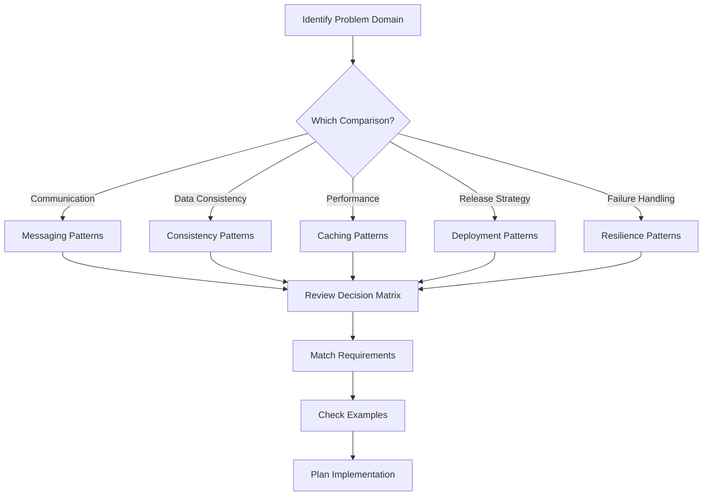

# Pattern Comparison Matrices

Making informed architectural decisions requires understanding the trade-offs between similar patterns. These comparison matrices help you choose the right pattern for your specific use case.

## Available Comparisons

### 📨 [Messaging Patterns](messaging-patterns-comparison.md)
Compare **Pub-Sub vs Event Streaming vs Message Queue vs WebSocket**
- When to use synchronous vs asynchronous messaging
- Scaling characteristics and limitations
- Real-world examples from Kafka, RabbitMQ, and Redis

### 🔄 [Consistency Patterns](consistency-patterns-comparison.md)
Compare **2PC vs Saga vs Event Sourcing vs CQRS**
- Consistency guarantees and trade-offs
- Complexity vs flexibility analysis
- Migration paths from legacy to modern patterns

### 💾 [Caching Patterns](caching-patterns-comparison.md)
Compare **Client-side vs CDN vs Application vs Database Caching**
- Performance characteristics at each layer
- Cache invalidation strategies
- Cost optimization techniques

### 🚀 [Deployment Patterns](deployment-patterns-comparison.md)
Compare **Blue-Green vs Canary vs Rolling vs Feature Flags**
- Risk profiles and rollback strategies
- Resource requirements and costs
- Multi-region deployment considerations

### 🛡️ [Resilience Patterns](resilience-patterns-comparison.md)
Compare **Circuit Breaker vs Retry vs Timeout vs Bulkhead vs Rate Limiting**
- Failure protection strategies
- Pattern layering for defense in depth
- Configuration guidelines and anti-patterns

## How to Use These Comparisons

## Quick Decision Framework

### 1. Start with Requirements
- What problem are you solving?
- What are your constraints? (latency, consistency, cost)
- What's your scale? (requests/sec, data volume)

### 2. Review Relevant Comparison
- Check the overview table
- Study the decision matrix
- Review real-world examples

### 3. Consider Trade-offs
- Performance vs complexity
- Cost vs features
- Flexibility vs simplicity

### 4. Plan Migration
- If replacing existing pattern
- Check migration paths
- Consider hybrid approaches

## Pattern Selection Checklist

- [ ] **Problem clearly defined** - Know what you're solving
- [ ] **Scale requirements known** - Current and projected
- [ ] **Constraints identified** - Technical and business
- [ ] **Team expertise assessed** - Can your team implement/maintain?
- [ ] **Comparison reviewed** - Studied relevant matrices
- [ ] **Examples checked** - Found similar use cases
- [ ] **Migration planned** - If replacing existing solution
- [ ] **Monitoring defined** - Know how to measure success

## Common Pitfalls

<h4>⚠️ Pattern Overengineering</h4>

**Mistake**: Choosing the most sophisticated pattern without need
**Example**: Using Event Sourcing for simple CRUD operations
**Solution**: Start simple, evolve as needed

<h4>⚠️ Ignoring Team Expertise</h4>

**Mistake**: Selecting patterns beyond team capabilities
**Example**: Implementing CQRS without understanding eventual consistency
**Solution**: Factor in learning curve and operational complexity

<h4>⚠️ Not Planning for Migration</h4>

**Mistake**: Assuming clean-slate implementation
**Example**: Trying to move from 2PC to Saga overnight
**Solution**: Use gradual migration strategies

## Contributing

Have a suggestion for a new comparison? Found an error? Please contribute:

1. **New Comparisons**: Open an issue with patterns to compare
2. **Updates**: Submit a PR with improvements
3. **Examples**: Share your real-world implementations

---

*These comparisons are based on production experience from companies operating at scale. Your mileage may vary based on specific requirements.*