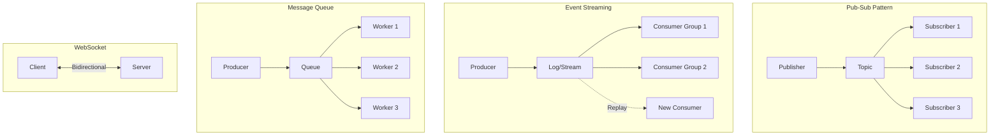
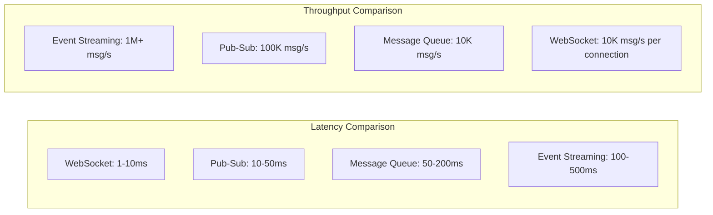
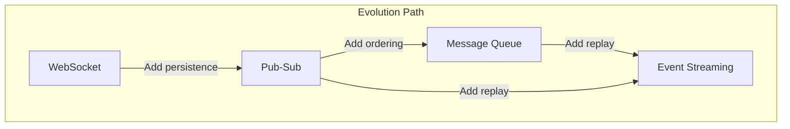
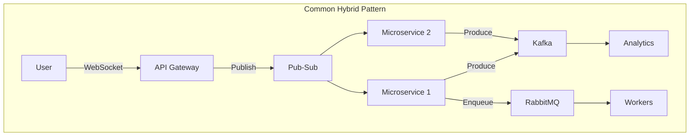

# Messaging Patterns Comparison

## Overview

Choosing the right messaging pattern is crucial for system communication. This guide compares Pub-Sub, Event Streaming, Message Queue, and WebSocket patterns.

## Quick Comparison Matrix

| Pattern | Use Case | Delivery | Ordering | Persistence | Latency | Throughput |
|---------|----------|----------|----------|-------------|---------|------------|
| **Pub-Sub** | Event distribution | At-most-once/At-least-once | No guarantee | Optional | Low | High |
| **Event Streaming** | Event sourcing, replay | At-least-once/Exactly-once | Guaranteed | Always | Medium | Very High |
| **Message Queue** | Task distribution | Exactly-once | FIFO/Priority | Until consumed | Medium | Medium |
| **WebSocket** | Real-time bidirectional | Best-effort | No guarantee | None | Very Low | Medium |

## Architectural Comparison



## Decision Matrix

### When to Use Each Pattern

| Scenario | Best Pattern | Why |
|----------|-------------|-----|
| Real-time chat | WebSocket | Low latency, bidirectional |
| Microservice events | Pub-Sub | Decoupling, fanout |
| Analytics pipeline | Event Streaming | Replay, ordering, history |
| Background jobs | Message Queue | Work distribution, acknowledgment |
| Live dashboards | WebSocket + Pub-Sub | Real-time updates with fallback |
| Audit logging | Event Streaming | Immutable history, compliance |
| Order processing | Message Queue | Exactly-once delivery |
| Push notifications | Pub-Sub | Broadcast to many devices |

## Performance Characteristics



## Complexity Comparison

| Pattern | Operational Complexity | Development Complexity | Scaling Complexity |
|---------|----------------------|----------------------|-------------------|
| **WebSocket** | Medium (connection management) | High (state management) | High (sticky sessions) |
| **Pub-Sub** | Low | Low | Low |
| **Message Queue** | Medium | Medium | Medium |
| **Event Streaming** | High | Medium | Low |

## Implementation Examples

### Pub-Sub (Redis)
```yaml
Use Case: Microservice event bus
Pros:
  - Simple to implement
  - Low latency
  - Good for ephemeral events
Cons:
  - No persistence by default
  - No replay capability
  - Fire-and-forget delivery
```

### Event Streaming (Kafka)
```yaml
Use Case: Data pipeline, event sourcing
Pros:
  - Persistent event log
  - Replay from any point
  - High throughput
  - Guaranteed ordering
Cons:
  - Higher operational overhead
  - Higher latency
  - Complex configuration
```

### Message Queue (RabbitMQ)
```yaml
Use Case: Task distribution, job processing
Pros:
  - Message acknowledgment
  - Dead letter queues
  - Priority queues
  - Exactly-once delivery
Cons:
  - Messages deleted after consumption
  - No native replay
  - Scaling requires careful planning
```

### WebSocket (Socket.io)
```yaml
Use Case: Real-time collaboration, gaming
Pros:
  - Lowest latency
  - Bidirectional communication
  - Real-time updates
Cons:
  - Stateful connections
  - Complex scaling
  - No built-in persistence
```

## Migration Paths



### Migration Strategies

| From | To | Strategy | Considerations |
|------|----|----------|----------------|
| WebSocket | Pub-Sub | Add broker, maintain WS for real-time | Hybrid approach for compatibility |
| Pub-Sub | Event Streaming | Dual publish during transition | Ensure consumer compatibility |
| Message Queue | Event Streaming | Use CDC or dual writes | Handle exactly-once semantics |
| Any | Hybrid | Implement facade pattern | Abstract messaging behind API |

## Hybrid Architectures



## Cost Comparison

| Pattern | Infrastructure Cost | Operational Cost | Development Cost |
|---------|-------------------|------------------|------------------|
| WebSocket | Low-Medium | Medium | High |
| Pub-Sub | Low | Low | Low |
| Message Queue | Medium | Medium | Medium |
| Event Streaming | High | High | Medium |

## Technology Choices

### By Scale
- **Small (< 1K msg/s)**: Redis Pub-Sub, RabbitMQ
- **Medium (1K-100K msg/s)**: Kafka, NATS
- **Large (> 100K msg/s)**: Kafka, Pulsar

### By Requirements
- **Low Latency**: WebSocket, Redis Pub-Sub
- **Durability**: Kafka, Pulsar, RabbitMQ
- **Simplicity**: Redis Pub-Sub, NATS
- **Feature-Rich**: RabbitMQ, Kafka

## Key Takeaways

1. **No one-size-fits-all**: Choose based on specific requirements
2. **Consider hybrid approaches**: Combine patterns for optimal results
3. **Plan for growth**: Migration paths should be part of initial design
4. **Monitor and measure**: Validate pattern choice with real metrics
5. **Start simple**: Begin with simpler patterns and evolve as needed