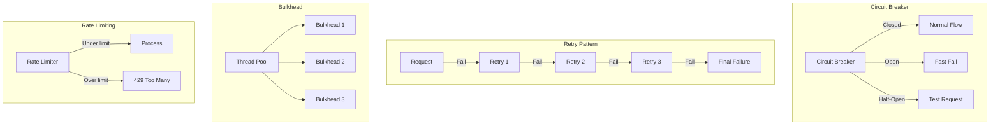
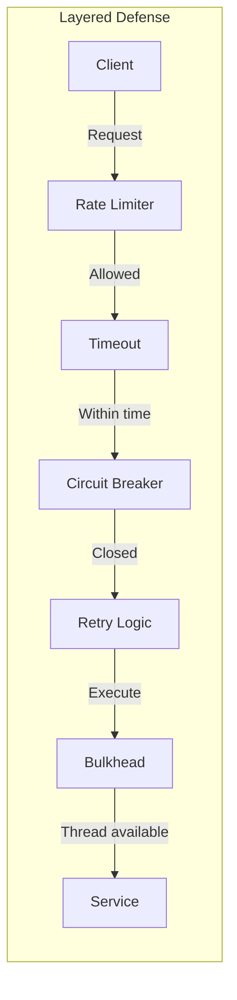

# Resilience Patterns Comparison

## Overview

Building resilient distributed systems requires multiple defensive patterns. This guide compares Circuit Breaker, Retry, Timeout, Bulkhead, and Rate Limiting patterns to help you build fault-tolerant systems.

## Quick Comparison Matrix

| Pattern | Failure Type | Response Time | Resource Protection | Complexity |
|---------|--------------|---------------|-------------------|------------|
| **Circuit Breaker** | Cascading failures | Fast fail | High | Medium |
| **Retry** | Transient failures | Delayed | Low | Low |
| **Timeout** | Slow responses | Bounded | Medium | Low |
| **Bulkhead** | Resource exhaustion | Isolated | High | Medium |
| **Rate Limiting** | Overload | Controlled | High | Medium |

## Failure Protection Strategies



## Decision Matrix

### When to Use Each Pattern

| Scenario | Best Pattern | Why |
|----------|-------------|-----|
| Service is down | Circuit Breaker | Prevent cascading failures |
| Network glitch | Retry with backoff | Transient error recovery |
| Slow dependency | Timeout | Prevent thread blocking |
| Resource isolation | Bulkhead | Fault containment |
| Traffic spike | Rate Limiting | Protect system capacity |
| Database overload | Circuit Breaker + Bulkhead | Combined protection |
| API protection | Rate Limiting + Timeout | Client fairness |

## Pattern Interactions



## Implementation Examples

### Circuit Breaker
```python
class CircuitBreaker:
    def __init__(self, failure_threshold=5, recovery_timeout=60, 
                 expected_exception=Exception):
        self.failure_threshold = failure_threshold
        self.recovery_timeout = recovery_timeout
        self.expected_exception = expected_exception
        self.failure_count = 0
        self.last_failure_time = None
        self.state = 'CLOSED'  # CLOSED, OPEN, HALF_OPEN
    
    def call(self, func, *args, **kwargs):
        if self.state == 'OPEN':
            if self._should_attempt_reset():
                self.state = 'HALF_OPEN'
            else:
                raise CircuitBreakerOpen("Circuit breaker is OPEN")
        
        try:
            result = func(*args, **kwargs)
            self._on_success()
            return result
        except self.expected_exception as e:
            self._on_failure()
            raise e
    
    def _on_success(self):
        self.failure_count = 0
        self.state = 'CLOSED'
    
    def _on_failure(self):
        self.failure_count += 1
        self.last_failure_time = time.time()
        if self.failure_count >= self.failure_threshold:
            self.state = 'OPEN'
    
    def _should_attempt_reset(self):
        return (time.time() - self.last_failure_time) >= self.recovery_timeout

# Usage
circuit_breaker = CircuitBreaker(failure_threshold=5, recovery_timeout=60)

def call_service():
    return circuit_breaker.call(external_service.request, data)
```

### Retry with Exponential Backoff
```python
import random
import time
from functools import wraps

def retry_with_backoff(retries=3, backoff_in_seconds=1, max_backoff=32):
    def decorator(func):
        @wraps(func)
        def wrapper(*args, **kwargs):
            x = backoff_in_seconds
            for i in range(retries):
                try:
                    return func(*args, **kwargs)
                except Exception as e:
                    if i == retries - 1:
                        raise e
                    
                    # Exponential backoff with jitter
                    sleep_time = min(x * (2 ** i) + random.uniform(0, 1), max_backoff)
                    time.sleep(sleep_time)
            
            return None
        return wrapper
    return decorator

# Usage
@retry_with_backoff(retries=3, backoff_in_seconds=1)
def call_api():
    response = requests.get("https://api.example.com/data")
    response.raise_for_status()
    return response.json()
```

### Timeout Pattern
```python
import signal
import functools
import asyncio
from concurrent.futures import TimeoutError

# Synchronous timeout
def timeout(seconds):
    def decorator(func):
        @functools.wraps(func)
        def wrapper(*args, **kwargs):
            def handler(signum, frame):
                raise TimeoutError(f"Function timed out after {seconds} seconds")
            
            signal.signal(signal.SIGALRM, handler)
            signal.alarm(seconds)
            try:
                result = func(*args, **kwargs)
            finally:
                signal.alarm(0)
            return result
        return wrapper
    return decorator

# Async timeout
async def async_timeout(coro, timeout_seconds):
    try:
        return await asyncio.wait_for(coro, timeout=timeout_seconds)
    except asyncio.TimeoutError:
        raise TimeoutError(f"Operation timed out after {timeout_seconds} seconds")

# Usage
@timeout(5)
def slow_operation():
    # Operation that might take too long
    return expensive_computation()

# Async usage
async def fetch_with_timeout():
    return await async_timeout(fetch_data(), timeout_seconds=3)
```

### Bulkhead Pattern
```python
from concurrent.futures import ThreadPoolExecutor
from threading import Semaphore
import queue

class Bulkhead:
    def __init__(self, name, max_concurrent_calls):
        self.name = name
        self.semaphore = Semaphore(max_concurrent_calls)
        self.executor = ThreadPoolExecutor(max_workers=max_concurrent_calls)
        self.queue_size = max_concurrent_calls * 2
        self.waiting_queue = queue.Queue(maxsize=self.queue_size)
    
    def execute(self, func, *args, **kwargs):
        if not self.semaphore.acquire(blocking=False):
            # Bulkhead is full
            try:
                self.waiting_queue.put_nowait((func, args, kwargs))
                raise BulkheadFullError(f"Bulkhead {self.name} is full")
            except queue.Full:
                raise BulkheadRejectedError(f"Bulkhead {self.name} queue is full")
        
        try:
            future = self.executor.submit(func, *args, **kwargs)
            result = future.result()
            return result
        finally:
            self.semaphore.release()
            # Process waiting requests
            self._process_waiting()
    
    def _process_waiting(self):
        try:
            func, args, kwargs = self.waiting_queue.get_nowait()
            self.execute(func, *args, **kwargs)
        except queue.Empty:
            pass

# Usage
user_service_bulkhead = Bulkhead("user-service", max_concurrent_calls=10)
order_service_bulkhead = Bulkhead("order-service", max_concurrent_calls=20)

def get_user_data(user_id):
    return user_service_bulkhead.execute(fetch_user, user_id)
```

### Rate Limiting
```python
import time
from collections import deque
import redis
import hashlib

class RateLimiter:
    def __init__(self, redis_client):
        self.redis = redis_client
    
    def sliding_window_counter(self, key, limit, window_seconds):
        """Sliding window counter algorithm"""
        now = time.time()
        pipeline = self.redis.pipeline()
        
        # Remove old entries
        pipeline.zremrangebyscore(key, 0, now - window_seconds)
        
        # Count current window
        pipeline.zcard(key)
        
        # Add current request
        pipeline.zadd(key, {str(now): now})
        
        # Set expiry
        pipeline.expire(key, window_seconds + 1)
        
        results = pipeline.execute()
        current_count = results[1]
        
        if current_count >= limit:
            # Remove the just-added entry
            self.redis.zrem(key, str(now))
            return False, 0
        
        return True, limit - current_count - 1
    
    def token_bucket(self, key, capacity, refill_rate):
        """Token bucket algorithm"""
        now = time.time()
        
        # Lua script for atomic token bucket
        lua_script = """
        local key = KEYS[1]
        local capacity = tonumber(ARGV[1])
        local refill_rate = tonumber(ARGV[2])
        local now = tonumber(ARGV[3])
        
        local bucket = redis.call('HMGET', key, 'tokens', 'last_refill')
        local tokens = tonumber(bucket[1]) or capacity
        local last_refill = tonumber(bucket[2]) or now
        
        -- Calculate tokens to add
        local elapsed = now - last_refill
        local tokens_to_add = elapsed * refill_rate
        tokens = math.min(capacity, tokens + tokens_to_add)
        
        if tokens >= 1 then
            tokens = tokens - 1
            redis.call('HMSET', key, 'tokens', tokens, 'last_refill', now)
            redis.call('EXPIRE', key, 3600)
            return {1, tokens}
        else
            redis.call('HMSET', key, 'tokens', tokens, 'last_refill', now)
            return {0, tokens}
        end
        """
        
        result = self.redis.eval(lua_script, 1, key, capacity, refill_rate, now)
        return result[0] == 1, result[1]

# Usage
rate_limiter = RateLimiter(redis.Redis())

# API endpoint rate limiting
def rate_limited_endpoint(user_id):
    key = f"rate_limit:api:{user_id}"
    allowed, remaining = rate_limiter.sliding_window_counter(
        key, limit=100, window_seconds=60
    )
    
    if not allowed:
        return {"error": "Rate limit exceeded"}, 429
    
    return {"data": "success", "rate_limit_remaining": remaining}, 200
```

## Combined Pattern Implementation

```python
class ResilientClient:
    def __init__(self, service_name):
        self.service_name = service_name
        self.circuit_breaker = CircuitBreaker(
            failure_threshold=5,
            recovery_timeout=60
        )
        self.bulkhead = Bulkhead(
            name=service_name,
            max_concurrent_calls=20
        )
        self.rate_limiter = RateLimiter(redis.Redis())
    
    @retry_with_backoff(retries=3, backoff_in_seconds=1)
    @timeout(5)
    def call_service(self, endpoint, user_id, *args, **kwargs):
        # Rate limiting
        key = f"rate_limit:{self.service_name}:{user_id}"
        allowed, remaining = self.rate_limiter.sliding_window_counter(
            key, limit=100, window_seconds=60
        )
        
        if not allowed:
            raise RateLimitExceeded("Rate limit exceeded")
        
        # Circuit breaker
        def make_request():
            # Bulkhead
            return self.bulkhead.execute(
                self._actual_request,
                endpoint,
                *args,
                **kwargs
            )
        
        return self.circuit_breaker.call(make_request)
    
    def _actual_request(self, endpoint, *args, **kwargs):
        response = requests.post(endpoint, json=kwargs, timeout=5)
        response.raise_for_status()
        return response.json()

# Usage
client = ResilientClient("user-service")
try:
    result = client.call_service(
        "https://api.example.com/users",
        user_id="123",
        data={"action": "update"}
    )
except (CircuitBreakerOpen, RateLimitExceeded, BulkheadFullError) as e:
    # Handle gracefully
    return fallback_response()
```

## Performance Impact

| Pattern | Latency Impact | CPU Overhead | Memory Overhead | Network Overhead |
|---------|---------------|--------------|-----------------|------------------|
| **Circuit Breaker** | -99% when open | Minimal | Small state | None |
| **Retry** | +100-300% on failure | Minimal | Minimal | 2-3x on failure |
| **Timeout** | Bounded maximum | Timer threads | Minimal | None |
| **Bulkhead** | Queue wait time | Thread management | Thread pool | None |
| **Rate Limiting** | Lookup time (1-5ms) | Counter updates | Counter storage | Redis calls |

## Configuration Guidelines

### Circuit Breaker Tuning
```yaml
failure_threshold: 5  # Opens after 5 failures
success_threshold: 2  # Closes after 2 successes in half-open
timeout: 60s         # Time before half-open attempt
monitored_errors:    # Which errors trigger opening
  - ConnectionError
  - TimeoutError
  - 503 Service Unavailable
```

### Retry Configuration
```yaml
max_attempts: 3
initial_delay: 100ms
max_delay: 30s
backoff_multiplier: 2
jitter: 0.1  # 10% randomization
retryable_errors:
  - NetworkError
  - 503 Service Unavailable
  - TimeoutError
```

### Bulkhead Sizing
```yaml
# Formula: pool_size = (peak_rps * response_time) * safety_factor
# Example: (100 rps * 0.2s) * 1.5 = 30 threads

services:
  critical:
    pool_size: 50
    queue_size: 100
  standard:
    pool_size: 20
    queue_size: 40
  background:
    pool_size: 10
    queue_size: 20
```

## Monitoring and Metrics

```python
class ResilienceMetrics:
    def __init__(self, metrics_client):
        self.metrics = metrics_client
    
    def record_circuit_breaker(self, name, state):
        self.metrics.gauge(f"circuit_breaker.{name}.state", 
                          1 if state == "OPEN" else 0)
    
    def record_retry(self, name, attempt, success):
        self.metrics.increment(f"retry.{name}.attempt.{attempt}")
        if success:
            self.metrics.increment(f"retry.{name}.success")
        else:
            self.metrics.increment(f"retry.{name}.failure")
    
    def record_rate_limit(self, name, allowed):
        if allowed:
            self.metrics.increment(f"rate_limit.{name}.allowed")
        else:
            self.metrics.increment(f"rate_limit.{name}.rejected")
    
    def record_bulkhead(self, name, active, waiting):
        self.metrics.gauge(f"bulkhead.{name}.active", active)
        self.metrics.gauge(f"bulkhead.{name}.waiting", waiting)
```

## Anti-Patterns to Avoid

| Anti-Pattern | Problem | Solution |
|--------------|---------|----------|
| **Retry storms** | Cascading retries | Exponential backoff, circuit breaker |
| **Infinite timeouts** | Resource exhaustion | Always set timeouts |
| **Shared bulkheads** | No isolation | Separate critical paths |
| **Global rate limits** | Unfair resource allocation | Per-user/tenant limits |
| **Silent failures** | Hidden problems | Comprehensive monitoring |

## Testing Resilience Patterns

```python
import pytest
from unittest.mock import Mock, patch

def test_circuit_breaker_opens_after_threshold():
    cb = CircuitBreaker(failure_threshold=3, recovery_timeout=60)
    mock_func = Mock(side_effect=Exception("Service error"))
    
    # First 2 failures don't open circuit
    for i in range(2):
        with pytest.raises(Exception):
            cb.call(mock_func)
    
    assert cb.state == 'CLOSED'
    
    # Third failure opens circuit
    with pytest.raises(Exception):
        cb.call(mock_func)
    
    assert cb.state == 'OPEN'
    
    # Subsequent calls fail fast
    with pytest.raises(CircuitBreakerOpen):
        cb.call(mock_func)

def test_retry_with_eventual_success():
    mock_func = Mock(side_effect=[Exception(), Exception(), "Success"])
    
    @retry_with_backoff(retries=3, backoff_in_seconds=0.1)
    def flaky_function():
        return mock_func()
    
    result = flaky_function()
    assert result == "Success"
    assert mock_func.call_count == 3
```

## Key Takeaways

1. **Layer your defenses**: Combine patterns for comprehensive protection
2. **Fail fast**: Circuit breakers prevent cascade failures
3. **Be patient**: Retries with backoff handle transient failures
4. **Isolate failures**: Bulkheads contain damage
5. **Monitor everything**: Metrics reveal system behavior
6. **Test failure scenarios**: Chaos engineering validates resilience