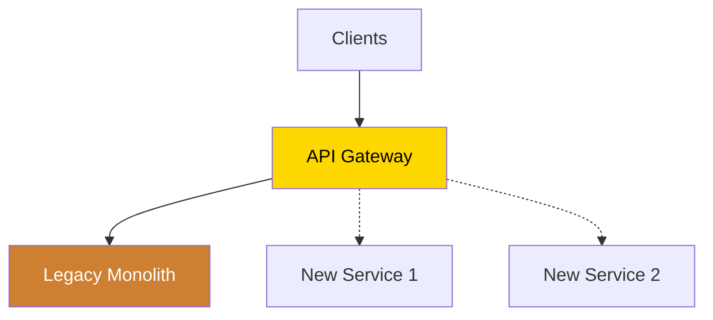
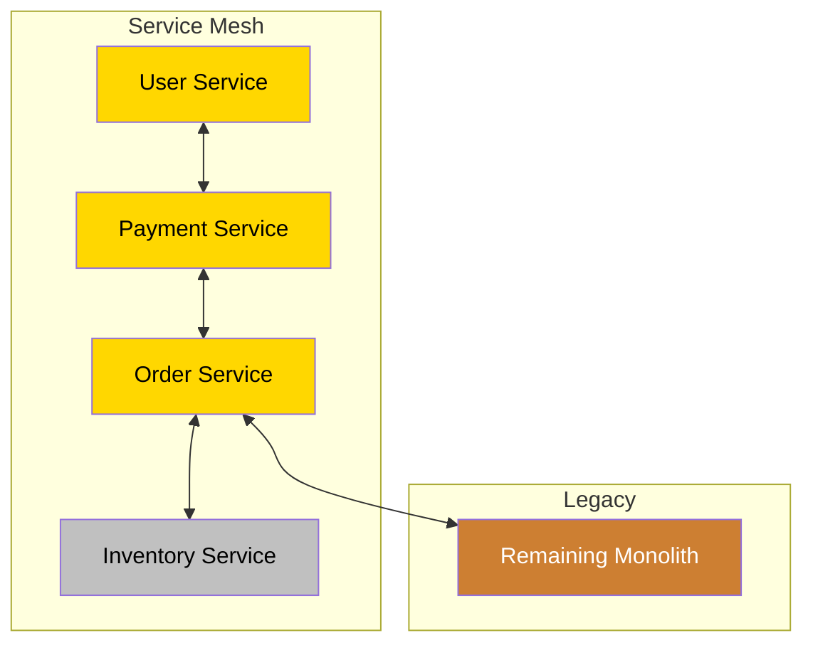

# 🔄 Legacy Modernization Journey

**The proven path to modernize legacy systems incrementally while maintaining business continuity.**

<div class="journey-header">
    <div class="journey-stats">
        <div class="stat">
            <h3>⏱️ Timeline</h3>
            <p>12-24 months</p>
        </div>
        <div class="stat">
            <h3>💪 Difficulty</h3>
            <p>Complex</p>
        </div>
        <div class="stat">
            <h3>💰 ROI</h3>
            <p>3-5x</p>
        </div>
        <div class="stat">
            <h3>🎯 Success Rate</h3>
            <p>70%</p>
        </div>
    </div>
</div>

## 🎯 Your Modernization Journey Map


## 📈 Phase 1: Assessment & Planning (Months 1-3)

### 🎯 Goals
- Understand current architecture
- Identify technical debt
- Map business capabilities
- Build migration roadmap

### 🏗️ Architecture Discovery
**Map the territory before making changes!**

```yaml
assessment_checklist:
  technical:
    - Database schema analysis
    - API inventory
    - Dependency mapping
    - Performance baselines
    - Security audit
  
  business:
    - Critical path identification
    - Risk assessment
    - Resource planning
    - Stakeholder alignment
```

### 📋 Implementation Checklist

#### Month 1: Discovery
- [ ] Document existing architecture
- [ ] Create dependency graph
- [ ] Identify bounded contexts
- [ ] Measure current performance

#### Month 2: Analysis
- [ ] Technical debt assessment
- [ ] Risk analysis
- [ ] Cost-benefit analysis
- [ ] Team skill assessment

#### Month 3: Planning
- [ ] Migration strategy selection
- [ ] Roadmap creation
- [ ] Success metrics definition
- [ ] Team formation

### 💡 Common Mistakes to Avoid
- 🚫 Big-bang rewrites
- 🚫 Ignoring data migration
- 🚫 Underestimating complexity
- 🚫 Poor stakeholder communication

### 📊 Success Metrics
- Clear bounded contexts identified
- Migration roadmap approved
- Team trained and ready
- Monitoring established

## 📈 Phase 2: Strangler Fig Implementation (Months 4-9)

### 🎯 Goals
- Intercept legacy traffic
- Build new services incrementally
- Maintain zero downtime
- Prove the approach

### 🏗️ Architecture Evolution
**Start strangling the monolith!**

```yaml
strangler_patterns:
  bronze_to_retire:
    - direct-database-access
    - shared-mutable-state
    - synchronous-coupling
  
  silver_to_adopt:
    - api-gateway         # Traffic interception
    - event-driven        # Decouple services
    - adapter-pattern     # Legacy integration
    - feature-toggles     # Safe rollout
  
  gold_foundations:
    - circuit-breaker     # Fault isolation
    - service-discovery   # Dynamic routing
    - distributed-tracing # Observability
```

### 📋 Strangler Fig Playbook

#### Step 1: API Gateway Setup


#### Step 2: First Service Extraction
<div class="migration-example">

**Before: Monolithic User Management**
```java
public class UserController {
    @Autowired private UserDAO userDAO;
    @Autowired private EmailService emailService;
    @Autowired private AuditService auditService;
    
    public User createUser(UserDTO dto) {
        User user = userDAO.save(dto);
        emailService.sendWelcome(user);
        auditService.log("USER_CREATED", user);
        return user;
    }
}
```

**After: Extracted User Service**
```java
// New User Service
@RestController
public class UserService {
    @Autowired private UserRepository repo;
    @Autowired private EventPublisher events;
    
    public User createUser(UserDTO dto) {
        User user = repo.save(dto);
        events.publish(new UserCreatedEvent(user));
        return user;
    }
}

// Legacy Adapter
public class LegacyUserAdapter {
    @Autowired private UserServiceClient client;
    
    public User createUser(UserDTO dto) {
        return client.createUser(dto);
    }
}
```

</div>

#### Step 3: Traffic Migration
- [ ] Route read traffic first
- [ ] Implement fallback to legacy
- [ ] Gradually increase traffic %
- [ ] Monitor error rates

### 🔄 Data Synchronization Strategy

```yaml
sync_patterns:
  initial_approach: "Dual writes"
  intermediate: "Event sourcing"
  final_state: "Service owns data"
  
  tools:
    - Change Data Capture (CDC)
    - Event streaming (Kafka)
    - Batch reconciliation
```

### 📊 Success Metrics
- First service extracted
- <1% error rate increase
- No performance degradation
- Team confidence high

## 📈 Phase 3: Service Mesh & Microservices (Months 10-15)

### 🎯 Goals
- Extract core services
- Implement service mesh
- Achieve service autonomy
- Scale development

### 🏗️ Service Decomposition
**Time to break apart the monolith!**

```yaml
service_extraction_order:
  1_user_service:
    complexity: low
    risk: low
    value: high
    patterns: [api-gateway, event-driven]
  
  2_payment_service:
    complexity: high
    risk: high
    value: critical
    patterns: [saga, circuit-breaker, idempotency]
  
  3_order_service:
    complexity: medium
    risk: medium
    value: high
    patterns: [event-sourcing, cqrs]
  
  4_inventory_service:
    complexity: medium
    risk: medium
    value: medium
    patterns: [optimistic-locking, event-driven]
```

### 📋 Service Mesh Implementation

#### Quarter 1: Core Services


#### Quarter 2: Data Decomposition
- [ ] Database per service
- [ ] Event-driven sync
- [ ] CQRS implementation
- [ ] Distributed transactions (Saga)

### 💰 Cost Optimization During Migration

<div class="cost-tips">

**Dual-Run Cost Management**
```yaml
strategies:
  shared_infrastructure:
    - Use same Kubernetes cluster
    - Share monitoring stack
    - Common CI/CD pipeline
  
  gradual_scaling:
    - Start with small instances
    - Auto-scale based on traffic
    - Decommission legacy gradually
  
  expected_timeline:
    - Month 1-6: +40% infrastructure cost
    - Month 7-12: Break even
    - Month 13+: 30% reduction
```

</div>

### 📊 Success Metrics
- 80% of traffic on new services
- Independent deployments
- Sub-second latency
- 50% faster feature delivery

## 📈 Phase 4: Legacy Decommission (Months 16-24)

### 🎯 Goals
- Complete migration
- Decommission legacy
- Optimize architecture
- Establish excellence

### 🏗️ Final Architecture
**Modern, scalable, maintainable!**

```yaml
target_architecture:
  patterns:
    gold_everywhere:
      - service-mesh
      - event-streaming
      - distributed-tracing
      - chaos-engineering
      - auto-scaling
      - multi-region
    
  capabilities:
      - Continuous deployment
      - A/B testing
      - Feature flags
      - Self-healing
      - Cost optimization
```

### 📋 Decommission Checklist

- [ ] All features migrated
- [ ] Data migration complete
- [ ] No legacy dependencies
- [ ] Performance validated
- [ ] Security audit passed
- [ ] Documentation updated
- [ ] Team trained
- [ ] Legacy shutdown

### 🏆 You've Modernized!

Your transformation achievements:
- 10x deployment frequency
- 90% reduction in MTTR
- 50% cost reduction
- 5x developer productivity

## 📚 Learning Resources by Phase

### Phase 1 Resources
- Book: "Working Effectively with Legacy Code"
- Course: "Domain-Driven Design"
- Case Study: Amazon's service extraction

### Phase 2 Resources
- Book: "Building Evolutionary Architectures"
- Course: "Microservices Patterns"
- Case Study: Netflix's migration

### Phase 3 Resources
- Book: "Microservices Patterns"
- Course: "Service Mesh Fundamentals"
- Case Study: Uber's microservices

### Phase 4 Resources
- Book: "Release It!"
- Course: "Site Reliability Engineering"
- Case Study: Airbnb's architecture

## 🎯 Success Stories

<div class="success-stories">

### Amazon: Monolith to Services
- **2001**: Single monolithic app
- **2002**: Service extraction begins
- **2006**: Full service architecture
- **Today**: 100s of services

### Netflix: DVD to Streaming
- **2007**: Monolithic DVD app
- **2008**: Cloud migration starts
- **2010**: Microservices adoption
- **Today**: 1000+ microservices

### Uber: PHP to Services
- **2012**: PHP monolith
- **2014**: Service extraction
- **2016**: 1000+ services
- **Today**: Global scale

</div>

## 💡 Key Takeaways

1. **Incremental Progress**
   - Strangler Fig over big bang
   - Prove value early
   - Maintain business continuity

2. **Data is the Hard Part**
   - Plan data migration first
   - Consider eventual consistency
   - Use events for synchronization

3. **Team Transformation**
   - Upskill existing team
   - Hire cloud-native talent
   - Create center of excellence

4. **Measure Everything**
   - Migration progress
   - System performance
   - Business metrics
   - Team velocity

---

<div class="navigation-footer">
    <a href="../startup-to-scale/" class="md-button">← Startup to Scale</a>
    <a href="../reliability-transformation/" class="md-button">Reliability Transformation →</a>
    <a href="../../migration-center/" class="md-button md-button--primary">Migration Patterns →</a>
</div>

<style>
.journey-header {
    margin: 2rem 0;
}

.journey-stats {
    display: grid;
    grid-template-columns: repeat(auto-fit, minmax(150px, 1fr));
    gap: 1.5rem;
    margin: 2rem 0;
}

.stat {
    text-align: center;
    padding: 1.5rem;
    background: var(--md-code-bg-color);
    border-radius: 0.5rem;
}

.stat h3 {
    margin: 0;
    font-size: 1.5rem;
}

.stat p {
    margin: 0.5rem 0 0 0;
    font-size: 1.2rem;
    color: var(--md-accent-fg-color);
}

.migration-example {
    background: var(--md-code-bg-color);
    padding: 2rem;
    border-radius: 0.5rem;
    margin: 2rem 0;
}

.cost-tips {
    background: #e8f5e9;
    padding: 2rem;
    border-radius: 0.5rem;
    margin: 2rem 0;
}

.success-stories {
    display: grid;
    grid-template-columns: repeat(auto-fit, minmax(250px, 1fr));
    gap: 1.5rem;
    margin: 2rem 0;
}

.success-stories > div {
    padding: 1.5rem;
    background: var(--md-accent-bg-color);
    border-radius: 0.5rem;
}

.navigation-footer {
    display: flex;
    gap: 1rem;
    justify-content: center;
    margin-top: 3rem;
    padding-top: 2rem;
    border-top: 1px solid var(--md-default-fg-color--lightest);
}

.mermaid {
    margin: 2rem 0;
    text-align: center;
}

code {
    background: var(--md-code-bg-color);
    padding: 0.1rem 0.3rem;
    border-radius: 0.2rem;
}
</style>