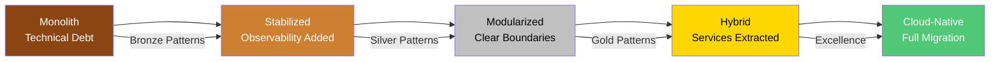
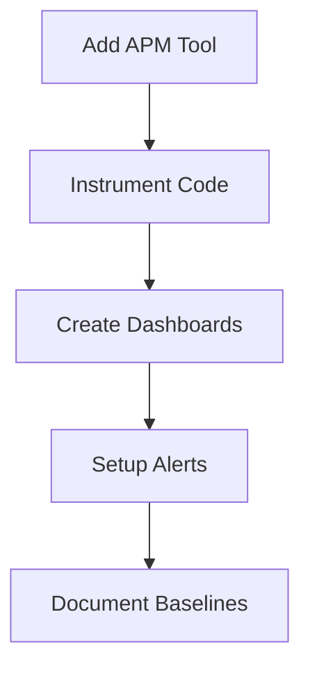
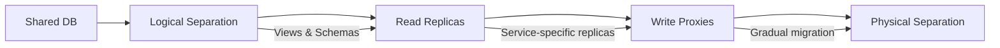

# 🔄 Legacy Modernization Journey

**The systematic path from decades-old monoliths to cloud-native excellence without disrupting business.**

<div class="journey-header">
    <div class="journey-stats">
        <div class="stat">
            <h3>⏱️ Timeline</h3>
            <p>12-24 months</p>
        </div>
        <div class="stat">
            <h3>💪 Difficulty</h3>
            <p>High</p>
        </div>
        <div class="stat">
            <h3>💰 ROI</h3>
            <p>5-8x</p>
        </div>
        <div class="stat">
            <h3>🎯 Success Rate</h3>
            <p>70%</p>
        </div>
    </div>
</div>

## 🎯 Your Modernization Roadmap



## 📈 Phase 1: Assessment & Stabilization (Month 1-3)

### 🎯 Goals
- Understand current state
- Add observability
- Eliminate critical risks
- Build team confidence

### 🏗️ Pattern Implementation
**First, stop the bleeding!**

```yaml
patterns_to_add:
  bronze:
    - health-checks      # Know when things break
    - structured-logging # Understand what's happening
    - basic-monitoring   # Track key metrics
  silver:
    - api-gateway       # Unified entry point
    - circuit-breaker   # Prevent cascade failures
    - rate-limiting     # Protect from overload
```

### 📋 Week-by-Week Plan

#### Week 1-2: Discovery
- [ ] Document current architecture
- [ ] Identify critical paths
- [ ] Map dependencies
- [ ] Assess technical debt

#### Week 3-4: Observability


#### Week 5-8: Quick Wins
- [ ] Add health endpoints
- [ ] Implement structured logging
- [ ] Create runbooks
- [ ] Fix critical bugs

#### Week 9-12: Foundation
- [ ] Add API gateway
- [ ] Implement circuit breakers
- [ ] Create test suites
- [ ] Establish CI/CD

### 💡 Common Pitfalls
- 🚫 Big bang rewrite attempts
- 🚫 Changing too much at once
- 🚫 Ignoring business continuity
- 🚫 Underestimating complexity

### 📊 Success Metrics
- Mean Time To Detect: <15 min
- Mean Time To Resolve: <2 hours
- Test coverage: >40%
- Deploy frequency: Weekly

## 📈 Phase 2: Modularization (Month 4-9)

### 🎯 Goals
- Define service boundaries
- Extract first services
- Establish patterns
- Prove approach works

### 🏗️ Architecture Evolution
**Strategic decomposition begins!**

```yaml
decomposition_strategy:
  approach: "Strangler Fig Pattern"
  first_candidates:
    - user-authentication    # Clear boundary
    - notification-service   # Async by nature
    - reporting-module       # Read-heavy
  patterns_to_implement:
    silver:
      - service-discovery   # Dynamic routing
      - message-queue       # Async communication
      - database-per-service # Data autonomy
    gold:
      - event-sourcing      # Audit trail
      - saga-pattern        # Distributed transactions
```

### 📋 Service Extraction Playbook

#### Month 4: First Service
<div class="migration-example">

**Before: Embedded Authentication**
```java
public class UserController {
    private void authenticateUser(String token) {
        // 500 lines of auth logic mixed with business logic
        // Direct database access
        // No clear boundaries
    }
}
```

**After: Authentication Service**
```java
// Auth Service
@RestController
public class AuthService {
    @PostMapping("/validate")
    public TokenValidation validate(@RequestBody Token token) {
        // Clean, focused auth logic
        // Own database
        // Clear API contract
    }
}

// Main Application
public class UserController {
    @Autowired
    private AuthServiceClient authClient;
    
    private void authenticateUser(String token) {
        return authClient.validate(token);
    }
}
```

</div>

#### Month 5-6: Pattern Establishment
- [ ] Service discovery implementation
- [ ] Message queue setup
- [ ] Database separation
- [ ] Integration testing

#### Month 7-9: Scale Extraction
- [ ] Extract 3-5 services
- [ ] Implement saga pattern
- [ ] Add distributed tracing
- [ ] Performance optimization

### 🔄 Data Migration Strategy



### 📊 Success Metrics
- Services extracted: 3-5
- API response time: <200ms
- Service autonomy: 80%
- Deployment independence: Yes

## 📈 Phase 3: Platform Building (Month 10-18)

### 🎯 Goals
- Build service platform
- Automate operations
- Enable team autonomy
- Accelerate delivery

### 🏗️ Platform Components
**Infrastructure as a product!**

```yaml
platform_capabilities:
  core:
    - kubernetes          # Container orchestration
    - service-mesh        # Communication layer
    - api-management      # External APIs
    - observability-stack # Monitoring/tracing
  
  patterns_everywhere:
    gold:
      - auto-scaling       # Handle load
      - blue-green-deploy  # Safe releases
      - feature-flags      # Progressive rollout
      - chaos-engineering  # Resilience testing
```

### 📋 Platform Implementation

#### Quarter 4: Foundation
1. **Container Migration**
   ```dockerfile
   # Standardized base images
   FROM company/base-java:11
   
   # Health checks built-in
   HEALTHCHECK --interval=30s \
     CMD curl -f http://localhost:8080/health || exit 1
   ```

2. **Service Mesh Rollout**
   - Istio/Linkerd deployment
   - mTLS between services
   - Traffic management
   - Observability integration

3. **Developer Experience**
   - Self-service provisioning
   - Automated testing
   - One-click deployments
   - Cost visibility

#### Quarter 5: Advanced Patterns
- [ ] Multi-region deployment
- [ ] Disaster recovery
- [ ] Performance optimization
- [ ] Security hardening

#### Quarter 6: Excellence
- [ ] ML-driven scaling
- [ ] Predictive monitoring
- [ ] Cost optimization
- [ ] Innovation platform

### 💰 Cost Management

<div class="cost-tips">

**Migration Savings**
```yaml
before:
  - On-premise datacenter: $50K/month
  - Overprovisioned: 30% utilization
  - Manual scaling: 4 FTEs
  
after:
  - Cloud infrastructure: $25K/month
  - Auto-scaling: 75% utilization
  - Automated ops: 1 FTE
  
savings: 60% reduction
```

</div>

### 📊 Success Metrics
- Service count: 20-30
- Deploy frequency: Daily
- Lead time: <1 hour
- MTTR: <30 minutes

## 📈 Phase 4: Excellence Achievement (Month 19-24)

### 🎯 Goals
- Zero-downtime operations
- Self-healing systems
- Innovation enablement
- Industry leadership

### 🏗️ Excellence Architecture

```yaml
final_state:
  architecture:
    - cell-based-deployment
    - event-driven-backbone
    - polyglot-persistence
    - edge-computing
  
  operations:
    - gitops-everything
    - progressive-delivery
    - automated-recovery
    - ml-optimization
  
  culture:
    - ownership-mindset
    - excellence-standards
    - continuous-learning
    - innovation-time
```

### 📋 Excellence Checklist

- [ ] 99.99% availability achieved
- [ ] Sub-100ms global latency
- [ ] Full automation coverage
- [ ] Chaos engineering practice
- [ ] Cost optimization achieved
- [ ] Team autonomy realized

### 🏆 Transformation Complete!

You've successfully modernized from:
- **20-year-old monolith** → **Cloud-native platform**
- **Quarterly releases** → **Continuous deployment**
- **Hours of downtime** → **Zero-downtime operations**
- **Manual operations** → **Self-healing systems**

## 📚 Case Studies

### JP Morgan Chase: Core Banking Modernization
- **Challenge**: 30-year-old COBOL systems
- **Approach**: Incremental strangler pattern
- **Timeline**: 3 years
- **Result**: 50% cost reduction, 10x faster features

### Walmart: E-commerce Platform
- **Challenge**: Unable to handle Black Friday
- **Approach**: Microservices + Kubernetes
- **Timeline**: 2 years
- **Result**: 6M orders/minute capability

### Capital One: Cloud Migration
- **Challenge**: On-premise data centers
- **Approach**: All-in cloud strategy
- **Timeline**: 5 years
- **Result**: 8 data centers closed, 70% cost savings

## 💡 Key Success Factors

1. **Executive Sponsorship**
   - Clear vision
   - Sustained funding
   - Change management

2. **Incremental Approach**
   - Small wins build momentum
   - Risk mitigation
   - Continuous value delivery

3. **Team Enablement**
   - Training investment
   - Modern tooling
   - Autonomy and ownership

4. **Business Alignment**
   - Clear ROI metrics
   - Regular communication
   - Celebrating wins

## 📊 Modernization Metrics Dashboard

```yaml
technical_metrics:
  - deployment_frequency: "100x improvement"
  - lead_time: "From weeks to hours"
  - mttr: "From hours to minutes"
  - change_failure_rate: "From 25% to 2%"

business_metrics:
  - time_to_market: "75% faster"
  - operational_cost: "60% reduction"
  - developer_productivity: "3x increase"
  - customer_satisfaction: "40% improvement"
```

---

<div class="navigation-footer">
    <a href="../startup-to-scale/" class="md-button">← Startup to Scale</a>
    <a href="../" class="md-button">Back to Journeys</a>
    <a href="../reliability-transformation/" class="md-button">Reliability Journey →</a>
</div>

<style>
.journey-header {
    margin: 2rem 0;
}

.journey-stats {
    display: grid;
    grid-template-columns: repeat(auto-fit, minmax(150px, 1fr));
    gap: 1.5rem;
    margin: 2rem 0;
}

.stat {
    text-align: center;
    padding: 1.5rem;
    background: var(--md-code-bg-color);
    border-radius: 0.5rem;
}

.stat h3 {
    margin: 0;
    font-size: 1.5rem;
}

.stat p {
    margin: 0.5rem 0 0 0;
    font-size: 1.2rem;
    color: var(--md-accent-fg-color);
}

.migration-example {
    background: var(--md-code-bg-color);
    padding: 2rem;
    border-radius: 0.5rem;
    margin: 2rem 0;
}

.cost-tips {
    background: #e8f5e9;
    padding: 2rem;
    border-radius: 0.5rem;
    margin: 2rem 0;
}

.navigation-footer {
    display: flex;
    gap: 1rem;
    justify-content: center;
    margin-top: 3rem;
    padding-top: 2rem;
    border-top: 1px solid var(--md-default-fg-color--lightest);
}

.mermaid {
    margin: 2rem 0;
    text-align: center;
}

code {
    background: var(--md-code-bg-color);
    padding: 0.1rem 0.3rem;
    border-radius: 0.2rem;
}
</style>