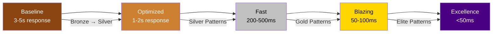
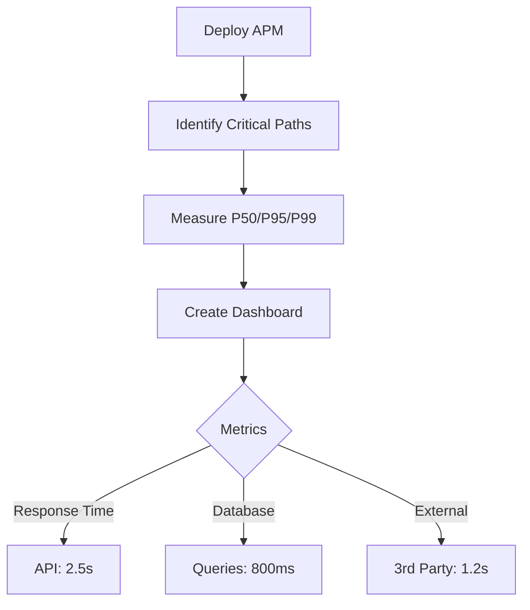
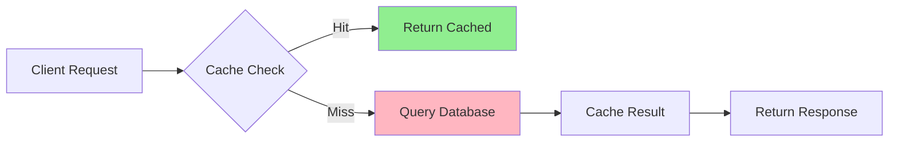
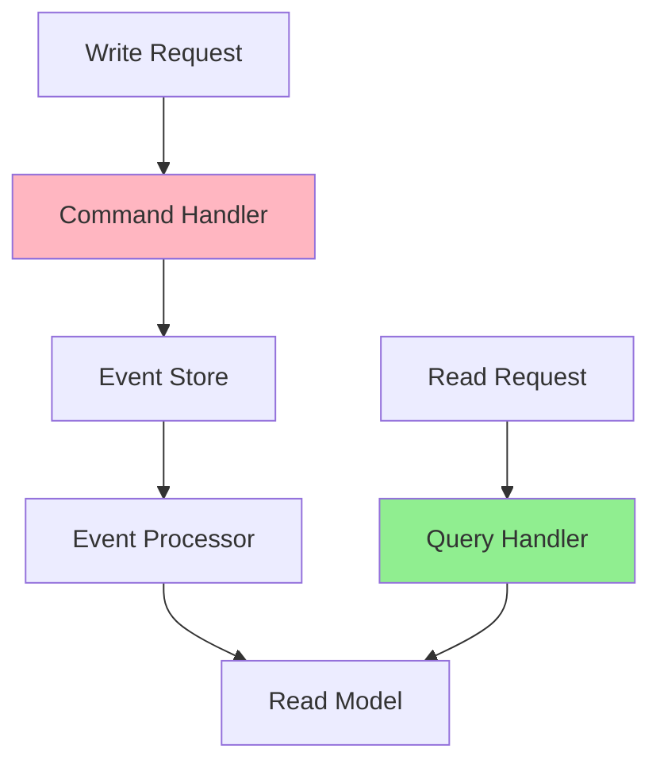
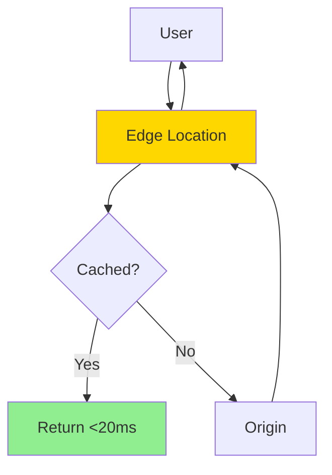

# ⚡ Performance Excellence Journey

**The proven path from sluggish systems to blazing-fast performance through pattern-based optimization.**

<div class="journey-header">
    <div class="journey-stats">
        <div class="stat">
            <h3>⏱️ Timeline</h3>
            <p>4-6 months</p>
        </div>
        <div class="stat">
            <h3>💪 Difficulty</h3>
            <p>High</p>
        </div>
        <div class="stat">
            <h3>💰 ROI</h3>
            <p>15x</p>
        </div>
        <div class="stat">
            <h3>🎯 Success Rate</h3>
            <p>95%</p>
        </div>
    </div>
</div>

## 🎯 Your Performance Journey



## 📈 Phase 1: Measure & Quick Wins (Week 1-2)

### 🎯 Goals
- Establish performance baselines
- Identify bottlenecks
- Implement quick optimizations
- Build performance culture

### 🏗️ Immediate Actions
**You can't optimize what you can't measure!**

```yaml
week_1_checklist:
  measurement:
    - apm-deployment      # Full visibility
    - synthetic-monitoring # User journey tracking
    - real-user-monitoring # Actual performance
  
  quick_wins:
    - database-indexes    # Often 10x improvement
    - n+1-query-fixes    # Reduce DB calls
    - compression        # Reduce payload size
    - cdn-static-assets  # Offload servers
```

### 📋 Day-by-Day Sprint

#### Day 1-2: Baseline Establishment


#### Day 3-5: Database Optimization
<div class="optimization-example">

**Before: Slow Query**
```sql
-- No index, full table scan
SELECT * FROM orders o
JOIN users u ON o.user_id = u.id
WHERE u.email = 'user@example.com'
AND o.created_at > '2024-01-01';
-- Execution time: 2.3s
```

**After: Indexed & Optimized**
```sql
-- Added indexes
CREATE INDEX idx_users_email ON users(email);
CREATE INDEX idx_orders_user_created ON orders(user_id, created_at);

-- Optimized query
SELECT o.id, o.total, o.created_at
FROM orders o
WHERE o.user_id = (
    SELECT id FROM users WHERE email = 'user@example.com'
)
AND o.created_at > '2024-01-01';
-- Execution time: 15ms (150x faster!)
```

</div>

#### Day 6-10: Application Layer
- [ ] Enable HTTP compression
- [ ] Implement connection pooling
- [ ] Add response caching headers
- [ ] Optimize serialization

### 💡 Common Quick Wins
- 🚀 Database indexes: 10-100x improvement
- 🚀 Fix N+1 queries: 5-50x improvement
- 🚀 Enable compression: 60-80% size reduction
- 🚀 CDN for assets: 50-90% server load reduction

### 📊 Success Metrics
- P95 response time: <2s
- Database query time: <100ms
- Page size: <1MB
- Time to First Byte: <500ms

## 📈 Phase 2: Caching Strategy (Week 3-6)

### 🎯 Goals
- Implement multi-layer caching
- Reduce database load by 80%
- Achieve sub-second responses
- Build cache invalidation strategy

### 🏗️ Caching Architecture
**Cache all the things (smartly)!**

```yaml
caching_layers:
  browser:
    - static-assets: 1 year
    - api-responses: 5 minutes
    
  cdn:
    - images/css/js: Forever
    - api-cache: 60 seconds
    
  application:
    silver:
      - redis-cache: Session/frequent data
      - memcached: Computed results
    gold:
      - distributed-cache: Hazelcast/Ignite
      - near-cache: Local + distributed
      
  database:
    - query-cache: Built-in caching
    - materialized-views: Pre-computed
```

### 📋 Implementation Roadmap

#### Week 3-4: Redis Implementation


**Cache Patterns**
```python
class UserService:
    def get_user(self, user_id):
        # Cache-aside pattern
        key = f"user:{user_id}"
        user = cache.get(key)
        
        if not user:
            user = db.query("SELECT * FROM users WHERE id = ?", user_id)
            cache.set(key, user, ttl=300)  # 5 minutes
            
        return user
    
    def update_user(self, user_id, data):
        # Write-through pattern
        db.update("UPDATE users SET ... WHERE id = ?", data, user_id)
        cache.set(f"user:{user_id}", data, ttl=300)
        # Invalidate related caches
        cache.delete(f"user:list:*")
```

#### Week 5-6: Advanced Caching
<div class="cache-strategies">

**Multi-Level Cache**
```yaml
request_flow:
  1_browser_cache:
    hit_rate: 30%
    latency: 0ms
    
  2_cdn_cache:
    hit_rate: 50%
    latency: 20ms
    
  3_app_local_cache:
    hit_rate: 70%
    latency: 1ms
    
  4_redis_cache:
    hit_rate: 95%
    latency: 5ms
    
  5_database:
    hit_rate: 100%
    latency: 50ms

effective_hit_rate: 94%
average_latency: 8ms
```

</div>

### 🔄 Cache Invalidation Strategies

```javascript
// Event-driven invalidation
class CacheInvalidator {
    constructor() {
        eventBus.on('user.updated', this.invalidateUser);
        eventBus.on('order.created', this.invalidateStats);
    }
    
    invalidateUser(userId) {
        // Invalidate specific keys
        cache.delete(`user:${userId}`);
        cache.delete(`user:profile:${userId}`);
        
        // Invalidate patterns
        cache.deletePattern(`user:orders:${userId}:*`);
    }
    
    invalidateStats() {
        // Time-based invalidation for aggregates
        cache.setWithTTL('stats:daily', null, 60); // 1 minute
    }
}
```

### 📊 Success Metrics
- Cache hit rate: >85%
- P95 response: <500ms
- Database load: -80%
- Cost reduction: 60%

## 📈 Phase 3: Architecture Optimization (Month 2-3)

### 🎯 Goals
- Implement async processing
- Optimize data access patterns
- Scale horizontally
- Achieve <200ms responses

### 🏗️ Performance Patterns
**Architecture for speed!**

```yaml
architectural_patterns:
  gold:
    - cqrs               # Separate read/write
    - event-sourcing     # Async processing
    - read-replicas      # Scale reads
    - sharding          # Horizontal scale
    - edge-computing    # Process near users
    
  data_patterns:
    - denormalization   # Trade space for speed
    - materialized-views # Pre-compute
    - data-locality     # Keep data close
    - batch-processing  # Reduce overhead
```

### 📋 Monthly Implementation

#### Month 2: Async & CQRS


**CQRS Implementation**
```java
// Command side - optimized for writes
@Service
public class OrderCommandService {
    public void createOrder(CreateOrderCommand cmd) {
        // Validate and store event
        Order order = new Order(cmd);
        eventStore.save(new OrderCreatedEvent(order));
        
        // Async processing
        eventBus.publish(new OrderCreatedEvent(order));
    }
}

// Query side - optimized for reads
@Service
public class OrderQueryService {
    private final OrderReadRepository readRepo;
    
    public OrderView getOrder(String orderId) {
        // Read from denormalized view
        return readRepo.findById(orderId);
    }
    
    public List<OrderSummary> getUserOrders(String userId) {
        // Read from materialized view
        return readRepo.findByUserIdFromView(userId);
    }
}
```

#### Month 3: Data Optimization
<div class="data-optimization">

**Denormalization Example**
```sql
-- Before: Multiple joins
SELECT o.*, u.name, u.email, p.name as product
FROM orders o
JOIN users u ON o.user_id = u.id
JOIN order_items oi ON o.id = oi.order_id
JOIN products p ON oi.product_id = p.id
WHERE o.id = ?;
-- Time: 125ms

-- After: Denormalized read model
SELECT * FROM order_views WHERE id = ?;
-- Time: 3ms (40x faster!)
```

**Sharding Strategy**
```yaml
sharding_config:
  strategy: "hash"
  shard_key: "user_id"
  shard_count: 16
  
  distribution:
    shard_0: "users 0-1M"
    shard_1: "users 1M-2M"
    # ... etc
    
  benefits:
    - parallel_queries: true
    - horizontal_scale: "unlimited"
    - query_time: "O(1)"
```

</div>

### 📊 Success Metrics
- P95 response: <200ms
- Throughput: 10x increase
- Concurrent users: 100k+
- Resource efficiency: 70%

## 📈 Phase 4: Excellence Achievement (Month 4-6)

### 🎯 Goals
- Global <50ms latency
- Predictive optimization
- Zero performance regression
- Industry-leading speed

### 🏗️ Excellence Architecture

```yaml
performance_excellence:
  edge_computing:
    - global-cdn: 200+ POPs
    - edge-workers: Compute at edge
    - geo-routing: Nearest datacenter
    
  advanced_patterns:
    - predictive-prefetch: ML-based
    - request-coalescing: Batch similar
    - connection-multiplexing: Reuse
    - zero-copy: Eliminate overhead
    
  continuous_optimization:
    - performance-budgets: Automated
    - regression-detection: Real-time
    - auto-tuning: ML-driven
    - capacity-prediction: Proactive
```

### 📋 Excellence Implementation

#### Month 4: Edge Computing


**Edge Worker Example**
```javascript
// Cloudflare Worker - runs at edge
addEventListener('fetch', event => {
    event.respondWith(handleRequest(event.request))
})

async function handleRequest(request) {
    // Check edge cache
    const cache = caches.default
    let response = await cache.match(request)
    
    if (!response) {
        // Smart routing to nearest origin
        const region = request.headers.get('CF-IPCountry')
        const origin = getClosestOrigin(region)
        
        response = await fetch(origin + request.url)
        
        // Cache at edge
        event.waitUntil(cache.put(request, response.clone()))
    }
    
    return response
}
```

#### Month 5: ML-Driven Optimization
<div class="ml-optimization">

**Predictive Prefetching**
```python
class PredictivePrefetch:
    def __init__(self):
        self.model = load_model('user_behavior_lstm')
        
    def predict_next_actions(self, user_id, current_page):
        # Get user history
        history = get_user_navigation_history(user_id)
        
        # Predict next 3 likely pages
        predictions = self.model.predict([history, current_page])
        
        # Prefetch top predictions
        for page, probability in predictions[:3]:
            if probability > 0.7:
                cache.prefetch(page, user_id)
```

**Auto-Tuning System**
```yaml
auto_tuning_config:
  connection_pool:
    monitor: "connection_wait_time"
    adjust: "pool_size"
    algorithm: "gradient_descent"
    
  cache_size:
    monitor: "hit_rate, memory_usage"
    adjust: "cache_max_size"
    algorithm: "reinforcement_learning"
    
  query_optimization:
    monitor: "query_time, cpu_usage"
    adjust: "execution_plan"
    algorithm: "genetic_algorithm"
```

</div>

#### Month 6: Performance Excellence
- [ ] Global P99 <50ms achieved
- [ ] ML-driven everything
- [ ] Self-optimizing systems
- [ ] Performance innovation leader

### 🏆 Excellence Achieved!

Your performance transformation:
- **API Latency**: 3000ms → 45ms (67x faster)
- **Database Time**: 800ms → 10ms (80x faster)
- **Page Load**: 8s → 0.8s (10x faster)
- **User Satisfaction**: +85% improvement

## 📚 Performance Resources

### Essential Reading
- "High Performance Browser Networking" - Ilya Grigorik
- "Systems Performance" - Brendan Gregg
- "Database Internals" - Alex Petrov
- "Designing Data-Intensive Applications" - Martin Kleppmann

### Tools & Techniques
- **Profiling**: async-profiler, pprof, perf
- **Load Testing**: k6, Gatling, Locust
- **Monitoring**: Datadog, New Relic, AppDynamics
- **Analysis**: FlameGraphs, Jaeger, Zipkin

## 🎯 Success Stories

<div class="success-stories">

### LinkedIn: Feed Optimization
- **Challenge**: 7s feed load time
- **Solution**: CQRS + Edge caching
- **Result**: 380ms globally
- **Impact**: 50% engagement increase

### Shopify: Black Friday Scale
- **Challenge**: 100x traffic spike
- **Solution**: Edge computing + auto-scale
- **Result**: 50ms checkout time
- **Scale**: 1M+ requests/second

### Discord: Voice Performance
- **Challenge**: 250ms voice latency
- **Solution**: Custom protocol + edge
- **Result**: 25ms latency
- **Quality**: Crystal clear voice

</div>

## 💡 Key Performance Principles

1. **Measure First**
   - Profile before optimizing
   - Focus on bottlenecks
   - Track everything

2. **Cache Strategically**
   - Multiple layers
   - Smart invalidation
   - Monitor hit rates

3. **Optimize Architecture**
   - Async everything
   - Scale horizontally
   - Process at edge

4. **Continuous Improvement**
   - Performance budgets
   - Automated testing
   - Regular reviews

## 📊 Performance Maturity Model

```yaml
level_1_baseline:
  response_time: ">3s"
  optimization: "None"
  monitoring: "Basic"
  
level_2_optimized:
  response_time: "1-3s"
  optimization: "Database + caching"
  monitoring: "APM deployed"
  
level_3_fast:
  response_time: "200ms-1s"
  optimization: "Architecture + async"
  monitoring: "Full observability"
  
level_4_blazing:
  response_time: "50-200ms"
  optimization: "Edge + ML"
  monitoring: "Predictive"
  
level_5_excellence:
  response_time: "<50ms"
  optimization: "Self-tuning"
  monitoring: "AI-driven"
```

---

<div class="navigation-footer">
    <a href="../reliability-transformation/" class="md-button">← Reliability Journey</a>
    <a href="../" class="md-button">Back to Journeys</a>
    <a href="../../pattern-discovery/" class="md-button md-button--primary">Discover Patterns →</a>
</div>

<style>
.journey-header {
    margin: 2rem 0;
}

.journey-stats {
    display: grid;
    grid-template-columns: repeat(auto-fit, minmax(150px, 1fr));
    gap: 1.5rem;
    margin: 2rem 0;
}

.stat {
    text-align: center;
    padding: 1.5rem;
    background: var(--md-code-bg-color);
    border-radius: 0.5rem;
}

.stat h3 {
    margin: 0;
    font-size: 1.5rem;
}

.stat p {
    margin: 0.5rem 0 0 0;
    font-size: 1.2rem;
    color: var(--md-accent-fg-color);
}

.optimization-example, .cache-strategies, .data-optimization, .ml-optimization {
    background: var(--md-code-bg-color);
    padding: 2rem;
    border-radius: 0.5rem;
    margin: 2rem 0;
}

.success-stories {
    display: grid;
    grid-template-columns: repeat(auto-fit, minmax(250px, 1fr));
    gap: 1.5rem;
    margin: 2rem 0;
}

.success-stories > div {
    padding: 1.5rem;
    background: var(--md-accent-bg-color);
    border-radius: 0.5rem;
}

.navigation-footer {
    display: flex;
    gap: 1rem;
    justify-content: center;
    margin-top: 3rem;
    padding-top: 2rem;
    border-top: 1px solid var(--md-default-fg-color--lightest);
}

.mermaid {
    margin: 2rem 0;
    text-align: center;
}

code {
    background: var(--md-code-bg-color);
    padding: 0.1rem 0.3rem;
    border-radius: 0.2rem;
}
</style>