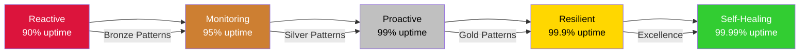
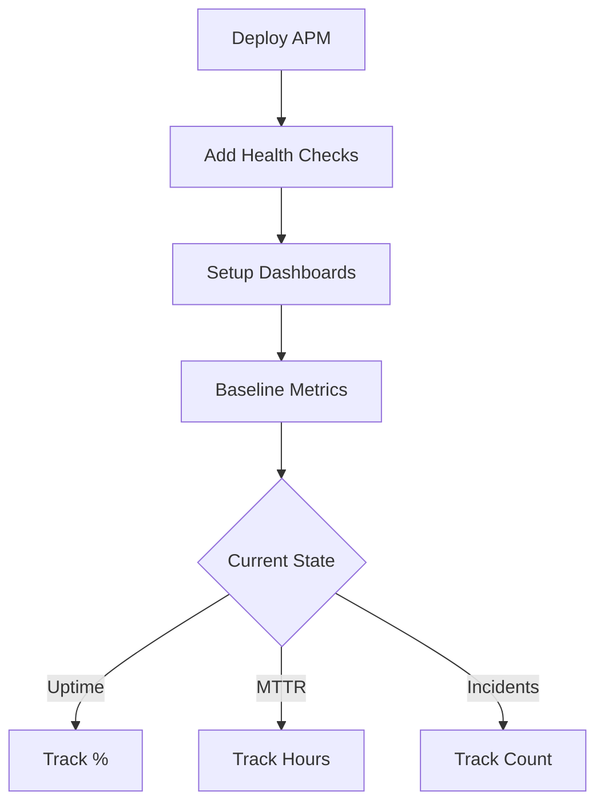
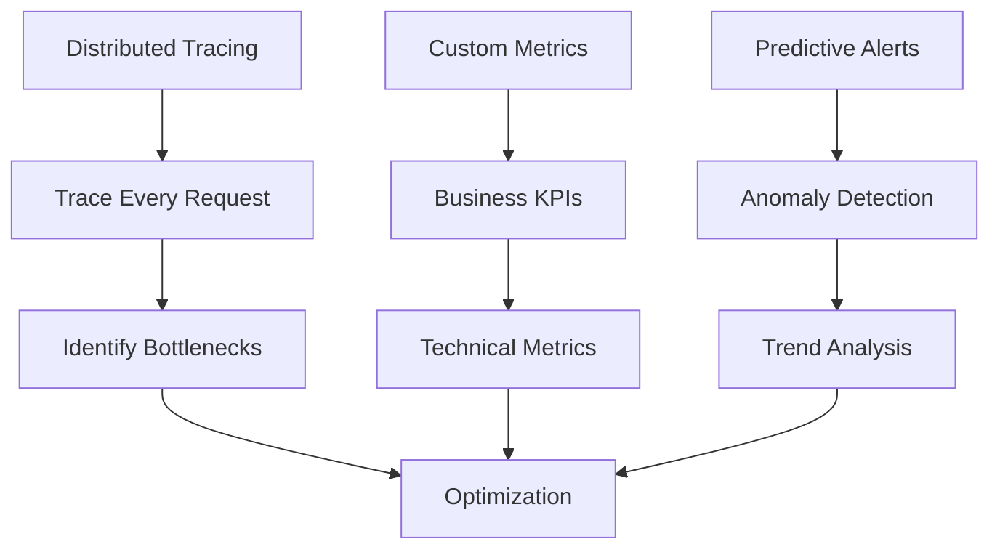

# 🛡️ Reliability Transformation Journey

**Transform from frequent outages to industry-leading reliability through systematic pattern adoption.**

<div class="journey-header">
    <div class="journey-stats">
        <div class="stat">
            <h3>⏱️ Timeline</h3>
            <p>6-9 months</p>
        </div>
        <div class="stat">
            <h3>💪 Difficulty</h3>
            <p>Moderate</p>
        </div>
        <div class="stat">
            <h3>💰 ROI</h3>
            <p>20x</p>
        </div>
        <div class="stat">
            <h3>🎯 Success Rate</h3>
            <p>90%</p>
        </div>
    </div>
</div>

## 🎯 Your Reliability Evolution



## 📈 Phase 1: Foundation Building (Week 1-4)

### 🎯 Goals
- Establish baseline metrics
- Implement basic monitoring
- Create incident process
- Build reliability culture

### 🏗️ Critical First Steps
**You can't improve what you can't measure!**

```yaml
immediate_actions:
  week_1:
    - health-checks       # Know service status
    - uptime-monitoring   # Track availability
    - error-tracking      # Capture failures
  week_2:
    - alerting-setup      # Get notified
    - runbook-creation    # Document responses
    - on-call-rotation    # Clear ownership
  patterns:
    bronze:
      - basic-monitoring
      - health-check-api
      - structured-logging
```

### 📋 Week-by-Week Implementation

#### Week 1: Visibility


#### Week 2: Alerting & Response
- [ ] Define SLIs (Service Level Indicators)
- [ ] Configure alerts for SLIs
- [ ] Create runbook templates
- [ ] Establish on-call schedule

#### Week 3: Quick Wins
<div class="reliability-quick-wins">

**Immediate Improvements**
```yaml
before:
  - No health checks
  - Logs in multiple formats
  - Alerts for everything
  - No documented procedures

after:
  - /health endpoint on all services
  - Structured JSON logging
  - Alert only on user impact
  - Runbooks for top 5 issues

impact: 30% reduction in MTTR
```

</div>

#### Week 4: Process & Culture
- [ ] Blameless postmortem process
- [ ] Weekly reliability review
- [ ] Error budget tracking
- [ ] Team training sessions

### 💡 Anti-Patterns to Avoid
- 🚫 Alert fatigue from noisy alerts
- 🚫 Blame culture in incidents
- 🚫 Ignoring near-misses
- 🚫 Manual toil acceptance

### 📊 Success Metrics
- Baseline uptime: Measured
- MTTR: <4 hours
- Alert accuracy: >80%
- Runbook coverage: Top 10 issues

## 📈 Phase 2: Resilience Patterns (Month 2-3)

### 🎯 Goals
- Prevent cascade failures
- Implement degradation strategies
- Add redundancy layers
- Automate responses

### 🏗️ Pattern Implementation
**Build defense in depth!**

```yaml
resilience_patterns:
  silver:
    - circuit-breaker     # Prevent cascades
    - retry-with-backoff  # Handle transients
    - timeout-handling    # Fail fast
    - bulkhead-isolation  # Limit blast radius
  gold:
    - rate-limiting       # Protect resources
    - load-balancing      # Distribute load
    - failover           # Automatic recovery
    - graceful-degradation # Partial service
```

### 📋 Implementation Roadmap

#### Month 2: Core Resilience
1. **Circuit Breakers Everywhere**
   ```java
   @Component
   public class PaymentService {
       private final CircuitBreaker circuitBreaker;
       
       public PaymentResult processPayment(Payment payment) {
           return circuitBreaker
               .executeSupplier(() -> externalPaymentAPI.process(payment))
               .recover(throwable -> {
                   // Fallback: Queue for later
                   return PaymentResult.queued(payment.id);
               });
       }
   }
   ```

2. **Timeout Configuration**
   ```yaml
   service_timeouts:
     default: 5s
     database_read: 1s
     database_write: 3s
     external_api: 10s
     circuit_break_after: 5_failures
   ```

3. **Retry Strategies**
   ```python
   @retry(
       wait=wait_exponential(multiplier=1, min=1, max=10),
       stop=stop_after_attempt(3),
       retry=retry_if_exception_type(TransientError)
   )
   def call_external_service(request):
       return api_client.post(request)
   ```

#### Month 3: Advanced Patterns
- [ ] Implement bulkheads
- [ ] Add rate limiting
- [ ] Setup multi-region failover
- [ ] Create chaos experiments

### 🔄 Graceful Degradation Example

<div class="degradation-example">

**Smart Feature Toggling**
```javascript
class RecommendationService {
    async getRecommendations(userId) {
        try {
            // Try ML-powered recommendations
            return await mlService.getPersonalized(userId);
        } catch (error) {
            // Fallback to popular items
            return await cache.getPopularItems();
        }
    }
}

// During high load
if (systemLoad > 0.8) {
    features.disable('personalizedRecommendations');
    features.enable('cachedRecommendations');
}
```

</div>

### 📊 Success Metrics
- Cascade failures: Zero
- Partial outages handled: 100%
- Auto-recovery rate: >70%
- Performance under load: Stable

## 📈 Phase 3: Proactive Operations (Month 4-6)

### 🎯 Goals
- Predict failures before impact
- Automate recovery procedures
- Implement chaos engineering
- Achieve 99.9% uptime

### 🏗️ Operational Excellence
**From reactive to proactive!**

```yaml
proactive_capabilities:
  observability:
    - distributed-tracing
    - custom-metrics
    - log-aggregation
    - synthetic-monitoring
  
  automation:
    - auto-scaling
    - self-healing
    - automated-rollback
    - capacity-planning
  
  testing:
    - chaos-engineering
    - load-testing
    - game-days
    - failure-injection
```

### 📋 Monthly Focus Areas

#### Month 4: Deep Observability


#### Month 5: Automation
1. **Auto-Scaling Rules**
   ```yaml
   scaling_policy:
     cpu_based:
       target: 70%
       scale_up: +2 instances
       scale_down: -1 instance
     
     request_based:
       target: 1000 req/sec/instance
       min_instances: 3
       max_instances: 100
     
     predictive:
       ml_model: traffic_predictor_v2
       pre_scale_minutes: 10
   ```

2. **Self-Healing Automation**
   - Health check failures → Auto-restart
   - Memory leaks → Scheduled restarts
   - Disk full → Log rotation
   - Network issues → Retry with backoff

#### Month 6: Chaos Engineering
<div class="chaos-experiments">

**Progressive Chaos Testing**
```yaml
week_1:
  - Kill random pods in dev
  - Inject network latency
  - Fill disk space

week_2:
  - Kill dependencies in staging
  - Simulate zone failure
  - Database connection limits

week_3:
  - Production experiments (limited)
  - 10% traffic loss
  - Single instance failures

week_4:
  - Full game day
  - Region failover test
  - Complete dependency failure
```

</div>

### 📊 Success Metrics
- Uptime: 99.9% achieved
- MTTD: <5 minutes
- MTTR: <30 minutes
- Automated recovery: 90%

## 📈 Phase 4: World-Class Reliability (Month 7-9)

### 🎯 Goals
- Achieve 99.99% uptime
- Zero customer-impacting incidents
- Full automation coverage
- Industry leadership

### 🏗️ Excellence Architecture

```yaml
reliability_excellence:
  architecture:
    - cell-based-isolation
    - multi-region-active-active
    - zero-downtime-deployments
    - immutable-infrastructure
  
  operations:
    - ml-driven-predictions
    - automated-capacity-planning
    - intelligent-load-balancing
    - self-optimizing-systems
  
  culture:
    - reliability-first-mindset
    - continuous-improvement
    - learning-organization
    - innovation-in-reliability
```

### 📋 Excellence Implementation

#### Month 7: Advanced Architecture
1. **Cell-Based Architecture**
   ```mermaid
   graph TB
       LB[Load Balancer] --> C1[Cell 1<br/>1000 users]
       LB --> C2[Cell 2<br/>1000 users]
       LB --> C3[Cell 3<br/>1000 users]
       
       C1 --> D1[Isolated Database]
       C2 --> D2[Isolated Database]
       C3 --> D3[Isolated Database]
       
       style C1 fill:#90EE90
       style C2 fill:#90EE90
       style C3 fill:#87CEEB
   ```

2. **Zero-Downtime Everything**
   - Blue-green deployments
   - Database migrations online
   - Schema changes backward compatible
   - Traffic shifting gradual

#### Month 8: ML-Driven Operations
- [ ] Anomaly detection models
- [ ] Predictive scaling
- [ ] Intelligent alerting
- [ ] Automated root cause analysis

#### Month 9: Excellence Achieved
- [ ] 99.99% uptime sustained
- [ ] Zero-touch operations
- [ ] Self-healing everything
- [ ] Industry benchmark leader

### 🏆 You've Achieved Excellence!

Your reliability transformation:
- **From**: 10 hours/month downtime
- **To**: 4.32 minutes/month downtime
- **Impact**: $10M+ saved annually
- **Team**: From firefighting to innovation

## 📚 Learning Resources

### Phase-Specific Resources

#### Foundation Phase
- Book: "Site Reliability Engineering" (Google)
- Course: "Monitoring and Observability"
- Tool: Datadog/New Relic tutorials

#### Resilience Phase
- Book: "Release It!" (Michael Nygard)
- Course: "Designing Resilient Systems"
- Practice: Failure scenario exercises

#### Proactive Phase
- Book: "Chaos Engineering" (Casey Rosenthal)
- Course: "Advanced SRE Practices"
- Tool: Gremlin/Chaos Monkey

#### Excellence Phase
- Book: "The Phoenix Project"
- Course: "ML for Operations"
- Community: SREcon conferences

## 🎯 Success Stories

<div class="success-stories">

### Netflix: Chaos Pioneers
- **Start**: Regular outages
- **Practice**: Daily chaos tests
- **Result**: 99.99% uptime
- **Innovation**: Chaos Monkey born

### Google: SRE Excellence
- **Philosophy**: Error budgets
- **Practice**: 50% engineering time
- **Result**: Industry standard
- **Scale**: Billions of users

### Amazon: Cell Architecture
- **Problem**: Cascade failures
- **Solution**: Cellular isolation
- **Result**: Region independence
- **Benefit**: Blast radius limited

</div>

## 💡 Key Takeaways

1. **Start with Visibility**
   - Measure everything
   - Alert on symptoms
   - Track trends

2. **Build Incrementally**
   - Quick wins first
   - Layer defenses
   - Automate gradually

3. **Culture Matters**
   - Blameless postmortems
   - Learning from failure
   - Celebrating reliability

4. **Never Stop Improving**
   - Regular game days
   - Chaos experiments
   - Innovation focus

## 📊 Reliability Scorecard

```yaml
maturity_levels:
  level_1_reactive:
    uptime: "90-95%"
    mttr: "4-8 hours"
    culture: "Firefighting"
    
  level_2_monitoring:
    uptime: "95-99%"
    mttr: "1-4 hours"
    culture: "Alert-driven"
    
  level_3_proactive:
    uptime: "99-99.9%"
    mttr: "15-60 minutes"
    culture: "Prevention-focused"
    
  level_4_resilient:
    uptime: "99.9-99.95%"
    mttr: "5-15 minutes"
    culture: "Automation-first"
    
  level_5_excellence:
    uptime: "99.95-99.99%"
    mttr: "<5 minutes"
    culture: "Self-healing systems"
```

---

<div class="navigation-footer">
    <a href="../legacy-modernization/" class="md-button">← Legacy Modernization</a>
    <a href="../" class="md-button">Back to Journeys</a>
    <a href="../performance-excellence/" class="md-button">Performance Excellence →</a>
</div>

