# 🚀 Startup to Scale Journey

**The proven path from your first users to millions, with the right patterns at the right time.**

<div class="journey-header">
    <div class="journey-stats">
        <div class="stat">
            <h3>⏱️ Timeline</h3>
            <p>6-12 months</p>
        </div>
        <div class="stat">
            <h3>💪 Difficulty</h3>
            <p>Progressive</p>
        </div>
        <div class="stat">
            <h3>💰 ROI</h3>
            <p>10x</p>
        </div>
        <div class="stat">
            <h3>🎯 Success Rate</h3>
            <p>85%</p>
        </div>
    </div>
</div>

## 🎯 Your Scaling Journey Map

```mermaid
graph LR
    A[MVP<br/>0-1K users] --> B[Product-Market Fit<br/>1K-10K users]
    B --> C[Growth Phase<br/>10K-100K users]
    C --> D[Scale Phase<br/>100K-1M users]
    D --> E[Hyperscale<br/>1M+ users]
    
    A -->|Bronze → Silver| B
    B -->|Silver Patterns| C
    C -->|Silver → Gold| D
    D -->|Gold Patterns| E
    
    style A fill:#CD7F32,color:#fff
    style B fill:#C0C0C0,color:#000
    style C fill:#C0C0C0,color:#000
    style D fill:#FFD700,color:#000
    style E fill:#FFD700,color:#000
```



## 📈 Phase 1: MVP to Product-Market Fit (0-10K users)

### 🎯 Goals
- Validate product quickly
- Iterate based on feedback
- Keep costs minimal
- Maintain agility

### 🏗️ Architecture Focus
**Keep it simple!** Don't over-engineer.

```yaml
architecture:
  type: "Monolith or simple services"
  database: "Single PostgreSQL/MySQL"
  hosting: "Heroku, Railway, or single VM"
  patterns:
    bronze:
      - singleton-database  # OK for now
      - synchronous-calls   # Simple to reason about
    silver:
      - basic-caching       # Redis for sessions
      - simple-auth         # JWT or sessions
```

### 📋 Implementation Checklist

#### Week 1-2: Foundation
- [ ] Single deployable unit
- [ ] Basic monitoring (DataDog, New Relic)
- [ ] Simple CI/CD (GitHub Actions)
- [ ] Error tracking (Sentry)

#### Week 3-4: First Optimizations
- [ ] Add caching layer (Redis)
- [ ] Database indexes
- [ ] Basic health checks
- [ ] CDN for static assets

### 💡 Common Mistakes to Avoid
- 🚫 Building for millions when you have hundreds
- 🚫 Microservices too early
- 🚫 Complex orchestration
- 🚫 Premature optimization

### 📊 Success Metrics
- Page load: <3 seconds
- Availability: 99%
- Deploy time: <30 minutes
- Cost: <$500/month

## 📈 Phase 2: Growth Phase (10K-100K users)

### 🎯 Goals
- Handle 10x growth
- Improve reliability
- Optimize performance
- Prepare for scale

### 🏗️ Architecture Evolution
**Time to get serious about patterns!**

```yaml
architecture:
  evolution: "Modular monolith → Early services"
  patterns_to_add:
    silver:
      - load-balancing      # Multiple app servers
      - read-replicas       # Database scaling
      - message-queue       # Async processing
      - api-gateway         # Unified entry point
    gold:
      - circuit-breaker     # Prevent cascades
      - health-checks       # Know service state
      - structured-logging  # Better debugging
```

### 📋 Implementation Roadmap

#### Month 1: Reliability


#### Month 2: Performance
- [ ] Database read replicas
- [ ] Aggressive caching strategy
- [ ] Background job processing
- [ ] API response optimization

#### Month 3: Observability
- [ ] Distributed tracing
- [ ] Custom dashboards
- [ ] Alert optimization
- [ ] Performance profiling

### 🔄 Migration: Bronze → Silver

<div class="migration-example">

**Before: Synchronous Email Sending**
```python
def register_user(email, name):
    user = create_user(email, name)
    send_welcome_email(user)  # Blocks request!
    return user
```

**After: Queue-Based Processing**
```python
def register_user(email, name):
    user = create_user(email, name)
    queue.push("send_welcome_email", user.id)
    return user  # Fast response!
```

</div>

### 📊 Success Metrics
- Page load: <1 second
- Availability: 99.9%
- Error rate: <0.1%
- Cost efficiency: <$50/1K users

## 📈 Phase 3: Scale Phase (100K-1M users)

### 🎯 Goals
- Linear scalability
- High availability
- Cost optimization
- Global presence

### 🏗️ Architecture Transformation
**Embrace distributed systems!**

```yaml
architecture:
  type: "Microservices with clear boundaries"
  patterns_to_add:
    gold:
      - auto-scaling        # Handle variable load
      - caching-strategies  # Multi-layer caching
      - event-driven        # Decouple services
      - service-discovery   # Dynamic routing
      - sharding           # Horizontal data scaling
      - cdn                # Global content delivery
  
  migrate_away_from:
    bronze:
      - singleton-database  → database-per-service
      - sync-communication  → async-messaging
      - manual-scaling      → auto-scaling
```

### 📋 Scaling Playbook

#### Quarter 1: Service Decomposition
1. **Identify Boundaries**
   - User Service
   - Order Service
   - Payment Service
   - Notification Service

2. **Extract Services**
   ```mermaid
   graph LR
       M[Monolith] --> U[User Service]
       M --> O[Order Service]
       M --> P[Payment Service]
       M --> N[Notification Service]
   ```

3. **Implement Patterns**
   - Service discovery
   - Circuit breakers
   - Distributed tracing

#### Quarter 2: Data Layer Scale
- [ ] Implement sharding strategy
- [ ] Move to polyglot persistence
- [ ] Add caching layers
- [ ] Optimize queries

#### Quarter 3: Global Scale
- [ ] Multi-region deployment
- [ ] CDN implementation
- [ ] Edge computing
- [ ] Geo-routing

### 💰 Cost Optimization

<div class="cost-tips">

**Auto-scaling Rules**
```yaml
scaling_policy:
  cpu_threshold: 70%
  memory_threshold: 80%
  request_rate: 1000/sec
  scale_up_cooldown: 60s
  scale_down_cooldown: 300s
```

**Savings Achieved**
- 40% reduction with auto-scaling
- 60% cache hit rate
- 30% fewer database queries
- 50% CDN offload

</div>

### 📊 Success Metrics
- Latency: <100ms globally
- Availability: 99.99%
- Scale: 1000 req/sec/instance
- Cost: <$10/1K users

## 📈 Phase 4: Hyperscale (1M+ users)

### 🎯 Goals
- Unlimited scalability
- Five 9s availability
- Sub-second global latency
- Innovation platform

### 🏗️ Excellence Architecture

```yaml
architecture:
  patterns:
    gold_everywhere:
      - cell-based-architecture
      - multi-region-active-active
      - event-streaming
      - chaos-engineering
      - edge-computing
      - ml-driven-optimization
    
  operational_excellence:
      - continuous-deployment
      - progressive-rollouts
      - automated-recovery
      - predictive-scaling
```

### 📋 Hyperscale Checklist

- [ ] Cell-based architecture for blast radius
- [ ] Global traffic management
- [ ] Chaos engineering practice
- [ ] ML-based optimization
- [ ] Real-time analytics
- [ ] Cost governance

### 🏆 You've Made It!

At this scale, you're in the elite tier with:
- Netflix (260M users)
- Uber (100M users)
- Discord (150M users)
- Airbnb (150M users)

## 📚 Learning Resources by Phase

### Phase 1 Resources
- Book: "The Lean Startup"
- Course: "Building MVPs"
- Case Study: Early Airbnb

### Phase 2 Resources
- Book: "Site Reliability Engineering"
- Course: "Scaling Web Applications"
- Case Study: Uber's growth phase

### Phase 3 Resources
- Book: "Building Microservices"
- Course: "Distributed Systems"
- Case Study: Netflix architecture

### Phase 4 Resources
- Book: "Designing Data-Intensive Applications"
- Course: "Hyperscale Systems"
- Case Study: Amazon's scale

## 🎯 Success Stories

<div class="success-stories">

### Uber: Monolith to Microservices
- **Year 1**: Python monolith
- **Year 3**: Service extraction
- **Year 5**: 1000+ microservices
- **Today**: 20M+ rides/day

### Discord: Elixir to Scale
- **Start**: Elixir monolith
- **Growth**: Service separation
- **Scale**: Rust services
- **Today**: 150M+ users

### Airbnb: Rails to Services
- **MVP**: Ruby on Rails
- **Growth**: Service extraction
- **Scale**: Java services
- **Today**: 150M+ users

</div>

## 💡 Key Takeaways

1. **Right Pattern, Right Time**
   - Don't over-engineer early
   - Evolve architecture with growth
   - Plan 6-12 months ahead

2. **Measure Everything**
   - User growth rate
   - Performance metrics
   - Cost per user
   - Error rates

3. **Incremental Progress**
   - Small, safe changes
   - Continuous improvement
   - Learn from each phase

4. **Team Growth**
   - Hire ahead of need
   - Invest in training
   - Build excellence culture

---

<div class="navigation-footer">
    <a href="../" class="md-button">← Back to Journeys</a>
    <a href="../legacy-modernization/" class="md-button">Legacy Modernization →</a>
    <a href="../../pattern-discovery/" class="md-button md-button--primary">Discover Patterns →</a>
</div>

<style>
.journey-header {
    margin: 2rem 0;
}

.journey-stats {
    display: grid;
    grid-template-columns: repeat(auto-fit, minmax(150px, 1fr));
    gap: 1.5rem;
    margin: 2rem 0;
}

.stat {
    text-align: center;
    padding: 1.5rem;
    background: var(--md-code-bg-color);
    border-radius: 0.5rem;
}

.stat h3 {
    margin: 0;
    font-size: 1.5rem;
}

.stat p {
    margin: 0.5rem 0 0 0;
    font-size: 1.2rem;
    color: var(--md-accent-fg-color);
}

.migration-example {
    background: var(--md-code-bg-color);
    padding: 2rem;
    border-radius: 0.5rem;
    margin: 2rem 0;
}

.cost-tips {
    background: #e8f5e9;
    padding: 2rem;
    border-radius: 0.5rem;
    margin: 2rem 0;
}

.success-stories {
    display: grid;
    grid-template-columns: repeat(auto-fit, minmax(250px, 1fr));
    gap: 1.5rem;
    margin: 2rem 0;
}

.success-stories > div {
    padding: 1.5rem;
    background: var(--md-accent-bg-color);
    border-radius: 0.5rem;
}

.navigation-footer {
    display: flex;
    gap: 1rem;
    justify-content: center;
    margin-top: 3rem;
    padding-top: 2rem;
    border-top: 1px solid var(--md-default-fg-color--lightest);
}

.mermaid {
    margin: 2rem 0;
    text-align: center;
}

code {
    background: var(--md-code-bg-color);
    padding: 0.1rem 0.3rem;
    border-radius: 0.2rem;
}
</style>