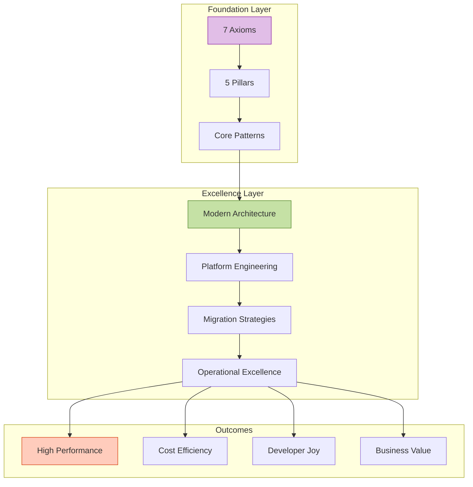
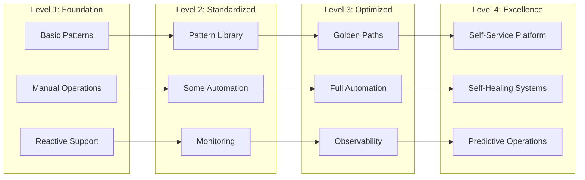
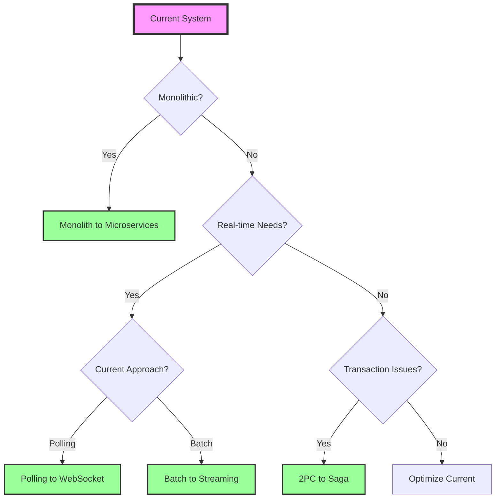
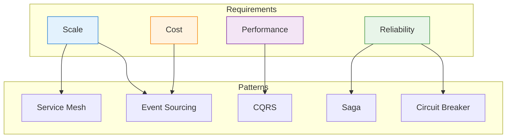
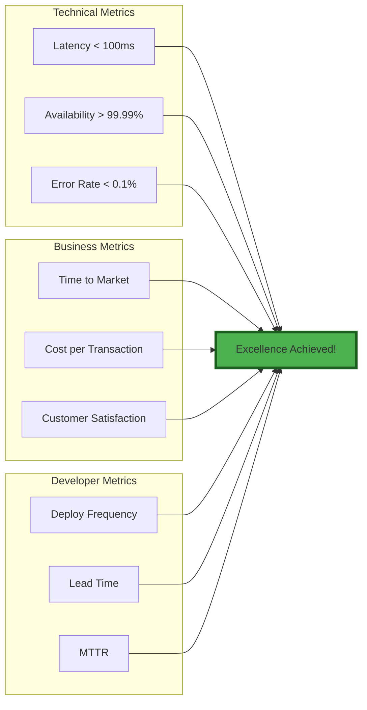
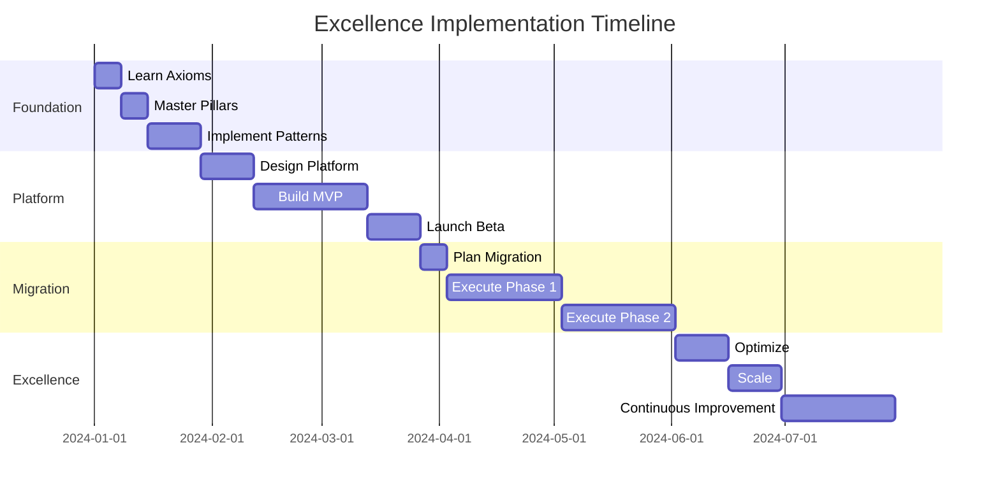
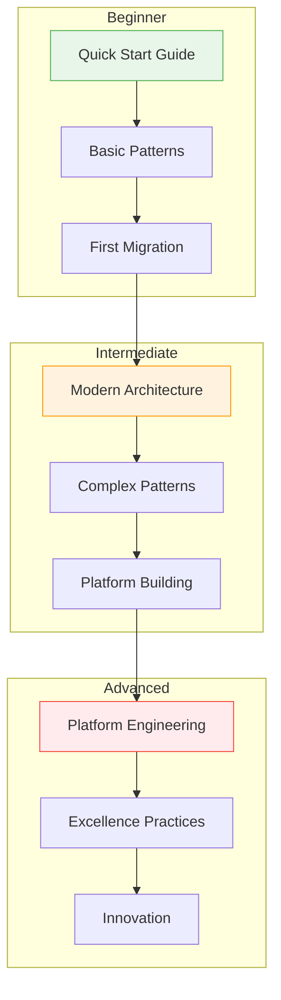
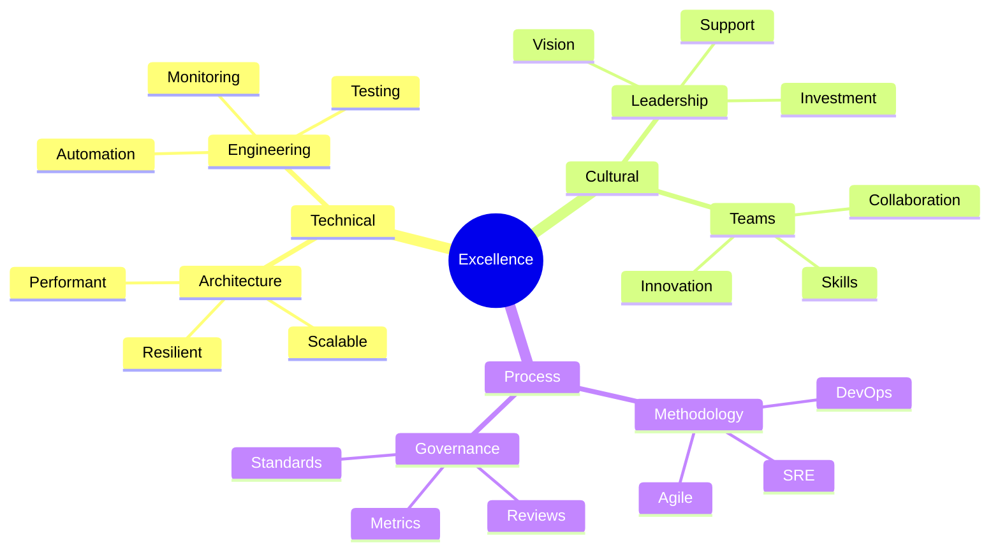
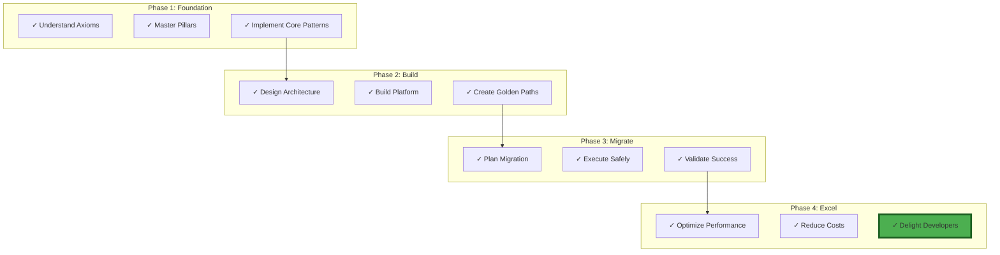

# Excellence Framework Visual Overview

## 🎯 The Complete Excellence Journey

## 📊 Excellence Maturity Model

## 🔄 Migration Decision Tree

## 🎯 Pattern Selection Matrix

## 📈 Excellence Metrics Dashboard

## 🚀 Implementation Roadmap

## 🎓 Learning Path Visualization

## 💡 Key Success Factors

## 🎯 Excellence Checklist

---

!!! success "Your Excellence Journey"
    This visual framework guides you from foundation to excellence. Each step builds on the previous, creating a sustainable path to world-class distributed systems.

!!! tip "Interactive Version"
    Visit our [Interactive Excellence Dashboard](../tools/) for real-time metrics and personalized recommendations.