# Excellence Framework Visual Overview

## 🎯 The Complete Excellence Journey

## 📊 Excellence Maturity Model

## 🔄 Migration Decision Tree

## 🎯 Pattern Selection Matrix

## 📈 Excellence Metrics Dashboard

## 🚀 Implementation Roadmap

## 🎓 Learning Path Visualization

## 💡 Key Success Factors

## 🎯 Excellence Checklist

```mermaid
graph TD
    subgraph "Phase 1: Foundation"
        F1[✓ Understand Axioms]
        F2[✓ Master Pillars]
        F3[✓ Implement Core Patterns]
    end
    
    subgraph "Phase 2: Build"
        B1[✓ Design Architecture]
        B2[✓ Build Platform]
        B3[✓ Create Golden Paths]
    end
    
    subgraph "Phase 3: Migrate"
        M1[✓ Plan Migration]
        M2[✓ Execute Safely]
        M3[✓ Validate Success]
    end
    
    subgraph "Phase 4: Excel"
        E1[✓ Optimize Performance]
        E2[✓ Reduce Costs]
        E3[✓ Delight Developers]
    end
    
    F3 --> B1
    B3 --> M1
    M3 --> E1
    
    style E3 fill:#4caf50,stroke:#1b5e20,stroke-width:4px
```

---

!!! success "Your Excellence Journey"
    This visual framework guides you from foundation to excellence. Each step builds on the previous, creating a sustainable path to world-class distributed systems.

!!! tip "Interactive Version"
    Visit our [Interactive Excellence Dashboard](../tools/) for real-time metrics and personalized recommendations.