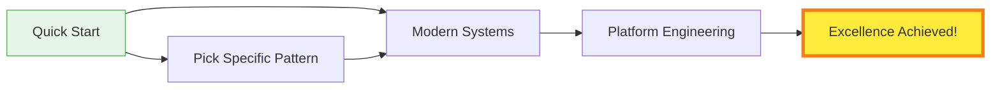
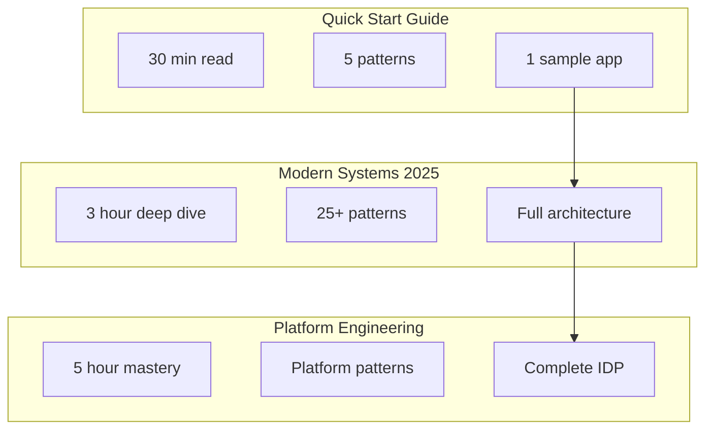

# Excellence Guides

Essential guides for building and operating world-class distributed systems.

## 📚 Available Guides

-   **🚀 Quick Start Guide**

    ---
    
    Go from zero to production-ready distributed system in under 30 minutes
    
    [:octicons-arrow-right-24: Start Now](quick-start-guide.md)

-   **🏗️ Modern Distributed Systems 2025**

    ---
    
    The definitive guide to building distributed systems with 2025's best practices
    
    [:octicons-arrow-right-24: Learn More](modern-distributed-systems-2025.md)

-   **⚡ Platform Engineering Playbook**

    ---
    
    Build and scale engineering platforms that developers love
    
    [:octicons-arrow-right-24: Explore](platform-engineering-playbook.md)

## 🎯 Guide Selection Matrix

| Guide | Best For | Time Investment | Outcome |
|-------|----------|-----------------|---------|
| **Quick Start** | Developers new to distributed systems | 30 minutes | Working prototype with core patterns |
| **Modern Systems 2025** | Architects designing new systems | 2-3 hours | Complete architecture blueprint |
| **Platform Engineering** | Platform teams and DevOps engineers | 4-5 hours | Production-ready platform design |

## 📈 Learning Path

## 🔧 Implementation Readiness

Before starting any guide, ensure you have:

- [x] Basic understanding of distributed systems concepts
- [x] Development environment with Docker/Kubernetes
- [x] Access to cloud provider (AWS/GCP/Azure)
- [x] Familiarity with at least one programming language

## 💡 Pro Tips

!!! tip "Start Small"
    Begin with the Quick Start Guide even if you're experienced. It introduces our framework and terminology.

!!! warning "Don't Skip Fundamentals"
    Review the [Axioms](../../part1-axioms/) and [Pillars](../../part2-pillars/) for deep understanding.

!!! success "Practice Makes Perfect"
    Each guide includes hands-on exercises. Complete them for maximum learning.

## 📊 Guide Comparison

---

[:octicons-arrow-left-24: Back to Excellence](../index.md) | [:octicons-arrow-right-24: Start with Quick Start Guide](quick-start-guide.md)