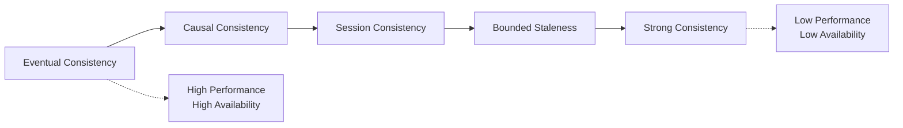
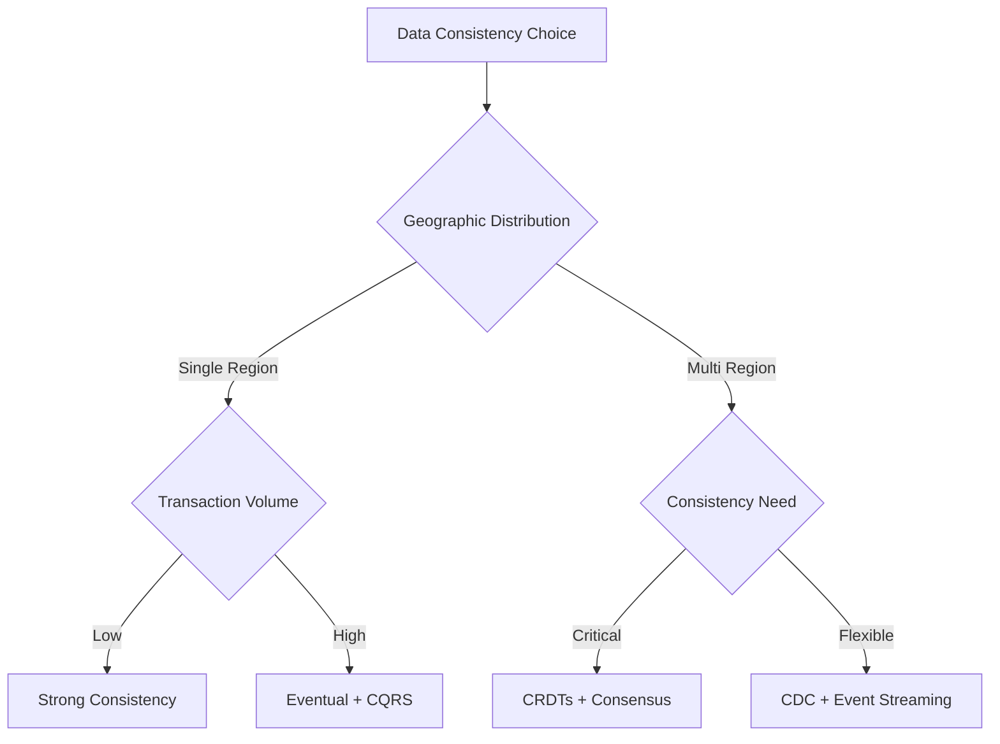
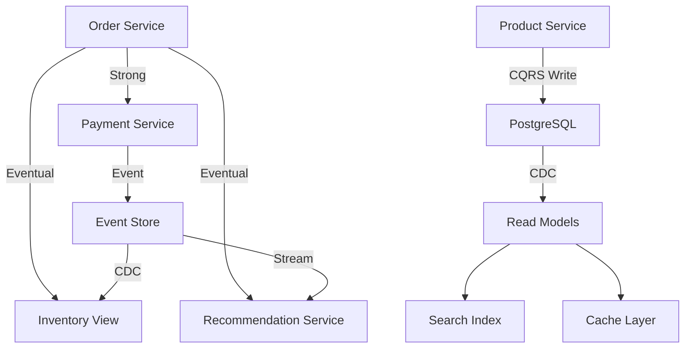
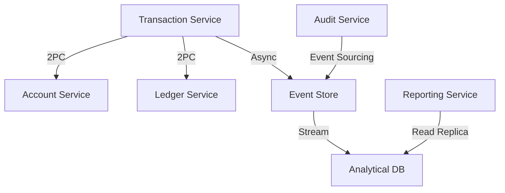
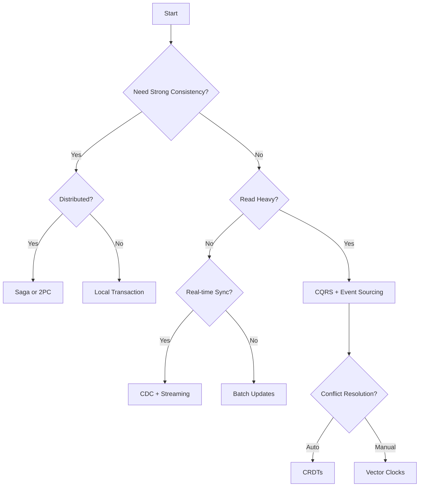

# Data Consistency Guide: Choosing the Right Patterns

## Consistency Spectrum



## Pattern Selection Framework

### By Business Requirements

| Requirement | Consistency Level | Recommended Patterns |
|-------------|------------------|---------------------|
| **Financial Transactions** | Strong | 2PC, Saga, Event Sourcing |
| **Social Media Feed** | Eventual | CQRS, CDC, Event Streaming |
| **Shopping Cart** | Session | Sticky Sessions, CRDTs |
| **Inventory Management** | Bounded Staleness | Distributed Lock, CAS |
| **Analytics** | Eventual | Lambda/Kappa, Materialized Views |

### By Scale and Geography



## Core Consistency Patterns

### 1. Event Sourcing (Gold Pattern)

**When to Use**:
- Audit trail requirements
- Complex business workflows
- Time-travel queries needed
- Debugging production issues

**Implementation**:
```python
class EventStore:
    def __init__(self):
        self.events = []
        self.snapshots = {}
        self.projections = {}
    
    def append_event(self, aggregate_id, event):
        event_record = {
            'aggregate_id': aggregate_id,
            'event_type': type(event).__name__,
            'event_data': event.to_dict(),
            'timestamp': datetime.utcnow(),
            'version': self.get_version(aggregate_id) + 1
        }
        self.events.append(event_record)
        self._update_projections(event_record)
        return event_record['version']
    
    def get_events(self, aggregate_id, from_version=0):
        return [e for e in self.events 
                if e['aggregate_id'] == aggregate_id 
                and e['version'] > from_version]
    
    def replay_aggregate(self, aggregate_id):
        snapshot = self.snapshots.get(aggregate_id)
        if snapshot:
            aggregate = snapshot['state']
            from_version = snapshot['version']
        else:
            aggregate = None
            from_version = 0
        
        events = self.get_events(aggregate_id, from_version)
        for event in events:
            aggregate = self.apply_event(aggregate, event)
        
        return aggregate
```

### 2. CQRS Pattern (Gold Pattern)

**Separation Strategy**:
```yaml
write_model:
  database: PostgreSQL
  consistency: Strong
  optimized_for: Writes
  patterns:
    - Event Sourcing
    - Domain Model
    - Aggregates

read_models:
  user_profile_view:
    database: MongoDB
    consistency: Eventual
    update_via: CDC
    optimized_for: Profile queries
  
  search_index:
    database: Elasticsearch  
    consistency: Eventual
    update_via: Event Stream
    optimized_for: Full-text search
  
  analytics_warehouse:
    database: ClickHouse
    consistency: Eventual
    update_via: Batch ETL
    optimized_for: Analytics
```

### 3. Saga Pattern (Gold Pattern)

**Orchestration Example**:
```python
class OrderSaga:
    def __init__(self, saga_coordinator):
        self.coordinator = saga_coordinator
        self.steps = [
            SagaStep(
                name="reserve_inventory",
                action=self.reserve_inventory,
                compensation=self.release_inventory
            ),
            SagaStep(
                name="charge_payment",
                action=self.charge_payment,
                compensation=self.refund_payment
            ),
            SagaStep(
                name="create_shipment",
                action=self.create_shipment,
                compensation=self.cancel_shipment
            )
        ]
    
    async def execute(self, order_data):
        completed_steps = []
        try:
            for step in self.steps:
                result = await step.action(order_data)
                completed_steps.append((step, result))
                
        except Exception as e:
            # Compensate in reverse order
            for step, result in reversed(completed_steps):
                await step.compensation(result)
            raise SagaFailedException(str(e))
        
        return OrderConfirmation(completed_steps)
```

### 4. Change Data Capture (Silver Pattern)

**CDC Pipeline**:
```yaml
source:
  type: PostgreSQL
  mode: logical_replication
  tables:
    - users
    - orders
    - products

pipeline:
  - stage: capture
    tool: Debezium
    output: Kafka
    
  - stage: transform
    tool: Kafka Streams
    operations:
      - denormalize
      - enrich
      - filter
      
  - stage: sink
    targets:
      - name: elasticsearch
        for: search
      - name: redis
        for: cache
      - name: s3
        for: archive
```

## Consistency Patterns by Use Case

### E-Commerce Platform



**Pattern Stack**:
- **Orders**: Saga pattern for distributed transactions
- **Inventory**: Event Sourcing for audit trail
- **Products**: CQRS for read/write separation
- **Search**: CDC to Elasticsearch

### Financial System



**Pattern Stack**:
- **Transactions**: Two-phase commit for atomicity
- **Audit**: Event Sourcing for compliance
- **Reporting**: Materialized Views for performance
- **Reconciliation**: CAS for conflict resolution

## Advanced Patterns

### Conflict-Free Replicated Data Types (CRDTs)

**Use Cases**:
- Collaborative editing
- Shopping carts
- Distributed counters
- Session state

**Implementation**:
```python
class GCounter:  # Grow-only counter
    def __init__(self, node_id):
        self.node_id = node_id
        self.counts = {node_id: 0}
    
    def increment(self, value=1):
        self.counts[self.node_id] += value
    
    def merge(self, other):
        for node_id, count in other.counts.items():
            self.counts[node_id] = max(
                self.counts.get(node_id, 0),
                count
            )
    
    def value(self):
        return sum(self.counts.values())
```

### Hybrid Logical Clocks (HLC)

**When to Use**:
- Need both logical and physical time
- Cross-datacenter synchronization
- Distributed debugging

```python
class HybridLogicalClock:
    def __init__(self):
        self.logical_time = 0
        self.logical_counter = 0
    
    def update(self, physical_time, received_time=None):
        if received_time:
            self.logical_time = max(
                self.logical_time,
                received_time.logical_time,
                physical_time
            )
            if self.logical_time == received_time.logical_time:
                self.logical_counter = received_time.logical_counter + 1
            else:
                self.logical_counter = 0
        else:
            if physical_time > self.logical_time:
                self.logical_time = physical_time
                self.logical_counter = 0
            else:
                self.logical_counter += 1
        
        return HLCTimestamp(self.logical_time, self.logical_counter)
```

## Decision Matrix

### Consistency vs Performance Trade-offs

| Pattern | Consistency | Performance | Complexity | Use When |
|---------|-------------|-------------|------------|----------|
| **2PC** | Strong | Low | High | Financial transactions |
| **Saga** | Eventual | Medium | High | Long-running workflows |
| **Event Sourcing** | Eventual | High | Medium | Audit requirements |
| **CQRS** | Eventual | High | Medium | Read-heavy workloads |
| **CRDTs** | Eventual | High | Low | Collaborative features |
| **CDC** | Eventual | High | Low | Real-time sync |

### Quick Selection Guide



## Implementation Checklist

### Foundation (Week 1)
- [ ] Define consistency requirements per domain
- [ ] Map data flows and dependencies
- [ ] Identify transaction boundaries
- [ ] Choose primary consistency pattern

### Implementation (Month 1)
- [ ] Set up event store if using Event Sourcing
- [ ] Implement CQRS write/read models
- [ ] Configure CDC pipelines
- [ ] Add monitoring for lag/consistency

### Production (Quarter 1)
- [ ] Test failure scenarios
- [ ] Measure actual consistency windows
- [ ] Optimize read model updates
- [ ] Add reconciliation processes

## Common Pitfalls

| Pitfall | Impact | Solution |
|---------|--------|----------|
| Over-engineering consistency | Performance degradation | Start eventual, add strong where needed |
| Ignoring eventual consistency lag | User confusion | Show loading states, timestamp data |
| No reconciliation process | Data drift | Regular consistency checks |
| Synchronous updates everywhere | Poor scalability | Async where possible |

## Real-World Examples

### Amazon DynamoDB
- **Pattern**: Eventual consistency by default
- **Option**: Strong consistency for 2x read cost
- **Implementation**: Vector clocks for conflict resolution

### Google Spanner
- **Pattern**: External consistency (TrueTime)
- **Trade-off**: Higher latency for global consistency
- **Use case**: AdWords billing (needs strong consistency)

### Cassandra
- **Pattern**: Tunable consistency
- **Levels**: ONE, QUORUM, ALL
- **Formula**: R + W > N for strong consistency

## Next Steps

1. **Audit current patterns**: Map existing consistency models
2. **Identify pain points**: Where are consistency issues?
3. **Choose patterns**: Use decision matrix above
4. **Implement incrementally**: Start with one service
5. **Monitor and iterate**: Track consistency metrics

## Resources

- [Event Sourcing Pattern](../../pattern-library/data-management/event-sourcing/index.md) (Gold)
- [CQRS Pattern](../../pattern-library/data-management/cqrs/index.md) (Gold)
- [Saga Pattern](../../pattern-library/data-management/saga/index.md) (Gold)
- [CDC Pattern](../../pattern-library/data-management/cdc/index.md) (Silver)
- [CRDT Pattern](../../pattern-library/data-management/crdt/index.md) (Silver)