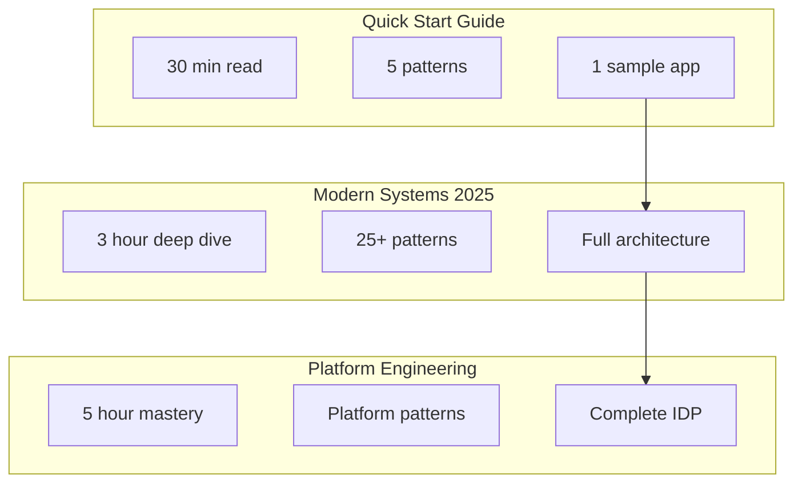

# 📚 Implementation Guides

**Master distributed systems with comprehensive, battle-tested implementation guides.**

    
Each guide provides deep technical knowledge, real-world examples, and step-by-step implementation instructions based on production experience from leading tech companies.

## 🎯 Core Excellence Guides

-   **🛡️ Resilience First**

    ---
    
    Build systems that never fail: circuit breakers, chaos engineering, multi-region
    
    📖 45 min • 🎯 12 patterns • 💡 Netflix, Amazon
    
    [:octicons-arrow-right-24: Learn Resilience](resilience-first.md)

-   **💾 Data Consistency**

    ---
    
    Master distributed data: CAP theorem, sagas, event sourcing, CQRS
    
    📖 60 min • 🎯 15 patterns • 💡 Uber, PayPal
    
    [:octicons-arrow-right-24: Master Data](data-consistency.md)

-   **🚀 Performance Optimization**

    ---
    
    Scale to millions: caching, CDN, async processing, database optimization
    
    📖 50 min • 🎯 10 patterns • 💡 Facebook, LinkedIn
    
    [:octicons-arrow-right-24: Optimize Performance](performance-optimization.md)

-   **🔧 Operational Excellence**

    ---
    
    Run production like a pro: observability, SRE, deployment strategies
    
    📖 40 min • 🎯 8 patterns • 💡 Google, Microsoft
    
    [:octicons-arrow-right-24: Excel at Ops](operational-excellence.md)

-   **🌐 Service Communication**

    ---
    
    Connect reliably: API design, service mesh, event-driven, gRPC vs REST
    
    📖 55 min • 🎯 14 patterns • 💡 Netflix, Uber
    
    [:octicons-arrow-right-24: Connect Services](service-communication.md)

-   **🏗️ Platform Engineering Playbook**

    ---
    
    Build platforms teams love: golden paths, self-service, developer experience
    
    📖 35 min • 🎯 7 patterns • 💡 Spotify, Zalando
    
    [:octicons-arrow-right-24: Build Platforms](platform-engineering-playbook.md)

-   **🔒 Security Patterns**

    ---
    
    Secure distributed systems: zero trust, service auth, secrets management
    
    📖 40 min • 🎯 9 patterns • 💡 Banks, Healthcare
    
    [:octicons-arrow-right-24: Secure Systems](security-patterns.md)

-   **🆕 Modern Distributed Systems 2025**

    ---
    
    Latest patterns: serverless, edge computing, AI/ML integration, WebAssembly
    
    📖 30 min • 🎯 6 patterns • 💡 Trending ↗️ 45%
    
    [:octicons-arrow-right-24: Future Ready](modern-distributed-systems-2025.md)

-   **🚀 Quick Start Guide**

    ---
    
    Go from zero to production-ready distributed system in under 30 minutes
    
    📖 30 min • 🎯 5 patterns • 💡 Perfect for beginners
    
    [:octicons-arrow-right-24: Start Now](quick-start-guide.md)

## 🎯 Guide Selection Matrix

| Guide | Best For | Time Investment | Outcome |
|-------|----------|-----------------|---------|
| **Quick Start** | Developers new to distributed systems | 30 minutes | Working prototype with core patterns |
| **Modern Systems 2025** | Architects designing new systems | 2-3 hours | Complete architecture blueprint |
| **Platform Engineering** | Platform teams and DevOps engineers | 4-5 hours | Production-ready platform design |

## 📈 Learning Path

## 🔧 Implementation Readiness

Before starting any guide, ensure you have:

- [x] Basic understanding of distributed systems concepts
- [x] Development environment with Docker/Kubernetes
- [x] Access to cloud provider (AWS/GCP/Azure)
- [x] Familiarity with at least one programming language

## 💡 Pro Tips

!!! tip "Start Small"
    Begin with the Quick Start Guide even if you're experienced. It introduces our framework and terminology.

!!! warning "Don't Skip Fundamentals"
    Review the [Axioms](../../part1-axioms/) and [Pillars](../../part2-pillars/) for deep understanding.

!!! success "Practice Makes Perfect"
    Each guide includes hands-on exercises. Complete them for maximum learning.

## 📊 Guide Comparison

---

[:octicons-arrow-left-24: Back to Excellence](../index.md) | [:octicons-arrow-right-24: Start with Quick Start Guide](quick-start-guide.md)