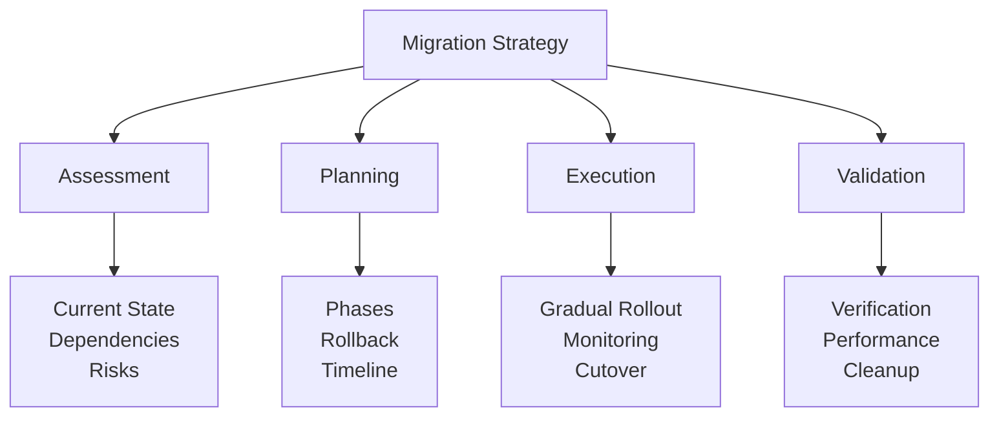
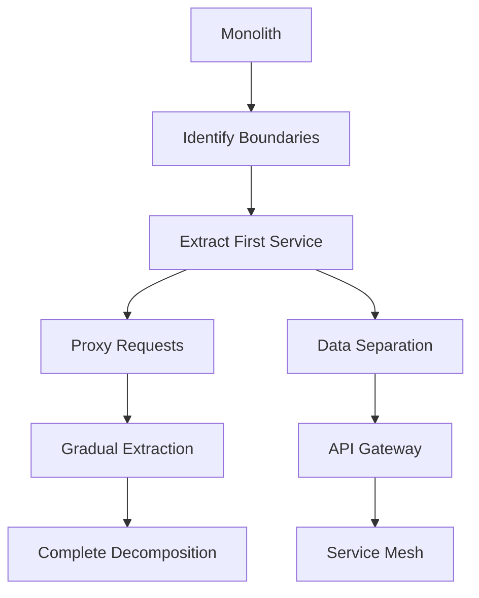

# Migration Strategies Guide: Evolving Systems Safely

## Migration Planning Framework



## Core Migration Patterns

### 1. Strangler Fig Pattern (Gold Pattern)

**Progressive Migration Strategy**:
```python
class StranglerFigMigration:
    def __init__(self, legacy_service, new_service):
        self.legacy = legacy_service
        self.new = new_service
        self.router = FeatureRouter()
        self.migration_state = {}
        
    async def route_request(self, request):
        feature = self.extract_feature(request)
        
        # Check migration state
        if self.is_migrated(feature):
            return await self.new.handle(request)
        
        # Check if in migration
        if self.is_migrating(feature):
            # Shadow mode - call both, return legacy
            legacy_result = await self.legacy.handle(request)
            
            # Async comparison
            asyncio.create_task(
                self.compare_results(request, legacy_result)
            )
            
            return legacy_result
        
        # Not migrated yet
        return await self.legacy.handle(request)
    
    async def compare_results(self, request, legacy_result):
        try:
            new_result = await self.new.handle(request)
            
            if not self.results_match(legacy_result, new_result):
                await self.log_discrepancy(
                    request, legacy_result, new_result
                )
        except Exception as e:
            await self.log_new_service_error(request, e)
    
    def migrate_feature(self, feature, percentage=0):
        """Gradually migrate traffic for a feature"""
        self.migration_state[feature] = {
            'status': 'migrating',
            'percentage': percentage,
            'started_at': datetime.utcnow()
        }
```

**Migration Phases**:
```yaml
strangler_fig_phases:
  phase1_identify:
    - map_all_endpoints
    - identify_dependencies
    - categorize_by_risk
    - create_migration_order
    
  phase2_implement:
    - build_new_service
    - implement_feature_flags
    - setup_monitoring
    - create_rollback_plan
    
  phase3_shadow:
    - route_duplicate_traffic
    - compare_results
    - fix_discrepancies
    - measure_performance
    
  phase4_migrate:
    - gradual_traffic_shift
    - monitor_error_rates
    - adjust_percentage
    - validate_behavior
    
  phase5_complete:
    - full_traffic_cutover
    - deprecate_legacy
    - remove_old_code
    - celebrate_success
```

### 2. Blue-Green Deployment (Silver Pattern)

**Zero-Downtime Cutover**:
```python
class BlueGreenDeployment:
    def __init__(self, load_balancer):
        self.lb = load_balancer
        self.environments = {
            'blue': Environment('blue'),
            'green': Environment('green')
        }
        self.active = 'blue'
        
    async def deploy_new_version(self, version):
        # Determine inactive environment
        inactive = 'green' if self.active == 'blue' else 'blue'
        
        # Deploy to inactive
        print(f"Deploying {version} to {inactive}")
        await self.environments[inactive].deploy(version)
        
        # Health check
        if not await self.health_check(inactive):
            raise DeploymentError("Health check failed")
        
        # Smoke test
        if not await self.smoke_test(inactive):
            raise DeploymentError("Smoke test failed")
        
        # Switch traffic
        await self.switch_traffic(inactive)
        
        # Monitor
        if not await self.monitor_after_switch():
            # Rollback
            await self.switch_traffic(self.active)
            raise DeploymentError("Post-deployment monitoring failed")
        
        # Update active
        self.active = inactive
        
    async def switch_traffic(self, target):
        """Atomic traffic switch"""
        await self.lb.update_backend_pool({
            'backends': self.environments[target].instances,
            'health_check': '/health',
            'drain_timeout': 30
        })
```

### 3. Database Migration Patterns

**Expand-Contract Pattern**:
```python
class DatabaseMigration:
    def __init__(self, db_connection):
        self.db = db_connection
        self.migration_log = MigrationLog()
        
    async def expand_contract_migration(self, migration_name):
        """Safe schema migration with backward compatibility"""
        
        # Phase 1: Expand - Add new structure
        await self.expand_phase(migration_name)
        
        # Phase 2: Migrate - Dual write
        await self.migrate_phase(migration_name)
        
        # Phase 3: Contract - Remove old structure
        await self.contract_phase(migration_name)
    
    async def expand_phase(self, name):
        """Add new columns/tables without breaking existing code"""
        try:
            # Add new column with default
            await self.db.execute("""
                ALTER TABLE users 
                ADD COLUMN email_verified BOOLEAN DEFAULT FALSE
            """)
            
            # Create new table
            await self.db.execute("""
                CREATE TABLE user_verification (
                    user_id INT PRIMARY KEY,
                    token VARCHAR(255),
                    created_at TIMESTAMP DEFAULT CURRENT_TIMESTAMP,
                    FOREIGN KEY (user_id) REFERENCES users(id)
                )
            """)
            
            await self.migration_log.record(name, 'expand', 'completed')
            
        except Exception as e:
            await self.migration_log.record(name, 'expand', 'failed', str(e))
            raise
    
    async def migrate_phase(self, name):
        """Migrate data with dual writes"""
        # Deploy code that writes to both old and new
        
        # Backfill existing data
        await self.db.execute("""
            INSERT INTO user_verification (user_id, token)
            SELECT id, generate_token() FROM users
            WHERE email_verified = TRUE
            ON CONFLICT DO NOTHING
        """)
        
        await self.migration_log.record(name, 'migrate', 'completed')
    
    async def contract_phase(self, name):
        """Remove old structure after verification"""
        # Verify data consistency
        inconsistencies = await self.verify_data_consistency()
        
        if inconsistencies:
            raise MigrationError(f"Data inconsistencies found: {inconsistencies}")
        
        # Remove old column
        await self.db.execute("""
            ALTER TABLE users DROP COLUMN email_verified
        """)
        
        await self.migration_log.record(name, 'contract', 'completed')
```

### 4. Event-Driven Migration

**From Batch to Streaming**:
```yaml
batch_to_streaming:
  current_state:
    - nightly_batch_jobs
    - etl_pipelines
    - data_warehouse_loads
    
  target_state:
    - real_time_streaming
    - event_sourcing
    - stream_processing
    
  migration_steps:
    1_parallel_run:
      - keep_batch_running
      - add_event_publishing
      - build_stream_processors
      - compare_results
      
    2_hybrid_mode:
      - stream_real_time_data
      - batch_historical_data
      - reconcile_differences
      - monitor_lag
      
    3_stream_first:
      - primary: streaming
      - fallback: batch
      - reduce_batch_frequency
      - measure_accuracy
      
    4_stream_only:
      - disable_batch_jobs
      - archive_batch_code
      - monitor_completeness
      - celebrate_real_time
```

**Implementation Example**:
```python
class BatchToStreamMigration:
    def __init__(self, batch_processor, stream_processor):
        self.batch = batch_processor
        self.stream = stream_processor
        self.mode = 'batch_only'
        
    async def process_data(self, data):
        if self.mode == 'batch_only':
            return await self.batch.process(data)
            
        elif self.mode == 'parallel':
            # Run both, compare results
            batch_result = await self.batch.process(data)
            stream_result = await self.stream.process(data)
            
            await self.compare_and_log(batch_result, stream_result)
            return batch_result  # Still return batch result
            
        elif self.mode == 'stream_primary':
            try:
                return await self.stream.process(data)
            except Exception as e:
                # Fallback to batch
                self.log_stream_failure(e)
                return await self.batch.process(data)
                
        elif self.mode == 'stream_only':
            return await self.stream.process(data)
    
    def advance_migration_phase(self):
        """Progress through migration phases"""
        transitions = {
            'batch_only': 'parallel',
            'parallel': 'stream_primary',
            'stream_primary': 'stream_only'
        }
        
        if self.mode in transitions:
            self.mode = transitions[self.mode]
            self.log_phase_change(self.mode)
```

## Migration Patterns by Type

### Monolith to Microservices



**Decomposition Strategy**:
```yaml
decomposition_order:
  1_edge_services:
    - user_authentication
    - api_gateway
    - static_content
    reason: Low coupling, clear boundaries
    
  2_business_services:
    - order_management
    - inventory_service
    - payment_processing
    reason: Domain boundaries
    
  3_core_services:
    - product_catalog
    - customer_data
    - transaction_engine
    reason: High coupling, needs careful extraction
    
  4_shared_services:
    - notification_service
    - audit_logging
    - configuration_management
    reason: Cross-cutting concerns
```

### Protocol Migration

**REST to gRPC Migration**:
```python
class ProtocolMigration:
    def __init__(self):
        self.rest_handler = RestHandler()
        self.grpc_handler = GrpcHandler()
        self.protocol_router = ProtocolRouter()
        
    async def handle_request(self, request):
        # Check client capabilities
        if self.supports_grpc(request):
            # New clients use gRPC
            return await self.grpc_handler.handle(request)
        else:
            # Legacy clients use REST
            rest_response = await self.rest_handler.handle(request)
            
            # Log for migration tracking
            await self.track_legacy_usage(request)
            
            return rest_response
    
    def supports_grpc(self, request):
        # Check headers, client version, etc.
        return (
            request.headers.get('Accept') == 'application/grpc' or
            request.headers.get('X-Client-Version', '0') >= '2.0'
        )
```

## Risk Mitigation Strategies

### Rollback Planning

```python
class RollbackStrategy:
    def __init__(self):
        self.checkpoints = []
        self.rollback_procedures = {}
        
    def add_checkpoint(self, name, validation_func, rollback_func):
        checkpoint = {
            'name': name,
            'validate': validation_func,
            'rollback': rollback_func,
            'timestamp': None,
            'state': None
        }
        
        self.checkpoints.append(checkpoint)
        self.rollback_procedures[name] = rollback_func
    
    async def execute_with_rollback(self, migration_func):
        completed_checkpoints = []
        
        try:
            # Execute migration
            result = await migration_func()
            
            # Validate all checkpoints
            for checkpoint in self.checkpoints:
                if not await checkpoint'validate':
                    raise ValidationError(f"Checkpoint {checkpoint['name']} failed")
                    
                completed_checkpoints.append(checkpoint)
                checkpoint['timestamp'] = datetime.utcnow()
            
            return result
            
        except Exception as e:
            # Rollback in reverse order
            for checkpoint in reversed(completed_checkpoints):
                try:
                    await checkpoint'rollback'
                except Exception as rollback_error:
                    # Log but continue rollback
                    self.log_rollback_error(checkpoint['name'], rollback_error)
            
            raise MigrationError(f"Migration failed: {e}")
```

### Testing Strategies

```yaml
migration_testing:
  shadow_testing:
    - duplicate_production_traffic
    - compare_results
    - measure_performance
    - zero_user_impact
    
  canary_testing:
    - 1%_traffic
    - monitor_errors
    - gradual_increase
    - quick_rollback
    
  dark_launch:
    - feature_behind_flag
    - select_users_only
    - gather_feedback
    - iterate_before_ga
    
  chaos_testing:
    - fail_old_service
    - verify_new_handles
    - test_rollback
    - validate_monitoring
```

## Migration Metrics

### Success Indicators

| Metric | Target | Measurement |
|--------|--------|-------------|
| **Error Rate** | < 0.1% increase | Compare before/after |
| **Latency** | < 10% increase | P50, P95, P99 |
| **Availability** | No decrease | Uptime monitoring |
| **Data Consistency** | 100% | Reconciliation jobs |
| **Rollback Time** | < 5 minutes | Drill exercises |

### Migration Dashboard

```python
class MigrationDashboard:
    def __init__(self):
        self.metrics = {
            'traffic_percentage': GaugeMetric(),
            'error_rate_delta': GaugeMetric(),
            'latency_delta': HistogramMetric(),
            'consistency_score': GaugeMetric()
        }
        
    def update_metrics(self, old_metrics, new_metrics):
        # Traffic split
        total_traffic = old_metrics.requests + new_metrics.requests
        new_percentage = new_metrics.requests / total_traffic * 100
        self.metrics['traffic_percentage'].set(new_percentage)
        
        # Error rate comparison
        old_error_rate = old_metrics.errors / old_metrics.requests
        new_error_rate = new_metrics.errors / new_metrics.requests
        delta = new_error_rate - old_error_rate
        self.metrics['error_rate_delta'].set(delta)
        
        # Latency comparison
        latency_increase = (new_metrics.p99_latency - old_metrics.p99_latency) / old_metrics.p99_latency
        self.metrics['latency_delta'].observe(latency_increase)
```

## Common Migration Pitfalls

| Pitfall | Impact | Prevention |
|---------|--------|------------|
| Big bang migration | High risk, difficult rollback | Use incremental approach |
| No rollback plan | Stuck with issues | Test rollback procedures |
| Insufficient monitoring | Blind to problems | Comprehensive dashboards |
| Data loss | Business impact | Dual writes, verification |
| Dependency issues | Cascading failures | Map all dependencies |

## Migration Checklist

### Pre-Migration
- [ ] Map all dependencies
- [ ] Create rollback plan
- [ ] Set up monitoring
- [ ] Test in staging
- [ ] Train team

### During Migration
- [ ] Follow runbook
- [ ] Monitor metrics
- [ ] Communicate status
- [ ] Document issues
- [ ] Ready to rollback

### Post-Migration
- [ ] Verify success criteria
- [ ] Clean up old code
- [ ] Update documentation
- [ ] Conduct retrospective
- [ ] Share learnings

## Real-World Examples

### Amazon Prime Video
- **From**: Microservices
- **To**: Monolith (for specific use case)
- **Result**: 90% cost reduction
- **Learning**: Right architecture for right problem

### Twitter Timeline
- **From**: Ruby monolith
- **To**: Scala microservices
- **Strategy**: Gradual service extraction
- **Result**: 10x performance improvement

### Airbnb Payments
- **From**: Monolithic billing
- **To**: Service-oriented architecture
- **Method**: Strangler fig pattern
- **Duration**: 2 years, zero downtime

## Next Steps

1. **Assess current architecture**: Identify pain points
2. **Choose migration pattern**: Match to your needs
3. **Create detailed plan**: Include rollback strategy
4. **Start small**: Pick low-risk component
5. **Measure everything**: Data drives decisions

## Resources

- [Strangler Fig Pattern](../../pattern-library/architecture/strangler-fig/)
- [Blue-Green Deployment](../pattern-library/blue-green-deployment.md)
- [Migration Playbooks](../architects-handbook/implementation-playbooks/migrations/)
- [Case Studies](../architects-handbook/case-studies/)
- [Saga Pattern](../../pattern-library/data-management/saga/) (Gold)
```
```
