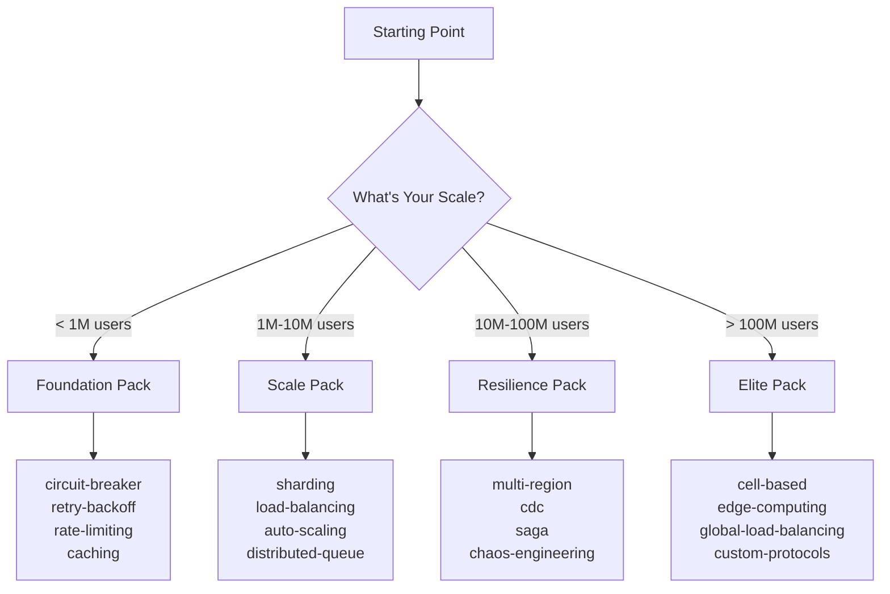
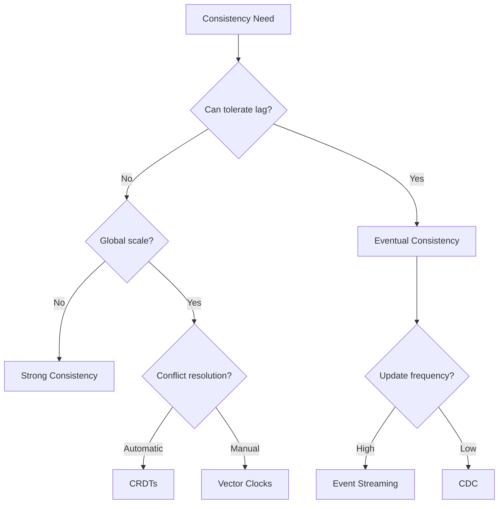
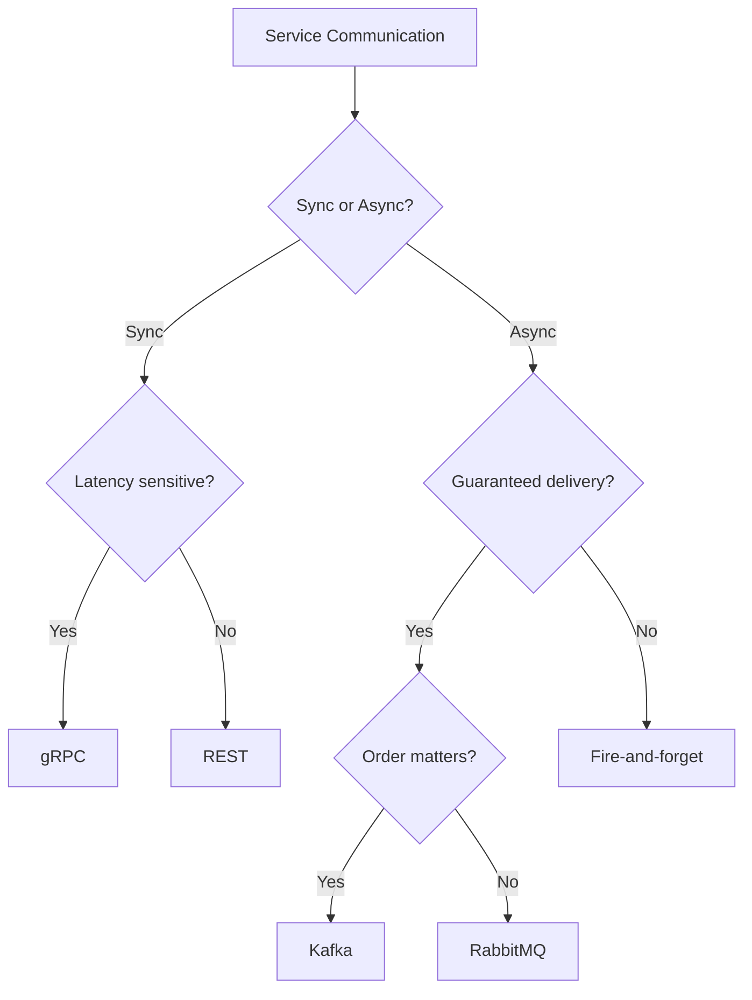

# Modern Distributed Systems in 2025: The Gold Standard

## Start Here: Your Pattern Journey



## The Elite Company Playbook

### How Netflix Does It
```
Foundation → Auto-scaling → Circuit Breakers → Multi-region → Chaos Engineering
```
- **Circuit Breaker**: Hystrix handles 100B+ requests/day
- **Auto-scaling**: Handles 2x daily traffic swings automatically
- **Edge Computing**: Open Connect CDN in 1000+ locations
- **Chaos Engineering**: Simian Army tests resilience continuously

### How Uber Does It
```
Service Mesh → CQRS → Saga → Geo-distribution → Cell-based Architecture
```
- **Service Mesh**: 3000+ microservices with Envoy
- **Saga Pattern**: 20M+ distributed transactions daily
- **Geo-replication**: Active in 10,000+ cities
- **Cell-based**: Isolated failure domains per region

### How Discord Does It
```
Consistent Hashing → Sharding → WebSockets → Edge Computing
```
- **Sharding**: 150M+ users across thousands of shards
- **WebSocket**: Millions of concurrent connections
- **Consistent Hashing**: Minimal disruption during scaling
- **ID Generation**: Snowflake-based IDs at billions/day

## Pattern Selection by Category

### 🏗️ Foundation Patterns (Start Here)

| Pattern | When to Use | Code Example |
|---------|-------------|--------------|
| **[Circuit Breaker](../../pattern-library/resilience/circuit-breaker/index.md)** | Any external service call | See implementation below |
| **[Retry with Backoff](../../pattern-library/resilience/retry-backoff/index.md)** | Transient failures expected | Exponential backoff required |
| **[Rate Limiting](../../pattern-library/scaling/rate-limiting/index.md)** | Public APIs, resource protection | Token bucket recommended |
| **[Caching](../../pattern-library/scaling/caching-strategies/index.md)** | Read-heavy workloads | Cache-aside pattern |

#### Circuit Breaker Quick Implementation
```python
class CircuitBreaker:
    def __init__(self, failure_threshold=5, timeout=60):
        self.failure_threshold = failure_threshold
        self.timeout = timeout
        self.failure_count = 0
        self.last_failure_time = None
        self.state = 'CLOSED'  # CLOSED, OPEN, HALF_OPEN
    
    def call(self, func, *args, **kwargs):
        if self.state == 'OPEN':
            if time.time() - self.last_failure_time > self.timeout:
                self.state = 'HALF_OPEN'
            else:
                raise Exception("Circuit breaker is OPEN")
        
        try:
            result = func(*args, **kwargs)
            if self.state == 'HALF_OPEN':
                self.state = 'CLOSED'
                self.failure_count = 0
            return result
        except Exception as e:
            self.failure_count += 1
            self.last_failure_time = time.time()
            if self.failure_count >= self.failure_threshold:
                self.state = 'OPEN'
            raise e
```

### 📈 Scale Patterns (1M+ Users)

| Pattern | When to Use | Real World Example |
|---------|-------------|-------------------|
| **[Sharding](../../pattern-library/scaling/sharding/index.md)** | Database > 1TB | Discord: User sharding |
| **[Load Balancing](../../pattern-library/scaling/load-balancing/index.md)** | Multiple service instances | Google Maglev: 1M+ RPS |
| **[Auto-scaling](../../pattern-library/scaling/auto-scaling/index.md)** | Variable traffic | Netflix: 2x daily swings |
| **[Message Queue](../../pattern-library/coordination/distributed-queue/index.md)** | Async processing | AWS SQS: Trillions of messages |

#### Sharding Decision Tree
```mermaid
graph TD
    A[Need Sharding?] --> B{Data Size}
    B -->|< 100GB| C[No Sharding]
    B -->|100GB-1TB| D[Consider Sharding]
    B -->|> 1TB| E[Must Shard]
    
    E --> F{Shard Key?}
    F -->|User-based| G[Hash(UserID)]
    F -->|Time-based| H[Date Range]
    F -->|Geographic| I[Region/Country]
    F -->|Random| J[Consistent Hash]
```

### 💪 Resilience Patterns (10M+ Users)

| Pattern | When to Use | Implementation Complexity |
|---------|-------------|--------------------------|
| **[Saga](../../pattern-library/data-management/saga/index.md)** | Distributed transactions | High - needs coordinator |
| **[Multi-region](../../pattern-library/scaling/multi-region/index.md)** | Global users, DR | Very High - data sync |
| **[CDC](../../pattern-library/data-management/cdc/index.md)** | Real-time sync | Medium - Debezium |
| **[Event Sourcing](../../pattern-library/data-management/event-sourcing/index.md)** | Audit requirements | High - event store |

#### Saga Pattern Implementation
```python
class SagaCoordinator:
    def __init__(self):
        self.steps = []
        self.compensations = []
    
    def add_step(self, action, compensation):
        self.steps.append(action)
        self.compensations.append(compensation)
    
    async def execute(self):
        completed = []
        try:
            for i, step in enumerate(self.steps):
                result = await step()
                completed.append(i)
        except Exception as e:
            # Compensate in reverse order
            for i in reversed(completed):
                await self.compensationsi
            raise e

# Usage
saga = SagaCoordinator()
saga.add_step(
    action=lambda: reserve_inventory(item_id),
    compensation=lambda: release_inventory(item_id)
)
saga.add_step(
    action=lambda: charge_payment(amount),
    compensation=lambda: refund_payment(amount)
)
await saga.execute()
```

### 🔄 Data Patterns (Any Scale)

| Pattern | When to Use | Trade-offs |
|---------|-------------|------------|
| **[CQRS](../../pattern-library/data-management/cqrs/index.md)** | Read/write ratio > 10:1 | Eventual consistency |
| **[Event Streaming](../../pattern-library/architecture/event-streaming/index.md)** | Real-time processing | Complexity |
| **[Materialized Views](../../pattern-library/data-management/materialized-view/index.md)** | Complex queries | Storage cost |
| **[Consistent Hashing](../../pattern-library/data-management/consistent-hashing/index.md)** | Dynamic clusters | Virtual nodes overhead |

## Decision Trees for Pattern Selection

### Choosing a Consistency Pattern


### Choosing a Communication Pattern


## Real Implementation Examples

### 1. Netflix's Resilience Stack
```yaml
layers:
  edge:
    - pattern: edge-computing
    - implementation: Open Connect CDN
    - scale: 1000+ locations
  
  api:
    - pattern: api-gateway
    - implementation: Zuul
    - features: [rate-limiting, authentication, routing]
  
  service:
    - pattern: circuit-breaker
    - implementation: Hystrix
    - scale: 100B+ requests/day
  
  data:
    - pattern: caching
    - implementation: EVCache
    - scale: Trillions of requests
```

### 2. Uber's Transaction Pattern
```yaml
ride_booking:
  saga_steps:
    1. validate_rider
    2. find_driver
    3. calculate_fare
    4. reserve_driver
    5. charge_rider
    6. confirm_ride
  
  compensations:
    - release_driver
    - refund_rider
    - notify_failure
  
  patterns_used:
    - saga
    - distributed-lock
    - event-sourcing
```

### 3. Discord's Sharding Strategy
```python
# Simplified Discord sharding
def get_shard(guild_id, num_shards):
    return (guild_id >> 22) % num_shards

class ShardManager:
    def __init__(self, num_shards=1000):
        self.shards = {}
        self.num_shards = num_shards
        
    def route_message(self, guild_id, message):
        shard_id = get_shard(guild_id, self.num_shards)
        if shard_id not in self.shards:
            self.shards[shard_id] = self.create_shard(shard_id)
        return self.shards[shard_id].process(message)
```

## Start Here Checklist

### Week 1: Foundation
- [ ] Implement circuit breakers on all external calls
- [ ] Add retry with exponential backoff
- [ ] Set up basic rate limiting
- [ ] Enable caching for read-heavy endpoints

### Month 1: Scale Preparation
- [ ] Design sharding strategy
- [ ] Implement load balancing
- [ ] Set up auto-scaling policies
- [ ] Add distributed tracing

### Quarter 1: Production Excellence
- [ ] Deploy multi-region setup
- [ ] Implement saga for distributed transactions
- [ ] Add chaos engineering tests
- [ ] Enable CDC for real-time sync

## Pattern Combinations That Work

### The Netflix Stack
```
Circuit Breaker + Auto-scaling + Edge Computing + Chaos Engineering
```

### The Uber Model
```
Service Mesh + Saga + CQRS + Cell-based Architecture
```

### The Discord Approach
```
Consistent Hashing + Sharding + WebSockets + Snowflake IDs
```

### The LinkedIn Way
```
Kafka (Event Streaming) + CQRS + CDC + Materialized Views
```

## Anti-Patterns to Avoid

| Anti-Pattern | Why It Fails | Use Instead |
|--------------|--------------|-------------|
| Synchronous chains | Cascading failures | Async messaging |
| Shared databases | Coupling, scaling limits | Service-owned DBs |
| Big bang migrations | High risk | Strangler fig pattern |
| Ignoring backpressure | System overload | Rate limiting + queues |

## Performance Benchmarks

| Pattern | Latency Impact | Throughput Impact | Resource Cost |
|---------|----------------|-------------------|---------------|
| Circuit Breaker | < 1ms | Minimal | Low |
| Service Mesh | 1-2ms | 5-10% overhead | Medium |
| Sharding | Varies | 10-100x improvement | High |
| Caching | 10-100x faster | 10-100x improvement | Medium |

## Next Steps

1. **Assess your current scale**: Use the decision tree above
2. **Start with Foundation patterns**: They're required at any scale
3. **Add Scale patterns**: As you approach 1M users
4. **Implement Resilience patterns**: Before you need them
5. **Consider Elite patterns**: At 100M+ users

## Resources

- [Pattern Deep Dives](../pattern-library../architects-handbook/case-studies/index.md)
- [Quantitative Models](../architects-handbook/quantitative-analysis.md/index.md)
- [Human Factors](../architects-handbook/human-factors/index.md)