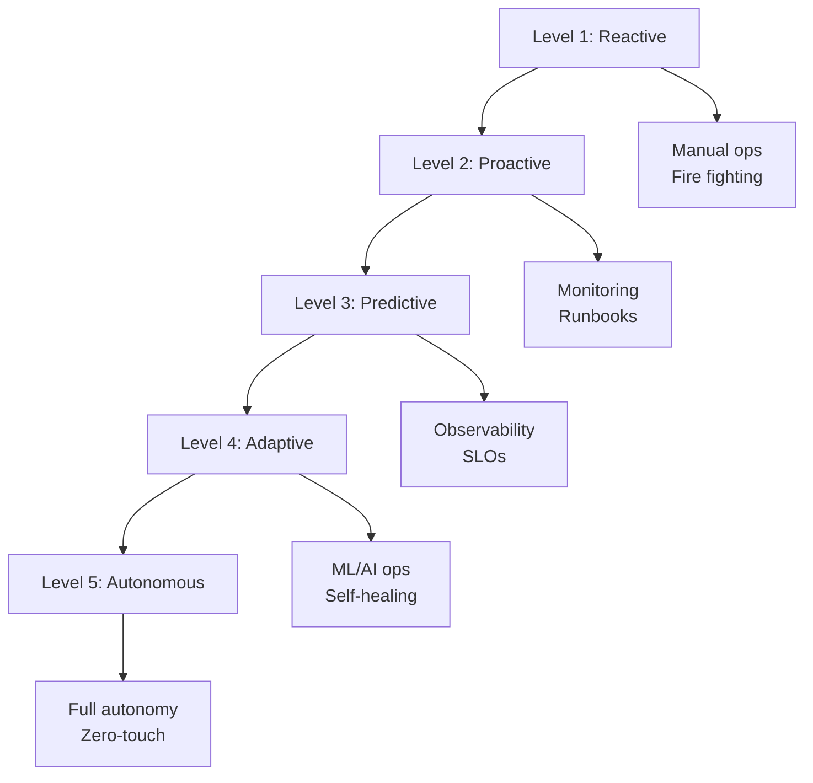
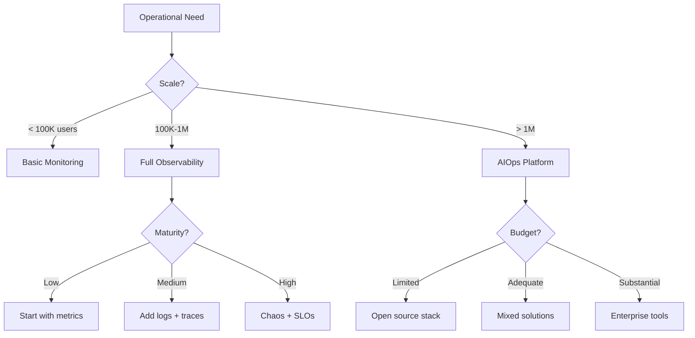

# Operational Excellence Guide: Running Systems at Scale

## Operations Maturity Model



## Core Operational Patterns

### 1. Observability Stack (Gold Pattern)

**Three Pillars Architecture**:
```yaml
observability_stack:
  metrics:
    collection: Prometheus
    storage: Thanos
    visualization: Grafana
    granularity:
      - raw: 15s for 2h
      - 5m: for 24h
      - 1h: for 30d
      - 1d: for 1y
  
  logs:
    collection: Fluentd
    storage: Loki
    query: LogQL
    retention:
      - hot: 7 days
      - warm: 30 days
      - cold: 90 days
  
  traces:
    collection: OpenTelemetry
    storage: Tempo
    sampling:
      - head-based: 0.1%
      - tail-based: errors + slow
```

**Golden Signals Dashboard**:
```python
class GoldenSignals:
    def __init__(self, prometheus_client):
        self.prom = prometheus_client
        
    def get_rate(self, service):
        query = f'sum(rate(http_requests_total{{service="{service}"}}[5m]))'
        return self.prom.query(query)
    
    def get_errors(self, service):
        query = f'''
            sum(rate(http_requests_total{{service="{service}",status=~"5.."}}[5m]))
            /
            sum(rate(http_requests_total{{service="{service}"}}[5m]))
        '''
        return self.prom.query(query)
    
    def get_duration(self, service, percentile=0.99):
        query = f'''
            histogram_quantile({percentile},
                sum(rate(http_request_duration_seconds_bucket{{service="{service}"}}[5m]))
                by (le)
            )
        '''
        return self.prom.query(query)
    
    def get_saturation(self, service):
        queries = {
            'cpu': f'avg(rate(container_cpu_usage_seconds_total{{service="{service}"}}[5m]))',
            'memory': f'avg(container_memory_usage_bytes{{service="{service}"}}) / avg(container_spec_memory_limit_bytes{{service="{service}"}})',
            'disk': f'avg((node_filesystem_size_bytes - node_filesystem_free_bytes) / node_filesystem_size_bytes)'
        }
        return {metric: self.prom.query(query) for metric, query in queries.items()}
```

### 2. SLO-Driven Operations (Gold Pattern)

**SLO Framework**:
```yaml
slo_definition:
  service: payment-api
  slis:
    - name: availability
      query: |
        sum(rate(http_requests_total{status!~"5.."}[5m]))
        /
        sum(rate(http_requests_total[5m]))
      
    - name: latency
      query: |
        histogram_quantile(0.99,
          sum(rate(http_request_duration_seconds_bucket[5m])) by (le)
        ) < 0.5
  
  objectives:
    - sli: availability
      target: 99.95%
      window: 30d
      
    - sli: latency
      target: 99.9%
      window: 30d
  
  error_budget:
    policy: |
      if budget_remaining < 20%:
        - freeze_deployments()
        - page_oncall()
        - prioritize_reliability()
```

**Error Budget Tracking**:
```python
class ErrorBudget:
    def __init__(self, slo_target, window_days=30):
        self.slo_target = slo_target
        self.window_seconds = window_days * 24 * 3600
        
    def calculate_budget(self, total_requests, failed_requests):
        # Calculate allowed failures
        allowed_failures = total_requests * (1 - self.slo_target)
        
        # Calculate remaining budget
        budget_used = failed_requests / allowed_failures
        budget_remaining = 1 - budget_used
        
        # Calculate burn rate
        time_elapsed = self.get_elapsed_time()
        expected_budget_used = time_elapsed / self.window_seconds
        burn_rate = budget_used / expected_budget_used if expected_budget_used > 0 else 0
        
        return {
            'budget_remaining_percent': budget_remaining * 100,
            'burn_rate': burn_rate,
            'time_until_exhausted': self.window_seconds * budget_remaining / burn_rate if burn_rate > 0 else float('inf'),
            'action_required': burn_rate > 1.5
        }
```

### 3. Chaos Engineering (Gold Pattern)

**Chaos Experiment Framework**:
```python
class ChaosExperiment:
    def __init__(self, name, hypothesis, blast_radius):
        self.name = name
        self.hypothesis = hypothesis
        self.blast_radius = blast_radius
        self.steady_state_metrics = {}
        
    async def run(self):
        # 1. Define steady state
        self.steady_state_metrics = await self.measure_steady_state()
        
        # 2. Hypothesis
        print(f"Hypothesis: {self.hypothesis}")
        
        # 3. Run experiment
        try:
            # Limit blast radius
            await self.limit_blast_radius()
            
            # Inject failure
            await self.inject_failure()
            
            # Monitor impact
            impact_metrics = await self.measure_impact()
            
            # Verify hypothesis
            result = self.verify_hypothesis(impact_metrics)
            
        finally:
            # 4. Rollback
            await self.rollback()
            
        return result
    
    async def inject_failure(self):
        """Override in specific experiments"""
        pass

class NetworkLatencyExperiment(ChaosExperiment):
    def __init__(self, service, latency_ms=100, percentage=10):
        super().__init__(
            name=f"Network latency on {service}",
            hypothesis=f"System remains available with {latency_ms}ms latency on {percentage}% of requests",
            blast_radius={"service": service, "percentage": percentage}
        )
        self.latency_ms = latency_ms
        
    async def inject_failure(self):
        # Using tc (traffic control) to add latency
        cmd = f"""
            tc qdisc add dev eth0 root netem delay {self.latency_ms}ms
        """
        await self.execute_on_subset(cmd)
```

### 4. Incident Management

**Incident Response Runbook**:
```yaml
incident_response:
  severity_levels:
    sev1:
      description: Complete outage or data loss
      response_time: < 5 minutes
      escalation: VP Engineering
      
    sev2:
      description: Significant degradation
      response_time: < 15 minutes
      escalation: Engineering Manager
      
    sev3:
      description: Minor degradation
      response_time: < 1 hour
      escalation: Team Lead
  
  response_phases:
    1_detect:
      - automated_alerts
      - customer_reports
      - synthetic_monitoring
      
    2_triage:
      - assess_impact
      - determine_severity
      - page_oncall
      
    3_mitigate:
      - immediate_actions
      - communicate_status
      - implement_workaround
      
    4_resolve:
      - root_cause_analysis
      - permanent_fix
      - verify_resolution
      
    5_learn:
      - blameless_postmortem
      - action_items
      - share_learnings
```

**Automated Incident Response**:
```python
class IncidentResponder:
    def __init__(self):
        self.playbooks = {}
        self.escalation_chain = []
        
    async def handle_alert(self, alert):
        # Create incident
        incident = await self.create_incident(alert)
        
        # Auto-triage
        severity = self.determine_severity(alert)
        incident.severity = severity
        
        # Execute playbook
        playbook = self.playbooks.get(alert.type)
        if playbook:
            await self.execute_playbook(playbook, incident)
        
        # Page if needed
        if severity <= 2:  # SEV1 or SEV2
            await self.page_oncall(incident)
        
        # Start diagnostics collection
        await self.collect_diagnostics(incident)
        
        return incident
    
    async def execute_playbook(self, playbook, incident):
        for step in playbook.steps:
            try:
                result = await step.execute(incident.context)
                incident.add_action(step.name, result)
                
                if result.resolved:
                    incident.status = 'resolved'
                    break
                    
            except Exception as e:
                incident.add_action(step.name, f"Failed: {e}")
```

## Operational Patterns by Scale

### Startup Scale (< 100K users)

```yaml
patterns:
  monitoring:
    - pattern: Basic Monitoring
    - tools: [Prometheus, Grafana]
    - focus: Availability, basic metrics
  
  incident_response:
    - pattern: On-call rotation
    - tools: [PagerDuty]
    - team_size: 3-5 engineers
  
  deployment:
    - pattern: Blue-Green
    - frequency: Weekly
    - rollback: Manual
```

### Growth Scale (100K - 1M users)

```yaml
patterns:
  observability:
    - pattern: Full Observability (Gold)
    - tools: [Prometheus, Loki, Tempo]
    - focus: Golden signals, SLOs
  
  chaos_engineering:
    - pattern: Game Days
    - frequency: Monthly
    - scope: Non-production first
  
  automation:
    - pattern: Runbook Automation
    - tools: [Ansible, Terraform]
    - coverage: 50% of incidents
```

### Enterprise Scale (> 1M users)

```yaml
patterns:
  aiops:
    - pattern: Predictive Operations
    - tools: [Custom ML models]
    - capabilities:
      - Anomaly detection
      - Capacity planning
      - Auto-remediation
  
  chaos_engineering:
    - pattern: Continuous Chaos (Gold)
    - tools: [Gremlin, Litmus]
    - scope: Production included
  
  sre_practices:
    - pattern: Full SRE (Gold)
    - practices:
      - Error budgets
      - Toil reduction
      - Blameless postmortems
```

## Key Operational Metrics

### Reliability Metrics

| Metric | Formula | Target | Alert Threshold |
|--------|---------|--------|-----------------|
| **Availability** | Uptime / Total Time | 99.95% | < 99.9% |
| **MTTR** | Total Downtime / Incidents | < 30 min | > 60 min |
| **MTBF** | Total Time / Incidents | > 30 days | < 7 days |
| **Error Budget** | 1 - (Errors / Total) | > 20% | < 10% |

### Performance Metrics

```python
class PerformanceMonitor:
    def __init__(self):
        self.thresholds = {
            'p50_latency': 100,  # ms
            'p99_latency': 500,  # ms
            'error_rate': 0.001,  # 0.1%
            'saturation': 0.8    # 80%
        }
    
    def check_slo_compliance(self, metrics):
        violations = []
        
        if metrics['p99_latency'] > self.thresholds['p99_latency']:
            violations.append({
                'slo': 'latency',
                'current': metrics['p99_latency'],
                'threshold': self.thresholds['p99_latency'],
                'severity': 'high' if metrics['p99_latency'] > 1000 else 'medium'
            })
        
        if metrics['error_rate'] > self.thresholds['error_rate']:
            violations.append({
                'slo': 'errors',
                'current': metrics['error_rate'],
                'threshold': self.thresholds['error_rate'],
                'severity': 'critical'
            })
        
        return violations
```

## Automation Patterns

### Toil Reduction

```yaml
toil_automation:
  identification:
    criteria:
      - manual
      - repetitive
      - automatable
      - tactical
      - no_enduring_value
      - scales_with_service
  
  automation_targets:
    - deployment_validation
    - certificate_renewal
    - capacity_scaling
    - log_rotation
    - backup_verification
  
  measurement:
    before: 60% toil
    target: < 20% toil
    tracking: Weekly surveys
```

### Self-Healing Systems

```python
class SelfHealingSystem:
    def __init__(self):
        self.health_checks = []
        self.remediation_actions = {}
        
    def register_health_check(self, check, remediation):
        self.health_checks.append(check)
        self.remediation_actions[check.name] = remediation
    
    async def monitor_and_heal(self):
        while True:
            for check in self.health_checks:
                try:
                    result = await check.execute()
                    
                    if not result.healthy:
                        # Attempt auto-remediation
                        remediation = self.remediation_actions[check.name]
                        
                        await self.log_healing_attempt(check, result)
                        healing_result = await remediation.execute(result.context)
                        
                        if healing_result.success:
                            await self.log_healing_success(check)
                        else:
                            await self.escalate_to_human(check, result)
                            
                except Exception as e:
                    await self.log_check_failure(check, e)
            
            await asyncio.sleep(60)  # Check every minute
```

## Decision Framework



## Implementation Roadmap

### Week 1-2: Foundation
- [ ] Deploy Prometheus + Grafana
- [ ] Set up basic alerts
- [ ] Create first runbook
- [ ] Define on-call rotation

### Month 1: Observability
- [ ] Implement distributed tracing
- [ ] Set up log aggregation
- [ ] Create service dashboards
- [ ] Define initial SLOs

### Month 2-3: Reliability
- [ ] Run first chaos experiment
- [ ] Automate common runbooks
- [ ] Implement error budgets
- [ ] Create incident response process

### Quarter 2: Excellence
- [ ] Deploy full observability stack
- [ ] Monthly chaos game days
- [ ] 50% toil reduction
- [ ] Predictive alerting

## Common Pitfalls

| Pitfall | Impact | Solution |
|---------|--------|----------|
| Alert fatigue | Ignored alerts | Tune thresholds, reduce noise |
| No SLOs | Unclear priorities | Define user-centric SLOs |
| Blame culture | Hidden failures | Blameless postmortems |
| Manual everything | Burnout | Aggressive automation |

## Real-World Examples

### Google SRE
- **Error Budgets**: Strict enforcement
- **Toil Target**: < 50% of time
- **Automation**: Everything possible

### Netflix Chaos
- **Simian Army**: Continuous chaos
- **Regional Failover**: Regular testing
- **Auto-remediation**: Self-healing priority

### Amazon Operations
- **Two-pizza teams**: Full ownership
- **Operational reviews**: Weekly COE
- **Automation first**: Manual as exception

## Next Steps

1. **Assess current state**: Use maturity model
2. **Define SLOs**: Start with user journeys
3. **Build observability**: Metrics first, then logs/traces
4. **Automate toil**: Track and reduce systematically
5. **Practice chaos**: Start small, expand gradually

## Resources

- [Observability Pattern](../../human-factors/observability.md)
- [Chaos Engineering](../../human-factors/chaos-engineering.md)
- [SRE Practices](../../human-factors/sre.md)
- [Health Check Pattern](../../../pattern-library/resilience/health-check/index.md)
- [Circuit Breaker Pattern](../../../pattern-library/resilience/circuit-breaker/index.md) (Gold)