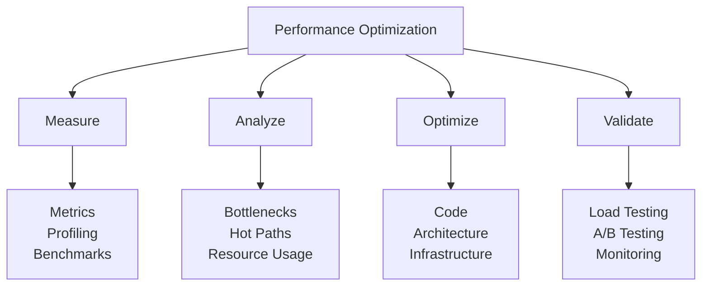
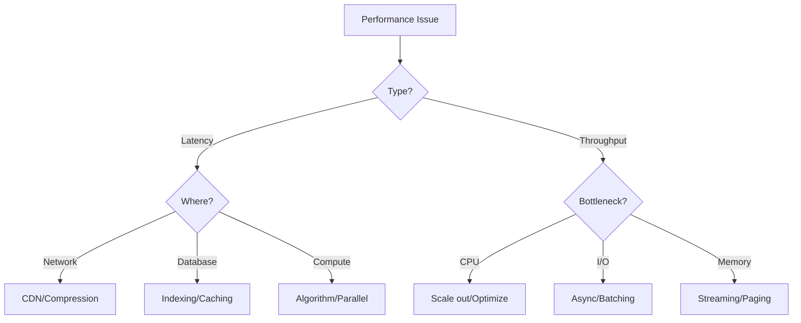

# Performance Optimization Guide: Speed at Scale

## Performance Optimization Framework



## Performance Patterns by Layer

### 1. Caching Strategies (Gold Pattern)

**Multi-Level Cache Architecture**:
```python
class MultiLevelCache:
    def __init__(self):
        # L1: Process memory (fastest, smallest)
        self.l1_cache = LRUCache(maxsize=1000)
        
        # L2: Redis (fast, medium)
        self.l2_cache = Redis(
            host='redis-cluster',
            cluster_mode=True,
            read_replicas=True
        )
        
        # L3: CDN (slower, largest)
        self.l3_cache = CDN(
            provider='cloudflare',
            ttl_default=3600
        )
        
    async def get(self, key):
        # Check L1
        value = self.l1_cache.get(key)
        if value is not None:
            self.metrics.l1_hit()
            return value
        
        # Check L2
        value = await self.l2_cache.get(key)
        if value is not None:
            self.metrics.l2_hit()
            self.l1_cache.set(key, value)
            return value
        
        # Check L3
        value = await self.l3_cache.get(key)
        if value is not None:
            self.metrics.l3_hit()
            await self._promote_to_l2(key, value)
            self.l1_cache.set(key, value)
            return value
        
        self.metrics.cache_miss()
        return None
    
    async def set(self, key, value, ttl=None):
        # Write-through to all levels
        self.l1_cache.set(key, value)
        await self.l2_cache.set(key, value, ttl or 300)
        await self.l3_cache.set(key, value, ttl or 3600)
```

**Cache Warming Strategy**:
```yaml
cache_warming:
  strategies:
    predictive:
      - analyze_access_patterns
      - preload_popular_items
      - schedule: "0 5 * * *"  # 5 AM daily
      
    lazy_loading:
      - load_on_first_access
      - background_refresh
      - ttl_based_refresh
      
    event_driven:
      - invalidate_on_update
      - warm_related_items
      - cascade_updates
```

### 2. Database Optimization (Gold Pattern)

**Query Optimization Framework**:
```python
class QueryOptimizer:
    def __init__(self, db_connection):
        self.db = db_connection
        self.query_cache = QueryCache()
        self.slow_query_threshold = 100  # ms
        
    async def execute_optimized(self, query, params=None):
        # Check query plan cache
        plan = self.query_cache.get_plan(query)
        
        if not plan:
            # Analyze query
            plan = await self.analyze_query(query)
            self.query_cache.set_plan(query, plan)
        
        # Apply optimizations
        if plan.needs_index:
            await self.suggest_index(plan)
        
        if plan.can_parallelize:
            return await self.execute_parallel(query, params)
        
        if plan.can_batch:
            return await self.batch_execute(query, params)
        
        # Execute with monitoring
        start_time = time.time()
        result = await self.db.execute(query, params)
        execution_time = (time.time() - start_time) * 1000
        
        if execution_time > self.slow_query_threshold:
            await self.log_slow_query(query, execution_time, plan)
        
        return result
    
    async def execute_parallel(self, query, params):
        # Split query into parallel chunks
        chunks = self.split_query(query, params)
        
        # Execute in parallel
        tasks = [
            self.db.execute(chunk_query, chunk_params)
            for chunk_query, chunk_params in chunks
        ]
        
        results = await asyncio.gather(*tasks)
        
        # Merge results
        return self.merge_results(results)
```

**Connection Pooling**:
```yaml
database_pools:
  read_pool:
    min_size: 10
    max_size: 100
    max_idle_time: 300s
    connection_timeout: 5s
    query_timeout: 30s
    
  write_pool:
    min_size: 5
    max_size: 50
    max_idle_time: 300s
    connection_timeout: 5s
    query_timeout: 60s
    
  analytics_pool:
    min_size: 2
    max_size: 20
    max_idle_time: 600s
    connection_timeout: 10s
    query_timeout: 300s
```

### 3. API Performance (Silver Pattern)

**Request Batching**:
```python
class RequestBatcher:
    def __init__(self, batch_size=100, wait_time_ms=10):
        self.batch_size = batch_size
        self.wait_time_ms = wait_time_ms
        self.pending_requests = []
        self.batch_timer = None
        
    async def add_request(self, request):
        future = asyncio.Future()
        self.pending_requests.append((request, future))
        
        if len(self.pending_requests) >= self.batch_size:
            await self._process_batch()
        elif not self.batch_timer:
            self.batch_timer = asyncio.create_task(
                self._wait_and_process()
            )
        
        return await future
    
    async def _process_batch(self):
        if not self.pending_requests:
            return
        
        # Take batch
        batch = self.pending_requests[:self.batch_size]
        self.pending_requests = self.pending_requests[self.batch_size:]
        
        # Process batch
        requests = [req for req, _ in batch]
        try:
            results = await self._execute_batch(requests)
            
            # Resolve futures
            for (_, future), result in zip(batch, results):
                future.set_result(result)
                
        except Exception as e:
            # Reject all futures in batch
            for _, future in batch:
                future.set_exception(e)
```

**Response Compression**:
```python
class CompressionMiddleware:
    def __init__(self, app, min_size=1024):
        self.app = app
        self.min_size = min_size
        self.algorithms = {
            'br': brotli.compress,
            'gzip': gzip.compress,
            'deflate': zlib.compress
        }
        
    async def __call__(self, request, call_next):
        # Check accepted encodings
        accept_encoding = request.headers.get('accept-encoding', '')
        
        # Process request
        response = await call_next(request)
        
        # Check if compression applicable
        if (response.status_code != 200 or
            'content-encoding' in response.headers or
            int(response.headers.get('content-length', 0)) < self.min_size):
            return response
        
        # Choose best algorithm
        for encoding in ['br', 'gzip', 'deflate']:
            if encoding in accept_encoding:
                # Compress response
                body = b''.join([chunk async for chunk in response.body_iterator])
                compressed = self.algorithms[encoding](body)
                
                # Update headers
                response.headers['content-encoding'] = encoding
                response.headers['content-length'] = str(len(compressed))
                response.headers['vary'] = 'Accept-Encoding'
                
                return Response(
                    content=compressed,
                    status_code=response.status_code,
                    headers=dict(response.headers),
                    media_type=response.media_type
                )
        
        return response
```

### 4. Compute Optimization

**Parallel Processing**:
```python
class ParallelProcessor:
    def __init__(self, worker_count=None):
        self.worker_count = worker_count or cpu_count()
        self.executor = ProcessPoolExecutor(
            max_workers=self.worker_count
        )
        
    async def process_parallel(self, items, processor_func):
        # Chunk items for parallel processing
        chunk_size = max(1, len(items) // self.worker_count)
        chunks = [
            items[i:i + chunk_size]
            for i in range(0, len(items), chunk_size)
        ]
        
        # Process chunks in parallel
        loop = asyncio.get_event_loop()
        futures = [
            loop.run_in_executor(
                self.executor,
                processor_func,
                chunk
            )
            for chunk in chunks
        ]
        
        # Gather results
        results = await asyncio.gather(*futures)
        
        # Flatten results
        return [item for chunk in results for item in chunk]
```

**Memory Optimization**:
```python
class MemoryOptimizedProcessor:
    def __init__(self, max_memory_mb=1024):
        self.max_memory_bytes = max_memory_mb * 1024 * 1024
        
    def process_large_file(self, file_path, processor):
        """Process large file in chunks to avoid memory overflow"""
        chunk_size = self._calculate_chunk_size(file_path)
        
        with open(file_path, 'rb') as f:
            while True:
                chunk = f.read(chunk_size)
                if not chunk:
                    break
                    
                # Process chunk
                result = processor(chunk)
                
                # Yield to avoid accumulating results in memory
                yield result
                
                # Force garbage collection if needed
                if self._memory_usage() > self.max_memory_bytes * 0.8:
                    gc.collect()
    
    def _calculate_chunk_size(self, file_path):
        file_size = os.path.getsize(file_path)
        # Use 1% of file size or 10MB, whichever is smaller
        return min(file_size // 100, 10 * 1024 * 1024)
```

## Performance Patterns by Scale

### Startup Scale (< 100K RPS)

```yaml
optimization_focus:
  - database_indexing
  - basic_caching
  - connection_pooling
  - gzip_compression
  
tools:
  - profiler: cProfile
  - load_test: Locust
  - monitoring: Prometheus
  - cache: Redis
```

### Growth Scale (100K - 1M RPS)

```yaml
optimization_focus:
  - multi_level_caching
  - database_sharding
  - cdn_integration
  - async_processing
  
patterns:
  - pattern: Read replicas
    benefit: 10x read scaling
  - pattern: Write batching
    benefit: 5x write throughput
  - pattern: Edge caching
    benefit: 50ms latency reduction
```

### Enterprise Scale (> 1M RPS)

```yaml
optimization_focus:
  - global_load_balancing
  - edge_computing
  - custom_protocols
  - hardware_acceleration
  
advanced_patterns:
  - pattern: DPDK networking
    benefit: 10x packet processing
  - pattern: GPU acceleration
    benefit: 100x ML inference
  - pattern: Custom TCP stack
    benefit: 50% latency reduction
```

## Performance Testing Framework

### Load Testing Strategy

```python
class LoadTestScenario:
    def __init__(self, name, target_rps):
        self.name = name
        self.target_rps = target_rps
        self.results = []
        
    async def run(self, duration_seconds=300):
        """Run load test scenario"""
        start_time = time.time()
        request_count = 0
        errors = 0
        latencies = []
        
        # Ramp up
        current_rps = 0
        ramp_up_time = 60  # seconds
        
        while time.time() - start_time < duration_seconds:
            # Calculate current RPS (with ramp up)
            elapsed = time.time() - start_time
            if elapsed < ramp_up_time:
                current_rps = self.target_rps * (elapsed / ramp_up_time)
            else:
                current_rps = self.target_rps
            
            # Send requests
            batch_size = int(current_rps / 10)  # 100ms batches
            batch_start = time.time()
            
            tasks = [
                self._send_request()
                for _ in range(batch_size)
            ]
            
            results = await asyncio.gather(*tasks, return_exceptions=True)
            
            # Process results
            for result in results:
                request_count += 1
                if isinstance(result, Exception):
                    errors += 1
                else:
                    latencies.append(result.latency)
            
            # Sleep to maintain RPS
            batch_duration = time.time() - batch_start
            sleep_time = max(0, 0.1 - batch_duration)
            await asyncio.sleep(sleep_time)
        
        # Calculate results
        return LoadTestResult(
            scenario=self.name,
            duration=duration_seconds,
            total_requests=request_count,
            errors=errors,
            error_rate=errors / request_count,
            latency_p50=np.percentile(latencies, 50),
            latency_p95=np.percentile(latencies, 95),
            latency_p99=np.percentile(latencies, 99),
            throughput=request_count / duration_seconds
        )
```

## Performance Monitoring

### Real-time Performance Dashboard

```yaml
metrics:
  application:
    - request_rate
    - error_rate
    - latency_percentiles
    - active_connections
    
  system:
    - cpu_usage
    - memory_usage
    - disk_io
    - network_throughput
    
  business:
    - conversion_rate
    - page_load_time
    - api_response_time
    - user_satisfaction
```

### Performance Alerting

```python
class PerformanceAlerter:
    def __init__(self):
        self.thresholds = {
            'latency_p99': 500,  # ms
            'error_rate': 0.01,   # 1%
            'cpu_usage': 0.8,     # 80%
            'memory_usage': 0.9   # 90%
        }
        
    async def check_performance(self, metrics):
        alerts = []
        
        # Check latency
        if metrics['latency_p99'] > self.thresholds['latency_p99']:
            alerts.append(Alert(
                level='warning',
                metric='latency_p99',
                value=metrics['latency_p99'],
                threshold=self.thresholds['latency_p99'],
                action='Scale out application servers'
            ))
        
        # Check error rate
        if metrics['error_rate'] > self.thresholds['error_rate']:
            alerts.append(Alert(
                level='critical',
                metric='error_rate',
                value=metrics['error_rate'],
                threshold=self.thresholds['error_rate'],
                action='Check application logs, possible bug'
            ))
        
        return alerts
```

## Common Performance Anti-Patterns

| Anti-Pattern | Impact | Solution |
|--------------|--------|----------|
| N+1 queries | Database overload | Eager loading, DataLoader |
| Synchronous I/O | Thread blocking | Async/await everywhere |
| No caching | Repeated computation | Multi-level caching |
| Large payloads | Network saturation | Pagination, compression |
| No connection pooling | Connection overhead | Pool all connections |

## Performance Optimization Checklist

### Week 1: Baseline
- [ ] Set up performance monitoring
- [ ] Establish baseline metrics
- [ ] Identify bottlenecks
- [ ] Create load test suite

### Month 1: Quick Wins
- [ ] Add caching layer
- [ ] Optimize database queries
- [ ] Enable compression
- [ ] Implement connection pooling

### Quarter 1: Deep Optimization
- [ ] Shard hot tables
- [ ] Deploy CDN
- [ ] Implement async processing
- [ ] Optimize algorithms

## Decision Framework



## Real-World Examples

### Discord Performance
- **Challenge**: Millions of concurrent connections
- **Solution**: Rust for critical paths
- **Result**: 10x performance improvement

### Netflix CDN
- **Challenge**: Global video streaming
- **Solution**: Open Connect edge caching
- **Result**: 95% traffic served from edge

### Uber H3
- **Challenge**: Geospatial queries at scale
- **Solution**: Hexagonal hierarchical index
- **Result**: 100x query performance

## Next Steps

1. **Measure first**: Never optimize without data
2. **Profile hotspots**: Focus on top 20% of code
3. **Test changes**: Verify improvements with load tests
4. **Monitor production**: Watch for regressions
5. **Iterate continuously**: Performance is ongoing

## Resources

- [Caching Strategies](../pattern-library/scaling/caching-strategies.md) (Gold)
- [Load Balancing](../pattern-library/scaling/load-balancing.md) (Gold)
- [Auto-scaling](../pattern-library/scaling/auto-scaling.md) (Silver)
- [Edge Computing](../pattern-library/scaling/edge-computing.md) (Gold)
- [Performance Testing Tools](../../reference/performance-tools.md)