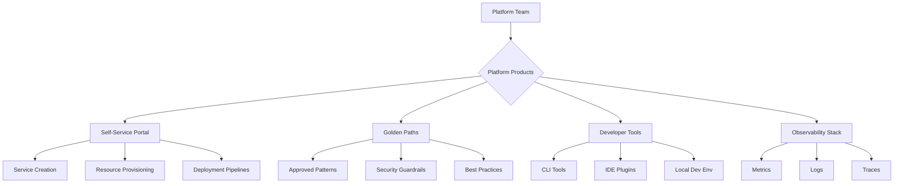
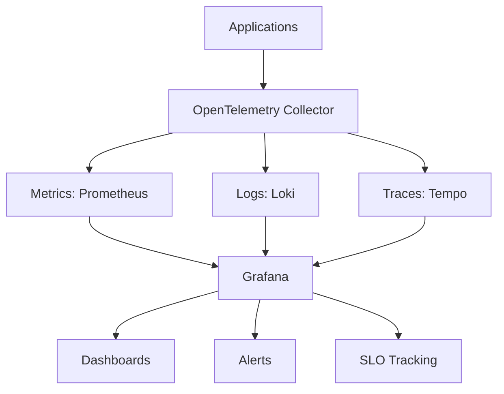
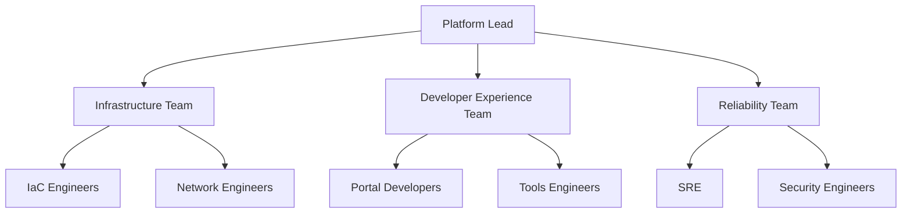

# Platform Engineering Playbook: Building Developer Excellence

## Table of Contents

1. [Platform as a Product Mindset](#platform-as-a-product-mindset)
2. [Core Platform Patterns](#core-platform-patterns)
   - [GitOps Foundation](#1-gitops-foundation)
   - [Infrastructure as Code (IaC)](#2-infrastructure-as-code-iac)
   - [Developer Experience Patterns](#3-developer-experience-patterns)
   - [Observability and Monitoring](#4-observability-and-monitoring)
   - [CI/CD and Progressive Delivery](#5-cicd-and-progressive-delivery)
   - [Cost Optimization](#6-cost-optimization)
3. [Platform Maturity Model](#platform-maturity-model)
4. [Key Metrics](#key-metrics)
5. [Implementation Roadmap](#implementation-roadmap)
6. [Common Pitfalls and Solutions](#common-pitfalls-and-solutions)
7. [Platform Team Structure](#platform-team-structure)
8. [Success Stories](#success-stories)
9. [Next Steps](#next-steps)
10. [Resources](#resources)

## Platform as a Product Mindset



## Core Platform Patterns

### 1. GitOps Foundation

```yaml
## GitOps Repository Structure
platform/
├── clusters/
│   ├── production/
│   │   ├── namespaces/
│   │   ├── network-policies/
│   │   └── resource-quotas/
│   ├── staging/
│   └── development/
├── applications/
│   ├── base/
│   └── overlays/
├── infrastructure/
│   ├── terraform/
│   └── crossplane/
└── policies/
    ├── security/
    └── compliance/
```

**Implementation with Flux**:
```yaml
apiVersion: source.toolkit.fluxcd.io/v1beta2
kind: GitRepository
metadata:
  name: platform-config
  namespace: flux-system
spec:
  interval: 1m
  ref:
    branch: main
  url: https://github.com/company/platform-config
---
apiVersion: kustomize.toolkit.fluxcd.io/v1beta2
kind: Kustomization
metadata:
  name: platform-core
  namespace: flux-system
spec:
  interval: 10m
  path: "./clusters/production"
  prune: true
  sourceRef:
    kind: GitRepository
    name: platform-config
```

### 2. Infrastructure as Code (IaC)

**Decision Matrix**:
| Tool | Best For | Learning Curve | Multi-Cloud |
|------|----------|----------------|-------------|
| Terraform | Everything | Medium | Yes |
| Pulumi | Type-safe IaC | High | Yes |
| Crossplane | K8s native | High | Yes |
| CDK | AWS-centric | Medium | Limited |

**Terraform Module Structure**:
```hcl
## modules/microservice/main.tf
module "microservice" {
  source = "./modules/microservice"
  
  name        = var.service_name
  environment = var.environment
  
  # Standardized inputs
  cpu_request    = var.cpu_request
  memory_request = var.memory_request
  replicas       = var.replicas
  
  # Platform standards enforced
  security_policies = data.platform.security_policies
  network_policies  = data.platform.network_policies
  
  # Automatic observability
  enable_metrics = true
  enable_tracing = true
  enable_logging = true
}
```

### 3. Developer Experience Patterns

#### Self-Service Portal
```python
## Platform API for service creation
@app.post("/services")
async def create_service(request: ServiceRequest):
    # Validate request
    validate_service_name(request.name)
    validate_team_ownership(request.team)
    
    # Generate from template
    service_config = generate_from_template(
        template="microservice-golden-path",
        params={
            "name": request.name,
            "team": request.team,
            "language": request.language,
            "framework": request.framework
        }
    )
    
    # Create resources
    await create_git_repo(service_config)
    await setup_ci_pipeline(service_config)
    await provision_infrastructure(service_config)
    await configure_monitoring(service_config)
    
    return {
        "service_url": f"https://{request.name}.platform.com",
        "git_repo": f"https://github.com/org/{request.name}",
        "dashboard": f"https://grafana.platform.com/d/{request.name}"
    }
```

### Golden Path Templates
```yaml
## golden-paths/microservice/template.yaml
apiVersion: scaffolder.backstage.io/v1beta3
kind: Template
metadata:
  name: microservice-golden-path
spec:
  type: service
  parameters:
    - title: Service Details
      properties:
        name:
          type: string
          pattern: '^[a-z0-9-]+$'
        description:
          type: string
        language:
          type: string
          enum: ['go', 'python', 'java', 'nodejs']
          
  steps:
    - id: fetch-base
      action: fetch:template
      input:
        url: ./skeleton
        values:
          name: ${{ parameters.name }}
          
    - id: setup-ci
      action: github:actions:create
      input:
        repoUrl: ${{ parameters.repoUrl }}
        workflows:
          - build-test-deploy.yaml
          
    - id: register-catalog
      action: catalog:register
      input:
        repoContentsUrl: ${{ steps.publish.output.repoContentsUrl }}
```

### 4. Observability and Monitoring

#### Observability Stack Architecture


#### Standard Dashboards
```json
{
  "golden_signals_dashboard": {
    "panels": [
      {
        "title": "Request Rate",
        "query": "sum(rate(http_requests_total[5m])) by (service)"
      },
      {
        "title": "Error Rate",
        "query": "sum(rate(http_requests_total{status=~'5..'}[5m])) by (service)"
      },
      {
        "title": "P99 Latency",
        "query": "histogram_quantile(0.99, http_request_duration_seconds_bucket)"
      },
      {
        "title": "Saturation",
        "query": "avg(container_cpu_usage_seconds_total) by (pod)"
      }
    ]
  }
}
```

### 5. CI/CD and Progressive Delivery

#### Pipeline as Code
```yaml
## .platform/pipeline.yaml
stages:
  - name: build
    steps:
      - name: test
        image: platform/test-runner:latest
        commands:
          - make test
          - make security-scan
          - make dependency-check
          
      - name: build
        image: platform/builder:latest
        commands:
          - make build
          - make docker-build
          
  - name: deploy-staging
    steps:
      - name: deploy
        image: platform/deployer:latest
        commands:
          - kubectl apply -k overlays/staging
          
      - name: smoke-test
        image: platform/test-runner:latest
        commands:
          - make smoke-test ENV=staging
          
  - name: deploy-production
    approval_required: true
    steps:
      - name: canary
        image: platform/flagger:latest
        config:
          analysis:
            interval: 1m
            threshold: 10
            maxWeight: 50
          metrics:
            - name: request-success-rate
              threshold: 99
            - name: request-duration
              threshold: 500ms
```

### Feature Flags Integration
```python
## Platform feature flag service
class FeatureFlags:
    def __init__(self):
        self.provider = LaunchDarkly(sdk_key=PLATFORM_SDK_KEY)
    
    def create_flag(self, name: str, rules: List[Rule]):
        return self.provider.create_flag(
            key=name,
            variations=[True, False],
            rules=rules,
            # Platform defaults
            default_variation=False,
            tags=["platform-managed"],
            maintainer_team=get_current_team()
        )
    
    def progressive_rollout(self, flag: str, percentage: int):
        return self.provider.update_flag(
            flag,
            rules=[{
                "variation": True,
                "rollout": {
                    "variations": [
                        {"variation": True, "weight": percentage},
                        {"variation": False, "weight": 100 - percentage}
                    ]
                }
            }]
        )
```

### 6. Cost Optimization

#### Cost Allocation Tags
```yaml
## Platform standard tags
platform_tags:
  required:
    - team
    - service
    - environment
    - cost-center
  
  recommended:
    - project
    - customer
    - data-classification
    
  automated:
    - created-by: platform
    - managed-by: terraform
    - last-modified: timestamp
```

### Resource Optimization
```python
## Automated rightsizing recommendations
class ResourceOptimizer:
    def analyze_service(self, service_name: str) -> Recommendations:
        # Get actual usage
        cpu_usage = prometheus.query(
            f'avg_over_time(container_cpu_usage[7d]{{service="{service_name}"}})'
        )
        memory_usage = prometheus.query(
            f'avg_over_time(container_memory_usage[7d]{{service="{service_name}"}})'
        )
        
        # Calculate recommendations
        recommendations = []
        
        if cpu_usage.p95 < cpu_request * 0.5:
            recommendations.append({
                "type": "downsize_cpu",
                "current": cpu_request,
                "recommended": cpu_usage.p95 * 1.2,
                "monthly_savings": calculate_cpu_savings()
            })
        
        return recommendations
```

## Platform Maturity Model

### Level 1: Foundation (Months 1-3)
- [ ] Basic GitOps setup
- [ ] CI/CD pipelines
- [ ] Container registry
- [ ] Basic monitoring

### Level 2: Standardization (Months 4-6)
- [ ] Golden path templates
- [ ] Service catalog
- [ ] Security scanning
- [ ] Cost visibility

### Level 3: Self-Service (Months 7-9)
- [ ] Developer portal
- [ ] Automated provisioning
- [ ] Feature flags
- [ ] SLO tracking

### Level 4: Excellence (Months 10-12)
- [ ] Full observability
- [ ] Chaos engineering
- [ ] Cost optimization
- [ ] Developer productivity metrics

### Level 5: Innovation (Year 2+)
- [ ] AI-powered operations
- [ ] Predictive scaling
- [ ] Automated remediation
- [ ] Platform marketplace

## Key Metrics

### Developer Experience Metrics
| Metric | Target | How to Measure |
|--------|--------|----------------|
| Time to first deploy | < 1 hour | Portal analytics |
| MTTR | < 30 min | Incident tracking |
| Deployment frequency | > 10/day/team | CI/CD metrics |
| Change failure rate | < 5% | Deployment tracking |

### Platform Reliability Metrics
| Metric | Target | How to Measure |
|--------|--------|----------------|
| Platform availability | 99.95% | Synthetic monitoring |
| API latency (p99) | < 100ms | APM tools |
| Build success rate | > 95% | CI/CD metrics |
| Resource utilization | 60-80% | Prometheus |

## Implementation Roadmap

### Week 1-2: Assessment
```yaml
tasks:
  - inventory_current_tools
  - survey_developer_pain_points
  - analyze_deployment_metrics
  - identify_quick_wins
```

### Week 3-4: Foundation
```yaml
tasks:
  - setup_gitops_repository
  - create_first_golden_path
  - implement_basic_monitoring
  - document_platform_apis
```

### Month 2: Core Services
```yaml
tasks:
  - deploy_service_mesh
  - implement_secret_management
  - setup_log_aggregation
  - create_developer_portal
```

### Month 3: Self-Service
```yaml
tasks:
  - launch_service_creation_api
  - automate_database_provisioning
  - implement_feature_flags
  - enable_cost_tracking
```

## Common Pitfalls and Solutions

| Pitfall | Impact | Solution |
|---------|--------|----------|
| Too many tools | Cognitive overload | Consolidate and standardize |
| Lack of documentation | Slow adoption | Invest in docs and examples |
| Over-engineering | Complexity | Start simple, iterate |
| Ignoring feedback | Poor DX | Regular developer surveys |

## Platform Team Structure



## Success Stories

### Spotify's Platform
- **Golden Paths**: 90% of services use standard templates
- **Backstage**: Open-sourced their developer portal
- **Autonomous teams**: With platform guardrails

### Airbnb's Platform
- **Service creation**: < 10 minutes
- **Standardized stack**: Reduced complexity by 60%
- **Cost attribution**: 100% tagged resources

## Next Steps

1. **Assess current state**: Use the maturity model
2. **Form platform team**: Mix of skills needed
3. **Choose core tools**: Based on your stack
4. **Start with one golden path**: Prove value quickly
5. **Measure everything**: DX metrics are crucial

## Resources

### External Resources
- [CNCF Platform Engineering](https://tag-app-delivery.cncf.io/whitepapers/platform-eng-maturity-model/)
- [GitOps Patterns](https://www.gitops.tech/)
- [Platform Engineering Slack](https://platformengineering.org/slack/)
- [Backstage Documentation](https://backstage.io/docs/)

### Related Internal Guides
- [Team Topologies](../../architects-handbook/human-factors/team-topologies.md)
- [Operational Excellence](operational-excellence.md)
- [Modern Distributed Systems](modern-distributed-systems-2025.md)
- [Resilience First](resilience-first.md)

### See Also
- [Service Communication Patterns](service-communication.md)
- [Security Patterns](security-patterns.md)
- [Performance Optimization](performance-optimization.md)
```
```
