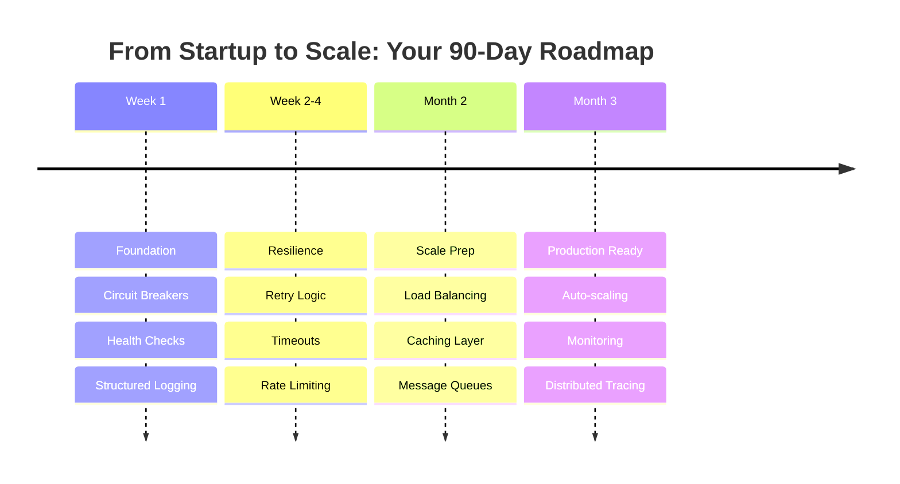

# Quick Start Guide: From Zero to Production Excellence

## Your 90-Day Journey to Distributed Systems Excellence



## Week 1: Essential Patterns to Implement

### Day 1-2: Circuit Breakers Everywhere

**Why**: Prevent cascade failures from day one

```python
# requirements.txt
py-breaker==0.7.0
requests==2.28.0

# circuit_breaker.py
from pybreaker import CircuitBreaker
import requests

# Configure circuit breaker
db_breaker = CircuitBreaker(
    fail_max=5,
    reset_timeout=60,
    exclude=[requests.HTTPError]
)

@db_breaker
def get_user(user_id):
    response = requests.get(f"http:/user-service/users/{user_id}")
    response.raise_for_status()
    return response.json()

# Usage
try:
    user = get_user(123)
except Exception as e:
    # Return cached data or default
    user = get_cached_user(123) or {"id": 123, "name": "Unknown"}
```

### Day 3-4: Health Checks & Readiness

**Why**: Enable proper load balancing and deployment

```python
# health.py
from flask import Flask, jsonify
import redis
import psycopg2

app = Flask(__name__)

@app.route('/health/live')
def liveness():
    """Am I alive?"""
    return jsonify({"status": "ok"}), 200

@app.route('/health/ready')
def readiness():
    """Am I ready to serve traffic?"""
    checks = {
        "database": check_database(),
        "cache": check_redis(),
        "dependencies": check_dependencies()
    }
    
    if all(checks.values()):
        return jsonify({"status": "ready", "checks": checks}), 200
    else:
        return jsonify({"status": "not ready", "checks": checks}), 503

def check_database():
    try:
        conn = psycopg2.connect(DATABASE_URL)
        conn.close()
        return True
    except:
        return False
```

### Day 5: Structured Logging

**Why**: Debugging distributed systems requires context

```python
# logging_config.py
import structlog
import logging

structlog.configure(
    processors=[
        structlog.stdlib.filter_by_level,
        structlog.stdlib.add_logger_name,
        structlog.stdlib.add_log_level,
        structlog.stdlib.PositionalArgumentsFormatter(),
        structlog.processors.TimeStamper(fmt="iso"),
        structlog.processors.StackInfoRenderer(),
        structlog.processors.format_exc_info,
        structlog.processors.UnicodeDecoder(),
        structlog.processors.JSONRenderer()
    ],
    context_class=dict,
    logger_factory=structlog.stdlib.LoggerFactory(),
    cache_logger_on_first_use=True,
)

# Usage
logger = structlog.get_logger()

# Always include context
logger.info("user_action", 
    user_id=user_id,
    action="login",
    ip_address=request.remote_addr,
    user_agent=request.headers.get('User-Agent'),
    correlation_id=get_correlation_id()
)
```

### Week 1 Checklist
- [ ] Circuit breakers on ALL external calls
- [ ] Health check endpoints deployed
- [ ] Structured logging with correlation IDs
- [ ] Basic monitoring dashboard set up
- [ ] Error handling standardized

## Week 2-4: Building Resilience

### Retry with Exponential Backoff

```python
# retry_handler.py
import time
import random
from functools import wraps

def exponential_backoff_retry(
    max_retries=3,
    base_delay=1,
    max_delay=60,
    exponential_base=2,
    jitter=True
):
    def decorator(func):
        @wraps(func)
        def wrapper(*args, **kwargs):
            retries = 0
            while retries < max_retries:
                try:
                    return func(*args, **kwargs)
                except Exception as e:
                    retries += 1
                    if retries == max_retries:
                        raise
                    
                    delay = min(base_delay * (exponential_base ** (retries - 1)), max_delay)
                    if jitter:
                        delay = delay * (0.5 + random.random())
                    
                    logger.warning(f"Retry {retries}/{max_retries} after {delay:.2f}s", 
                                 error=str(e))
                    time.sleep(delay)
            
        return wrapper
    return decorator

# Usage
@exponential_backoff_retry(max_retries=3)
def call_payment_service(amount, user_id):
    response = requests.post(
        "http:/payment-service/charge",
        json={"amount": amount, "user_id": user_id},
        timeout=5  # Always set timeouts!
    )
    response.raise_for_status()
    return response.json()
```

### Rate Limiting

```python
# rate_limiter.py
from functools import wraps
import time
import redis

redis_client = redis.Redis(host='localhost', port=6379, db=0)

def rate_limit(max_requests=100, window_seconds=60):
    def decorator(func):
        @wraps(func)
        def wrapper(*args, **kwargs):
            # Get client identifier (IP, API key, user ID)
            client_id = get_client_id()
            key = f"rate_limit:{func.__name__}:{client_id}"
            
            try:
                current = redis_client.incr(key)
                if current == 1:
                    redis_client.expire(key, window_seconds)
                
                if current > max_requests:
                    raise Exception(f"Rate limit exceeded: {max_requests} requests per {window_seconds}s")
                    
                return func(*args, **kwargs)
            except redis.RedisError:
                # Redis failure shouldn't break the service
                logger.error("Redis rate limit check failed, allowing request")
                return func(*args, **kwargs)
        
        return wrapper
    return decorator

# Usage
@rate_limit(max_requests=1000, window_seconds=3600)
def api_endpoint():
    return {"data": "response"}
```

## Month 1: Scaling Foundations

### Load Balancing Strategy

```yaml
# kubernetes/service.yaml
apiVersion: v1
kind: Service
metadata:
  name: api-service
spec:
  selector:
    app: api
  ports:
    - port: 80
      targetPort: 8080
  type: LoadBalancer
  sessionAffinity: None  # Round-robin by default
---
apiVersion: apps/v1
kind: Deployment
metadata:
  name: api-deployment
spec:
  replicas: 3  # Start with 3, scale based on metrics
  selector:
    matchLabels:
      app: api
  template:
    metadata:
      labels:
        app: api
    spec:
      containers:
      - name: api
        image: myapp:latest
        ports:
        - containerPort: 8080
        livenessProbe:
          httpGet:
            path: /health/live
            port: 8080
          initialDelaySeconds: 30
          periodSeconds: 10
        readinessProbe:
          httpGet:
            path: /health/ready
            port: 8080
          initialDelaySeconds: 5
          periodSeconds: 5
```

### Caching Layer

```python
# cache_manager.py
import functools
import hashlib
import json
import redis

redis_client = redis.Redis(host='localhost', port=6379, decode_responses=True)

def cache_result(ttl_seconds=300):
    def decorator(func):
        @functools.wraps(func)
        def wrapper(*args, **kwargs):
            # Create cache key from function name and arguments
            cache_key = f"{func.__name__}:{hashlib.md5(str(args).encode()).hexdigest()}"
            
            # Try to get from cache
            cached = redis_client.get(cache_key)
            if cached:
                logger.info("Cache hit", key=cache_key)
                return json.loads(cached)
            
            # Calculate result
            result = func(*args, **kwargs)
            
            # Store in cache
            redis_client.setex(cache_key, ttl_seconds, json.dumps(result))
            logger.info("Cache miss, stored", key=cache_key, ttl=ttl_seconds)
            
            return result
        return wrapper
    return decorator

# Usage
@cache_result(ttl_seconds=3600)
def get_product_details(product_id):
    # Expensive database query
    return db.query(f"SELECT * FROM products WHERE id = {product_id}")
```

### Message Queue Integration

```python
# task_queue.py
import json
import pika
from celery import Celery

# Using Celery for simplicity
app = Celery('tasks', broker='redis:/localhost:6379')

@app.task(bind=True, max_retries=3)
def process_order(self, order_data):
    try:
        # Process the order
        validate_order(order_data)
        charge_payment(order_data)
        update_inventory(order_data)
        send_confirmation_email(order_data)
        
        return {"status": "completed", "order_id": order_data['id']}
    except Exception as exc:
        # Retry with exponential backoff
        raise self.retry(exc=exc, countdown=2 ** self.request.retries)

# Usage in API
@app.route('/orders', methods=['POST'])
def create_order():
    order_data = request.json
    
    # Queue for async processing
    task = process_order.delay(order_data)
    
    return jsonify({
        "status": "processing",
        "task_id": task.id,
        "order_id": order_data['id']
    }), 202
```

## Quarter 1: Production Excellence

### Auto-scaling Configuration

```yaml
# kubernetes/hpa.yaml
apiVersion: autoscaling/v2
kind: HorizontalPodAutoscaler
metadata:
  name: api-hpa
spec:
  scaleTargetRef:
    apiVersion: apps/v1
    kind: Deployment
    name: api-deployment
  minReplicas: 3
  maxReplicas: 20
  metrics:
  - type: Resource
    resource:
      name: cpu
      target:
        type: Utilization
        averageUtilization: 70
  - type: Resource
    resource:
      name: memory
      target:
        type: Utilization
        averageUtilization: 80
  - type: Pods
    pods:
      metric:
        name: http_requests_per_second
      target:
        type: AverageValue
        averageValue: "1000"
  behavior:
    scaleDown:
      stabilizationWindowSeconds: 300  # Wait 5 min before scaling down
      policies:
      - type: Pods
        value: 2
        periodSeconds: 60  # Remove max 2 pods per minute
    scaleUp:
      stabilizationWindowSeconds: 60   # Wait 1 min before scaling up
      policies:
      - type: Pods
        value: 5
        periodSeconds: 60  # Add max 5 pods per minute
```

### Comprehensive Monitoring

```yaml
# prometheus/rules.yaml
groups:
  - name: api_alerts
    rules:
      - alert: HighErrorRate
        expr: rate(http_requests_total{status=~"5.."}[5m]) > 0.05
        for: 5m
        labels:
          severity: critical
        annotations:
          summary: "High error rate detected"
          description: "Error rate is {{ $value }} (> 5%)"
      
      - alert: HighLatency
        expr: histogram_quantile(0.95, http_request_duration_seconds_bucket) > 1
        for: 10m
        labels:
          severity: warning
        annotations:
          summary: "High latency detected"
          description: "95th percentile latency is {{ $value }}s"
      
      - alert: PodMemoryUsage
        expr: container_memory_usage_bytes / container_spec_memory_limit_bytes > 0.9
        for: 5m
        labels:
          severity: warning
        annotations:
          summary: "Pod memory usage high"
          description: "Pod {{ $labels.pod }} memory usage is {{ $value }}%"
```

### Distributed Tracing

```python
# tracing.py
from opentelemetry import trace
from opentelemetry.exporter.otlp.proto.grpc.trace_exporter import OTLPSpanExporter
from opentelemetry.sdk.trace import TracerProvider
from opentelemetry.sdk.trace.export import BatchSpanProcessor
from opentelemetry.instrumentation.flask import FlaskInstrumentor
from opentelemetry.instrumentation.requests import RequestsInstrumentor

# Configure tracing
trace.set_tracer_provider(TracerProvider())
tracer = trace.get_tracer(__name__)

# Configure exporter
otlp_exporter = OTLPSpanExporter(
    endpoint="http:/jaeger-collector:4317",
    insecure=True
)

# Add span processor
span_processor = BatchSpanProcessor(otlp_exporter)
trace.get_tracer_provider().add_span_processor(span_processor)

# Auto-instrument libraries
FlaskInstrumentor().instrument_app(app)
RequestsInstrumentor().instrument()

# Manual instrumentation
@app.route('/process')
def process_request():
    with tracer.start_as_current_span("process_request") as span:
        span.set_attribute("user.id", get_user_id())
        
        with tracer.start_as_current_span("validate_input"):
            validate_input(request.json)
        
        with tracer.start_as_current_span("database_query"):
            result = query_database()
        
        with tracer.start_as_current_span("cache_update"):
            update_cache(result)
        
        return jsonify(result)
```

## Anti-Patterns to Avoid

### ❌ Common Mistakes

| Mistake | Why It's Bad | Do Instead |
|---------|--------------|------------|
| No timeouts | Cascading failures | Set timeouts everywhere |
| Sync everything | Poor scalability | Use async patterns |
| Single point of failure | System-wide outages | Build redundancy |
| No circuit breakers | Cascade failures | Fail fast |
| Ignoring backpressure | System overload | Implement flow control |

### ❌ Legacy Patterns to Skip

1. **Two-phase commit**: Use saga pattern instead
2. **Shared databases**: Service-owned databases
3. **Synchronous chains**: Event-driven architecture
4. **Manual scaling**: Auto-scaling from day one
5. **Log files**: Centralized logging

## Monthly Milestones

### Month 1 Checklist
- [ ] All services have health checks
- [ ] Circuit breakers on external calls
- [ ] Basic caching implemented
- [ ] Message queue for async tasks
- [ ] Structured logging everywhere

### Month 2 Checklist
- [ ] Load balancing configured
- [ ] Auto-scaling policies set
- [ ] Monitoring dashboards created
- [ ] Alerts configured
- [ ] Performance baselines established

### Month 3 Checklist
- [ ] Distributed tracing enabled
- [ ] Chaos testing started
- [ ] Runbooks documented
- [ ] SLOs defined
- [ ] Cost tracking enabled

## Production Readiness Checklist

### Before Going Live
- [ ] Circuit breakers configured
- [ ] Retry logic with backoff
- [ ] Timeouts on all calls
- [ ] Rate limiting enabled
- [ ] Health checks passing
- [ ] Monitoring active
- [ ] Alerts configured
- [ ] Logging structured
- [ ] Tracing enabled
- [ ] Auto-scaling tested
- [ ] Backups configured
- [ ] Runbooks written
- [ ] Load tested
- [ ] Security scanned
- [ ] Cost estimated

## Quick Reference Card

### Essential Libraries

**Python**:
```txt
py-breaker==0.7.0      # Circuit breakers
tenacity==8.2.2        # Retry logic
redis==4.5.1          # Caching/rate limiting
celery==5.2.7         # Task queues
prometheus-client==0.16.0  # Metrics
opentelemetry-api==1.17.0  # Tracing
structlog==23.1.0     # Structured logging
```

**Node.js**:
```json
{
  "opossum": "^7.0.0",      / Circuit breaker
  "p-retry": "^5.1.2",      / Retry logic
  "bull": "^4.10.4",        / Task queues
  "prom-client": "^14.2.0", / Metrics
  "@opentelemetry/api": "^1.4.1", / Tracing
  "pino": "^8.11.0"         / Structured logging
}
```

### Deployment Commands

```bash
# Local development
docker-compose up -d
make test
make run-local

# Staging deployment
kubectl apply -k overlays/staging
kubectl rollout status deployment/api-deployment

# Production deployment
kubectl apply -k overlays/production
kubectl rollout status deployment/api-deployment
kubectl rollout history deployment/api-deployment

# Rollback if needed
kubectl rollout undo deployment/api-deployment
```

## Next Steps

1. **Week 1**: Implement foundation patterns
2. **Week 2-4**: Add resilience patterns
3. **Month 2**: Scale your system
4. **Month 3**: Production excellence
5. **Ongoing**: Iterate and improve

## Resources

- [Circuit Breaker Pattern](../../pattern-library/resilience/circuit-breaker/)
- [Retry Patterns](../../pattern-library/resilience/retry-backoff/)
- [Caching Strategies](../../pattern-library/scaling/caching-strategies/)
- [Auto-scaling Guide](../../pattern-library/scaling/auto-scaling/)
- [Monitoring Best Practices](../architects-handbook/human-factors/observability-stacks.md)