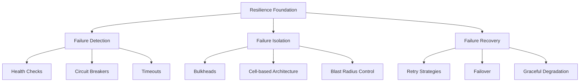
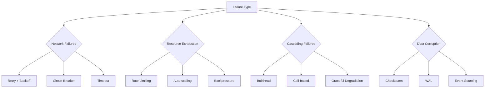
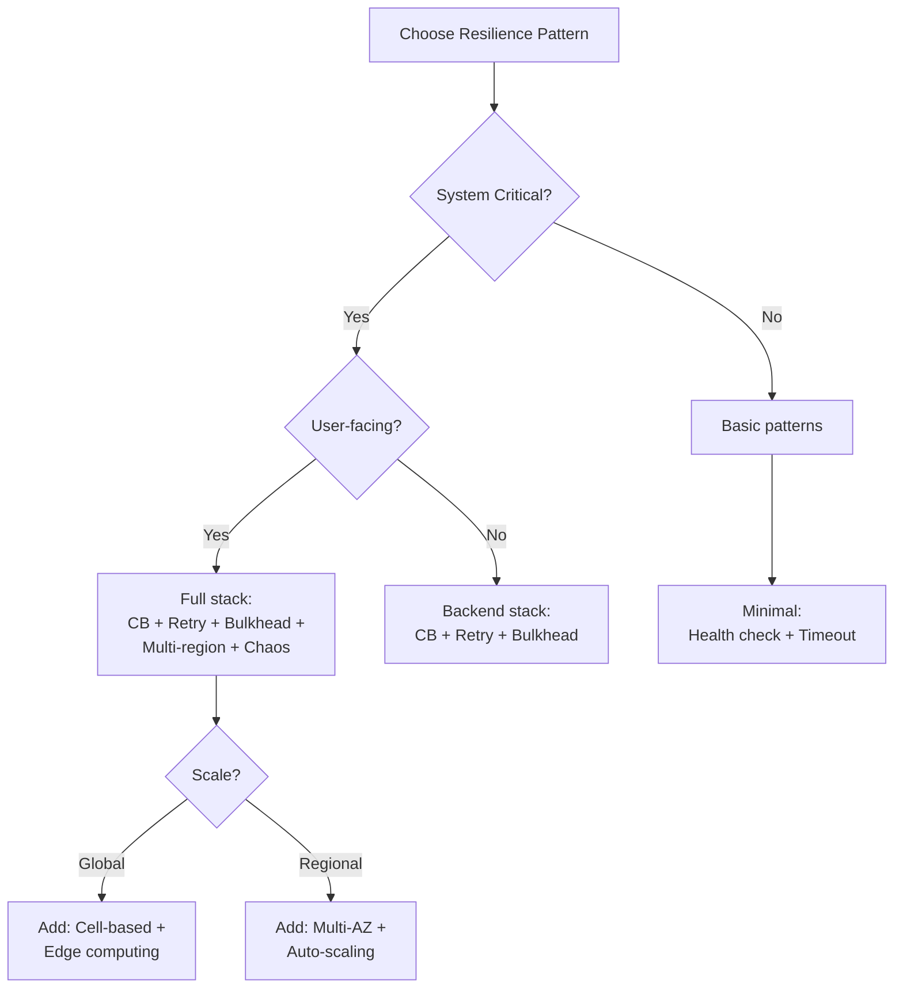

# Resilience-First Engineering: Building Systems That Survive

## The Resilience Pyramid



## Resilience Pattern Selection

### By System Scale

| Scale | Essential Patterns | Advanced Patterns |
|-------|-------------------|-------------------|
| **< 100K users** | Circuit Breaker, Timeouts, Health Checks | Bulkhead, Basic Retry |
| **100K-1M users** | + Rate Limiting, Auto-scaling | + Backpressure, Queue Management |
| **1M-10M users** | + Multi-region Failover, CDC | + Chaos Engineering, Cell-based |
| **> 10M users** | + Edge Computing, Global LB | + Custom Protocols, Adaptive Systems |

### By Failure Type



## Core Resilience Patterns

### 1. Circuit Breaker Implementation

**Gold Standard Pattern**
```python
class CircuitBreaker:
    def __init__(self, failure_threshold=5, recovery_timeout=60, expected_exception=Exception):
        self.failure_threshold = failure_threshold
        self.recovery_timeout = recovery_timeout
        self.expected_exception = expected_exception
        self.failure_count = 0
        self.last_failure_time = None
        self.state = 'CLOSED'
        
    def call(self, func, *args, **kwargs):
        if self.state == 'OPEN':
            if time.time() - self.last_failure_time > self.recovery_timeout:
                self.state = 'HALF_OPEN'
            else:
                raise CircuitOpenError()
        
        try:
            result = func(*args, **kwargs)
            if self.state == 'HALF_OPEN':
                self.state = 'CLOSED'
                self.failure_count = 0
            return result
        except self.expected_exception as e:
            self._record_failure()
            raise e
    
    def _record_failure(self):
        self.failure_count += 1
        self.last_failure_time = time.time()
        if self.failure_count >= self.failure_threshold:
            self.state = 'OPEN'
```

### 2. Bulkhead Pattern

**Resource Isolation Strategy**
```yaml
# Kubernetes Resource Isolation
apiVersion: v1
kind: ResourceQuota
metadata:
  name: service-bulkhead
spec:
  hard:
    requests.cpu: "10"
    requests.memory: 20Gi
    persistentvolumeclaims: "4"
---
apiVersion: v1
kind: LimitRange
metadata:
  name: pod-limits
spec:
  limits:
  - max:
      cpu: "2"
      memory: "4Gi"
    type: Pod
```

### 3. Timeout Cascade Prevention

```python
# Timeout budget allocation
class TimeoutBudget:
    def __init__(self, total_timeout=3000):  # 3 seconds total
        self.total = total_timeout
        self.allocations = {
            'database': 0.4,      # 40% = 1200ms
            'cache': 0.1,         # 10% = 300ms
            'external_api': 0.3,  # 30% = 900ms
            'processing': 0.2     # 20% = 600ms
        }
    
    def get_timeout(self, operation):
        return int(self.total * self.allocations.get(operation, 0.1))
    
    def with_timeout(self, operation):
        def decorator(func):
            @functools.wraps(func)
            async def wrapper(*args, **kwargs):
                timeout = self.get_timeout(operation)
                return await asyncio.wait_for(
                    func(*args, **kwargs),
                    timeout=timeout/1000  # Convert to seconds
                )
            return wrapper
        return decorator
```

## Real-World Resilience Stacks

### Netflix's Approach
```yaml
resilience_stack:
  edge:
    - pattern: Edge Computing (Gold)
    - tool: Open Connect CDN
    - benefit: Absorbs 90% of traffic
  
  api:
    - pattern: API Gateway (Gold)
    - tool: Zuul
    - features: [circuit-breaking, retry, routing]
  
  service:
    - pattern: Circuit Breaker (Gold)
    - tool: Hystrix
    - scale: 100B+ requests/day
  
  chaos:
    - pattern: Chaos Engineering (Gold)
    - tool: Simian Army
    - tests: [latency, failure, resource]
```

### AWS's Resilience Model
```yaml
availability_zones:
  - pattern: Cell-based Architecture (Gold)
  - isolation: Complete failure isolation
  - replication: Cross-AZ synchronous
  
regional_resilience:
  - pattern: Multi-region (Gold)
  - failover: Automated with Route 53
  - data_sync: Cross-region replication
  
service_resilience:
  - pattern: Auto-scaling (Silver)
  - metrics: [CPU, network, custom]
  - response_time: < 90 seconds
```

## Failure Scenario Planning

### Common Failure Modes

| Failure Type | Detection Pattern | Mitigation Pattern | Recovery Pattern |
|--------------|-------------------|-------------------|------------------|
| Network partition | Heartbeat timeout | Circuit breaker | Retry with backoff |
| Resource exhaustion | Metrics threshold | Rate limiting | Auto-scaling |
| Cascading failure | Error rate spike | Bulkhead isolation | Graceful degradation |
| Data corruption | Checksum mismatch | Write-ahead log | Event replay |
| Thundering herd | Request spike | Request coalescing | Jittered retry |

### Resilience Testing Checklist

```yaml
chaos_experiments:
  network:
    - [ ] Latency injection (100ms, 500ms, 1s)
    - [ ] Packet loss (1%, 5%, 10%)
    - [ ] Network partition
    - [ ] DNS failures
  
  resource:
    - [ ] CPU throttling
    - [ ] Memory pressure
    - [ ] Disk space exhaustion
    - [ ] Connection pool exhaustion
  
  application:
    - [ ] Service crashes
    - [ ] Slow responses
    - [ ] Error injection
    - [ ] Clock skew
```

## Pattern Combinations

### The Foundation Stack
```
Health Checks + Circuit Breaker + Timeout + Retry
```
- **When**: Every external call
- **Benefit**: 90% of failures handled
- **Complexity**: Low

### The Scale Stack
```
Foundation + Rate Limiting + Auto-scaling + Bulkhead
```
- **When**: > 100K users
- **Benefit**: Prevents resource exhaustion
- **Complexity**: Medium

### The Enterprise Stack
```
Scale Stack + Multi-region + Cell-based + Chaos Engineering
```
- **When**: > 1M users or critical systems
- **Benefit**: 99.99% availability
- **Complexity**: High

## Implementation Priority

### Week 1: Detection
1. Implement health checks on all services
2. Add structured logging with correlation IDs
3. Set up basic alerting thresholds
4. Create runbooks for common failures

### Month 1: Isolation
1. Add circuit breakers to external calls
2. Implement request timeouts with budgets
3. Set up bulkheads for critical resources
4. Add rate limiting to public endpoints

### Quarter 1: Recovery
1. Implement retry with exponential backoff
2. Set up multi-region failover
3. Add graceful degradation features
4. Deploy chaos engineering tests

## Metrics and SLOs

### Golden Signals for Resilience
```yaml
availability:
  slo: 99.95%
  measurement: successful_requests / total_requests
  window: 30 days

error_budget:
  calculation: 1 - slo
  monthly_minutes: 21.6
  alert_threshold: 50% consumed

recovery_time:
  p50: < 10 seconds
  p99: < 60 seconds
  measurement: time_to_recovery

blast_radius:
  target: < 5% of users affected
  measurement: affected_users / total_users
```

## Anti-Patterns to Avoid

| Anti-Pattern | Why It Fails | Use Instead |
|--------------|--------------|-------------|
| Infinite retry | Resource exhaustion | Exponential backoff with max attempts |
| Synchronous failover | Increases latency | Async with fallback |
| Global circuit breaker | Too coarse-grained | Per-dependency breakers |
| Static thresholds | Can't adapt to load | Dynamic/adaptive thresholds |

## Quick Decision Guide



## Next Steps

1. **Assess current resilience**: Run failure scenario analysis
2. **Implement foundation patterns**: Start with circuit breakers
3. **Add monitoring**: Track failure rates and recovery times
4. **Test with chaos**: Verify patterns work under stress
5. **Iterate based on incidents**: Learn from production failures

## Resources

- [Circuit Breaker Pattern](../../pattern-library/resilience/circuit-breaker/) (Gold)
- [Bulkhead Pattern](../../pattern-library/resilience/bulkhead/) (Gold)
- [Chaos Engineering](../architects-handbook/human-factors/chaos-engineering.md)
- [Cell-based Architecture](../../pattern-library/architecture/cell-based/) (Gold)