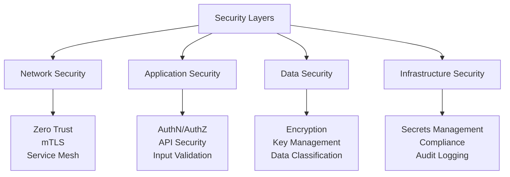

# Security Patterns Guide: Building Secure Distributed Systems

## Security-First Architecture



## Core Security Patterns

### 1. Zero Trust Architecture (Gold Pattern)

**Implementation Strategy**:
```yaml
zero_trust_principles:
  never_trust_always_verify:
    - Authenticate every request
    - Authorize every action
    - Encrypt every communication
    
  implementation:
    service_mesh:
      tool: Istio
      features:
        - mTLS between all services
        - RBAC policies
        - Request authentication
        
    identity_provider:
      tool: Keycloak
      protocols: [OIDC, SAML]
      
    policy_engine:
      tool: Open Policy Agent
      policies:
        - service_access
        - data_access
        - api_authorization
```

**mTLS Configuration**:
```yaml
apiVersion: security.istio.io/v1beta1
kind: PeerAuthentication
metadata:
  name: default
  namespace: production
spec:
  mtls:
    mode: STRICT
---
apiVersion: security.istio.io/v1beta1
kind: AuthorizationPolicy
metadata:
  name: service-access
spec:
  selector:
    matchLabels:
      app: payment-service
  rules:
  - from:
    - source:
        principals: ["cluster.local/ns/production/sa/order-service"]
    to:
    - operation:
        methods: ["POST"]
        paths: ["/api/v1/payments/*"]
```

### 2. Secrets Management (Gold Pattern)

**Vault Integration**:
```python
class SecretManager:
    def __init__(self, vault_url, role_id, secret_id):
        self.vault = hvac.Client(url=vault_url)
        self.vault.auth.approle.login(
            role_id=role_id,
            secret_id=secret_id
        )
        self.cache = TTLCache(maxsize=100, ttl=300)  # 5 min cache
        
    def get_secret(self, path, key=None):
        # Check cache first
        cache_key = f"{path}:{key}"
        if cache_key in self.cache:
            return self.cache[cache_key]
        
        # Fetch from Vault
        response = self.vault.secrets.kv.v2.read_secret_version(
            path=path
        )
        secret_data = response['data']['data']
        
        if key:
            value = secret_data.get(key)
            self.cache[cache_key] = value
            return value
        
        return secret_data
    
    def rotate_secret(self, path, new_value):
        # Update in Vault
        self.vault.secrets.kv.v2.create_or_update_secret(
            path=path,
            secret=new_value
        )
        
        # Invalidate cache
        self._invalidate_cache_for_path(path)
        
        # Trigger application reload
        self._notify_applications(path)
```

**Dynamic Secret Rotation**:
```yaml
rotation_policy:
  database_credentials:
    frequency: 30d
    strategy: dual_credentials
    steps:
      - create_new_credentials
      - update_applications
      - verify_new_credentials
      - revoke_old_credentials
      
  api_keys:
    frequency: 90d
    strategy: rolling
    overlap_period: 7d
    
  certificates:
    frequency: 365d
    warning_period: 30d
    auto_renewal: true
```

### 3. API Security (Silver Pattern)

**Rate Limiting with Redis**:
```python
class RateLimiter:
    def __init__(self, redis_client):
        self.redis = redis_client
        self.limits = {
            'anonymous': {'requests': 100, 'window': 3600},
            'authenticated': {'requests': 1000, 'window': 3600},
            'premium': {'requests': 10000, 'window': 3600}
        }
    
    async def check_rate_limit(self, user_id, user_type='authenticated'):
        limit_config = self.limits[user_type]
        key = f"rate_limit:{user_type}:{user_id}"
        
        try:
            current = await self.redis.incr(key)
            
            if current == 1:
                await self.redis.expire(key, limit_config['window'])
            
            if current > limit_config['requests']:
                return RateLimitResult(
                    allowed=False,
                    limit=limit_config['requests'],
                    remaining=0,
                    reset_at=await self.redis.ttl(key)
                )
            
            return RateLimitResult(
                allowed=True,
                limit=limit_config['requests'],
                remaining=limit_config['requests'] - current,
                reset_at=await self.redis.ttl(key)
            )
            
        except Exception as e:
            # Fail open - allow request if Redis is down
            logger.error(f"Rate limit check failed: {e}")
            return RateLimitResult(allowed=True)
```

**API Gateway Security**:
```yaml
api_gateway_config:
  authentication:
    providers:
      - jwt:
          issuer: https://auth.company.com
          jwks_uri: https://auth.company.com/.well-known/jwks.json
      - api_key:
          header: X-API-Key
          query_param: api_key
  
  authorization:
    engine: OPA
    policy_path: /v1/data/api/authz
    
  security_headers:
    X-Content-Type-Options: nosniff
    X-Frame-Options: DENY
    X-XSS-Protection: 1; mode=block
    Strict-Transport-Security: max-age=31536000; includeSubDomains
    
  request_validation:
    - schema_validation
    - sql_injection_detection
    - xss_prevention
    - size_limits
```

### 4. Data Encryption Patterns

**Encryption at Rest**:
```python
class DataEncryption:
    def __init__(self, kms_client):
        self.kms = kms_client
        self.data_key_cache = TTLCache(maxsize=100, ttl=3600)
        
    async def encrypt_data(self, plaintext, context=None):
        # Get or create data encryption key
        dek = await self._get_data_encryption_key(context)
        
        # Encrypt data using DEK
        cipher = Cipher(
            algorithms.AES(dek.plaintext_key),
            modes.GCM(os.urandom(12))
        )
        encryptor = cipher.encryptor()
        ciphertext = encryptor.update(plaintext) + encryptor.finalize()
        
        return {
            'ciphertext': base64.b64encode(ciphertext).decode(),
            'key_id': dek.key_id,
            'algorithm': 'AES-256-GCM',
            'tag': base64.b64encode(encryptor.tag).decode()
        }
    
    async def _get_data_encryption_key(self, context):
        cache_key = f"dek:{context}" if context else "dek:default"
        
        if cache_key in self.data_key_cache:
            return self.data_key_cache[cache_key]
        
        # Generate new DEK
        response = await self.kms.generate_data_key(
            KeyId='alias/application-key',
            KeySpec='AES_256',
            EncryptionContext=context or {}
        )
        
        dek = DataEncryptionKey(
            key_id=response['KeyId'],
            ciphertext_key=response['CiphertextBlob'],
            plaintext_key=response['Plaintext']
        )
        
        self.data_key_cache[cache_key] = dek
        return dek
```

**Field-Level Encryption**:
```python
@dataclass
class User:
    id: str
    email: str  # Encrypted
    name: str   # Encrypted
    created_at: datetime
    
    _encrypted_fields = ['email', 'name']
    
    def to_dict(self, encryption_service):
        data = asdict(self)
        
        for field in self._encrypted_fields:
            if field in data and data[field]:
                data[field] = encryption_service.encrypt_field(
                    data[field],
                    context={'user_id': self.id, 'field': field}
                )
        
        return data
    
    @classmethod
    def from_dict(cls, data, encryption_service):
        for field in cls._encrypted_fields:
            if field in data and data[field]:
                data[field] = encryption_service.decrypt_field(
                    data[field],
                    context={'user_id': data['id'], 'field': field}
                )
        
        return cls(**data)
```

## Security Patterns by Layer

### Network Security

```yaml
patterns:
  service_mesh_security:
    - pattern: mTLS everywhere
    - tools: [Istio, Linkerd]
    - enforcement: STRICT mode
    
  network_policies:
    - pattern: Zero trust networking
    - tools: [Calico, Cilium]
    - default: Deny all
    
  waf:
    - pattern: Web Application Firewall
    - tools: [ModSecurity, AWS WAF]
    - rules: OWASP Core Rule Set
```

### Application Security

```python
class SecurityMiddleware:
    def __init__(self, app):
        self.app = app
        self.csrf_protection = CSRFProtection()
        self.input_validator = InputValidator()
        self.auth_handler = AuthHandler()
        
    async def __call__(self, request, call_next):
        # CSRF Protection
        if request.method in ['POST', 'PUT', 'DELETE']:
            if not await self.csrf_protection.validate(request):
                return JSONResponse(
                    status_code=403,
                    content={"error": "CSRF validation failed"}
                )
        
        # Input Validation
        validation_result = await self.input_validator.validate(request)
        if not validation_result.is_valid:
            return JSONResponse(
                status_code=400,
                content={"errors": validation_result.errors}
            )
        
        # Authentication
        auth_result = await self.auth_handler.authenticate(request)
        if not auth_result.authenticated:
            return JSONResponse(
                status_code=401,
                content={"error": "Authentication required"}
            )
        
        # Add security headers
        response = await call_next(request)
        response.headers.update(self._security_headers())
        
        return response
```

### Infrastructure Security

```yaml
infrastructure_security:
  compliance_scanning:
    - pattern: Policy as Code
    - tools: [OPA, Sentinel]
    - policies:
      - no_public_s3_buckets
      - encrypted_volumes_only
      - approved_ami_only
      
  vulnerability_scanning:
    - pattern: Container Scanning
    - tools: [Trivy, Clair]
    - enforcement: Block critical CVEs
    
  audit_logging:
    - pattern: Immutable Audit Trail
    - implementation:
      - Ship logs to SIEM
      - Tamper-proof storage
      - Real-time analysis
```

## Security Decision Matrix

| Requirement | Pattern | Implementation | Complexity |
|-------------|---------|----------------|------------|
| **Service-to-service auth** | mTLS | Service Mesh | Medium |
| **User authentication** | OIDC/OAuth2 | Keycloak/Auth0 | Low |
| **API security** | API Gateway | Kong/Apigee | Medium |
| **Secrets management** | Dynamic secrets | Vault | High |
| **Data encryption** | Envelope encryption | KMS + AES | Medium |
| **Audit compliance** | Immutable logs | ELK + WORM | High |

## Implementation Checklist

### Week 1: Foundation
- [ ] Enable mTLS in service mesh
- [ ] Deploy secrets management
- [ ] Configure RBAC policies
- [ ] Set up audit logging

### Month 1: Core Security
- [ ] Implement authentication/authorization
- [ ] Enable encryption at rest
- [ ] Deploy WAF rules
- [ ] Configure security scanning

### Quarter 1: Advanced Security
- [ ] Zero trust architecture
- [ ] Runtime security monitoring
- [ ] Compliance automation
- [ ] Security chaos engineering

## Common Security Anti-Patterns

| Anti-Pattern | Risk | Correct Pattern |
|--------------|------|-----------------|
| Hardcoded secrets | Credential exposure | Secrets management |
| Trust internal network | Lateral movement | Zero trust |
| No rate limiting | DDoS vulnerability | Adaptive rate limiting |
| Plaintext storage | Data breach | Encryption at rest |
| No audit trail | Compliance failure | Immutable logging |

## Real-World Examples

### Netflix Security
- **Pattern**: Zero trust with Lemur
- **Scale**: 100M+ users
- **Key**: Automated certificate management

### Google BeyondCorp
- **Pattern**: Zero trust architecture
- **Innovation**: No VPN required
- **Access**: Context-aware proxy

### AWS Security
- **Pattern**: Defense in depth
- **Services**: IAM, KMS, GuardDuty
- **Compliance**: SOC2, PCI, HIPAA

## Security Monitoring

```python
class SecurityMonitor:
    def __init__(self):
        self.anomaly_detector = AnomalyDetector()
        self.threat_intel = ThreatIntelligence()
        
    async def analyze_request(self, request):
        signals = []
        
        # Check for anomalies
        if await self.anomaly_detector.is_anomalous(request):
            signals.append(SecuritySignal(
                type='anomaly',
                severity='medium',
                details='Unusual request pattern detected'
            ))
        
        # Check threat intelligence
        if await self.threat_intel.is_malicious_ip(request.client_ip):
            signals.append(SecuritySignal(
                type='threat',
                severity='high',
                details='Known malicious IP'
            ))
        
        # Check for common attacks
        if self._detect_sql_injection(request):
            signals.append(SecuritySignal(
                type='attack',
                severity='critical',
                details='SQL injection attempt'
            ))
        
        return SecurityAnalysis(signals=signals)
```

## Next Steps

1. **Security assessment**: Identify current vulnerabilities
2. **Implement basics**: Start with mTLS and secrets management
3. **Build defense in depth**: Layer security controls
4. **Automate compliance**: Policy as code
5. **Continuous improvement**: Security chaos engineering

## Resources

- [Zero Trust Architecture](../pattern-library/zero-trust.md)
- [API Gateway Pattern](../../../pattern-library/communication/api-gateway/) (Gold)
- [Service Mesh Pattern](../../../pattern-library/communication/service-mesh/) (Gold)
- [Valet Key Pattern](../../../pattern-library/architecture/valet-key/)
- [Security Best Practices](../../reference/security.md)