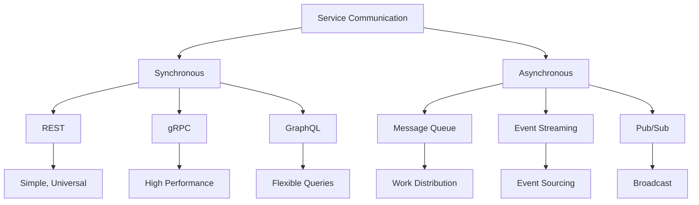
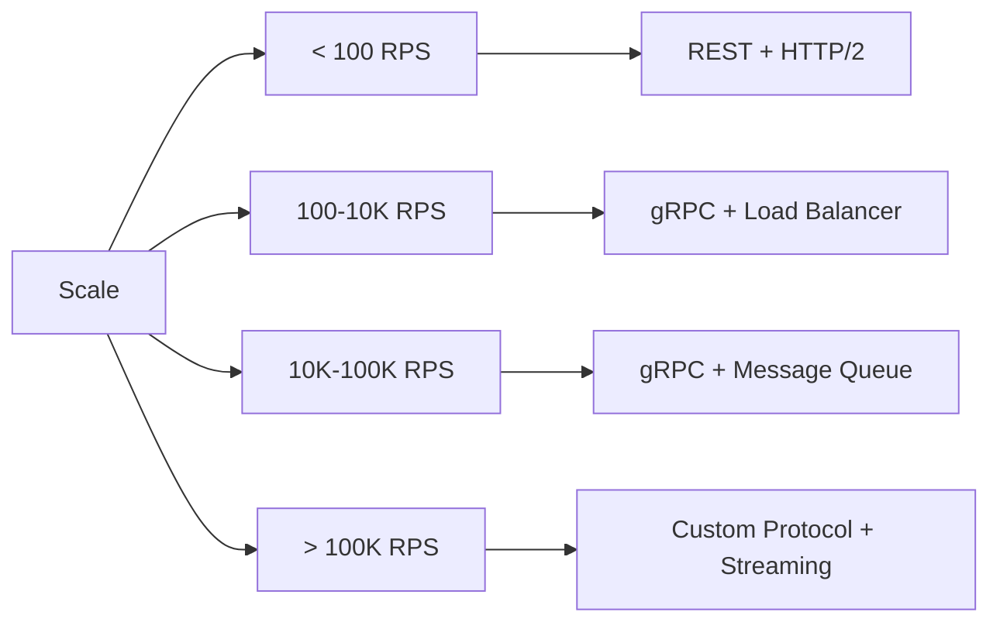
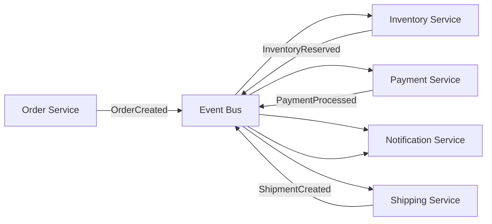
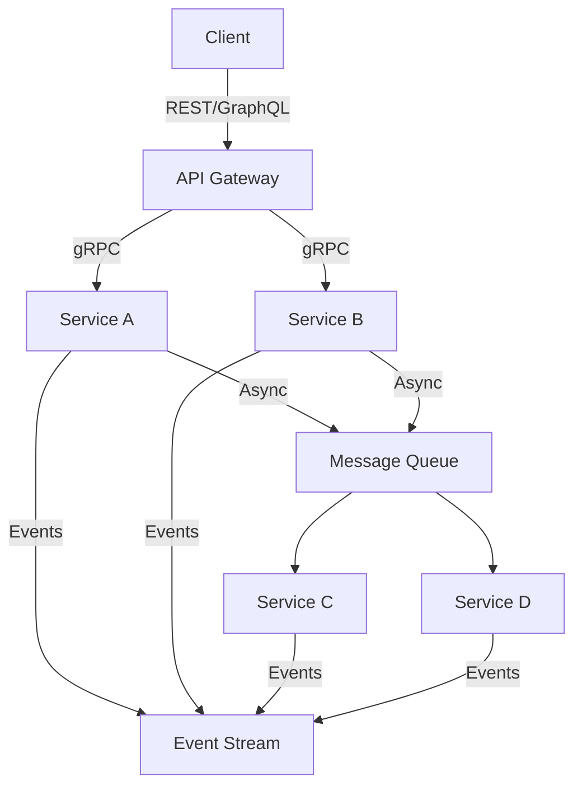
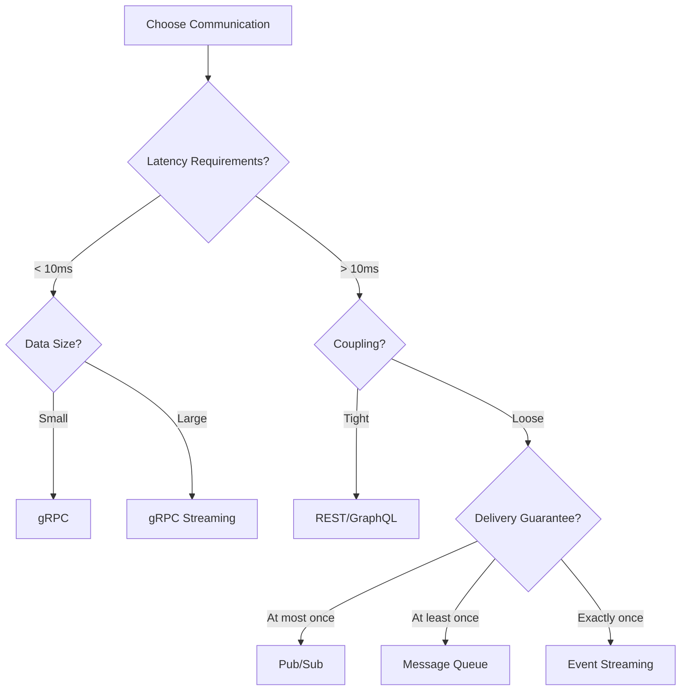

# Service Communication Guide: Patterns for Scale

## Communication Pattern Hierarchy



## Pattern Selection Matrix

### By Requirements

| Requirement | Sync Pattern | Async Pattern | Hybrid Approach |
|-------------|--------------|---------------|-----------------|
| **Low Latency (<10ms)** | gRPC | In-memory queue | gRPC + Redis |
| **High Throughput** | gRPC streaming | Kafka | gRPC + Kafka |
| **Complex Queries** | GraphQL | Event sourcing | GraphQL + CDC |
| **Loose Coupling** | REST | Message queue | REST + Events |
| **Real-time Updates** | WebSocket | Event streaming | WebSocket + SSE |

### By Scale



## Core Communication Patterns

### 1. Service Mesh (Gold Pattern)

**Architecture**:
```yaml
service_mesh:
  data_plane:
    proxy: Envoy
    features:
      - circuit_breaking
      - retry_logic
      - load_balancing
      - tls_termination
      - observability
  
  control_plane:
    tool: Istio
    components:
      - pilot: Service discovery
      - citadel: Certificate management
      - galley: Configuration
      - mixer: Policy enforcement
```

**Implementation**:
```yaml
apiVersion: networking.istio.io/v1beta1
kind: VirtualService
metadata:
  name: order-service
spec:
  hosts:
  - order-service
  http:
  - retries:
      attempts: 3
      perTryTimeout: 2s
      retryOn: 5xx
    timeout: 10s
    route:
    - destination:
        host: order-service
        subset: v2
      weight: 20  # Canary deployment
    - destination:
        host: order-service
        subset: v1
      weight: 80
```

### 2. API Gateway (Gold Pattern)

**Gateway Features**:
```python
class APIGateway:
    def __init__(self):
        self.routes = {}
        self.middleware = []
        self.circuit_breakers = {}
        
    def add_middleware(self, middleware):
        self.middleware.append(middleware)
    
    async def handle_request(self, request):
        # Rate limiting
        if not await self.rate_limiter.check(request):
            return Response(429, "Rate limit exceeded")
        
        # Authentication
        user = await self.authenticate(request)
        if not user:
            return Response(401, "Unauthorized")
        
        # Circuit breaker
        service = self.get_service(request.path)
        breaker = self.circuit_breakers[service]
        
        try:
            # Route to service
            response = await breaker.call(
                self.forward_request,
                request,
                service
            )
            
            # Transform response
            return self.transform_response(response)
            
        except CircuitOpenError:
            # Fallback response
            return self.fallback_response(service)
```

### 3. Event-Driven Architecture (Gold Pattern)

**Event Flow**:


**Implementation**:
```python
class EventDrivenService:
    def __init__(self, service_name, event_bus):
        self.service_name = service_name
        self.event_bus = event_bus
        self.handlers = {}
        
    def handle(self, event_type):
        def decorator(func):
            self.handlers[event_type] = func
            return func
        return decorator
    
    async def emit(self, event_type, data):
        event = {
            'id': str(uuid.uuid4()),
            'type': event_type,
            'source': self.service_name,
            'timestamp': datetime.utcnow().isoformat(),
            'data': data
        }
        await self.event_bus.publish(event)
    
    async def start(self):
        async for event in self.event_bus.subscribe(self.service_name):
            handler = self.handlers.get(event['type'])
            if handler:
                try:
                    await handler(event['data'])
                except Exception as e:
                    await self.handle_error(event, e)
```

### 4. gRPC for High Performance (Silver Pattern)

**Protocol Buffer Definition**:
```protobuf
syntax = "proto3";

service OrderService {
  rpc CreateOrder(CreateOrderRequest) returns (Order);
  rpc GetOrder(GetOrderRequest) returns (Order);
  rpc ListOrders(ListOrdersRequest) returns (stream Order);
  rpc WatchOrders(WatchOrdersRequest) returns (stream OrderEvent);
}

message Order {
  string id = 1;
  string customer_id = 2;
  repeated OrderItem items = 3;
  OrderStatus status = 4;
  google.protobuf.Timestamp created_at = 5;
}

enum OrderStatus {
  PENDING = 0;
  PROCESSING = 1;
  SHIPPED = 2;
  DELIVERED = 3;
  CANCELLED = 4;
}
```

**Client Implementation**:
```python
class OrderServiceClient:
    def __init__(self, channel):
        self.stub = OrderServiceStub(channel)
        self.timeout = 5.0
        
    async def create_order(self, items, metadata=None):
        request = CreateOrderRequest(items=items)
        
        # Add retry interceptor
        return await self.stub.CreateOrder(
            request,
            timeout=self.timeout,
            metadata=metadata or []
        )
    
    async def watch_orders(self, customer_id):
        request = WatchOrdersRequest(customer_id=customer_id)
        
        # Streaming response
        async for event in self.stub.WatchOrders(request):
            yield event
```

## Communication Patterns by Use Case

### Real-Time Systems

```yaml
patterns:
  frontend_to_backend:
    - WebSocket: Bi-directional communication
    - Server-Sent Events: Server push only
    - Long polling: Fallback option
  
  backend_to_backend:
    - gRPC streaming: Low latency
    - Redis Pub/Sub: Simple broadcast
    - Kafka: Durable streaming
  
  edge_to_cloud:
    - MQTT: IoT optimized
    - WebRTC: P2P communication
    - Custom UDP: Ultra-low latency
```

### Microservices Architecture



## Advanced Patterns

### Circuit Breaker with Fallback

```python
class SmartCircuitBreaker:
    def __init__(self, failure_threshold=5, timeout=60):
        self.failure_threshold = failure_threshold
        self.timeout = timeout
        self.failures = 0
        self.last_failure = None
        self.state = 'CLOSED'
        self.fallback_cache = TTLCache(maxsize=1000, ttl=300)
        
    async def call_with_fallback(self, func, fallback_func, *args, **kwargs):
        cache_key = self._make_cache_key(func.__name__, args, kwargs)
        
        if self.state == 'OPEN':
            if time.time() - self.last_failure > self.timeout:
                self.state = 'HALF_OPEN'
            else:
                # Use fallback
                return await self._get_fallback(
                    cache_key, fallback_func, *args, **kwargs
                )
        
        try:
            result = await func(*args, **kwargs)
            
            # Cache successful result
            self.fallback_cache[cache_key] = result
            
            if self.state == 'HALF_OPEN':
                self.state = 'CLOSED'
                self.failures = 0
                
            return result
            
        except Exception as e:
            self.failures += 1
            self.last_failure = time.time()
            
            if self.failures >= self.failure_threshold:
                self.state = 'OPEN'
                
            return await self._get_fallback(
                cache_key, fallback_func, *args, **kwargs
            )
```

### Service Discovery Patterns

```yaml
discovery_patterns:
  client_side:
    pattern: Client-side discovery
    tools: [Consul, Eureka]
    pros: [Less network hops, Client control]
    cons: [Complex clients, Language-specific]
    
  server_side:
    pattern: Server-side discovery
    tools: [AWS ELB, Kubernetes Service]
    pros: [Simple clients, Platform agnostic]
    cons: [Additional hop, Less control]
    
  service_mesh:
    pattern: Sidecar proxy
    tools: [Istio, Linkerd]
    pros: [Transparent, Feature-rich]
    cons: [Resource overhead, Complexity]
```

## Performance Optimization

### Connection Pooling

```python
class ConnectionPool:
    def __init__(self, factory, max_size=100, min_size=10):
        self.factory = factory
        self.max_size = max_size
        self.min_size = min_size
        self.pool = asyncio.Queue(max_size)
        self.size = 0
        
    async def acquire(self):
        try:
            # Try to get from pool
            return await asyncio.wait_for(
                self.pool.get(), timeout=0.1
            )
        except asyncio.TimeoutError:
            # Create new if under limit
            if self.size < self.max_size:
                conn = await self.factory()
                self.size += 1
                return conn
            else:
                # Wait for available connection
                return await self.pool.get()
    
    async def release(self, conn):
        if conn.is_healthy():
            await self.pool.put(conn)
        else:
            await conn.close()
            self.size -= 1
```

### Request Batching

```python
class RequestBatcher:
    def __init__(self, batch_size=100, timeout_ms=50):
        self.batch_size = batch_size
        self.timeout_ms = timeout_ms
        self.pending = []
        self.timer = None
        
    async def add_request(self, request):
        future = asyncio.Future()
        self.pending.append((request, future))
        
        if len(self.pending) >= self.batch_size:
            await self._flush()
        elif not self.timer:
            self.timer = asyncio.create_task(self._timeout_flush())
            
        return await future
    
    async def _flush(self):
        if not self.pending:
            return
            
        batch = self.pending[:self.batch_size]
        self.pending = self.pending[self.batch_size:]
        
        # Send batch request
        results = await self._send_batch([r for r, _ in batch])
        
        # Resolve futures
        for (_, future), result in zip(batch, results):
            future.set_result(result)
```

## Anti-Patterns to Avoid

| Anti-Pattern | Problem | Solution |
|--------------|---------|----------|
| Chatty interfaces | Network overhead | Batch requests, GraphQL |
| Synchronous chains | Cascading failures | Async messaging |
| No timeout | Thread exhaustion | Always set timeouts |
| No circuit breaker | Cascading failures | Implement breakers |
| Hardcoded endpoints | No flexibility | Service discovery |

## Decision Flow



## Implementation Checklist

### Week 1: Foundation
- [ ] Define service boundaries
- [ ] Choose primary communication pattern
- [ ] Set up service discovery
- [ ] Implement health checks

### Month 1: Resilience
- [ ] Add circuit breakers
- [ ] Implement retries with backoff
- [ ] Set up timeout budgets
- [ ] Add request tracing

### Quarter 1: Scale
- [ ] Deploy service mesh
- [ ] Implement caching layer
- [ ] Add request batching
- [ ] Set up performance monitoring

## Real-World Examples

### Netflix
- **Pattern**: gRPC for internal services
- **Scale**: 1M+ RPS
- **Resilience**: Hystrix circuit breakers

### Uber
- **Pattern**: Service mesh (custom)
- **Scale**: 3000+ microservices
- **Protocol**: TChannel (custom RPC)

### Twitter
- **Pattern**: Finagle RPC framework
- **Features**: Built-in circuit breaking
- **Scale**: Billions of requests/day

## Next Steps

1. **Audit current communication**: Map service dependencies
2. **Identify bottlenecks**: Measure latency and throughput
3. **Choose patterns**: Use decision matrix
4. **Implement gradually**: Start with critical paths
5. **Monitor and optimize**: Track performance metrics

## Resources

- [Service Mesh Pattern](../pattern-library/communication/service-mesh.md) (Gold)
- [API Gateway Pattern](../pattern-library/communication/api-gateway.md) (Gold)
- [Event-Driven Pattern](../pattern-library/architecture/event-driven.md) (Gold)
- [gRPC Best Practices](../pattern-library/grpc.md)
- [WebSocket Pattern](../pattern-library/communication/websocket.md) (Silver)