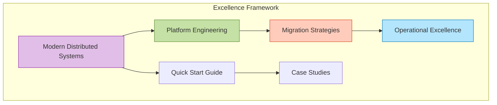
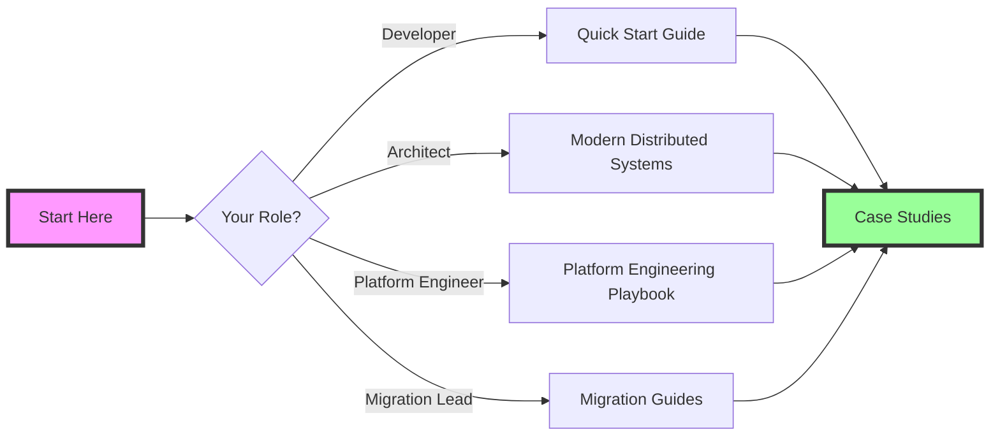

# Excellence Framework

The Excellence Framework is your comprehensive guide to building and operating world-class distributed systems. It combines battle-tested patterns, migration strategies, and operational excellence practices from industry leaders.

## 🎯 Quick Navigation

-   **📚 Guides**

    ---
    
    Essential guides for modern distributed systems
    
    [:octicons-arrow-right-24: Browse Guides](guides/)

-   **🔄 Migrations**

    ---
    
    Step-by-step migration playbooks
    
    [:octicons-arrow-right-24: Migration Guides](migrations/)

-   **📊 Case Studies**

    ---
    
    Real-world excellence implementations
    
    [:octicons-arrow-right-24: Case Studies](case-studies/)

-   **🚀 Quick Start**

    ---
    
    Get started in under 30 minutes
    
    [:octicons-arrow-right-24: Quick Start Guide](guides/quick-start-guide.md)

## 🎯 Framework Overview

## 📖 Essential Guides

### [Modern Distributed Systems 2025](guides/modern-distributed-systems-2025.md)
The definitive guide to building distributed systems with 2025's best practices, covering:
- Cloud-native architectures
- Service mesh patterns
- Event-driven systems
- Observability strategies

### [Platform Engineering Playbook](guides/platform-engineering-playbook.md)
Build and scale engineering platforms that developers love:
- Internal developer platforms
- Golden paths
- Self-service infrastructure
- Developer experience metrics

### [Quick Start Guide](guides/quick-start-guide.md)
Go from zero to production-ready in under 30 minutes:
- Essential patterns
- Implementation templates
- Testing strategies
- Deployment workflows

## 🔄 Migration Playbooks

### System Transformations
- [Two-Phase Commit to Saga](migrations/2pc-to-saga.md) - Modernize transaction handling
- [Polling to WebSocket](migrations/polling-to-websocket.md) - Real-time communication upgrade
- [Monolith to Microservices](migrations/monolith-to-microservices.md) - Decomposition strategies
- [Batch to Streaming](migrations/batch-to-streaming.md) - Real-time data processing

## 📊 Excellence Metrics

-   **⚡ Performance**
    
    - P99 < 100ms
    - 99.99% availability
    - Linear scalability

-   **💰 Cost Efficiency**
    
    - 40% cost reduction
    - Automated optimization
    - Resource utilization > 70%

-   **🛡️ Reliability**
    
    - Zero-downtime deployments
    - Automated failover
    - Self-healing systems

-   **👥 Developer Experience**
    
    - < 5 min to deploy
    - Self-service everything
    - Instant feedback loops

## 🎯 Learning Paths

## 🚀 Getting Started

1. **New to distributed systems?**
   - Start with the [Quick Start Guide](guides/quick-start-guide.md)
   - Review fundamental [Axioms](../part1-axioms/) and [Pillars](../part2-pillars/)

2. **Building a new system?**
   - Follow [Modern Distributed Systems 2025](guides/modern-distributed-systems-2025.md)
   - Apply patterns from our [Pattern Catalog](../patterns/)

3. **Migrating existing systems?**
   - Choose your [Migration Guide](migrations/)
   - Learn from [Case Studies](case-studies/)

4. **Scaling your platform?**
   - Implement the [Platform Engineering Playbook](guides/platform-engineering-playbook.md)
   - Adopt [Human Factors](../human-factors/) best practices

## 🎓 Key Principles

### 1. **Start Simple, Scale Smart**
Begin with the minimum viable architecture and evolve based on actual needs.

### 2. **Measure Everything**
You can't improve what you don't measure. Instrument early and often.

### 3. **Automate Ruthlessly**
If you do it twice, automate it. If it can fail, make it self-healing.

### 4. **Design for Failure**
Systems will fail. Design for graceful degradation and fast recovery.

### 5. **Developer Experience First**
Happy developers build better systems. Optimize for developer productivity.

## 📚 Related Resources

- [Axioms - Fundamental Laws](../part1-axioms/)
- [Pillars - Core Concepts](../part2-pillars/)
- [Patterns - Implementation Guide](../patterns/)
- [Quantitative Analysis](../quantitative/)
- [Human Factors](../human-factors/)

---

!!! tip "Pro Tip"
    Start with the Quick Start Guide to get hands-on experience, then dive deeper into specific topics based on your needs.

!!! success "Excellence Awaits"
    Join thousands of engineers building world-class distributed systems. Your journey to excellence starts here!