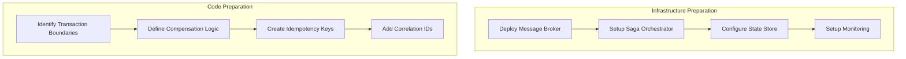

# Two-Phase Commit to Saga Migration Guide

## Overview

Migrating from Two-Phase Commit (2PC) to Saga pattern transforms your distributed transactions from synchronous, blocking operations to asynchronous, eventually consistent workflows. This guide provides a battle-tested approach based on real production migrations.

## Pre-Migration Assessment Checklist

### System Readiness Assessment

```yaml
readiness_criteria:
  business:
    - [ ] Strong consistency not required for all operations
    - [ ] Business can tolerate eventual consistency (seconds to minutes)
    - [ ] Compensating actions are well-defined
    - [ ] Audit trail requirements documented
  
  technical:
    - [ ] Message broker infrastructure available (Kafka/RabbitMQ)
    - [ ] Idempotent service operations implemented
    - [ ] Distributed tracing in place
    - [ ] State storage for saga orchestrator decided
  
  team:
    - [ ] Team trained on eventual consistency patterns
    - [ ] Operational runbooks for saga failures prepared
    - [ ] Monitoring and alerting strategy defined
```

### Migration Complexity Estimator

| Factor | Low Complexity (1pt) | Medium (3pts) | High (5pts) |
|--------|---------------------|----------------|--------------|
| Transaction Steps | 2-3 services | 4-6 services | 7+ services |
| Data Volume | <1K txn/day | 1K-100K txn/day | >100K txn/day |
| Consistency Requirements | Eventually consistent OK | Mixed requirements | Strong consistency critical |
| Rollback Complexity | Simple state reversion | Some business logic | Complex compensations |
| Team Experience | Experienced with sagas | Some distributed systems exp | New to distributed patterns |

**Score Interpretation:**
- 5-10 points: 2-3 month migration
- 11-20 points: 3-6 month migration
- 21-25 points: 6-12 month migration with phased approach

## Week-by-Week Migration Plan

### Week 1-2: Foundation Setup



**Deliverables:**
- Message broker cluster deployed
- Saga orchestrator framework selected and deployed
- Service instrumentation completed

### Week 3-4: Parallel Infrastructure

```yaml
parallel_running_strategy:
  phase_1_shadow_mode:
    - 2PC remains primary transaction path
    - Saga runs in parallel, results logged but not used
    - Compare outcomes for consistency
    - Measure performance differences
  
  phase_2_canary:
    - 5% traffic routed to saga path
    - Monitor error rates and latencies
    - Gradual increase: 5% → 10% → 25% → 50%
    - Automated rollback on anomalies
  
  phase_3_primary:
    - Saga becomes primary path
    - 2PC kept as fallback for 2 weeks
    - Remove 2PC after stability confirmed
```

### Week 5-6: Service Migration

```python
## Example: Order Service Migration
class OrderSagaOrchestrator:
    def __init__(self):
        self.state_store = SagaStateStore()
        self.message_bus = MessageBus()
    
    async def create_order_saga(self, order_request):
        saga_id = generate_saga_id()
        
        # Define saga steps
        steps = [
            SagaStep("validate_inventory", compensate="release_inventory"),
            SagaStep("reserve_payment", compensate="refund_payment"),
            SagaStep("create_shipment", compensate="cancel_shipment"),
            SagaStep("send_confirmation", compensate="send_cancellation")
        ]
        
        # Execute saga
        try:
            for step in steps:
                await self.execute_step(saga_id, step, order_request)
        except SagaStepFailure as e:
            await self.compensate(saga_id, e.failed_step)
            raise
```

### Week 7-8: Testing and Validation

**Test Scenarios:**
1. **Happy Path Testing**
   - All services respond successfully
   - Measure end-to-end latency
   - Verify data consistency

2. **Failure Testing**
   ```bash
   # Chaos testing script
   kubectl exec -it saga-orchestrator -- chaos-test \
     --failure-rate=0.1 \
     --service=payment \
     --duration=1h
   ```

3. **Performance Testing**
   - Load test at 2x expected volume
   - Measure saga completion times
   - Monitor resource utilization

## Common Pitfalls and Solutions

### Pitfall 1: Incomplete Compensation Logic

**Problem:** Compensation doesn't fully reverse the original action

**Solution:**
```python
class CompensationValidator:
    def validate_compensation(self, action, compensation):
        # Record state before action
        state_before = self.capture_state()
        
        # Execute action
        action_result = action.execute()
        
        # Execute compensation
        compensation.execute(action_result)
        
        # Verify state restored
        state_after = self.capture_state()
        assert state_before == state_after
```

### Pitfall 2: Saga State Corruption

**Problem:** Orchestrator crashes mid-saga, state inconsistent

**Solution:**
```yaml
saga_recovery_strategy:
  checkpoint_frequency: after_each_step
  recovery_mechanism:
    - Scan incomplete sagas on startup
    - Replay from last checkpoint
    - Apply exponential backoff for retries
  monitoring:
    - Alert on sagas older than SLA
    - Dashboard for saga state distribution
```

### Pitfall 3: Timeout Management

**Problem:** Services take too long, causing cascading timeouts

**Solution:**
```python
class AdaptiveTimeoutManager:
    def calculate_timeout(self, service, operation):
        # Use P99 latency from last hour
        p99_latency = self.metrics.get_p99_latency(service, operation)
        
        # Add buffer based on criticality
        buffer = 1.5 if operation.is_critical else 1.2
        
        return min(p99_latency * buffer, MAX_TIMEOUT)
```

## Real Company Migration Stories

### Case Study 1: E-Commerce Platform (100M+ transactions/day)

**Timeline:** 6 months
**Team Size:** 8 engineers

**Approach:**
1. Started with low-risk operations (wishlist updates)
2. Progressively moved to cart operations
3. Finally migrated checkout flow
4. Kept 2PC for financial reconciliation

**Results:**
- 60% reduction in transaction failures
- 40% improvement in checkout completion time
- 90% reduction in database locks

### Case Study 2: Financial Services (Strong Consistency Requirements)

**Timeline:** 9 months
**Team Size:** 12 engineers

**Approach:**
1. Hybrid model: Saga for read-heavy operations
2. Kept 2PC for critical financial transactions
3. Built comprehensive audit trail system
4. Implemented real-time reconciliation

**Challenges:**
- Regulatory compliance required extensive documentation
- Needed custom compensation for partial payments
- Built fallback to 2PC for compliance scenarios

## Success Metrics

### Technical Metrics
```yaml
sla_targets:
  saga_completion_rate: 99.9%
  compensation_success_rate: 99.99%
  median_completion_time: <5s
  p99_completion_time: <30s
  
monitoring_queries:
  completion_rate: |
    SELECT 
      COUNT(*) FILTER (WHERE status = 'completed') * 100.0 / COUNT(*) as completion_rate
    FROM sagas
    WHERE created_at > NOW() - INTERVAL '1 hour'
  
  compensation_rate: |
    SELECT 
      COUNT(*) FILTER (WHERE status = 'compensated') * 100.0 / COUNT(*) as compensation_rate
    FROM sagas
    WHERE status IN ('compensated', 'failed')
```

### Business Metrics
- Order completion rate improvement
- Customer satisfaction scores
- Reduced support tickets for stuck transactions
- Infrastructure cost reduction

## Rollback Procedures

### Emergency Rollback Plan

```bash
#!/bin/bash
## emergency-rollback.sh

## 1. Stop new traffic to saga orchestrator
kubectl scale deployment saga-orchestrator --replicas=0

## 2. Redirect traffic to 2PC path
kubectl patch configmap app-config --patch '{"data":{"transaction.mode":"2pc"}}'

## 3. Process in-flight sagas
./drain-sagas.sh --timeout=5m

## 4. Monitor system stability
./monitor-rollback.sh --duration=30m
```

### Gradual Rollback
1. Reduce saga traffic percentage
2. Monitor for 24 hours
3. Investigate issues while on reduced load
4. Fix and re-deploy

## Migration Completion Checklist

- [ ] All transaction types migrated
- [ ] 2PC infrastructure decommissioned
- [ ] Monitoring dashboards updated
- [ ] Runbooks validated
- [ ] Team trained on operations
- [ ] Performance benchmarks met
- [ ] Cost savings realized
- [ ] Post-mortem completed

## Additional Resources

- Saga Pattern Deep Dive
- Distributed Transaction Patterns
- [Message Broker Selection Guide](../infrastructure/message-brokers.md)
- [Monitoring Distributed Systems](../architects-handbook/human-factors/observability.md)