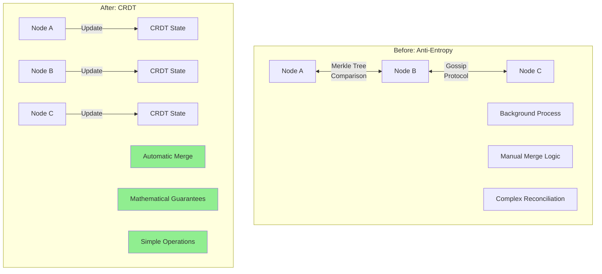
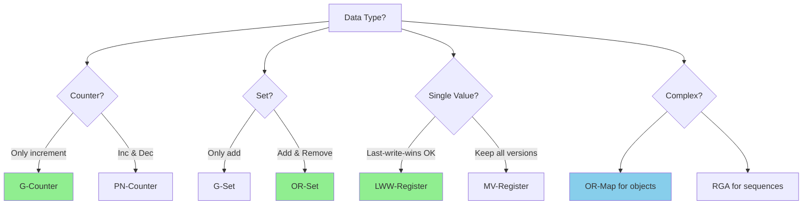
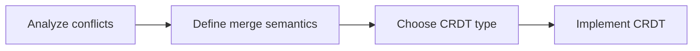
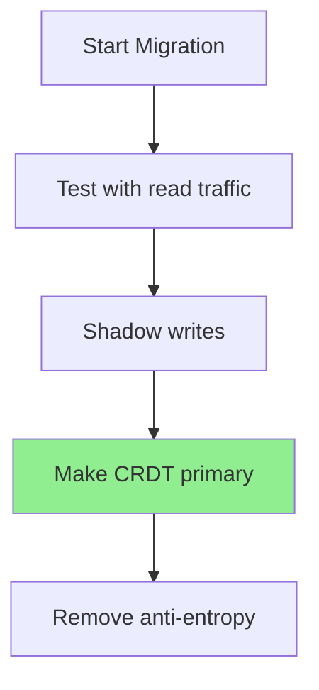
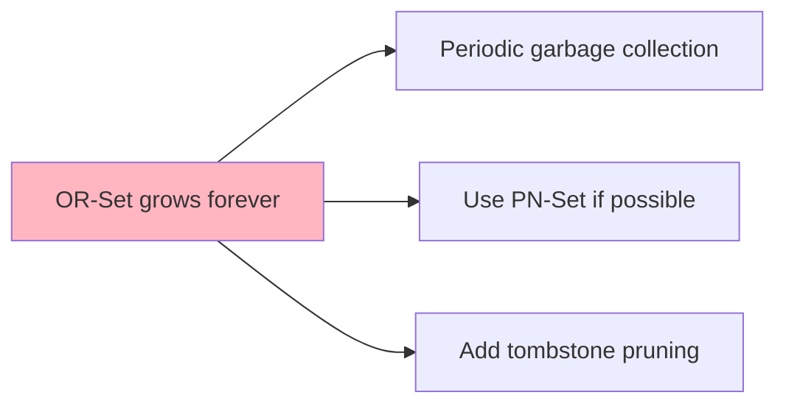
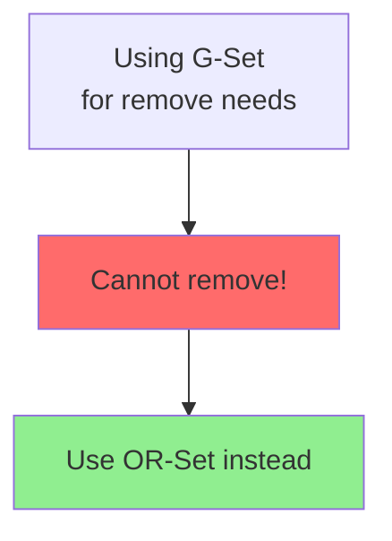

# Migrating from Anti-Entropy to CRDT

!!! success "Migration Benefits"
    - **Automatic conflict resolution**: No manual merge logic needed
    - **Guaranteed convergence**: Mathematical properties ensure consistency
    - **Reduced complexity**: Remove anti-entropy background processes
    - **Better performance**: Local operations without coordination
    - **Proven correctness**: Well-studied mathematical foundations

## When to Migrate

### ✅ Good Candidates
- Systems with well-defined merge semantics
- Applications with commutative operations
- Eventually consistent data stores
- Collaborative editing systems
- Distributed caches and counters

### ❌ Poor Candidates
- Systems requiring custom conflict resolution
- Applications with complex business logic merges
- Strongly consistent requirements
- Limited to specific data types that don't fit CRDT models

## Migration Overview



## CRDT Type Selection

### Data Type Mapping

| Anti-Entropy Use Case | Recommended CRDT | Example |
|----------------------|------------------|---------|
| **Counters** | G-Counter / PN-Counter | View counts, inventory |
| **Sets** | G-Set / OR-Set | Tags, user groups |
| **Maps** | OR-Map / LWW-Map | User profiles, configs |
| **Lists** | RGA / Causal Tree | Documents, logs |
| **Flags** | Enable-Wins Flag | Feature flags |
| **Registers** | LWW-Register / MV-Register | Single values |

### Decision Tree



## Implementation Migration

### Before: Anti-Entropy Counter

```python
class AntiEntropyCounter:
    def __init__(self, node_id: str):
        self.node_id = node_id
        self.value = 0
        self.version = 0
        self.peers = []
        
    def increment(self, amount: int = 1):
        self.value += amount
        self.version += 1
        
    def anti_entropy_round(self):
        """Background process to sync with peers"""
        for peer in self.peers:
            # Compare versions
            if peer.version > self.version:
                # Conflict! Need manual resolution
                self.resolve_conflict(peer)
            elif peer.version < self.version:
                # Push our value
                peer.value = self.value
                peer.version = self.version
    
    def resolve_conflict(self, peer):
        # Custom merge logic - error prone!
        if self.node_id < peer.node_id:
            self.value = max(self.value, peer.value)
        else:
            self.value = peer.value
        self.version = max(self.version, peer.version) + 1
```

### After: CRDT Counter

```python
class GCounter:
    """Grow-only counter CRDT"""
    def __init__(self, node_id: str):
        self.node_id = node_id
        self.counts = {node_id: 0}  # Each node tracks its own count
        
    def increment(self, amount: int = 1):
        self.counts[self.node_id] += amount
        
    def value(self) -> int:
        return sum(self.counts.values())
        
    def merge(self, other: 'GCounter'):
        """Automatic conflict-free merge"""
        for node_id, count in other.counts.items():
            self.counts[node_id] = max(
                self.counts.get(node_id, 0),
                count
            )
    
    # No anti-entropy needed! Just merge on receive
```

### Before: Anti-Entropy Set

```python
class AntiEntropySet:
    def __init__(self):
        self.elements = set()
        self.tombstones = set()  # Track deletions
        self.version_vector = {}
        
    def add(self, elem):
        self.elements.add(elem)
        self.tombstones.discard(elem)
        self.increment_version()
        
    def remove(self, elem):
        self.elements.discard(elem)
        self.tombstones.add(elem)
        self.increment_version()
        
    def anti_entropy_merge(self, other):
        # Complex merge logic
        # Handle concurrent add/remove
        # Resolve conflicts based on timestamps
        # Deal with tombstone cleanup
        # ... lots of error-prone code
```

### After: OR-Set CRDT

```python
class ORSet:
    """Observed-Remove Set CRDT"""
    def __init__(self, node_id: str):
        self.node_id = node_id
        self.elements = {}  # elem -> {unique_tags}
        self.counter = 0
        
    def add(self, elem):
        tag = (self.node_id, self.counter)
        self.counter += 1
        
        if elem not in self.elements:
            self.elements[elem] = set()
        self.elements[elem].add(tag)
        
    def remove(self, elem):
        # Remove all observed tags
        if elem in self.elements:
            del self.elements[elem]
            
    def contains(self, elem) -> bool:
        return elem in self.elements and len(self.elements[elem]) > 0
        
    def merge(self, other: 'ORSet'):
        """Automatic conflict-free merge"""
        for elem, tags in other.elements.items():
            if elem not in self.elements:
                self.elements[elem] = set()
            self.elements[elem].update(tags)
```

## Migration Strategy

### Phase 1: Understand Current Semantics



Questions to answer:
1. What happens on concurrent updates?
2. Is commutativity required?
3. Can operations be modeled as monotonic?
4. What are the consistency requirements?

### Phase 2: Parallel Implementation

```python
class HybridSystem:
    def __init__(self):
        self.anti_entropy = AntiEntropyStore()
        self.crdt = CRDTStore()
        
    def update(self, key, value):
        # Update both systems
        self.anti_entropy.update(key, value)
        self.crdt.update(key, value)
        
        # Compare results
        if self.anti_entropy.get(key) != self.crdt.get(key):
            log_divergence(key)
```

### Phase 3: Gradual Rollout



## Common Patterns

### Shopping Cart

```python
# Before: Anti-entropy with conflict resolution
class AntiEntropyCart:
    def merge_carts(self, cart1, cart2):
        # Complex logic for concurrent adds/removes
        # What if same item added with different quantities?
        # What if one removed while other added?

# After: OR-Map CRDT
class CRDTCart:
    def __init__(self):
        self.items = ORMap()  # item_id -> quantity (PN-Counter)
        
    def add_item(self, item_id, quantity):
        if item_id not in self.items:
            self.items[item_id] = PNCounter()
        self.items[item_id].increment(quantity)
        
    def remove_item(self, item_id):
        self.items.remove(item_id)
        
    # Merge is automatic!
```

### User Presence

```python
# Before: Gossip-based presence with anti-entropy
class AntiEntropyPresence:
    def reconcile_presence(self):
        # Compare heartbeats
        # Resolve conflicts
        # Clean up stale entries

# After: LWW-Map with automatic expiry
class CRDTPresence:
    def __init__(self):
        self.presence = LWWMap()  # user_id -> (status, timestamp)
        
    def update_status(self, user_id, status):
        self.presence.set(user_id, {
            'status': status,
            'timestamp': time.time()
        })
        
    def get_active_users(self):
        now = time.time()
        return [
            user_id for user_id, data in self.presence.items()
            if now - data['timestamp'] < 30  # 30s timeout
        ]
```

## Performance Comparison

| Aspect | Anti-Entropy | CRDT |
|--------|--------------|------|
| **Merge Complexity** | O(n log n) comparison | O(n) union |
| **Network Overhead** | Periodic sync rounds | On-demand only |
| **Conflict Resolution** | Custom logic needed | Automatic |
| **Convergence Time** | Multiple rounds | Single merge |
| **CPU Usage** | High (comparisons) | Low (set operations) |
| **Correctness** | Error-prone | Mathematically proven |

## Common Pitfalls

### 1. Unbounded Growth



### 2. Operation Order Assumptions

```python
# ❌ Wrong: Assuming order
def transfer_money(from_account, to_account, amount):
    from_account.decrement(amount)  # What if this arrives second?
    to_account.increment(amount)

# ✅ Correct: Use CRDT that handles this
def transfer_money(transfer_id, from_account, to_account, amount):
    # Use a CRDT that tracks transfers as atomic operations
    transfer_crdt.add_transfer(transfer_id, from_account, to_account, amount)
```

### 3. Choosing Wrong CRDT Type



## Testing Strategy

### Property-Based Testing

```python
def test_crdt_properties(crdt_class):
    # Commutativity: merge(a,b) = merge(b,a)
    a, b = crdt_class(), crdt_class()
    # ... perform operations ...
    
    a_merged_b = a.copy().merge(b)
    b_merged_a = b.copy().merge(a)
    assert a_merged_b.value() == b_merged_a.value()
    
    # Associativity: merge(merge(a,b),c) = merge(a,merge(b,c))
    # Idempotence: merge(a,a) = a
```

### Migration Validation

1. **Shadow mode**: Run both systems, compare results
2. **Chaos testing**: Introduce network partitions
3. **Load testing**: Verify performance improvements
4. **Convergence testing**: Ensure eventual consistency

## Monitoring

### Key Metrics

```yaml
# Prometheus metrics
crdt_merge_duration_seconds{type="or_set"}
crdt_state_size_bytes{type="or_set", node="node1"}
crdt_operation_count{type="add", crdt="or_set"}
crdt_convergence_time_seconds
```

### Dashboards

- State size growth over time
- Merge frequency and duration
- Operation distribution
- Memory usage by CRDT type

## Next Steps

1. **Learn CRDT theory**: Understand the mathematical foundations
2. **Use existing libraries**: 
   - JavaScript: Yjs, Automerge
   - Java: Akka Distributed Data
   - Rust: crdts.rs
3. **Consider hybrid approaches**: Some data with CRDTs, some with other methods
4. **Plan for state growth**: Implement pruning strategies

## References

- [CRDTs: Consistency without Concurrency Control](https://hal.inria.fr/inria-00397981/index.md)
- [A Comprehensive Study of CRDTs](https://hal.inria.fr/inria-00555588/index.md)
- [Automerge: A JSON-like CRDT](https://github.com/automerge/automerge/index.md)
- [Redis CRDT](https://redis.com/redis-enterprise/technology/active-active-geo-distribution/index.md)
- [Riak Data Types](https://riak.com/posts/technical/crdts-in-riak-2-0/index.md)