# Batch to Streaming Migration Guide

## Overview

Migrating from batch processing to stream processing transforms how your system handles data - from periodic bulk operations to continuous, real-time processing. This guide provides a comprehensive approach based on real production migrations.

## Current State Assessment

### Migration Readiness Matrix

| Factor | Stay with Batch | Hybrid Approach | Full Streaming |
|--------|----------------|-----------------|----------------|
| Data Arrival Pattern | Daily/Weekly dumps | Micro-batches throughout day | Continuous stream |
| Business SLA | Hours to days | Minutes to hours | Seconds to minutes |
| Data Volume | TB+ per batch | GB per hour | MB per second |
| Processing Complexity | Complex ML models | Mix of simple and complex | Simple transformations |
| State Management | Full dataset needed | Windowed operations | Event-by-event |

### Complexity Estimator

```python
def assess_migration_complexity(current_system):
    """Assess complexity of batch to streaming migration"""
    
    complexity_score = 0
    factors = {}
    
    # Data characteristics
    if current_system['daily_volume_gb'] > 1000:
        complexity_score += 3
        factors['data_volume'] = 'high'
    
    # Processing patterns
    if current_system['uses_full_table_scans']:
        complexity_score += 5
        factors['processing_pattern'] = 'requires_redesign'
    
    # State requirements
    if current_system['stateful_operations'] > 5:
        complexity_score += 4
        factors['state_management'] = 'complex'
    
    # Dependencies
    if current_system['downstream_batch_jobs'] > 10:
        complexity_score += 3
        factors['dependencies'] = 'extensive'
    
    # Infrastructure
    if not current_system['has_streaming_infra']:
        complexity_score += 4
        factors['infrastructure'] = 'needs_setup'
    
    return {
        'score': complexity_score,
        'factors': factors,
        'estimated_timeline': f"{complexity_score * 2}-{complexity_score * 3} weeks",
        'recommended_approach': 'hybrid' if complexity_score > 10 else 'direct'
    }
```

## Architecture Comparison

### Batch vs Streaming Architectures

```mermaid
graph TB
    subgraph "Batch Architecture"
        DS1[Data Source] --> DL1[Data Lake]
        DL1 --> BJ1[Nightly ETL Job]
        BJ1 --> DW1[Data Warehouse]
        DW1 --> BI1[BI Reports]
        
        style BJ1 fill:#ff9999
    end
    
    subgraph "Streaming Architecture"
        DS2[Data Source] --> K[Kafka]
        K --> SP[Stream Processor]
        SP --> RT[Real-time Store]
        RT --> D[Dashboard]
        
        SP --> DL2[Data Lake]
        DL2 --> BA[Batch Analytics]
        
        style SP fill:#99ff99
    end
    
    subgraph "Lambda Architecture (Hybrid)"
        DS3[Data Source] --> K2[Kafka]
        K2 --> SP2[Speed Layer]
        K2 --> DL3[Data Lake]
        DL3 --> BL[Batch Layer]
        SP2 --> SV[Serving Layer]
        BL --> SV
        SV --> API[Unified API]
        
        style SP2 fill:#99ff99
        style BL fill:#ff9999
    end
```



## Migration Strategies

### Strategy 1: Parallel Run (Recommended)

```yaml
parallel_run_strategy:
  phase_1_setup:  # Weeks 1-2
    - Deploy streaming infrastructure
    - Setup Kafka/Pulsar clusters
    - Configure stream processors
    - Create state stores
    
  phase_2_shadow_mode:  # Weeks 3-6
    - Stream data to both batch and streaming
    - Run streaming pipeline in shadow mode
    - Compare results between systems
    - Tune streaming performance
    
  phase_3_migration:  # Weeks 7-10
    - Migrate read traffic to streaming (10% → 50% → 100%)
    - Keep batch as backup
    - Monitor accuracy and latency
    
  phase_4_decommission:  # Weeks 11-12
    - Turn off batch pipeline
    - Archive historical batch code
    - Document new processes
```

### Strategy 2: Incremental Migration

```python
class IncrementalMigration:
    """Migrate use cases incrementally from batch to streaming"""
    
    def __init__(self):
        self.migration_order = [
            # Start with simple, high-value use cases
            "real_time_alerts",
            "dashboard_metrics", 
            "user_activity_tracking",
            # Then complex aggregations
            "hourly_summaries",
            "daily_reports",
            # Finally, ML pipelines
            "feature_computation",
            "model_scoring"
        ]
    
    def migrate_use_case(self, use_case: str):
        """Migrate single use case to streaming"""
        
        # 1. Identify data sources
        sources = self.identify_sources(use_case)
        
        # 2. Setup streaming ingestion
        for source in sources:
            self.setup_streaming_source(source)
        
        # 3. Implement streaming logic
        stream_job = self.convert_batch_to_stream(use_case)
        
        # 4. Validate results
        validation = self.run_validation(
            batch_results=self.get_batch_results(use_case),
            stream_results=stream_job.get_results()
        )
        
        if validation.accuracy > 0.99:
            self.switch_to_streaming(use_case)
        else:
            self.debug_differences(validation)
```

## From MapReduce to Kafka Streams

### MapReduce Pattern Translation

```java
// Original MapReduce Job
public class WordCountMR {
    public static class Map extends Mapper<LongWritable, Text, Text, IntWritable> {
        public void map(LongWritable key, Text value, Context context) {
            String[] words = value.toString().split(" ");
            for (String word : words) {
                context.write(new Text(word), new IntWritable(1));
            }
        }
    }
    
    public static class Reduce extends Reducer<Text, IntWritable, Text, IntWritable> {
        public void reduce(Text key, Iterable<IntWritable> values, Context context) {
            int sum = 0;
            for (IntWritable val : values) {
                sum += val.get();
            }
            context.write(key, new IntWritable(sum));
        }
    }
}

// Equivalent Kafka Streams
public class WordCountStream {
    public static void main(String[] args) {
        StreamsBuilder builder = new StreamsBuilder();
        
        // Input stream
        KStream<String, String> textLines = builder.stream("text-input");
        
        // Processing - equivalent to Map phase
        KTable<String, Long> wordCounts = textLines
            .flatMapValues(line -> Arrays.asList(line.split(" ")))
            .groupBy((key, word) -> word)
            // Equivalent to Reduce phase
            .count(Materialized.as("word-counts-store"));
        
        // Output
        wordCounts.toStream().to("word-count-output");
        
        // Start streaming
        KafkaStreams streams = new KafkaStreams(builder.build(), config);
        streams.start();
    }
}
```

### Complex Aggregation Example

```python
# Batch: Daily user activity summary
def batch_user_summary():
    df = spark.read.parquet("s3://data/user_events/")
    
    summary = df.groupBy("user_id", "date") \
        .agg(
            count("event_id").alias("event_count"),
            sum("revenue").alias("total_revenue"),
            collect_set("product_id").alias("unique_products")
        )
    
    summary.write.parquet("s3://data/user_summaries/")

# Streaming: Real-time user activity summary
from pyspark.sql import functions as F
from pyspark.sql.types import *

def streaming_user_summary():
    # Define schema
    schema = StructType([
        StructField("user_id", StringType()),
        StructField("event_id", StringType()),
        StructField("revenue", DoubleType()),
        StructField("product_id", StringType()),
        StructField("timestamp", TimestampType())
    ])
    
    # Read from Kafka
    events = spark \
        .readStream \
        .format("kafka") \
        .option("kafka.bootstrap.servers", "localhost:9092") \
        .option("subscribe", "user-events") \
        .load() \
        .select(
            from_json(col("value").cast("string"), schema).alias("data")
        ).select("data.*")
    
    # Add watermark for late data handling
    events_with_watermark = events \
        .withWatermark("timestamp", "10 minutes")
    
    # Windowed aggregation
    windowed_summary = events_with_watermark \
        .groupBy(
            col("user_id"),
            window(col("timestamp"), "1 day", "1 hour")  # Daily window, hourly slide
        ).agg(
            count("event_id").alias("event_count"),
            sum("revenue").alias("total_revenue"),
            collect_set("product_id").alias("unique_products"),
            min("timestamp").alias("first_event_time"),
            max("timestamp").alias("last_event_time")
        )
    
    # Output to multiple sinks
    # Real-time sink (for dashboards)
    query1 = windowed_summary \
        .selectExpr("to_json(struct(*)) AS value") \
        .writeStream \
        .format("kafka") \
        .option("kafka.bootstrap.servers", "localhost:9092") \
        .option("topic", "user-summaries-realtime") \
        .option("checkpointLocation", "/tmp/checkpoint1") \
        .outputMode("update") \
        .start()
    
    # Historical sink (for analytics)
    query2 = windowed_summary \
        .writeStream \
        .format("parquet") \
        .option("path", "s3://data/user-summaries-streaming/") \
        .option("checkpointLocation", "/tmp/checkpoint2") \
        .partitionBy("window") \
        .outputMode("append") \
        .trigger(processingTime="10 minutes") \
        .start()
    
    return [query1, query2]
```

## State Management Migration

### Stateful Operations Comparison

| Batch Pattern | Streaming Equivalent | State Store |
|--------------|---------------------|-------------|
| Full table scan | Continuous aggregation | RocksDB |
| Join with lookup table | Stream-table join | Redis/Cassandra |
| Historical comparison | Windowed aggregation | Kafka Streams State |
| Complex SQL | Stream SQL (KSQL/Flink SQL) | Distributed State |

### State Management Implementation

```java
// Batch: Session analysis with full history
public class BatchSessionAnalysis {
    public void analyze() {
        Dataset<Row> events = spark.read().parquet("s3://events/");
        
        Dataset<Row> sessions = events
            .groupBy("user_id", "session_id")
            .agg(
                min("timestamp").as("session_start"),
                max("timestamp").as("session_end"),
                count("event_id").as("event_count")
            )
            .filter(col("event_count").gt(5));
        
        sessions.write().parquet("s3://sessions/");
    }
}

// Streaming: Real-time session analysis
public class StreamingSessionAnalysis {
    public void buildTopology() {
        StreamsBuilder builder = new StreamsBuilder();
        
        // Session store configuration
        SessionWindowedKStream<String, Event> sessionized = builder
            .stream("events", Consumed.with(Serdes.String(), eventSerde))
            .groupByKey()
            .windowedBy(SessionWindows.with(Duration.ofMinutes(30)));
        
        // Aggregate session data
        KTable<Windowed<String>, SessionInfo> sessions = sessionized
            .aggregate(
                SessionInfo::new,
                (key, event, session) -> session.addEvent(event),
                (key, session1, session2) -> session1.merge(session2),
                Materialized.<String, SessionInfo>as("session-store")
                    .withKeySerde(Serdes.String())
                    .withValueSerde(sessionInfoSerde)
                    .withRetention(Duration.ofDays(7))
            );
        
        // Filter and output active sessions
        sessions.toStream()
            .filter((window, session) -> session.getEventCount() > 5)
            .map((window, session) -> {
                session.setSessionId(window.key() + "-" + window.window().start());
                return KeyValue.pair(window.key(), session);
            })
            .to("active-sessions", Produced.with(Serdes.String(), sessionInfoSerde));
    }
}

// Custom session info with state
public class SessionInfo {
    private String userId;
    private long sessionStart;
    private long sessionEnd;
    private int eventCount;
    private Set<String> uniquePages;
    private double totalRevenue;
    
    public SessionInfo addEvent(Event event) {
        if (sessionStart == 0 || event.timestamp < sessionStart) {
            sessionStart = event.timestamp;
        }
        if (event.timestamp > sessionEnd) {
            sessionEnd = event.timestamp;
        }
        eventCount++;
        uniquePages.add(event.pageId);
        totalRevenue += event.revenue;
        return this;
    }
    
    public SessionInfo merge(SessionInfo other) {
        SessionInfo merged = new SessionInfo();
        merged.sessionStart = Math.min(this.sessionStart, other.sessionStart);
        merged.sessionEnd = Math.max(this.sessionEnd, other.sessionEnd);
        merged.eventCount = this.eventCount + other.eventCount;
        merged.uniquePages.addAll(this.uniquePages);
        merged.uniquePages.addAll(other.uniquePages);
        merged.totalRevenue = this.totalRevenue + other.totalRevenue;
        return merged;
    }
}
```

## Exactly-Once Processing

### Ensuring Data Consistency

```python
class ExactlyOnceProcessor:
    """Implement exactly-once semantics in streaming"""
    
    def __init__(self):
        self.kafka_config = {
            # Enable idempotent producer
            'enable.idempotence': True,
            # Transaction support
            'transactional.id': 'stream-processor-1',
            # Exactly once semantics
            'processing.guarantee': 'exactly_once',
            # State store config
            'state.dir': '/var/kafka-streams'
        }
    
    def process_with_transactions(self):
        # Flink example with exactly-once
        env = StreamExecutionEnvironment.get_execution_environment()
        env.enable_checkpointing(60000)  # Checkpoint every minute
        env.get_checkpoint_config().set_checkpoint_storage_dir("s3://checkpoints/")
        
        # Kafka source with exactly-once
        kafka_source = FlinkKafkaConsumer(
            topics=['transactions'],
            deserialization_schema=JsonRowDeserializationSchema(),
            properties={
                'bootstrap.servers': 'localhost:9092',
                'group.id': 'exactly-once-consumer',
                'enable.auto.commit': 'false',
                'isolation.level': 'read_committed'
            }
        )
        
        # Processing pipeline
        transactions = env.add_source(kafka_source)
        
        # Stateful processing
        processed = transactions \
            .key_by(lambda x: x['account_id']) \
            .process(ExactlyOnceProcessor())
        
        # Kafka sink with exactly-once
        kafka_sink = FlinkKafkaProducer(
            topic='processed-transactions',
            serialization_schema=JsonRowSerializationSchema(),
            producer_config={
                'bootstrap.servers': 'localhost:9092',
                'transaction.timeout.ms': '900000',
                'enable.idempotence': 'true'
            },
            semantic=FlinkKafkaProducer.Semantic.EXACTLY_ONCE
        )
        
        processed.add_sink(kafka_sink)
        env.execute("Exactly-Once Transaction Processing")

class TransactionDeduplicator(KeyedProcessFunction):
    """Remove duplicate transactions using state"""
    
    def open(self, parameters):
        # State to track processed transactions
        state_descriptor = ValueStateDescriptor(
            "processed-txns",
            Types.SET(Types.STRING())
        )
        self.processed_state = self.get_runtime_context().get_state(state_descriptor)
    
    def process_element(self, transaction, ctx, out):
        txn_id = transaction['transaction_id']
        processed_set = self.processed_state.value() or set()
        
        if txn_id not in processed_set:
            # First time seeing this transaction
            processed_set.add(txn_id)
            self.processed_state.update(processed_set)
            
            # Process transaction
            transaction['processed_timestamp'] = ctx.timestamp()
            out.collect(transaction)
            
            # Set timer to clean up old state
            ctx.timer_service().register_event_time_timer(
                ctx.timestamp() + 24 * 60 * 60 * 1000  # 24 hours
            )
    
    def on_timer(self, timestamp, ctx, out):
        # Clean up old transactions from state
        processed_set = self.processed_state.value() or set()
        # Remove transactions older than 24 hours
        # (Implementation depends on how you track timestamps)
        self.processed_state.update(processed_set)
```

## Operational Considerations

### Infrastructure Requirements

```yaml
streaming_infrastructure:
  message_broker:
    kafka:
      brokers: 5  # Minimum for production
      zookeeper: 3
      retention_days: 7
      replication_factor: 3
      partitions_per_topic: 100
      
  stream_processing:
    flink:
      job_managers: 2  # HA setup
      task_managers: 10
      slots_per_tm: 4
      state_backend: "rocksdb"
      checkpoint_interval: "1m"
      
    kafka_streams:
      instances: 20
      threads_per_instance: 4
      state_stores: "rocksdb"
      
  state_storage:
    rocksdb:
      cache_size: "8GB"
      block_cache: "4GB"
      write_buffer: "256MB"
      
    external_state:
      redis_cluster:
        nodes: 6
        memory: "32GB"
        persistence: "AOF"
```

### Monitoring and Alerting

```python
class StreamingMonitoring:
    """Monitor streaming pipeline health"""
    
    def setup_metrics(self):
        metrics = {
            # Throughput metrics
            'events_per_second': Gauge('streaming_events_per_second'),
            'bytes_per_second': Gauge('streaming_bytes_per_second'),
            
            # Latency metrics
            'end_to_end_latency': Histogram(
                'streaming_e2e_latency_ms',
                buckets=[10, 50, 100, 500, 1000, 5000]
            ),
            'processing_latency': Histogram('streaming_processing_latency_ms'),
            
            # State metrics
            'state_size_bytes': Gauge('streaming_state_size_bytes'),
            'checkpoint_duration': Histogram('checkpoint_duration_ms'),
            
            # Error metrics
            'failed_events': Counter('streaming_failed_events_total'),
            'deserialization_errors': Counter('streaming_deser_errors_total'),
            
            # Backpressure
            'consumer_lag': Gauge('streaming_consumer_lag'),
            'backpressure_ratio': Gauge('streaming_backpressure_ratio')
        }
        
        # Alerts
        alerts = [
            {
                'name': 'HighConsumerLag',
                'condition': 'streaming_consumer_lag > 100000',
                'duration': '5m',
                'severity': 'warning'
            },
            {
                'name': 'ProcessingLatencyHigh', 
                'condition': 'histogram_quantile(0.99, streaming_processing_latency_ms) > 1000',
                'duration': '10m',
                'severity': 'critical'
            },
            {
                'name': 'StateGrowthAnomaly',
                'condition': 'rate(streaming_state_size_bytes[1h]) > 1073741824',  # 1GB/hour
                'duration': '30m',
                'severity': 'warning'
            }
        ]
        
        return metrics, alerts
```

### Performance Tuning

```java
public class StreamingPerformanceTuning {
    
    public KafkaStreamsConfig optimizeForThroughput() {
        Properties props = new Properties();
        
        // Buffer and batch settings
        props.put(ProducerConfig.BUFFER_MEMORY_CONFIG, 64 * 1024 * 1024); // 64MB
        props.put(ProducerConfig.BATCH_SIZE_CONFIG, 64 * 1024); // 64KB
        props.put(ProducerConfig.LINGER_MS_CONFIG, 100); // Wait up to 100ms
        props.put(ProducerConfig.COMPRESSION_TYPE_CONFIG, "lz4");
        
        // Parallelism
        props.put(StreamsConfig.NUM_STREAM_THREADS_CONFIG, 8);
        props.put(ConsumerConfig.MAX_POLL_RECORDS_CONFIG, 1000);
        
        // State store optimization
        props.put(StreamsConfig.ROCKSDB_CONFIG_SETTER_CLASS_CONFIG, 
                  RocksDBConfigSetter.class);
        
        return new KafkaStreamsConfig(props);
    }
    
    public static class RocksDBConfigSetter implements RocksDBConfigSetter {
        @Override
        public void setConfig(String storeName, Options options, Map<String, Object> configs) {
            // Optimize for SSD
            options.setCompactionStyle(CompactionStyle.LEVEL);
            options.setCompressionType(CompressionType.LZ4_COMPRESSION);
            
            // Increase parallelism
            options.setIncreaseParallelism(16);
            options.setMaxBackgroundCompactions(8);
            
            // Memory settings
            BlockBasedTableConfig tableConfig = new BlockBasedTableConfig();
            tableConfig.setBlockCacheSize(512 * 1024 * 1024); // 512MB
            tableConfig.setCacheIndexAndFilterBlocks(true);
            options.setTableFormatConfig(tableConfig);
            
            // Write optimization
            options.setMaxWriteBufferNumber(4);
            options.setWriteBufferSize(64 * 1024 * 1024); // 64MB
        }
    }
}
```

## Real-World Migration Examples

### Example 1: E-commerce Analytics Platform

**Before:** Daily batch processing of order data
**After:** Real-time order analytics with sub-second dashboards

```yaml
migration_timeline:
  week_1_2:
    - Set up Kafka cluster (MSK on AWS)
    - Configure Kafka Connect for CDC from order database
    - Deploy Flink cluster on Kubernetes
    
  week_3_4:
    - Implement streaming order aggregations
    - Create real-time dashboards
    - Set up state backup to S3
    
  week_5_6:
    - Shadow run streaming pipeline
    - Compare results with batch
    - Fix data quality issues
    
  week_7_8:
    - Migrate dashboard to streaming data
    - Implement exactly-once processing
    - Add monitoring and alerts
    
  results:
    - Order visibility: 24 hours → 5 seconds
    - Infrastructure cost: +30% initially, -20% after optimization
    - Business value: $2M additional revenue from real-time insights
```

### Example 2: Financial Risk Calculation

**Before:** Overnight risk calculation batch
**After:** Continuous risk monitoring

```python
# Before: Batch risk calculation
def batch_risk_calculation():
    # Load entire portfolio
    positions = spark.read.parquet("s3://data/positions/")
    market_data = spark.read.parquet("s3://data/market_data/")
    
    # Calculate risk metrics
    risk_metrics = positions.join(market_data, "instrument_id") \
        .groupBy("portfolio_id") \
        .agg(
            sum(col("position_value") * col("volatility")).alias("total_risk"),
            sum("position_value").alias("total_value")
        )
    
    risk_metrics.write.mode("overwrite").parquet("s3://data/risk_metrics/")

# After: Streaming risk calculation
class StreamingRiskCalculator:
    def __init__(self):
        self.position_store = {}  # In practice, use Redis/Hazelcast
        self.market_data_store = {}
        
    def process_position_update(self, position_event):
        # Update position store
        portfolio_id = position_event['portfolio_id']
        instrument_id = position_event['instrument_id']
        
        if portfolio_id not in self.position_store:
            self.position_store[portfolio_id] = {}
        
        self.position_store[portfolio_id][instrument_id] = position_event
        
        # Recalculate risk for portfolio
        self.calculate_portfolio_risk(portfolio_id)
    
    def process_market_data(self, market_event):
        # Update market data
        instrument_id = market_event['instrument_id']
        self.market_data_store[instrument_id] = market_event
        
        # Find affected portfolios
        affected_portfolios = self.find_affected_portfolios(instrument_id)
        
        # Recalculate risk for each
        for portfolio_id in affected_portfolios:
            self.calculate_portfolio_risk(portfolio_id)
    
    def calculate_portfolio_risk(self, portfolio_id):
        positions = self.position_store.get(portfolio_id, {})
        
        total_risk = 0
        total_value = 0
        
        for instrument_id, position in positions.items():
            market_data = self.market_data_store.get(instrument_id)
            if market_data:
                position_value = position['quantity'] * market_data['price']
                position_risk = position_value * market_data['volatility']
                
                total_value += position_value
                total_risk += position_risk
        
        # Emit updated risk metrics
        self.emit_risk_update({
            'portfolio_id': portfolio_id,
            'total_risk': total_risk,
            'total_value': total_value,
            'risk_ratio': total_risk / total_value if total_value > 0 else 0,
            'timestamp': time.time()
        })
```

## Migration Validation

### Correctness Validation

```python
class StreamingValidation:
    """Validate streaming results against batch"""
    
    def __init__(self):
        self.tolerance = 0.001  # 0.1% tolerance
        
    def compare_results(self, batch_df, streaming_df, key_columns, metric_columns):
        """Compare batch and streaming results"""
        
        # Join on key columns
        comparison = batch_df.alias("batch").join(
            streaming_df.alias("stream"),
            key_columns,
            "full_outer"
        )
        
        # Calculate differences
        for metric in metric_columns:
            comparison = comparison.withColumn(
                f"{metric}_diff",
                abs(col(f"batch.{metric}") - col(f"stream.{metric}"))
            ).withColumn(
                f"{metric}_pct_diff",
                col(f"{metric}_diff") / col(f"batch.{metric}") * 100
            )
        
        # Find mismatches
        mismatches = comparison.filter(
            " OR ".join([
                f"{metric}_pct_diff > {self.tolerance * 100}"
                for metric in metric_columns
            ])
        )
        
        return {
            'total_rows': comparison.count(),
            'matching_rows': comparison.filter(
                " AND ".join([
                    f"{metric}_pct_diff <= {self.tolerance * 100}"
                    for metric in metric_columns
                ])
            ).count(),
            'mismatches': mismatches.collect(),
            'max_differences': {
                metric: comparison.agg(
                    max(f"{metric}_pct_diff")
                ).collect()[0][0]
                for metric in metric_columns
            }
        }
```

### Performance Validation

```yaml
performance_benchmarks:
  latency:
    p50: "< 100ms"
    p95: "< 500ms" 
    p99: "< 1000ms"
    
  throughput:
    events_per_second: "> 100,000"
    mb_per_second: "> 100"
    
  resource_usage:
    cpu_utilization: "< 70%"
    memory_usage: "< 80%"
    state_size_growth: "< 1GB/hour"
    
  reliability:
    uptime: "> 99.9%"
    data_loss: "0%"
    duplicate_rate: "< 0.01%"
```

## Common Challenges and Solutions

### Challenge 1: Handling Late Data

```java
// Solution: Watermarks and allowed lateness
DataStream<Event> events = source
    .assignTimestampsAndWatermarks(
        WatermarkStrategy.<Event>forBoundedOutOfOrderness(Duration.ofMinutes(5))
            .withTimestampAssigner((event, timestamp) -> event.getTimestamp())
    );

WindowedStream<Event, String, TimeWindow> windowed = events
    .keyBy(Event::getUserId)
    .window(TumblingEventTimeWindows.of(Time.hours(1)))
    .allowedLateness(Time.minutes(30))
    .sideOutputLateData(lateDataTag);

// Process main window
SingleOutputStreamOperator<Result> results = windowed
    .aggregate(new EventAggregator());

// Handle late data separately
DataStream<Event> lateEvents = results.getSideOutput(lateDataTag);
lateEvents.addSink(new LateDataHandler());
```

### Challenge 2: State Size Management

```python
class StateManagement:
    """Manage growing state in streaming applications"""
    
    def implement_ttl(self):
        """Time-based state cleanup"""
        
        # Flink state TTL
        ttl_config = StateTtlConfig \
            .newBuilder(Time.hours(24)) \
            .setUpdateType(StateTtlConfig.UpdateType.OnCreateAndWrite) \
            .setStateVisibility(StateTtlConfig.StateVisibility.NeverReturnExpired) \
            .cleanupFullSnapshot() \
            .build()
        
        state_descriptor = ValueStateDescriptor("user-state", UserInfo.class)
        state_descriptor.enableTimeToLive(ttl_config)
        
        return state_descriptor
    
    def implement_compaction(self):
        """Periodic state compaction"""
        
        class CompactionTrigger(Trigger):
            def on_element(self, element, timestamp, window, ctx):
                # Register timer for compaction
                ctx.register_processing_time_timer(
                    ctx.get_current_processing_time() + 3600000  # 1 hour
                )
                return TriggerResult.CONTINUE
            
            def on_processing_time(self, time, window, ctx):
                # Trigger compaction
                return TriggerResult.FIRE_AND_PURGE
```

### Challenge 3: Debugging Streaming Applications

```python
class StreamingDebugger:
    """Tools for debugging streaming pipelines"""
    
    def add_debug_sinks(self, stream):
        """Add multiple debug outputs"""
        
        # Sample data to logs
        stream.filter(lambda x: random.random() < 0.001) \
              .add_sink(LoggingSink("sampled-data"))
        
        # Metrics sink
        stream.map(lambda x: {"count": 1, "size": len(str(x))}) \
              .key_by(lambda x: "global") \
              .window(TumblingEventTimeWindows.of(Time.minutes(1))) \
              .reduce(lambda a, b: {
                  "count": a["count"] + b["count"],
                  "size": a["size"] + b["size"]
              }) \
              .add_sink(MetricsSink())
        
        # Debug UI sink
        if self.debug_mode:
            stream.add_sink(DebugUISink("http://localhost:8080"))
    
    def replay_from_checkpoint(self, checkpoint_path, start_time, end_time):
        """Replay events for debugging"""
        
        # Load checkpoint
        env = StreamExecutionEnvironment.get_execution_environment()
        env.enable_checkpointing(60000)
        
        # Create filtered source
        historical_source = KafkaSource.builder() \
            .setBootstrapServers("localhost:9092") \
            .setTopics("events") \
            .setStartingOffsets(OffsetsInitializer.timestamp(start_time)) \
            .setBounded(OffsetsInitializer.timestamp(end_time)) \
            .build()
        
        # Replay with same logic
        env.from_source(historical_source) \
           .map(self.parse_event) \
           .key_by(lambda x: x['key']) \
           .process(self.stateful_processor) \
           .add_sink(DebugFileSink("/tmp/replay-output"))
        
        env.execute("Debug Replay")
```

## Success Metrics

```sql
-- Streaming pipeline health metrics
WITH pipeline_metrics AS (
    SELECT
        DATE_TRUNC('hour', timestamp) as hour,
        COUNT(*) as events_processed,
        AVG(processing_latency_ms) as avg_latency,
        PERCENTILE_CONT(0.99) WITHIN GROUP (ORDER BY processing_latency_ms) as p99_latency,
        SUM(CASE WHEN status = 'failed' THEN 1 ELSE 0 END) as failed_events,
        MAX(consumer_lag) as max_lag
    FROM streaming_metrics
    WHERE timestamp > NOW() - INTERVAL '7 days'
    GROUP BY 1
)
SELECT
    hour,
    events_processed,
    avg_latency,
    p99_latency,
    failed_events::FLOAT / events_processed * 100 as error_rate,
    max_lag,
    CASE 
        WHEN p99_latency > 1000 OR error_rate > 1 OR max_lag > 100000 
        THEN 'UNHEALTHY'
        ELSE 'HEALTHY'
    END as health_status
FROM pipeline_metrics
ORDER BY hour DESC;
```

## Post-Migration Checklist

- [ ] All batch jobs migrated or running in parallel
- [ ] Streaming pipeline meeting SLAs
- [ ] State management implemented and tested
- [ ] Exactly-once semantics verified
- [ ] Monitoring and alerting configured
- [ ] Failure recovery procedures tested
- [ ] Team trained on streaming operations
- [ ] Documentation updated
- [ ] Cost optimization completed
- [ ] Business stakeholders satisfied with real-time data

## Additional Resources

- [Stream Processing Patterns](/patterns/stream-processing.md)
- [State Management in Streaming](/patterns/stateful-streaming.md)
- [Kafka Best Practices](/infrastructure/kafka-operations.md)
- [Flink Production Guide](/infrastructure/flink-production.md)