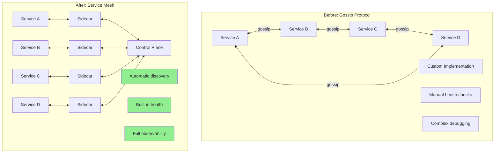
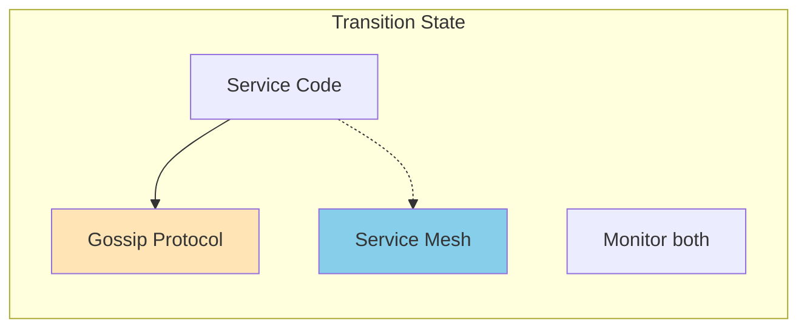
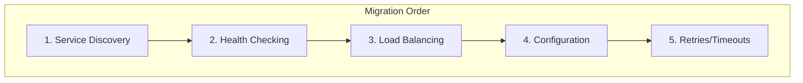
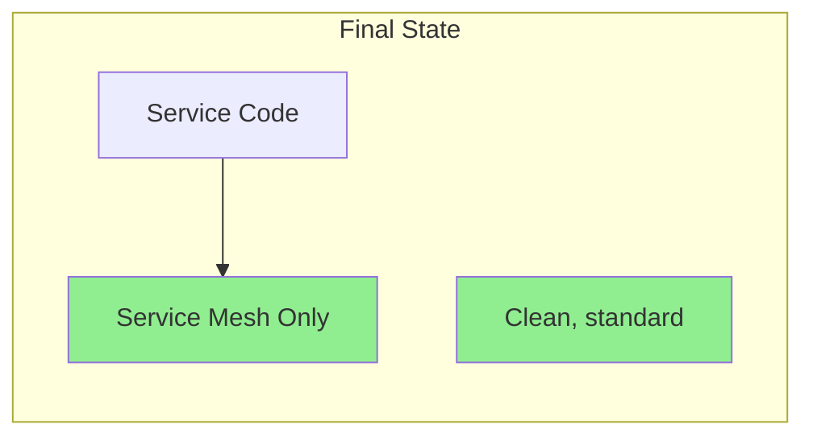
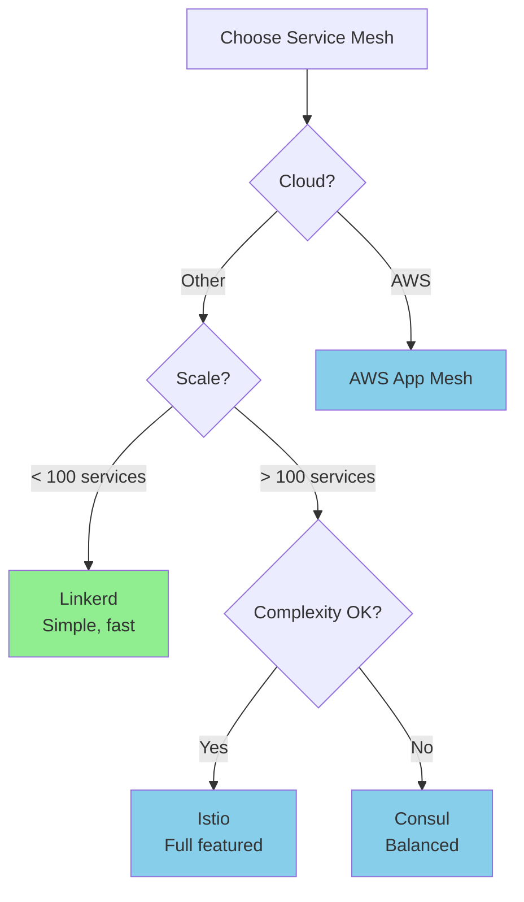
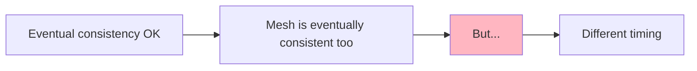
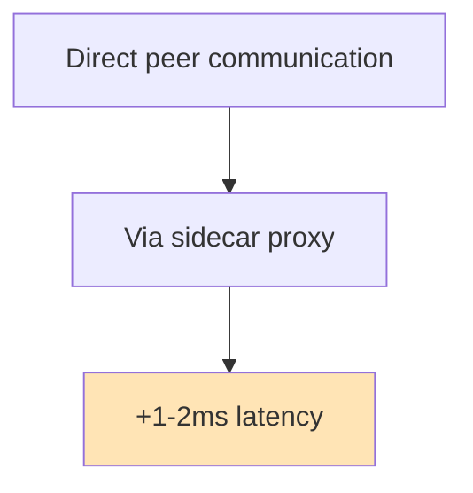
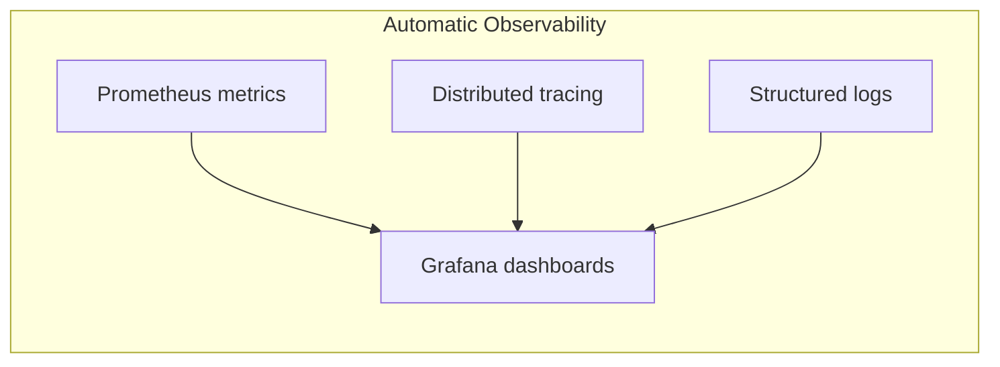

# Migrating from Gossip Protocol to Service Mesh

!!! success "Migration Benefits"
    - **Built-in features**: Service discovery, health checking, load balancing out of the box
    - **Standardization**: Industry-standard tools (Istio, Linkerd, Consul)
    - **Observability**: Automatic metrics, tracing, and logging
    - **Security**: mTLS, authorization policies without custom code
    - **Traffic management**: Canary deployments, circuit breaking, retries

## When to Migrate

### ✅ Good Candidates
- Microservice architectures with custom gossip for discovery
- Systems using gossip for configuration propagation
- Services implementing custom health checking via gossip
- Applications in Kubernetes or cloud environments

### ❌ Poor Candidates
- Peer-to-peer systems without central infrastructure
- Highly dynamic networks with frequent topology changes
- Systems requiring sub-second convergence
- Applications with extreme scale (>10K nodes)

## Migration Overview



## Feature Mapping

| Gossip Protocol Feature | Service Mesh Equivalent |
|------------------------|------------------------|
| **Membership Discovery** | Service registry (automatic) |
| **Health Detection (SWIM)** | Health checks + circuit breakers |
| **Configuration Propagation** | ConfigMaps + control plane |
| **Load Balancing** | Built-in LB algorithms |
| **Failure Detection** | Outlier detection |
| **Eventual Consistency** | Eventually consistent config |

## Migration Strategy

### Phase 1: Parallel Infrastructure



1. Deploy service mesh alongside gossip
2. Register services in both systems
3. Compare discovery results
4. Monitor consistency

### Phase 2: Feature Migration



### Phase 3: Gossip Removal



## Implementation Examples

### Before: Gossip-based Discovery

```python
class GossipServiceDiscovery:
    def __init__(self, node_id: str):
        self.node_id = node_id
        self.members = {}
        self.health_scores = {}
        
    def gossip_round(self):
        # Select random peers
        peers = self.select_peers(k=3)
        
        for peer in peers:
            # Exchange membership info
            their_members = peer.get_members()
            self.merge_members(their_members)
            
            # SWIM-style health check
            if not self.ping(peer):
                self.suspect_member(peer)
    
    def discover_service(self, service_name: str):
        candidates = [
            m for m in self.members.values()
            if m['service'] == service_name and m['status'] == 'healthy'
        ]
        
        if not candidates:
            return None
            
        # Custom load balancing
        return self.select_least_loaded(candidates)
    
    def handle_config_update(self, config):
        # Propagate via gossip
        self.config_version += 1
        self.pending_updates.append(config)
```

### After: Service Mesh Discovery

```python
# Istio/Envoy automatically handles discovery
class ServiceMeshClient:
    def __init__(self, service_name: str):
        self.service_name = service_name
        # No manual discovery needed!
    
    def call_service(self, target_service: str, request):
        # Service mesh handles:
        # - Service discovery
        # - Load balancing
        # - Health checking
        # - Retries
        # - Circuit breaking
        
        # Just make the call
        response = requests.post(
            f"http://{target_service}/api",
            json=request,
            # Mesh adds headers automatically
        )
        return response

# Configuration via ConfigMap (Kubernetes)
apiVersion: v1
kind: ConfigMap
metadata:
  name: service-config
data:
  timeout: "30s"
  retry_count: "3"
```

## Service Mesh Selection

### Comparison Matrix

| Feature | Istio | Linkerd | Consul Connect | AWS App Mesh |
|---------|-------|---------|----------------|--------------|
| **Complexity** | High | Low | Medium | Medium |
| **Performance** | ~2ms latency | ~1ms latency | ~1.5ms latency | ~2ms latency |
| **Resource Usage** | 100-500MB | 50-100MB | 100-200MB | 100-300MB |
| **Language Support** | Any | Any | Any | Any |
| **Multi-cluster** | Excellent | Good | Excellent | AWS-only |
| **Learning Curve** | Steep | Gentle | Moderate | Moderate |

### Decision Tree



## Configuration Migration

### Gossip-based Config
```python
# Old: Custom propagation
def propagate_config(self, config):
    self.config_version += 1
    for peer in self.select_random_peers():
        peer.update_config(config, self.config_version)
```

### Service Mesh Config
```yaml
# New: Declarative configuration
apiVersion: networking.istio.io/v1beta1
kind: VirtualService
metadata:
  name: my-service
spec:
  http:
  - timeout: 30s
    retries:
      attempts: 3
      perTryTimeout: 10s
```

## Health Check Migration

### From SWIM to Mesh Health Checks

```yaml
# Envoy health check configuration
healthChecks:
- timeout: 3s
  interval: 10s
  unhealthyThreshold: 3
  healthyThreshold: 2
  path: /health
  httpHeaders:
  - name: x-health-check
    value: mesh
```

Benefits:
- Standardized health endpoints
- Automatic outlier detection
- Circuit breaking on failures
- No custom SWIM implementation

## Common Challenges

### 1. Gossip Protocol Assumptions



**Solution**: Adjust timeouts and expectations

### 2. Peer-to-Peer Communication



**Solution**: Usually negligible, but test performance

### 3. Dynamic Membership

Service mesh assumes relatively stable service definitions:

- Use headless services for dynamic pools
- Consider hybrid approach for highly dynamic systems
- Use custom CRDs for complex scenarios

## Rollback Strategy

1. **Maintain gossip code**: Don't delete immediately
2. **Feature flags**: Toggle between implementations
3. **Gradual rollout**: Service by service
4. **Monitoring**: Watch error rates closely

## Post-Migration Benefits

### Observability


### Security
- Automatic mTLS between services
- Fine-grained authorization policies
- Certificate rotation
- Zero-trust networking

### Traffic Management
- Canary deployments
- Blue-green deployments
- Traffic splitting
- Fault injection for testing

## Performance Comparison

| Metric | Gossip Protocol | Service Mesh |
|--------|----------------|--------------|
| **Discovery Latency** | O(log n) rounds | Instant (cached) |
| **Config Propagation** | Seconds to minutes | Milliseconds |
| **Memory per Node** | O(n) for membership | O(1) sidecar |
| **Network Traffic** | Continuous gossip | On-demand + health |
| **Operational Overhead** | High (custom) | Low (standard) |

## Next Steps

1. **Start with non-critical services**
2. **Enable observability first**
3. **Add traffic management gradually**
4. **Implement security policies last**

## References

- [Istio Architecture](https://istio.io/latest/docs/ops/deployment/architecture/)
- [Linkerd Architecture](https://linkerd.io/2/reference/architecture/)
- [Consul Connect](https://www.consul.io/docs/connect)
- [CNCF Service Mesh Landscape](https://landscape.cncf.io/card-mode?category=service-mesh)
- [Service Mesh Comparison](https://servicemesh.es/)