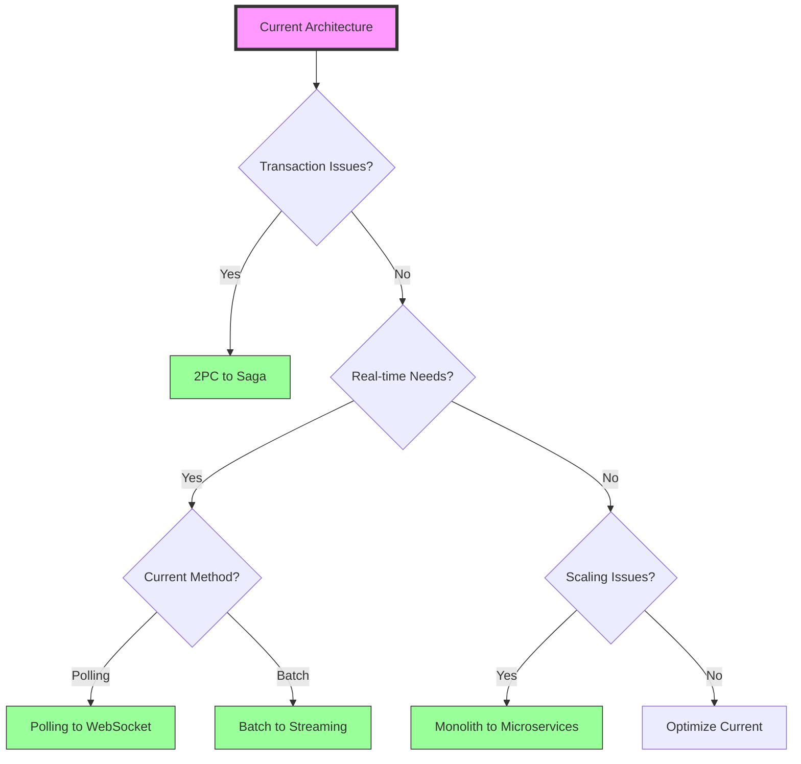
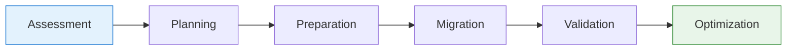
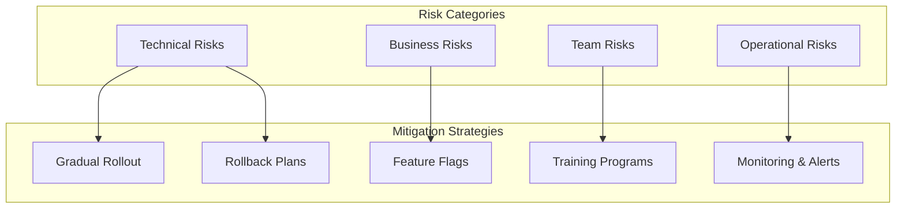

# Migration Playbooks

Step-by-step guides for migrating from legacy patterns to modern distributed systems architectures.

## 🔄 Available Migration Guides

-   **🔄 Two-Phase Commit to Saga**

    ---
    
    Modernize distributed transactions for better scalability and resilience
    
    [:octicons-arrow-right-24: View Guide](../../excellence/migrations/2pc-to-saga.md)

-   **🌐 Polling to WebSocket**

    ---
    
    Transform to real-time communication with reduced latency
    
    [:octicons-arrow-right-24: View Guide](../../excellence/migrations/polling-to-websocket.md)

-   **🏗️ Monolith to Microservices**

    ---
    
    Decompose monolithic applications into scalable services
    
    [:octicons-arrow-right-24: View Guide](../../excellence/migrations/monolith-to-microservices.md)

-   **⚡ Batch to Streaming**

    ---
    
    Evolve from batch processing to real-time data streams
    
    [:octicons-arrow-right-24: View Guide](../../excellence/migrations/batch-to-streaming.md)

-   **🕐 Vector Clocks to HLC**

    ---
    
    Modernize distributed timestamps with compact hybrid logical clocks
    
    [:octicons-arrow-right-24: View Guide](../../excellence/migrations/vector-clocks-to-hlc.md)

-   **🌐 Gossip to Service Mesh**

    ---
    
    Replace custom gossip protocols with industry-standard service mesh
    
    [:octicons-arrow-right-24: View Guide](../../excellence/migrations/gossip-to-service-mesh.md)

-   **🔄 Anti-Entropy to CRDT**

    ---
    
    Automatic conflict resolution with mathematically proven data types
    
    [:octicons-arrow-right-24: View Guide](../../excellence/migrations/anti-entropy-to-crdt.md)

## 🎯 Migration Decision Matrix

| Current State | Target State | Complexity | Duration | Risk Level |
|--------------|--------------|------------|----------|------------|
| **2PC Transactions** | Saga Pattern | Medium | 2-3 months | Medium |
| **HTTP Polling** | WebSockets | Low | 1-2 months | Low |
| **Monolith** | Microservices | High | 6-12 months | High |
| **Batch Processing** | Stream Processing | Medium | 3-4 months | Medium |
| **Vector Clocks** | Hybrid Logical Clocks | Medium | 1-2 months | Medium |
| **Gossip Protocol** | Service Mesh | High | 3-6 months | Medium |
| **Anti-Entropy** | CRDTs | Medium | 2-3 months | Low |

## 📊 Migration Selection Guide

## 🚀 Migration Process Overview

Each migration guide follows our proven 6-phase approach:

### Phase Details

1. **Assessment**: Analyze current state and define success criteria
2. **Planning**: Create detailed migration roadmap and risk mitigation
3. **Preparation**: Set up tools, environments, and team training
4. **Migration**: Execute migration with careful monitoring
5. **Validation**: Verify functionality and performance targets
6. **Optimization**: Fine-tune and capture lessons learned

## 💡 Common Migration Patterns

### Strangler Fig Pattern
Gradually replace legacy components without big-bang rewrites

### Parallel Run
Run old and new systems simultaneously for validation

### Feature Toggle
Control rollout and enable quick rollbacks

### Canary Deployment
Test with small user subset before full migration

## 📈 Success Metrics

Track these KPIs during migration:

- **Technical Metrics**
  - System availability (target: >99.9%)
  - Performance benchmarks
  - Error rates
  - Resource utilization

- **Business Metrics**
  - User satisfaction scores
  - Feature delivery velocity
  - Operational costs
  - Time to market

- **Team Metrics**
  - Developer productivity
  - Deployment frequency
  - Mean time to recovery
  - Knowledge transfer completion

## 🛡️ Risk Mitigation Strategies

## 🎓 Pre-Migration Checklist

Before starting any migration:

- [ ] Executive buy-in and budget approval
- [ ] Clear success criteria defined
- [ ] Team trained on new technologies
- [ ] Testing strategy in place
- [ ] Rollback procedures documented
- [ ] Monitoring and alerting configured
- [ ] Communication plan for stakeholders

## 📚 Additional Resources

- [Migration Patterns](../../pattern-library/index.md)
- [Quantitative Analysis Tools](../../quantitative-analysis/)
- [Human Factors in Migration](../../human-factors.md)
- [Case Studies](../case-studies/)

!!! warning "Critical Success Factor"
    The #1 reason migrations fail is rushing. Take time to plan, test, and validate each phase.

!!! tip "Start Small"
    Begin with a non-critical component to build confidence and refine your process.

---

[:octicons-arrow-left-24: Back to Excellence](../index.md) | [:octicons-arrow-right-24: Choose Your Migration](../../excellence/migrations/2pc-to-saga.md)