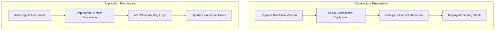

# Master-Slave to Multi-Primary Migration Guide

## Overview

Migrating from Master-Slave to Multi-Primary replication transforms your database architecture from a single write point to multiple active write nodes. This guide provides battle-tested approaches for achieving true multi-master capabilities while maintaining data consistency.

## Pre-Migration Assessment Checklist

### System Readiness Assessment

```yaml
readiness_criteria:
  business:
    - [ ] Conflict resolution strategy approved by stakeholders
    - [ ] Acceptable latency for cross-region writes defined
    - [ ] Data sovereignty requirements documented
    - [ ] RPO/RTO targets for each region established
  
  technical:
    - [ ] Network latency between regions < 100ms
    - [ ] Conflict-free data types (CRDTs) evaluated
    - [ ] Application-level conflict resolution implemented
    - [ ] Clock synchronization (NTP) configured
  
  team:
    - [ ] Team trained on multi-primary patterns
    - [ ] Operational runbooks for split-brain scenarios
    - [ ] Monitoring for replication lag and conflicts
```

### Migration Complexity Estimator

| Factor | Low Complexity (1pt) | Medium (3pts) | High (5pts) |
|--------|---------------------|----------------|--------------|
| Geographic Distribution | Single region | 2-3 regions | 4+ regions |
| Write Volume | <1K writes/sec | 1K-10K writes/sec | >10K writes/sec |
| Schema Complexity | Simple, no FKs | Some relations | Complex relations |
| Conflict Frequency | Rare conflicts | Occasional conflicts | Frequent conflicts |
| Consistency Requirements | Eventual OK | Causal consistency | Strong consistency |

**Score Interpretation:**
- 5-10 points: 3-4 month migration
- 11-20 points: 4-8 month migration
- 21-25 points: 8-12 month migration with phased approach

## Week-by-Week Migration Plan

### Week 1-2: Foundation Setup



**Deliverables:**
- Bidirectional replication configured between primary and secondary
- Conflict detection and logging enabled
- Application code prepared for multi-primary

### Week 3-4: Parallel Testing

```yaml
testing_phases:
  phase_1_read_validation:
    - Secondary promoted to accept test writes
    - Validate bidirectional replication
    - Monitor for conflicts and lag
    - Test failover scenarios
  
  phase_2_write_splitting:
    - 5% writes to secondary region
    - Monitor conflict rates
    - Measure replication lag impact
    - Gradual increase: 5% → 15% → 30% → 50%
  
  phase_3_active_active:
    - Both nodes accept production writes
    - Geographic routing enabled
    - Monitor global consistency
    - Validate conflict resolution
```

### Week 5-6: Conflict Resolution Implementation

```python
# Example: Last-Write-Wins with Vector Clocks
class MultiPrimaryConflictResolver:
    def __init__(self):
        self.vector_clock = VectorClock()
        self.conflict_log = ConflictAuditLog()
    
    def resolve_conflict(self, local_record, remote_record):
        # Compare vector clocks
        comparison = self.vector_clock.compare(
            local_record.clock, 
            remote_record.clock
        )
        
        if comparison == ClockComparison.CONCURRENT:
            # Conflict detected - apply resolution strategy
            winner = self.apply_resolution_strategy(
                local_record, 
                remote_record
            )
            self.conflict_log.record(local_record, remote_record, winner)
            return winner
        elif comparison == ClockComparison.LOCAL_NEWER:
            return local_record
        else:
            return remote_record
    
    def apply_resolution_strategy(self, local, remote):
        # Business-specific resolution
        if self.is_financial_data(local):
            # Use deterministic ordering for financial data
            return max(local, remote, key=lambda r: (r.timestamp, r.node_id))
        else:
            # Last-write-wins for other data
            return max(local, remote, key=lambda r: r.timestamp)
```

### Week 7-8: Geographic Distribution

```mermaid
graph TB
    subgraph "US East"
        USE[Primary Node US-E]
        USEApp[App Servers US-E]
        USEApp -->|Local Writes| USE
    end
    
    subgraph "EU West"
        EUW[Primary Node EU-W]
        EUWApp[App Servers EU-W]
        EUWApp -->|Local Writes| EUW
    end
    
    subgraph "APAC"
        APAC[Primary Node APAC]
        APACApp[App Servers APAC]
        APACApp -->|Local Writes| APAC
    end
    
    USE <-->|Bidirectional Replication| EUW
    EUW <-->|Bidirectional Replication| APAC
    APAC <-->|Bidirectional Replication| USE
```

### Week 9-10: Production Cutover

**Cutover Sequence:**
1. **Enable Multi-Primary Mode**
   ```sql
   -- On each node
   SET GLOBAL group_replication_single_primary_mode=OFF;
   SET GLOBAL group_replication_enforce_update_everywhere_checks=ON;
   ```

2. **Update Application Configuration**
   ```yaml
   database:
     topology: multi_primary
     nodes:
       - host: db-us-east.example.com
         region: us-east-1
         weight: 100
       - host: db-eu-west.example.com
         region: eu-west-1
         weight: 100
       - host: db-apac.example.com
         region: ap-southeast-1
         weight: 100
     routing:
       strategy: nearest_region
       fallback: round_robin
   ```

3. **Monitor Critical Metrics**
   - Replication lag per region
   - Conflict rate per table
   - Write distribution across nodes
   - Application error rates

## Common Pitfalls and Solutions

### Pitfall 1: Auto-Increment Conflicts

**Problem:** Multiple nodes generating conflicting primary keys

**Solution:**
```sql
-- Configure different auto-increment offsets per node
-- Node 1
SET @@auto_increment_increment = 3;
SET @@auto_increment_offset = 1;

-- Node 2
SET @@auto_increment_increment = 3;
SET @@auto_increment_offset = 2;

-- Node 3
SET @@auto_increment_increment = 3;
SET @@auto_increment_offset = 3;
```

### Pitfall 2: Foreign Key Constraints

**Problem:** FK violations during concurrent updates

**Solution:**
```python
class ForeignKeyManager:
    def __init__(self):
        self.retry_queue = RetryQueue()
    
    def safe_update_with_fk(self, update_func, max_retries=3):
        retry_count = 0
        while retry_count < max_retries:
            try:
                return update_func()
            except ForeignKeyViolation as e:
                retry_count += 1
                if retry_count >= max_retries:
                    # Queue for async resolution
                    self.retry_queue.add(update_func, e)
                else:
                    # Exponential backoff
                    time.sleep(2 ** retry_count)
```

### Pitfall 3: Split-Brain Scenarios

**Problem:** Network partition causes nodes to diverge

**Solution:**
```yaml
split_brain_prevention:
  quorum_configuration:
    minimum_nodes: 2
    weight_distribution:
      us-east: 3
      eu-west: 2
      apac: 2
  
  automatic_recovery:
    - Detect network partition
    - Demote minority partition to read-only
    - Queue writes for replay
    - Reconcile on partition heal
  
  monitoring:
    - Alert on replication breaks
    - Track divergence metrics
    - Automated health checks
```

## Real Company Migration Stories

### Case Study 1: Global E-Commerce Platform

**Timeline:** 6 months
**Scale:** 5B transactions/year across 3 continents

**Approach:**
1. Started with read replicas in each region
2. Implemented application-level sharding by customer region
3. Gradually enabled writes in local regions
4. Built custom conflict resolution for inventory

**Results:**
- 70% reduction in write latency for regional users
- 99.99% availability achieved
- 50% reduction in cross-region bandwidth costs

**Challenges:**
- Inventory conflicts required business logic changes
- Clock skew caused initial consistency issues
- Regulatory compliance for data residency

### Case Study 2: Financial Services Platform

**Timeline:** 9 months
**Scale:** 100M+ accounts, strict consistency requirements

**Approach:**
1. Hybrid model: Multi-primary for reference data
2. Single-primary with fast failover for transactions
3. Event sourcing for audit trail
4. Deterministic conflict resolution

**Results:**
- 3x improvement in write throughput
- Sub-second regional failover
- Zero data loss during migration

**Key Decisions:**
- Kept financial transactions on single primary
- Used multi-primary for user profiles and settings
- Built reconciliation service for consistency checks

## Success Metrics

### Technical Metrics
```yaml
sla_targets:
  replication_lag_p99: <100ms
  conflict_rate: <0.01%
  write_availability: 99.99%
  failover_time: <5s
  
monitoring_queries:
  replication_lag: |
    SELECT 
      source_region,
      target_region,
      MAX(lag_seconds) as max_lag,
      AVG(lag_seconds) as avg_lag
    FROM replication_metrics
    WHERE timestamp > NOW() - INTERVAL '5 minutes'
    GROUP BY source_region, target_region
  
  conflict_rate: |
    SELECT 
      table_name,
      COUNT(*) as conflict_count,
      COUNT(DISTINCT record_id) as affected_records
    FROM conflict_log
    WHERE timestamp > NOW() - INTERVAL '1 hour'
    GROUP BY table_name
```

### Business Metrics
- Regional write latency improvement
- Availability improvement per region
- Cost savings from reduced cross-region traffic
- User satisfaction by geography

## Rollback Procedures

### Emergency Rollback Plan

```bash
#!/bin/bash
# emergency-rollback-to-single-primary.sh

# 1. Select new primary (lowest latency to majority)
PRIMARY=$(select-optimal-primary.sh)

# 2. Demote other nodes to read-only
for node in $(get-all-nodes.sh | grep -v $PRIMARY); do
  mysql -h $node -e "SET GLOBAL read_only=ON;"
  mysql -h $node -e "SET GLOBAL super_read_only=ON;"
done

# 3. Update application configuration
update-config.sh --mode=single_primary --primary=$PRIMARY

# 4. Restart application servers
rolling-restart.sh --service=app-servers

# 5. Monitor for stability
monitor-health.sh --duration=30m --alert-on-error
```

### Gradual Rollback
1. Reduce write percentage to secondary regions
2. Monitor for 48 hours
3. Investigate and fix issues
4. Resume migration with fixes

## Migration Completion Checklist

- [ ] All regions accepting writes
- [ ] Conflict resolution tested and validated
- [ ] Monitoring dashboards operational
- [ ] Runbooks updated and tested
- [ ] Team trained on multi-primary operations
- [ ] Performance benchmarks met
- [ ] Disaster recovery procedures validated
- [ ] Post-mortem completed

## Additional Resources

- [Multi-Primary Replication Patterns](../../pattern-library/multi-primary.md)
- [Conflict-Free Replicated Data Types](../../pattern-library/data-management/crdt.md)
- [Geographic Distribution Strategies](../../pattern-library/scaling/geo-replication.md)
- [Database Monitoring Best Practices](../../human-factors/observability.md)