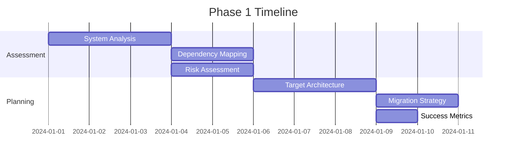
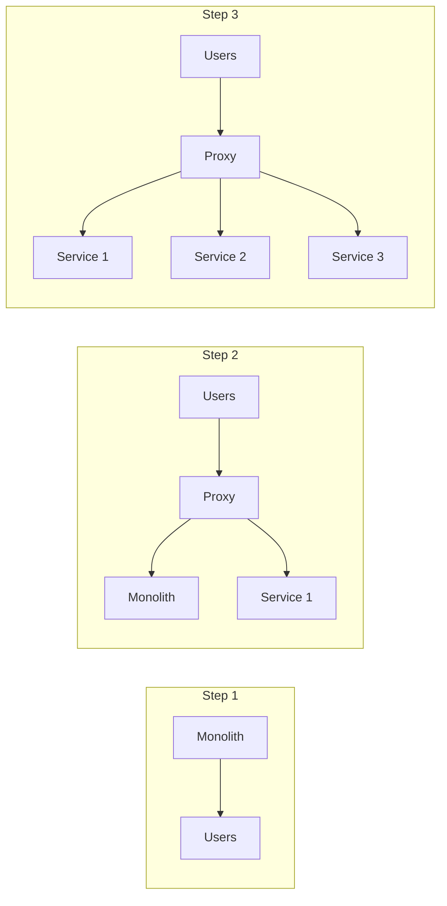

# Migration Playbook Template

!!! info "How to Use This Template"
    This template provides a structured approach for documenting pattern migrations. Copy this template and customize it for specific migration scenarios (e.g., Monolith to Microservices, Polling to Event-Driven).

## Migration: [Source Pattern] to [Target Pattern]

### Executive Summary

**Migration Overview**
- **From**: [Legacy pattern name and brief description]
- **To**: [Modern pattern name and brief description]
- **Typical Duration**: [X-Y months]
- **Complexity**: [Low/Medium/High]
- **Risk Level**: [Low/Medium/High]
- **Expected ROI**: [Xx improvement in specific metrics]

### Why Migrate?

<div class="grid cards" markdown>

- :material-alert:{ .lg .middle } **Problems with [Source Pattern]**
    
    ---
    
    - [Problem 1: e.g., Scalability bottleneck]
    - [Problem 2: e.g., Single point of failure]
    - [Problem 3: e.g., Maintenance overhead]
    - [Problem 4: e.g., Performance issues]

- :material-check-circle:{ .lg .middle } **Benefits of [Target Pattern]**
    
    ---
    
    - [Benefit 1: e.g., Horizontal scalability]
    - [Benefit 2: e.g., Fault isolation]
    - [Benefit 3: e.g., Independent deployments]
    - [Benefit 4: e.g., Technology flexibility]

</div>

### Migration Readiness Checklist

Before starting migration, ensure:

- [ ] **Current State Assessment**
  - [ ] Document existing architecture
  - [ ] Measure current performance metrics
  - [ ] Identify all dependencies
  - [ ] Map data flows

- [ ] **Team Readiness**
  - [ ] Team trained on [Target Pattern]
  - [ ] Clear ownership defined
  - [ ] Support from leadership
  - [ ] Dedicated migration team

- [ ] **Technical Prerequisites**
  - [ ] Test environment available
  - [ ] Monitoring tools in place
  - [ ] Rollback plan prepared
  - [ ] Data backup strategy

## Migration Phases

### Phase 1: Assessment and Planning (Week 1-2)

#### Objectives
- Understand current system thoroughly
- Define target architecture
- Create migration roadmap
- Set success criteria

#### Activities



#### Deliverables
1. **Current State Documentation**
   ```yaml
   architecture:
     type: [monolith/distributed/hybrid]
     components: [list key components]
     data_stores: [databases, caches, queues]
     external_dependencies: [third-party services]
   
   metrics:
     users: [current user count]
     rps: [requests per second]
     latency_p99: [99th percentile latency]
     availability: [current SLA]
   ```

2. **Target State Design**
   - Architecture diagrams
   - Component boundaries
   - API contracts
   - Data models

3. **Migration Plan**
   - Phase breakdown
   - Timeline estimates
   - Risk mitigation strategies
   - Rollback procedures

### Phase 2: Foundation Building (Week 3-4)

#### Objectives
- Set up infrastructure
- Implement core components
- Establish monitoring
- Create safety mechanisms

#### Key Tasks

| Task | Description | Duration | Dependencies |
|------|-------------|----------|--------------|
| Infrastructure Setup | Provision servers, networks, tools | 2 days | None |
| CI/CD Pipeline | Automated build and deploy | 1 day | Infrastructure |
| Monitoring Stack | Metrics, logs, traces | 2 days | Infrastructure |
| Feature Flags | Progressive rollout capability | 1 day | CI/CD |

#### Code Examples

**Example: Setting up feature flags for gradual migration**
```python
class FeatureFlags:
    def __init__(self, config_source):
        self.config = config_source
    
    def is_new_pattern_enabled(self, user_id: str) -> bool:
        # Gradual rollout based on user percentage
        percentage = self.config.get("new_pattern_rollout_percentage", 0)
        user_hash = hashlib.md5(user_id.encode()).hexdigest()
        user_bucket = int(user_hash[:8], 16) % 100
        return user_bucket < percentage
    
    def route_request(self, user_id: str, request: Request):
        if self.is_new_pattern_enabled(user_id):
            return self.new_pattern_handler(request)
        return self.legacy_pattern_handler(request)
```

### Phase 3: Incremental Migration (Week 5-12)

#### Migration Strategies

<div class="strategy-cards">

##### Strategy A: Strangler Fig Pattern
Best for: Monolith to Microservices



##### Strategy B: Parallel Run
Best for: Data store migrations

```python
def dual_write_pattern(data):
    # Write to both old and new systems
    try:
        legacy_result = legacy_system.write(data)
        new_result = new_system.write(data)
        
        # Compare results for validation
        if not results_match(legacy_result, new_result):
            log_discrepancy(data, legacy_result, new_result)
        
        return legacy_result  # Still return legacy result
    except NewSystemException as e:
        # New system failures don't affect users
        log_error("New system write failed", e)
        return legacy_result
```

##### Strategy C: Blue-Green Deployment
Best for: Complete cutover scenarios

</div>

#### Weekly Milestones

| Week | Goal | Success Criteria | Rollback Trigger |
|------|------|------------------|------------------|
| 5-6 | Migrate 10% traffic | Error rate < 0.1% | Error rate > 1% |
| 7-8 | Migrate 25% traffic | Latency < 110% of baseline | Latency > 150% |
| 9-10 | Migrate 50% traffic | All metrics stable | Any SLA breach |
| 11-12 | Complete migration | 100% on new pattern | Critical issues |

### Phase 4: Optimization and Cleanup (Week 13-16)

#### Post-Migration Tasks

1. **Performance Tuning**
   ```yaml
   optimizations:
     - Cache warming strategies
     - Connection pool sizing
     - Query optimization
     - Resource right-sizing
   ```

2. **Legacy Cleanup**
   - Remove old code paths
   - Decommission legacy infrastructure
   - Archive historical data
   - Update documentation

3. **Knowledge Transfer**
   - Team training sessions
   - Runbook creation
   - Incident response procedures
   - Architecture decision records

## Common Pitfalls and Solutions

### Pitfall 1: Big Bang Migration
**Problem**: Attempting to migrate everything at once
**Solution**: Use incremental approach with feature flags

### Pitfall 2: Inadequate Testing
**Problem**: Not testing edge cases and failure scenarios
**Solution**: Comprehensive test strategy including:
- Unit tests for new components
- Integration tests for interactions
- Performance tests under load
- Chaos engineering for failures

### Pitfall 3: Data Inconsistency
**Problem**: Data divergence between old and new systems
**Solution**: Implement reconciliation process:
```python
def reconcile_data():
    legacy_data = fetch_legacy_data()
    new_data = fetch_new_data()
    
    discrepancies = []
    for key in legacy_data:
        if key not in new_data:
            discrepancies.append(("missing", key))
        elif legacy_data[key] != new_data[key]:
            discrepancies.append(("mismatch", key, 
                                legacy_data[key], new_data[key]))
    
    return discrepancies
```

## Success Metrics

### Technical Metrics
| Metric | Baseline | Target | Measurement |
|--------|----------|--------|-------------|
| Latency (p99) | [X ms] | [Y ms] | APM tools |
| Availability | [X%] | [Y%] | Uptime monitoring |
| Error Rate | [X%] | [Y%] | Log analysis |
| Throughput | [X RPS] | [Y RPS] | Load testing |

### Business Metrics
- **Development Velocity**: Features shipped per sprint
- **Operational Cost**: Infrastructure and maintenance costs
- **Time to Market**: Feature delivery speed
- **Customer Satisfaction**: NPS or support tickets

## Case Studies

### Success Story: [Company Name]
- **Migration**: [Source] to [Target]
- **Duration**: X months
- **Results**: Y% improvement in [metric]
- **Key Learning**: [Main takeaway]

[Link to full case study]

### Lessons from Failed Migrations
1. **[Company X]**: Rushed timeline led to instability
2. **[Company Y]**: Insufficient monitoring caused blind spots
3. **[Company Z]**: Lack of rollback plan resulted in extended downtime

## Tools and Resources

### Recommended Tools
- **Planning**: JIRA, Confluence, Miro
- **Monitoring**: Datadog, New Relic, Prometheus
- **Testing**: JMeter, Gatling, Chaos Monkey
- **Feature Flags**: LaunchDarkly, Split.io

### Further Reading
- [Book: "Monolith to Microservices" by Sam Newman]
- [Article: "Strangler Fig Pattern" by Martin Fowler]
- [Video: "Migration Strategies at Scale" - Conference Talk]

## Migration Checklist

### Pre-Migration
- [ ] Stakeholder buy-in secured
- [ ] Team trained and ready
- [ ] Architecture documented
- [ ] Success metrics defined
- [ ] Rollback plan prepared

### During Migration
- [ ] Daily progress tracking
- [ ] Metrics monitoring
- [ ] Regular stakeholder updates
- [ ] Issue tracking and resolution
- [ ] Documentation updates

### Post-Migration
- [ ] Performance optimization complete
- [ ] Legacy system decommissioned
- [ ] Team knowledge transferred
- [ ] Lessons learned documented
- [ ] Success metrics achieved

---

!!! tip "Customize This Template"
    This template provides a comprehensive structure for migration playbooks. Adapt it to your specific migration scenario by:
    
    1. Replacing placeholder text with specific details
    2. Adding domain-specific considerations
    3. Including relevant code examples
    4. Linking to actual case studies
    5. Updating timelines based on complexity

**Next Steps**: Use this template to create specific migration guides for common transitions in your organization.