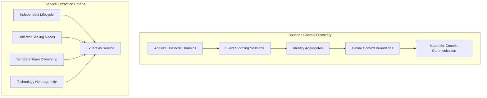
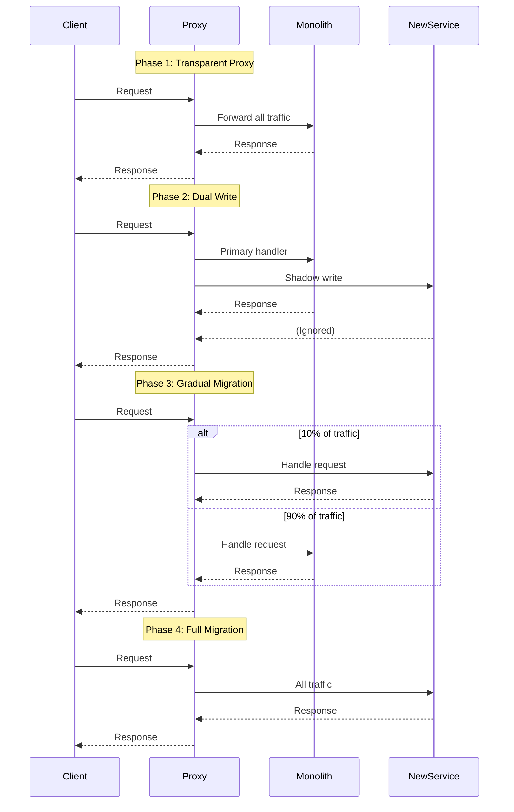
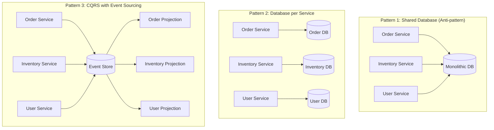
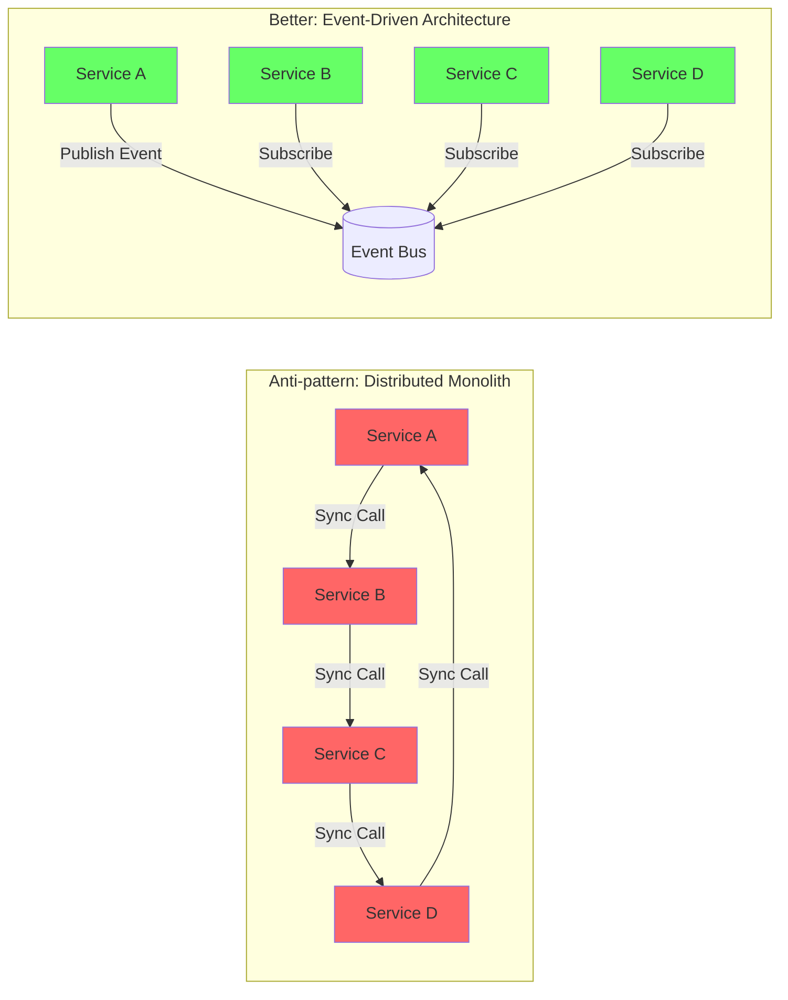

# Monolith to Microservices Migration Guide

## Overview

This guide focuses on migrating monolithic applications to microservices using proven patterns and avoiding common pitfalls. The key is not to blindly split everything, but to identify proper service boundaries and use patterns correctly.

## Service Boundary Identification

### Domain-Driven Design Approach



### Service Boundary Assessment Framework

```yaml
boundary_assessment:
  cohesion_metrics:
    - data_affinity: "How often do these entities change together?"
    - business_capability: "Do they serve a single business function?"
    - team_ownership: "Can a single team own this boundary?"
    
  coupling_indicators:
    - database_joins: "Count of cross-boundary joins"
    - shared_transactions: "Number of distributed transactions needed"
    - api_chattiness: "Projected API calls between services"
    
  extraction_score:
    high_cohesion_low_coupling: "Extract immediately"
    high_cohesion_high_coupling: "Refactor first, then extract"
    low_cohesion_low_coupling: "Consider merging with related domain"
    low_cohesion_high_coupling: "Do not extract - refactor monolith"
```

### Practical Service Identification Process

```python
class ServiceBoundaryAnalyzer:
    def analyze_codebase(self, repo_path):
        # Step 1: Analyze package dependencies
        dependencies = self.extract_dependencies(repo_path)
        
        # Step 2: Identify clusters of high cohesion
        clusters = self.find_cohesive_clusters(dependencies)
        
        # Step 3: Measure coupling between clusters
        coupling_matrix = self.calculate_coupling(clusters)
        
        # Step 4: Generate service candidates
        candidates = []
        for cluster in clusters:
            score = self.calculate_extraction_score(cluster, coupling_matrix)
            if score > 0.7:  # High confidence threshold
                candidates.append({
                    'name': cluster.suggested_name,
                    'packages': cluster.packages,
                    'score': score,
                    'dependencies': cluster.external_deps,
                    'estimated_effort': self.estimate_effort(cluster)
                })
        
        return sorted(candidates, key=lambda x: x['score'], reverse=True)
    
    def calculate_extraction_score(self, cluster, coupling_matrix):
        # Conway's Law consideration
        team_alignment = self.check_team_alignment(cluster)
        
        # Technical factors
        db_isolation = self.check_database_isolation(cluster)
        api_surface = self.estimate_api_surface(cluster)
        
        # Business factors
        lifecycle_independence = self.check_release_cycle(cluster)
        business_capability = self.check_single_capability(cluster)
        
        return (
            team_alignment * 0.3 +
            db_isolation * 0.25 +
            api_surface * 0.15 +
            lifecycle_independence * 0.2 +
            business_capability * 0.1
        )
```

## Strangler Fig Pattern Implementation

### Progressive Migration Strategy



### Implementation Example

```python
# Strangler Fig Proxy Implementation
from flask import Flask, request, jsonify
import requests
import random
import logging

app = Flask(__name__)

class StranglerProxy:
    def __init__(self):
        self.routes = {
            '/api/orders': {
                'legacy_url': 'http://monolith:8080',
                'new_url': 'http://order-service:8080',
                'migration_percentage': 0,  # Start with 0%
                'shadow_mode': True,
                'compare_responses': True
            },
            '/api/inventory': {
                'legacy_url': 'http://monolith:8080',
                'new_url': 'http://inventory-service:8080',
                'migration_percentage': 25,  # 25% to new service
                'shadow_mode': False,
                'compare_responses': False
            }
        }
        self.metrics = MetricsCollector()
    
    def route_request(self, path, method, headers, data):
        route_config = self.routes.get(path)
        if not route_config:
            # Not configured, pass through to monolith
            return self.call_legacy(path, method, headers, data)
        
        # Determine target based on migration percentage
        use_new_service = random.random() < route_config['migration_percentage'] / 100
        
        if route_config['shadow_mode']:
            # Call both, return legacy response
            legacy_response = self.call_legacy(path, method, headers, data)
            new_response = self.call_new_service(route_config['new_url'], path, method, headers, data)
            
            if route_config['compare_responses']:
                self.compare_and_log(path, legacy_response, new_response)
            
            return legacy_response
        
        elif use_new_service:
            # Route to new service
            try:
                response = self.call_new_service(route_config['new_url'], path, method, headers, data)
                self.metrics.record_success('new_service', path)
                return response
            except Exception as e:
                # Fallback to legacy on error
                logging.error(f"New service failed for {path}: {e}")
                self.metrics.record_failure('new_service', path)
                return self.call_legacy(path, method, headers, data)
        else:
            # Route to legacy
            return self.call_legacy(path, method, headers, data)
    
    def compare_and_log(self, path, legacy_response, new_response):
        if legacy_response.status_code != new_response.status_code:
            logging.warning(f"Status code mismatch for {path}: legacy={legacy_response.status_code}, new={new_response.status_code}")
        
        if legacy_response.json() != new_response.json():
            logging.warning(f"Response body mismatch for {path}")
            # Log detailed diff for investigation
            self.log_response_diff(path, legacy_response.json(), new_response.json())

@app.route('/<path:path>', methods=['GET', 'POST', 'PUT', 'DELETE'])
def proxy(path):
    proxy = StranglerProxy()
    response = proxy.route_request(
        f'/{path}',
        request.method,
        dict(request.headers),
        request.get_data()
    )
    return response.content, response.status_code, dict(response.headers)
```

## Data Isolation Strategies

### Database Decomposition Patterns



### Data Migration Strategy

```python
class DataMigrationOrchestrator:
    def __init__(self):
        self.strategies = {
            'branch_by_abstraction': BranchByAbstractionStrategy(),
            'event_sourcing_replay': EventSourcingReplayStrategy(),
            'change_data_capture': CDCStrategy(),
            'dual_write': DualWriteStrategy()
        }
    
    def plan_migration(self, source_schema, target_services):
        migration_plan = []
        
        for table in source_schema.tables:
            # Determine owning service
            owner_service = self.identify_owner(table, target_services)
            
            # Identify cross-service references
            references = self.find_cross_references(table, source_schema)
            
            # Choose migration strategy
            if references.count() == 0:
                strategy = 'branch_by_abstraction'
            elif references.all_soft():
                strategy = 'event_sourcing_replay'
            else:
                strategy = 'change_data_capture'
            
            migration_plan.append({
                'table': table.name,
                'owner': owner_service,
                'strategy': strategy,
                'dependencies': references,
                'estimated_duration': self.estimate_duration(table, strategy)
            })
        
        # Order by dependencies
        return self.topological_sort(migration_plan)
    
    def execute_migration(self, plan_item):
        strategy = self.strategies[plan_item['strategy']]
        
        # Phase 1: Setup dual write
        strategy.setup_dual_write(plan_item['table'], plan_item['owner'])
        
        # Phase 2: Backfill historical data
        strategy.backfill_data(plan_item['table'], plan_item['owner'])
        
        # Phase 3: Verify data consistency
        consistency_check = strategy.verify_consistency(plan_item['table'])
        if not consistency_check.passed:
            raise DataInconsistencyError(consistency_check.differences)
        
        # Phase 4: Switch reads to new service
        strategy.switch_reads(plan_item['table'], plan_item['owner'])
        
        # Phase 5: Stop writes to old location
        strategy.stop_legacy_writes(plan_item['table'])
        
        return MigrationResult(plan_item, success=True)
```

### Handling Distributed Transactions

```yaml
# Transaction patterns ranked by preference
transaction_patterns:
  1_saga_orchestration:
    description: "Preferred for long-running business transactions"
    when_to_use:
      - "Multiple services involved"
      - "Can tolerate eventual consistency"
      - "Clear compensation logic exists"
    implementation: |
      class OrderSaga:
          steps = [
              SagaStep('reserve_inventory', compensate='release_inventory'),
              SagaStep('charge_payment', compensate='refund_payment'),
              SagaStep('create_shipment', compensate='cancel_shipment')
          ]
  
  2_event_choreography:
    description: "Good for loosely coupled services"
    when_to_use:
      - "Services can work independently"
      - "Natural event flow exists"
      - "No central coordination needed"
    
  3_two_phase_commit:
    description: "Last resort - avoid if possible"
    when_to_use:
      - "Strong consistency absolutely required"
      - "Short-lived transactions only"
      - "All participants support 2PC"
```

## Communication Pattern Selection

### Pattern Decision Matrix

| Pattern | Use When | Avoid When | Example |
|---------|----------|------------|---------|
| Synchronous REST | Request/response needed | High latency sensitivity | User profile lookup |
| Async Messaging | Fire-and-forget OK | Immediate response needed | Order placement |
| gRPC | High performance needed | Browser clients | Service-to-service |
| GraphQL | Multiple data sources | Simple CRUD | API Gateway |
| WebSocket | Real-time updates | Stateless operations | Price updates |

### Service Mesh Implementation

```yaml
# Istio service mesh configuration
apiVersion: networking.istio.io/v1beta1
kind: VirtualService
metadata:
  name: order-service
spec:
  hosts:
  - order-service
  http:
  - match:
    - headers:
        x-version:
          exact: v2
    route:
    - destination:
        host: order-service
        subset: v2
      weight: 100
  - route:
    - destination:
        host: order-service
        subset: v1
      weight: 90
    - destination:
        host: order-service
        subset: v2
      weight: 10  # Canary deployment
---
apiVersion: networking.istio.io/v1beta1
kind: DestinationRule
metadata:
  name: order-service
spec:
  host: order-service
  trafficPolicy:
    connectionPool:
      tcp:
        maxConnections: 100
      http:
        http1MaxPendingRequests: 50
        http2MaxRequests: 100
    loadBalancer:
      simple: LEAST_REQUEST
    outlierDetection:
      consecutiveErrors: 5
      interval: 30s
      baseEjectionTime: 30s
  subsets:
  - name: v1
    labels:
      version: v1
  - name: v2
    labels:
      version: v2
```

## Anti-patterns to Avoid

### 1. Distributed Monolith



### 2. Chatty Services

```python
# Anti-pattern: Chatty service calls
class ChattyOrderService:
    def get_order_details(self, order_id):
        order = self.get_order(order_id)  # Call 1
        user = user_service.get_user(order.user_id)  # Call 2
        
        items = []
        for item_id in order.item_ids:
            item = inventory_service.get_item(item_id)  # Call N
            items.append(item)
        
        shipping = shipping_service.get_shipping(order.shipping_id)  # Call N+3
        
        return OrderDetails(order, user, items, shipping)

# Better: Aggregated API with caching
class OptimizedOrderService:
    def get_order_details(self, order_id):
        # Use GraphQL or BFF pattern to aggregate
        query = """
        query GetOrderDetails($orderId: ID!) {
            order(id: $orderId) {
                id
                user {
                    id
                    name
                    email
                }
                items {
                    id
                    name
                    price
                }
                shipping {
                    address
                    estimatedDelivery
                }
            }
        }
        """
        return self.graphql_gateway.execute(query, {"orderId": order_id})
```

### 3. Shared Database

```sql
-- Anti-pattern: Services sharing tables
-- Order Service and Inventory Service both access inventory table
SELECT * FROM inventory WHERE product_id = ?;  -- Used by both services
UPDATE inventory SET quantity = quantity - ? WHERE product_id = ?;  -- Race condition!

-- Better: Event-driven inventory updates
-- Inventory Service publishes events
INSERT INTO inventory_events (event_type, product_id, quantity_change, timestamp)
VALUES ('reserved', ?, ?, NOW());

-- Order Service subscribes to inventory events
-- Each service maintains its own view of data
```

### 4. Synchronous Cascading Failures

```python
# Anti-pattern: No circuit breakers
class FragileService:
    def process_order(self, order):
        # If payment service is down, entire order fails
        payment_result = payment_service.charge(order.amount)  # Blocks indefinitely
        inventory_result = inventory_service.reserve(order.items)
        shipping_result = shipping_service.schedule(order)
        return OrderResult(payment_result, inventory_result, shipping_result)

# Better: Circuit breakers and timeouts
class ResilientService:
    def __init__(self):
        self.payment_breaker = CircuitBreaker(
            failure_threshold=5,
            recovery_timeout=60,
            expected_exception=ServiceException
        )
    
    def process_order(self, order):
        results = {}
        
        # Process payment with circuit breaker
        try:
            results['payment'] = self.payment_breaker.call(
                payment_service.charge,
                order.amount,
                timeout=3
            )
        except CircuitBreakerOpen:
            # Fallback: Queue for later processing
            payment_queue.send(order)
            results['payment'] = PaymentResult(status='queued')
        
        # Continue with other services independently
        # ...
```

## Real Migration Examples

### Example 1: E-commerce Platform

**Initial State:** 500K LOC Ruby on Rails monolith

**Migration Timeline:** 18 months

```yaml
migration_phases:
  phase_1_preparation:  # Months 1-3
    - Add API Gateway
    - Implement distributed tracing
    - Create service registry
    - Setup CI/CD pipelines
    
  phase_2_edge_services:  # Months 4-6
    - Extract User Service (authentication/authorization)
    - Extract Notification Service (email/SMS)
    - Extract Search Service (Elasticsearch)
    
  phase_3_core_domain:  # Months 7-12
    - Extract Inventory Service
    - Extract Order Service
    - Extract Payment Service
    - Implement Saga orchestration
    
  phase_4_optimization:  # Months 13-18
    - Extract Recommendation Service
    - Implement CQRS for reporting
    - Optimize service communication
    - Decommission monolith code

results:
  - deployment_frequency: "Monthly → Daily"
  - mean_time_to_recovery: "4 hours → 15 minutes"
  - infrastructure_cost: "Increased 40% initially, decreased 20% after optimization"
  - developer_productivity: "2x increase after 6 months"
```

### Example 2: Financial Services

**Initial State:** Java monolith processing 1M transactions/day

**Migration Strategy:** Domain-driven with regulatory compliance

```python
# Compliance-aware migration approach
class RegulatoryMigrationStrategy:
    def __init__(self):
        self.audit_requirements = {
            'data_residency': 'US-EAST',
            'encryption': 'AES-256',
            'audit_retention': '7 years',
            'transaction_integrity': 'ACID required'
        }
    
    def validate_service_extraction(self, service_definition):
        validations = []
        
        # Check data residency
        if service_definition.data_location != self.audit_requirements['data_residency']:
            validations.append(ValidationError('Data must remain in US-EAST'))
        
        # Check transaction boundaries
        if service_definition.crosses_financial_boundary():
            validations.append(ValidationError('Cannot split financial transactions'))
        
        # Check audit trail
        if not service_definition.implements_audit_trail():
            validations.append(ValidationError('Audit trail required'))
        
        return ValidationResult(validations)
```

## Monitoring and Success Metrics

### Key Performance Indicators

```sql
-- Service health metrics
WITH service_metrics AS (
    SELECT
        service_name,
        DATE_TRUNC('day', timestamp) as day,
        COUNT(*) as request_count,
        AVG(response_time_ms) as avg_latency,
        PERCENTILE_CONT(0.99) WITHIN GROUP (ORDER BY response_time_ms) as p99_latency,
        SUM(CASE WHEN status_code >= 500 THEN 1 ELSE 0 END)::FLOAT / COUNT(*) * 100 as error_rate
    FROM service_requests
    WHERE timestamp > NOW() - INTERVAL '30 days'
    GROUP BY 1, 2
)
SELECT
    service_name,
    AVG(avg_latency) as avg_latency_30d,
    AVG(p99_latency) as avg_p99_30d,
    AVG(error_rate) as avg_error_rate_30d,
    STDDEV(avg_latency) as latency_stability
FROM service_metrics
GROUP BY service_name
ORDER BY avg_error_rate_30d DESC;

-- Service coupling metrics
WITH service_calls AS (
    SELECT
        calling_service,
        called_service,
        COUNT(*) as call_count,
        AVG(response_time_ms) as avg_latency
    FROM service_dependencies
    WHERE timestamp > NOW() - INTERVAL '1 day'
    GROUP BY 1, 2
)
SELECT
    calling_service,
    COUNT(DISTINCT called_service) as dependency_count,
    SUM(call_count) as total_outbound_calls,
    AVG(avg_latency) as avg_dependency_latency
FROM service_calls
GROUP BY calling_service
HAVING COUNT(DISTINCT called_service) > 5  -- Flag highly coupled services
ORDER BY dependency_count DESC;
```

### Migration Success Criteria

```yaml
success_metrics:
  technical:
    - deployment_independence: "Each service deployable independently"
    - failure_isolation: "Service failures don't cascade"
    - scalability: "Services scale based on their load patterns"
    - technology_diversity: "Teams can choose appropriate tech stacks"
    
  business:
    - time_to_market: "Feature delivery 2x faster"
    - innovation_velocity: "Experiments without system-wide impact"
    - team_autonomy: "Teams own their service lifecycle"
    - operational_cost: "20% reduction after optimization phase"
    
  operational:
    - mean_time_to_recovery: "<15 minutes"
    - deployment_frequency: ">10x per day"
    - rollback_time: "<5 minutes"
    - monitoring_coverage: "100% of critical paths"
```

## Post-Migration Checklist

- [ ] All services have independent CI/CD pipelines
- [ ] Service boundaries align with team boundaries
- [ ] No shared databases between services
- [ ] All synchronous calls have circuit breakers
- [ ] Distributed tracing covers all service interactions
- [ ] Each service has comprehensive monitoring
- [ ] Security policies implemented at service mesh level
- [ ] Disaster recovery tested for service failures
- [ ] Documentation updated with service architecture
- [ ] Team trained on microservices operations

## Additional Resources

- Domain-Driven Design
- [Service Mesh Patterns](../../../pattern-library/communication/service-mesh/)
- [Event-Driven Architecture](../../../pattern-library/architecture/event-driven/)
- [Microservices Security](../../security/microservices-security.md)