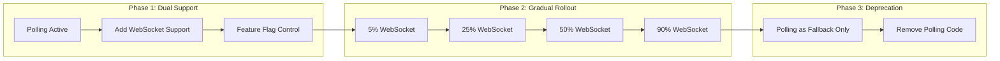

# Polling to WebSocket/SSE Migration Guide

## Overview

Migrating from polling to WebSocket or Server-Sent Events (SSE) dramatically reduces server load and improves real-time user experience. This guide provides a comprehensive approach to migration with minimal disruption.

## When to Migrate: Cost/Benefit Analysis

### Migration Decision Matrix

| Metric | Stay with Polling | Consider Migration | Migrate Now |
|--------|------------------|-------------------|-------------|
| Polling Frequency | >30s intervals | 5-30s intervals | <5s intervals |
| Concurrent Users | <1,000 | 1,000-10,000 | >10,000 |
| Data Freshness Need | Minutes acceptable | Seconds preferred | Real-time critical |
| Infrastructure Cost | <$1K/month | $1K-$10K/month | >$10K/month |
| Bandwidth Usage | <10GB/day | 10GB-100GB/day | >100GB/day |

### ROI Calculator

```python
def calculate_migration_roi(current_metrics):
    # Current polling costs
    requests_per_day = current_metrics['users'] * current_metrics['polls_per_user_per_day']
    bandwidth_gb = requests_per_day * current_metrics['avg_response_size_kb'] / 1_000_000
    
    current_costs = {
        'bandwidth': bandwidth_gb * 0.09,  # $/GB
        'compute': requests_per_day * 0.0000002,  # $/request
        'database': requests_per_day * 0.0000001   # $/query
    }
    
    # WebSocket costs (90% reduction in requests)
    ws_costs = {
        'bandwidth': current_costs['bandwidth'] * 0.1,
        'compute': current_costs['compute'] * 0.2,  # Persistent connections
        'database': current_costs['database'] * 0.1
    }
    
    # Migration costs
    migration_costs = {
        'development': 160 * 150,  # hours * $/hour
        'infrastructure': 5000,     # WebSocket infrastructure
        'testing': 80 * 150        # hours * $/hour
    }
    
    monthly_savings = sum(current_costs.values()) - sum(ws_costs.values())
    payback_months = sum(migration_costs.values()) / (monthly_savings * 30)
    
    return {
        'monthly_savings': monthly_savings * 30,
        'payback_period_months': payback_months,
        'first_year_roi': (monthly_savings * 365 - sum(migration_costs.values())) / sum(migration_costs.values()) * 100
    }
```

## Infrastructure Requirements

### WebSocket Infrastructure Setup

```yaml
websocket_infrastructure:
  load_balancer:
    type: "Application Load Balancer"
    sticky_sessions: true
    health_check:
      protocol: "WebSocket"
      path: "/ws/health"
      interval: 10s
  
  servers:
    instances: 3  # Minimum for HA
    specs:
      cpu: "4 vCPU"
      memory: "16 GB"
      network: "10 Gbps"
    
  connection_limits:
    per_server: 50000
    per_client_ip: 5
    idle_timeout: 300s
  
  message_broker:
    type: "Redis Cluster"
    nodes: 3
    persistence: true
    pub_sub_channels: true
```

### SSE Infrastructure Setup

```nginx
# Nginx configuration for SSE
location /events {
    proxy_pass http:/sse_backend;
    proxy_http_version 1.1;
    proxy_set_header Connection "";
    proxy_buffering off;
    proxy_cache off;
    proxy_read_timeout 86400s;
    
    # SSE specific headers
    add_header Content-Type text/event-stream;
    add_header Cache-Control no-cache;
    add_header X-Accel-Buffering no;
}
```

## Client Migration Strategy

### Progressive Enhancement Approach

```javascript
class RealtimeClient {
    constructor(config) {
        this.config = config;
        this.strategy = this.detectBestStrategy();
    }
    
    detectBestStrategy() {
        / Priority order: WebSocket > SSE > Long Polling > Short Polling
        if ('WebSocket' in window && this.config.websocketEnabled) {
            return new WebSocketStrategy(this.config);
        } else if ('EventSource' in window && this.config.sseEnabled) {
            return new SSEStrategy(this.config);
        } else {
            return new PollingStrategy(this.config);
        }
    }
    
    connect() {
        this.strategy.connect();
        this.setupFallbackMechanism();
    }
    
    setupFallbackMechanism() {
        this.strategy.on('error', (error) => {
            console.warn('Primary strategy failed, falling back', error);
            this.fallback();
        });
    }
    
    fallback() {
        if (this.strategy instanceof WebSocketStrategy) {
            this.strategy = new SSEStrategy(this.config);
        } else if (this.strategy instanceof SSEStrategy) {
            this.strategy = new PollingStrategy(this.config);
        }
        this.connect();
    }
}
```

### Migration Phases



## Fallback Mechanisms

### Automatic Fallback Implementation

```typescript
class ConnectionManager {
    private strategies = [
        { type: 'websocket', weight: 1.0 },
        { type: 'sse', weight: 0.8 },
        { type: 'long-poll', weight: 0.5 },
        { type: 'short-poll', weight: 0.3 }
    ];
    
    private currentStrategy: ConnectionStrategy;
    private fallbackTimer: NodeJS.Timeout;
    
    async connect(): Promise<void> {
        for (const strategy of this.strategies) {
            try {
                this.currentStrategy = await this.tryStrategy(strategy);
                this.monitorConnection();
                break;
            } catch (error) {
                console.warn(`Strategy ${strategy.type} failed:`, error);
                continue;
            }
        }
    }
    
    private monitorConnection(): void {
        this.currentStrategy.on('disconnect', () => {
            this.reconnectWithBackoff();
        });
        
        / Heartbeat monitoring
        setInterval(() => {
            if (!this.currentStrategy.isHealthy()) {
                this.fallbackToNext();
            }
        }, 30000);
    }
    
    private async reconnectWithBackoff(): Promise<void> {
        const delays = [1000, 2000, 4000, 8000, 16000];
        
        for (let i = 0; i < delays.length; i++) {
            await this.delay(delays[i]);
            
            try {
                await this.currentStrategy.reconnect();
                return;
            } catch (error) {
                if (i === delays.length - 1) {
                    this.fallbackToNext();
                }
            }
        }
    }
}
```

### Circuit Breaker for Fallback

```python
class CircuitBreaker:
    def __init__(self, failure_threshold=5, timeout=60):
        self.failure_threshold = failure_threshold
        self.timeout = timeout
        self.failures = 0
        self.last_failure_time = None
        self.state = 'CLOSED'  # CLOSED, OPEN, HALF_OPEN
    
    def call(self, func, *args, **kwargs):
        if self.state == 'OPEN':
            if time.time() - self.last_failure_time > self.timeout:
                self.state = 'HALF_OPEN'
            else:
                raise CircuitOpenError("Circuit breaker is OPEN")
        
        try:
            result = func(*args, **kwargs)
            if self.state == 'HALF_OPEN':
                self.state = 'CLOSED'
                self.failures = 0
            return result
        except Exception as e:
            self.record_failure()
            raise e
    
    def record_failure(self):
        self.failures += 1
        self.last_failure_time = time.time()
        
        if self.failures >= self.failure_threshold:
            self.state = 'OPEN'
```

## Performance Improvements Expected

### Benchmark Results from Production Migrations

```yaml
before_migration:
  avg_latency: "2500ms"  # Polling interval + processing
  requests_per_second: 10000
  bandwidth_usage: "500 GB/day"
  server_cpu_usage: "75%"
  database_load: "High - 50K queries/second"

after_migration:
  avg_latency: "50ms"  # Real-time updates
  connections: 10000  # Persistent connections
  bandwidth_usage: "50 GB/day"  # 90% reduction
  server_cpu_usage: "25%"  # 66% reduction
  database_load: "Low - 5K queries/second"  # 90% reduction

improvements:
  latency_reduction: "98%"
  bandwidth_savings: "90%"
  server_cost_savings: "70%"
  user_experience_score: "+35 points"
```

### Real-World Case Studies

#### Case Study 1: Stock Trading Platform

**Challenge:** 100K users polling every second for price updates

**Solution:**
```javascript
/ Before: Polling implementation
setInterval(async () => {
    const prices = await fetch('/api/prices');
    updateUI(prices);
}, 1000);

/ After: WebSocket implementation
const ws = new WebSocket('wss:/api.trading.com/prices');
ws.on('message', (data) => {
    const prices = JSON.parse(data);
    updateUI(prices);  / Instant updates
});
```

**Results:**
- Bandwidth: 10TB/day → 500GB/day
- Latency: 500ms average → 10ms average
- Infrastructure cost: $50K/month → $8K/month

#### Case Study 2: Collaboration Platform

**Challenge:** Real-time document collaboration with 50K concurrent users

**Solution:** Hybrid WebSocket + SSE approach
- WebSocket for bidirectional editing
- SSE for read-only viewers
- Automatic fallback chain

**Results:**
- User complaints about lag: 500/day → 5/day
- Server count: 100 → 20
- Database load: Reduced by 95%

## Implementation Walkthrough

### Step 1: Server-Side WebSocket Implementation

```python
# FastAPI WebSocket implementation
from fastapi import FastAPI, WebSocket, WebSocketDisconnect
from typing import Dict, Set
import json
import asyncio

app = FastAPI()

class ConnectionManager:
    def __init__(self):
        self.active_connections: Dict[str, Set[WebSocket]] = {}
        self.heartbeat_interval = 30
    
    async def connect(self, websocket: WebSocket, client_id: str):
        await websocket.accept()
        if client_id not in self.active_connections:
            self.active_connections[client_id] = set()
        self.active_connections[client_id].add(websocket)
        asyncio.create_task(self.heartbeat(websocket))
    
    def disconnect(self, websocket: WebSocket, client_id: str):
        self.active_connections[client_id].discard(websocket)
        if not self.active_connections[client_id]:
            del self.active_connections[client_id]
    
    async def broadcast_to_client(self, client_id: str, message: dict):
        if client_id in self.active_connections:
            disconnected = set()
            for connection in self.active_connections[client_id]:
                try:
                    await connection.send_json(message)
                except:
                    disconnected.add(connection)
            
            # Clean up disconnected clients
            for conn in disconnected:
                self.active_connections[client_id].discard(conn)
    
    async def heartbeat(self, websocket: WebSocket):
        try:
            while True:
                await asyncio.sleep(self.heartbeat_interval)
                await websocket.send_json({"type": "ping"})
        except:
            pass  # Connection closed

manager = ConnectionManager()

@app.websocket("/ws/{client_id}")
async def websocket_endpoint(websocket: WebSocket, client_id: str):
    await manager.connect(websocket, client_id)
    try:
        while True:
            data = await websocket.receive_json()
            # Process incoming messages
            if data["type"] == "pong":
                continue  # Heartbeat response
            else:
                await process_client_message(client_id, data)
    except WebSocketDisconnect:
        manager.disconnect(websocket, client_id)
```

### Step 2: Load Balancer Configuration

```yaml
# HAProxy configuration for WebSocket
global
    maxconn 50000
    tune.ssl.default-dh-param 2048

defaults
    mode http
    timeout connect 5000ms
    timeout client 30000ms
    timeout server 30000ms
    timeout tunnel 3600s  # For WebSocket connections

frontend websocket_frontend
    bind *:443 ssl crt /etc/ssl/certs/server.pem
    acl is_websocket hdr(Upgrade) -i WebSocket
    use_backend websocket_backend if is_websocket
    default_backend http_backend

backend websocket_backend
    balance source  # Sticky sessions based on source IP
    option http-server-close
    option forwardfor
    
    # WebSocket specific options
    timeout tunnel 1h
    
    server ws1 10.0.1.10:8000 check
    server ws2 10.0.1.11:8000 check
    server ws3 10.0.1.12:8000 check
```

### Step 3: Monitoring and Alerting

```yaml
monitoring_setup:
  metrics:
    - websocket_connections_active
    - websocket_messages_per_second
    - websocket_errors_per_minute
    - fallback_activations_per_hour
    - reconnection_attempts
    
  alerts:
    high_error_rate:
      condition: "websocket_errors_per_minute > 100"
      severity: "warning"
      
    mass_disconnections:
      condition: "websocket_connections_active drops by 20% in 1 minute"
      severity: "critical"
      
    high_fallback_rate:
      condition: "fallback_activations_per_hour > 1000"
      severity: "warning"

  dashboards:
    - connection_overview:
        - total_connections
        - connections_by_region
        - connection_duration_histogram
    
    - performance_metrics:
        - message_latency_p50_p95_p99
        - bandwidth_usage_over_time
        - cpu_memory_usage_by_server
```

## Testing Strategy

### Load Testing WebSockets

```python
# WebSocket load testing with locust
from locust import User, task, between
import websocket
import json
import time

class WebSocketUser(User):
    wait_time = between(1, 5)
    
    def on_start(self):
        self.ws = websocket.WebSocket()
        self.ws.connect(f"wss:/api.example.com/ws/{self.user_id}")
        self.last_message_time = time.time()
    
    @task
    def send_message(self):
        message = {
            "type": "data_request",
            "timestamp": time.time()
        }
        self.ws.send(json.dumps(message))
        
        # Wait for response
        response = self.ws.recv()
        latency = time.time() - message["timestamp"]
        
        # Report metrics
        self.environment.events.request.fire(
            request_type="WebSocket",
            name="data_request",
            response_time=latency * 1000,
            response_length=len(response),
            exception=None,
            context={}
        )
    
    def on_stop(self):
        self.ws.close()
```

### Migration Validation Tests

```bash
#!/bin/bash
# migration-validation.sh

# Test 1: Verify dual support
echo "Testing dual support..."
curl -X GET https:/api.example.com/data  # Polling endpoint
wscat -c wss:/api.example.com/ws  # WebSocket endpoint

# Test 2: Fallback mechanism
echo "Testing fallback..."
# Block WebSocket port temporarily
iptables -A OUTPUT -p tcp --dport 443 -j DROP
# Verify client falls back to polling
node test-client.js --expect-fallback

# Test 3: Performance comparison
echo "Running performance comparison..."
artillery run polling-scenario.yml -o polling-results.json
artillery run websocket-scenario.yml -o websocket-results.json
compare-results.py polling-results.json websocket-results.json
```

## Common Issues and Solutions

### Issue 1: Connection Drops Behind Corporate Proxies

**Solution:**
```javascript
/ Implement aggressive reconnection with exponential backoff
class RobustWebSocket {
    constructor(url, options = {}) {
        this.url = url;
        this.reconnectInterval = options.reconnectInterval || 1000;
        this.maxReconnectInterval = options.maxReconnectInterval || 30000;
        this.reconnectDecay = options.reconnectDecay || 1.5;
        this.reconnectAttempts = 0;
        this.forcedClose = false;
    }
    
    connect() {
        this.ws = new WebSocket(this.url);
        
        this.ws.onopen = () => {
            this.reconnectAttempts = 0;
            this.onopen?.();
        };
        
        this.ws.onclose = (event) => {
            if (!this.forcedClose) {
                this.reconnect();
            }
            this.onclose?.(event);
        };
        
        this.ws.onerror = (error) => {
            this.onerror?.(error);
        };
    }
    
    reconnect() {
        const timeout = Math.min(
            this.reconnectInterval * Math.pow(this.reconnectDecay, this.reconnectAttempts),
            this.maxReconnectInterval
        );
        
        this.reconnectAttempts++;
        
        setTimeout(() => {
            this.connect();
        }, timeout);
    }
}
```

### Issue 2: Memory Leaks with Long-Lived Connections

**Solution:**
```python
# Implement connection recycling
class ConnectionRecycler:
    def __init__(self, max_age_hours=24):
        self.max_age = max_age_hours * 3600
        self.connections = {}
    
    async def add_connection(self, conn_id, websocket):
        self.connections[conn_id] = {
            'websocket': websocket,
            'created_at': time.time()
        }
    
    async def recycle_old_connections(self):
        while True:
            current_time = time.time()
            to_recycle = []
            
            for conn_id, conn_info in self.connections.items():
                age = current_time - conn_info['created_at']
                if age > self.max_age:
                    to_recycle.append(conn_id)
            
            for conn_id in to_recycle:
                await self.graceful_reconnect(conn_id)
            
            await asyncio.sleep(3600)  # Check hourly
    
    async def graceful_reconnect(self, conn_id):
        conn_info = self.connections[conn_id]
        websocket = conn_info['websocket']
        
        # Send reconnect request to client
        await websocket.send_json({
            'type': 'reconnect_required',
            'reason': 'connection_recycling'
        })
        
        # Give client time to reconnect
        await asyncio.sleep(5)
        
        # Close old connection
        await websocket.close()
        del self.connections[conn_id]
```

## Success Metrics

```sql
-- Connection health metrics
WITH connection_stats AS (
    SELECT
        DATE_TRUNC('hour', created_at) as hour,
        COUNT(*) as total_connections,
        AVG(duration_seconds) as avg_connection_duration,
        PERCENTILE_CONT(0.95) WITHIN GROUP (ORDER BY duration_seconds) as p95_duration,
        SUM(CASE WHEN disconnect_reason = 'error' THEN 1 ELSE 0 END) as error_disconnects
    FROM websocket_connections
    WHERE created_at > NOW() - INTERVAL '7 days'
    GROUP BY 1
)
SELECT
    hour,
    total_connections,
    avg_connection_duration,
    p95_duration,
    error_disconnects,
    error_disconnects::FLOAT / total_connections * 100 as error_rate
FROM connection_stats
ORDER BY hour DESC;

-- Message latency tracking
SELECT
    DATE_TRUNC('minute', timestamp) as minute,
    AVG(client_receive_time - server_send_time) as avg_latency_ms,
    PERCENTILE_CONT(0.5) WITHIN GROUP (ORDER BY client_receive_time - server_send_time) as p50_latency,
    PERCENTILE_CONT(0.95) WITHIN GROUP (ORDER BY client_receive_time - server_send_time) as p95_latency,
    PERCENTILE_CONT(0.99) WITHIN GROUP (ORDER BY client_receive_time - server_send_time) as p99_latency
FROM message_latency_tracking
WHERE timestamp > NOW() - INTERVAL '1 hour'
GROUP BY 1
ORDER BY 1 DESC;
```

## Post-Migration Checklist

- [ ] All polling endpoints deprecated
- [ ] WebSocket/SSE endpoints load tested
- [ ] Fallback mechanisms verified
- [ ] Monitoring dashboards configured
- [ ] Alert rules implemented
- [ ] Client libraries updated
- [ ] Documentation updated
- [ ] Team trained on new architecture
- [ ] Cost savings verified
- [ ] Performance improvements documented

## Additional Resources

- [WebSocket Protocol Deep Dive](../protocols/websocket.md)
- [Server-Sent Events Guide](../protocols/sse.md)
- Real-time Architecture Patterns
- [Load Balancing WebSockets](../infrastructure/websocket-load-balancing.md)