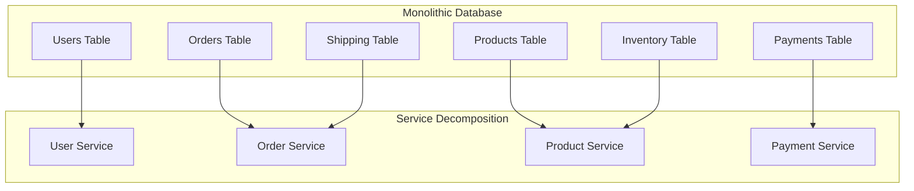
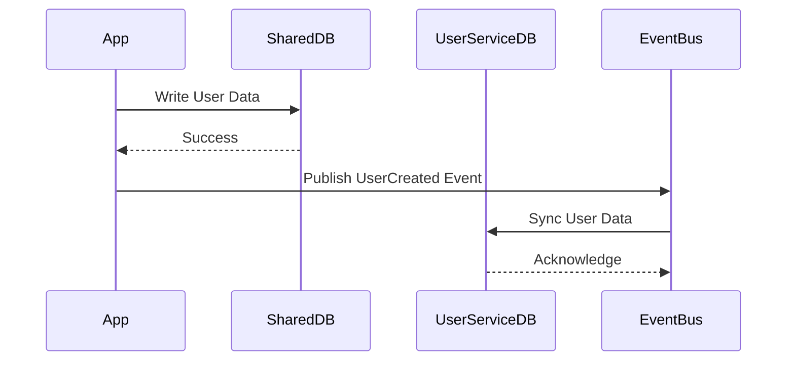

# Shared Database to Microservices Migration Guide

## Overview

Migrating from a shared database to microservices with isolated data stores is one of the most challenging architectural transformations. This guide provides proven strategies for breaking monolithic databases into service-specific stores while maintaining data consistency and system availability.

## Pre-Migration Assessment Checklist

### System Readiness Assessment

```yaml
readiness_criteria:
  business:
    - [ ] Service boundaries clearly defined
    - [ ] Data ownership model approved
    - [ ] Eventual consistency tolerance assessed
    - [ ] Budget for increased infrastructure approved
  
  technical:
    - [ ] Database schema fully documented
    - [ ] Cross-table dependencies mapped
    - [ ] Transaction boundaries identified
    - [ ] Integration patterns selected (sync/async)
  
  team:
    - [ ] Team structure aligns with service ownership
    - [ ] Distributed systems expertise available
    - [ ] DevOps practices mature (CI/CD, monitoring)
    - [ ] On-call rotation planned per service
```

### Migration Complexity Estimator

| Factor | Low Complexity (1pt) | Medium (3pts) | High (5pts) |
|--------|---------------------|----------------|--------------|
| Database Size | <100GB | 100GB-1TB | >1TB |
| Number of Tables | <50 | 50-200 | >200 |
| Service Count | 3-5 services | 6-10 services | >10 services |
| Transaction Complexity | Single table | 2-3 tables | Many tables |
| Read/Write Ratio | Mostly reads | Balanced | Write heavy |

**Score Interpretation:**
- 5-10 points: 3-6 month migration
- 11-20 points: 6-12 month migration
- 21-25 points: 12-18 month migration with multiple phases

## Week-by-Week Migration Plan

### Week 1-2: Service Boundary Definition



**Domain Driven Design Session Output:**
```yaml
bounded_contexts:
  user_management:
    tables: [users, user_profiles, user_preferences]
    primary_entity: User
    relationships: 
      - owns: [profiles, preferences]
  
  order_management:
    tables: [orders, order_items, shipping_details]
    primary_entity: Order
    relationships:
      - references: [users, products]
      - owns: [order_items, shipping]
  
  product_catalog:
    tables: [products, categories, inventory]
    primary_entity: Product
    relationships:
      - owns: [inventory, categories]
  
  payment_processing:
    tables: [payments, payment_methods, transactions]
    primary_entity: Payment
    relationships:
      - references: [users, orders]
```

### Week 3-4: Data Access Layer Implementation

```python
# Step 1: Introduce Repository Pattern
class OrderRepository:
    def __init__(self, db_connection):
        self.db = db_connection
        self.cache = RedisCache()
    
    def find_by_id(self, order_id):
        # Check cache first
        cached = self.cache.get(f"order:{order_id}")
        if cached:
            return cached
        
        # Query database
        order = self.db.query(
            "SELECT * FROM orders WHERE id = ?", 
            order_id
        )
        
        # Denormalize for service isolation
        order['user'] = self.get_user_info(order['user_id'])
        order['items'] = self.get_order_items(order_id)
        
        self.cache.set(f"order:{order_id}", order, ttl=300)
        return order
    
    def get_user_info(self, user_id):
        # This will eventually become an API call
        return self.db.query(
            "SELECT id, name, email FROM users WHERE id = ?",
            user_id
        )
```

### Week 5-6: Parallel Data Writes



**Dual Write Implementation:**
```python
class DualWriteUserService:
    def __init__(self):
        self.legacy_db = LegacyDatabase()
        self.new_db = UserServiceDatabase()
        self.event_publisher = EventPublisher()
    
    def create_user(self, user_data):
        # Write to legacy database first
        legacy_user = self.legacy_db.insert_user(user_data)
        
        try:
            # Write to new service database
            new_user = self.new_db.insert_user(user_data)
            
            # Publish event for other services
            self.event_publisher.publish(
                'user.created',
                {
                    'user_id': new_user['id'],
                    'timestamp': datetime.now()
                }
            )
        except Exception as e:
            # Log discrepancy for reconciliation
            self.log_sync_failure(legacy_user['id'], str(e))
            # Don't fail the request
        
        return legacy_user
```

### Week 7-8: Cross-Service Queries

```python
# Before: Single Database Join
def get_order_details(order_id):
    return db.query("""
        SELECT o.*, u.name, u.email, p.name as product_name
        FROM orders o
        JOIN users u ON o.user_id = u.id
        JOIN order_items oi ON o.id = oi.order_id
        JOIN products p ON oi.product_id = p.id
        WHERE o.id = ?
    """, order_id)

# After: Service Composition
class OrderAggregationService:
    def __init__(self):
        self.order_service = OrderServiceClient()
        self.user_service = UserServiceClient()
        self.product_service = ProductServiceClient()
    
    async def get_order_details(self, order_id):
        # Parallel API calls
        order_future = self.order_service.get_order(order_id)
        
        order = await order_future
        
        # Parallel fetch of related data
        user_future = self.user_service.get_user(order['user_id'])
        product_futures = [
            self.product_service.get_product(item['product_id'])
            for item in order['items']
        ]
        
        # Aggregate results
        order['user'] = await user_future
        order['products'] = await asyncio.gather(*product_futures)
        
        return order
```

### Week 9-10: Transaction Management

```python
# Saga Pattern Implementation for Distributed Transactions
class OrderSaga:
    def __init__(self):
        self.saga_log = SagaLog()
        self.compensations = []
    
    async def create_order(self, order_request):
        saga_id = generate_id()
        
        try:
            # Step 1: Reserve inventory
            reservation = await self.reserve_inventory(
                order_request['items']
            )
            self.compensations.append(
                lambda: self.release_inventory(reservation)
            )
            
            # Step 2: Process payment
            payment = await self.process_payment(
                order_request['payment_info']
            )
            self.compensations.append(
                lambda: self.refund_payment(payment)
            )
            
            # Step 3: Create order
            order = await self.create_order_record(
                order_request, reservation, payment
            )
            
            # Step 4: Notify shipping
            await self.notify_shipping(order)
            
            await self.saga_log.mark_complete(saga_id)
            return order
            
        except Exception as e:
            # Execute compensations in reverse order
            for compensation in reversed(self.compensations):
                await compensation()
            
            await self.saga_log.mark_failed(saga_id, str(e))
            raise
```

### Week 11-12: Data Migration Execution

```yaml
migration_strategy:
  phase_1_shadow_reads:
    duration: 2_weeks
    approach:
      - New services read from their databases
      - Fall back to legacy DB if data missing
      - Log all fallback occurrences
      - Sync missing data asynchronously
  
  phase_2_primary_reads:
    duration: 2_weeks
    approach:
      - New services are primary data source
      - Legacy DB updated via events
      - Monitor data consistency
      - Fix any sync issues
  
  phase_3_deprecate_legacy:
    duration: 1_week
    approach:
      - Stop writes to legacy tables
      - Archive legacy data
      - Remove legacy dependencies
      - Celebrate!
```

## Common Pitfalls and Solutions

### Pitfall 1: Distributed Joins

**Problem:** Cannot join across service boundaries efficiently

**Solution:**
```python
# CQRS Pattern with Materialized Views
class OrderReadModel:
    def __init__(self):
        self.read_db = ReadOptimizedDatabase()
        self.event_consumer = EventConsumer()
    
    def start_projection(self):
        self.event_consumer.subscribe([
            'order.created',
            'user.updated',
            'product.updated'
        ], self.handle_event)
    
    def handle_event(self, event):
        if event.type == 'order.created':
            # Denormalize order data
            order_view = self.build_order_view(event.data)
            self.read_db.upsert_order_view(order_view)
        
        elif event.type == 'user.updated':
            # Update all orders for this user
            self.read_db.update_user_in_orders(
                event.data['user_id'],
                event.data['changes']
            )
```

### Pitfall 2: Referential Integrity

**Problem:** No foreign keys across services

**Solution:**
```yaml
referential_integrity_patterns:
  soft_references:
    description: Store IDs without FK constraints
    validation: Runtime API checks
    example: order.user_id references user service
  
  event_driven_sync:
    description: Sync deletions via events
    implementation:
      - User deletion publishes user.deleted
      - Order service handles orphaned orders
      - Configurable strategies (hide/delete/archive)
  
  reference_data_cache:
    description: Cache frequently accessed references
    implementation:
      - Local cache of user data in order service
      - TTL-based invalidation
      - Event-based cache updates
```

### Pitfall 3: Report Generation

**Problem:** Reports need data from multiple services

**Solution:**
```python
# Data Lake Pattern for Analytics
class AnalyticsDataPipeline:
    def __init__(self):
        self.data_lake = S3DataLake()
        self.services = [
            UserServiceClient(),
            OrderServiceClient(),
            ProductServiceClient()
        ]
    
    def daily_export(self):
        date = datetime.now().strftime('%Y-%m-%d')
        
        for service in self.services:
            # Each service exports its data
            data = service.export_daily_snapshot()
            
            # Store in data lake
            self.data_lake.store(
                f"{service.name}/{date}/data.parquet",
                data
            )
        
        # Trigger analytics job
        self.trigger_etl_job(date)
```

## Real Company Migration Stories

### Case Study 1: E-Commerce Giant

**Scale:** 500M users, 1B+ orders/year
**Timeline:** 18 months
**Team Size:** 50 engineers

**Approach:**
1. Started with read-only services (product catalog)
2. Moved to low-risk writes (user preferences)
3. Tackled core business logic (orders)
4. Kept monolith for complex reports

**Results:**
- 10x improvement in deployment frequency
- 75% reduction in incident escalations
- 90% faster feature development

**Challenges:**
- Initial performance degradation from network calls
- Complex data migration required custom tooling
- Cultural shift to service ownership

### Case Study 2: Financial Services

**Scale:** 10M accounts, strict consistency requirements
**Timeline:** 24 months
**Team Size:** 30 engineers

**Approach:**
1. Domain modeling with finance experts
2. Event sourcing for audit requirements
3. Gradual service extraction by subdomain
4. Extensive reconciliation systems

**Results:**
- 99.999% data consistency maintained
- 5x improvement in system resilience
- 60% reduction in regulatory audit time

**Key Decisions:**
- Kept transaction processing monolithic initially
- Built comprehensive event store
- Invested heavily in monitoring and reconciliation

## Success Metrics

### Technical Metrics
```yaml
sla_targets:
  api_latency_p99: <100ms
  data_consistency: 99.99%
  service_availability: 99.95%
  deployment_frequency: daily
  
monitoring_queries:
  consistency_check: |
    SELECT 
      service_name,
      COUNT(*) as total_entities,
      SUM(CASE WHEN is_consistent THEN 1 ELSE 0 END) as consistent_entities
    FROM consistency_audit
    WHERE check_time > NOW() - INTERVAL '1 hour'
    GROUP BY service_name
  
  api_performance: |
    SELECT 
      service_name,
      endpoint,
      percentile_cont(0.99) WITHIN GROUP (ORDER BY duration) as p99_latency
    FROM api_metrics
    WHERE timestamp > NOW() - INTERVAL '5 minutes'
    GROUP BY service_name, endpoint
```

### Business Metrics
- Time to market for new features
- Service team autonomy score
- Incident resolution time
- Development velocity per team

## Rollback Procedures

### Emergency Rollback Plan

```bash
#!/bin/bash
# emergency-rollback-to-monolith.sh

# 1. Route all traffic to monolith
kubectl patch virtualservice api-gateway \
  --patch '{"spec":{"http":[{"route":[{"destination":{"host":"monolith"}}]}]}}'

# 2. Disable service writes
for service in $(kubectl get deployments -l type=microservice -o name); do
  kubectl set env $service WRITE_ENABLED=false
done

# 3. Sync service data back to monolith
./reverse-sync-data.sh --source=services --target=monolith

# 4. Validate monolith data integrity
./validate-monolith-data.sh

# 5. Scale down services
kubectl scale deployments -l type=microservice --replicas=0
```

### Gradual Rollback
1. Route specific endpoints back to monolith
2. Monitor for 24-48 hours
3. Debug issues in isolated environment
4. Resume migration after fixes

## Migration Completion Checklist

- [ ] All services deployed and stable
- [ ] Monolith database decomposed
- [ ] Service ownership established
- [ ] Monitoring and alerting configured
- [ ] Runbooks created and tested
- [ ] Team training completed
- [ ] Performance benchmarks met
- [ ] Post-mortem documented

## Additional Resources

- Domain-Driven Design Patterns
- Microservices Data Patterns
- [Event Sourcing Guide](../../../pattern-library/data-management/event-sourcing/)
- [Service Mesh Implementation](../../../pattern-library/communication/service-mesh/)