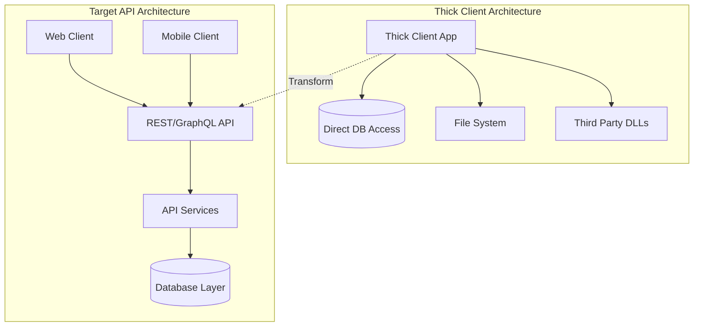
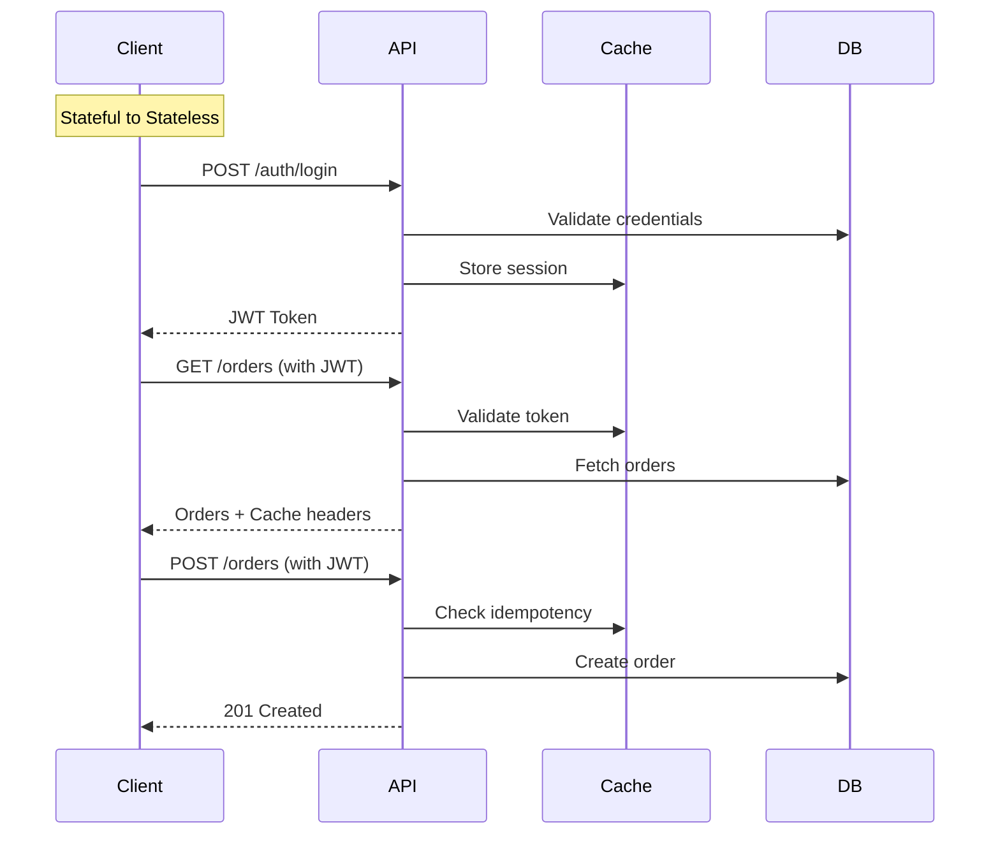

# Thick Client to API-First Migration Guide

## Overview

Migrating from thick client architectures to API-first design transforms tightly coupled, desktop-centric applications into flexible, platform-agnostic services. This guide provides proven strategies for modernizing legacy thick clients while maintaining business continuity.

## Pre-Migration Assessment Checklist

### System Readiness Assessment

```yaml
readiness_criteria:
  business:
    - [ ] Business logic extraction strategy defined
    - [ ] API versioning strategy approved
    - [ ] Security model for APIs established
    - [ ] Mobile/web strategy documented
  
  technical:
    - [ ] Client-server communication mapped
    - [ ] Stateful operations identified
    - [ ] Database access patterns documented
    - [ ] Third-party integrations cataloged
  
  team:
    - [ ] API design expertise available
    - [ ] Frontend development skills present
    - [ ] Security team engaged
    - [ ] DevOps practices established
```

### Migration Complexity Estimator

| Factor | Low Complexity (1pt) | Medium (3pts) | High (5pts) |
|--------|---------------------|----------------|--------------|
| Business Logic Location | Mostly server-side | Mixed client/server | Mostly client-side |
| State Management | Stateless operations | Some session state | Heavy client state |
| UI Complexity | Simple forms | Complex workflows | Rich interactions |
| Data Volume | Small payloads | Medium data sets | Large binary data |
| User Base | <1000 users | 1000-10000 users | >10000 users |

**Score Interpretation:**
- 5-10 points: 3-4 month migration
- 11-20 points: 4-8 month migration
- 21-25 points: 8-12 month migration with phased approach

## Week-by-Week Migration Plan

### Week 1-2: Architecture Analysis



**Analysis Deliverables:**
- Business logic inventory
- Data flow diagrams
- Integration points map
- Security requirements

### Week 3-4: API Design

```yaml
api_design_approach:
  principles:
    - Resource-oriented design
    - Stateless operations
    - Version from day one
    - Security by default
  
  patterns:
    rest_api:
      - GET /api/v1/customers
      - POST /api/v1/customers
      - GET /api/v1/customers/{id}
      - PUT /api/v1/customers/{id}
      - DELETE /api/v1/customers/{id}
    
    graphql_api:
      - Query for flexible data fetching
      - Mutations for state changes
      - Subscriptions for real-time updates
```

### Week 5-6: Business Logic Extraction

```python
# Before: Business logic in thick client
class ThickClientOrderProcessor:
    def __init__(self):
        self.db = DirectDatabaseConnection()
        self.validator = LocalValidator()
    
    def process_order(self, order_data):
        # Validation in client
        if not self.validator.validate_order(order_data):
            raise ValidationError("Invalid order")
        
        # Direct database access
        customer = self.db.query(
            "SELECT * FROM customers WHERE id = ?", 
            order_data['customer_id']
        )
        
        # Business logic in client
        discount = self.calculate_discount(customer, order_data)
        total = self.calculate_total(order_data, discount)
        
        # Direct database write
        self.db.execute(
            "INSERT INTO orders VALUES (?, ?, ?)",
            (order_data['id'], total, customer['id'])
        )

# After: Business logic in API
class OrderAPIService:
    def __init__(self):
        self.order_service = OrderService()
        self.auth_service = AuthService()
    
    @api_endpoint('/api/v1/orders', method='POST')
    @authenticate
    @validate_schema(OrderSchema)
    def create_order(self, request):
        # Extract user context
        user = self.auth_service.get_user(request.token)
        
        # Delegate to service layer
        order = self.order_service.create_order(
            request.json,
            user
        )
        
        # Return API response
        return {
            'status': 'success',
            'data': order.to_dict(),
            'links': {
                'self': f'/api/v1/orders/{order.id}',
                'payment': f'/api/v1/orders/{order.id}/payment'
            }
        }
```

### Week 7-8: State Management Strategy



### Week 9-10: Progressive Migration

```python
# Strangler Fig Pattern Implementation
class HybridClient:
    def __init__(self):
        self.legacy_processor = LegacyThickClientCode()
        self.api_client = ModernAPIClient()
        self.feature_flags = FeatureFlags()
    
    def process_request(self, operation, data):
        # Check if operation is migrated
        if self.feature_flags.is_enabled(f"api_{operation}"):
            return self.api_client.call(operation, data)
        else:
            return self.legacy_processor.execute(operation, data)
    
    def gradual_rollout(self, operation, percentage):
        # Route percentage of traffic to API
        if random.random() < percentage / 100:
            try:
                result = self.api_client.call(operation, data)
                self.log_api_success(operation)
                return result
            except Exception as e:
                self.log_api_failure(operation, e)
                # Fallback to legacy
                return self.legacy_processor.execute(operation, data)
        else:
            return self.legacy_processor.execute(operation, data)
```

### Week 11-12: Client Migration

**Modern Client Architecture:**
```typescript
// React/Angular/Vue client consuming APIs
class OrderService {
    private apiClient: APIClient;
    private cache: CacheService;
    
    async getOrders(filters?: OrderFilters): Promise<Order[]> {
        // Check cache first
        const cacheKey = `orders_${JSON.stringify(filters)}`;
        const cached = await this.cache.get(cacheKey);
        if (cached) return cached;
        
        // API call with retry logic
        const response = await this.apiClient
            .get('/api/v1/orders', { params: filters })
            .retry(3)
            .timeout(5000);
        
        // Cache response
        await this.cache.set(cacheKey, response.data, 300);
        
        return response.data;
    }
    
    async createOrder(orderData: CreateOrderDTO): Promise<Order> {
        // Optimistic UI update
        const tempOrder = { ...orderData, id: 'temp_' + Date.now() };
        this.store.addOrder(tempOrder);
        
        try {
            const response = await this.apiClient
                .post('/api/v1/orders', orderData);
            
            // Replace temp with real order
            this.store.replaceOrder(tempOrder.id, response.data);
            return response.data;
        } catch (error) {
            // Rollback optimistic update
            this.store.removeOrder(tempOrder.id);
            throw error;
        }
    }
}
```

## Common Pitfalls and Solutions

### Pitfall 1: Chatty API Design

**Problem:** Direct translation of thick client calls creates hundreds of API calls

**Solution:**
```yaml
api_aggregation_patterns:
  backend_for_frontend:
    - Create specialized APIs per client type
    - Aggregate multiple resources in single call
    - Optimize for specific UI needs
  
  graphql_adoption:
    - Let clients request exactly what they need
    - Reduce over-fetching and under-fetching
    - Single endpoint for all queries
  
  response_composition:
    before: 
      - GET /customers/123
      - GET /orders?customer_id=123
      - GET /payments?customer_id=123
    
    after:
      - GET /customers/123?include=orders,payments
```

### Pitfall 2: Authentication & Session Management

**Problem:** Thick clients often use Windows auth or long-lived sessions

**Solution:**
```python
# Modern JWT-based authentication
class APIAuthenticationMiddleware:
    def __init__(self):
        self.jwt_secret = os.environ['JWT_SECRET']
        self.refresh_service = RefreshTokenService()
    
    def authenticate(self, request):
        # Extract token from header
        auth_header = request.headers.get('Authorization')
        if not auth_header:
            raise Unauthorized('Missing authorization')
        
        try:
            # Verify JWT
            token = auth_header.replace('Bearer ', '')
            payload = jwt.decode(token, self.jwt_secret, 'HS256')
            
            # Check expiration
            if payload['exp'] < time.time():
                raise TokenExpired('Token expired')
            
            # Attach user context
            request.user = User(payload['user_id'])
            
        except jwt.InvalidTokenError:
            raise Unauthorized('Invalid token')
    
    def refresh_token(self, refresh_token):
        # Validate refresh token
        if self.refresh_service.is_valid(refresh_token):
            # Issue new access token
            return self.create_token(
                self.refresh_service.get_user(refresh_token)
            )
```

### Pitfall 3: File Upload/Download

**Problem:** Thick clients handle large files directly; APIs have size limits

**Solution:**
```python
# Chunked upload implementation
class FileUploadAPI:
    def __init__(self):
        self.storage = S3Storage()
        self.chunk_size = 5 * 1024 * 1024  # 5MB chunks
    
    @api_endpoint('/api/v1/files/init', method='POST')
    def init_upload(self, request):
        file_info = request.json
        upload_id = str(uuid.uuid4())
        
        # Create multipart upload
        s3_upload = self.storage.create_multipart_upload(
            file_info['filename'],
            file_info['content_type']
        )
        
        # Generate presigned URLs for chunks
        urls = []
        for i in range(file_info['total_chunks']):
            url = self.storage.generate_presigned_url(
                s3_upload['upload_id'],
                i + 1
            )
            urls.append(url)
        
        return {
            'upload_id': upload_id,
            's3_upload_id': s3_upload['upload_id'],
            'chunk_urls': urls
        }
    
    @api_endpoint('/api/v1/files/complete', method='POST')
    def complete_upload(self, request):
        # Complete multipart upload
        result = self.storage.complete_multipart_upload(
            request.json['s3_upload_id'],
            request.json['parts']
        )
        
        return {
            'file_url': result['Location'],
            'etag': result['ETag']
        }
```

## Real Company Migration Stories

### Case Study 1: Financial Trading Platform

**Timeline:** 12 months
**Scale:** 50,000 daily active traders

**Approach:**
1. Started with read-only APIs (market data)
2. Migrated authentication to OAuth2/JWT
3. Gradually moved trading operations
4. Kept thick client as optional "power user" tool

**Results:**
- 90% users migrated to web platform
- Mobile app launched with same APIs
- 60% reduction in support tickets
- 10x faster feature deployment

**Challenges:**
- Real-time data required WebSocket implementation
- Legacy thick client had complex hotkey system
- Regulatory requirements for audit trails

### Case Study 2: Healthcare Management System

**Timeline:** 18 months
**Scale:** 500 hospitals, 100K users

**Approach:**
1. API-first redesign with FHIR standards
2. Module-by-module migration
3. Hybrid client during transition
4. Progressive web app for mobile

**Results:**
- 100% API coverage achieved
- 3 new client types supported (web, mobile, tablet)
- 70% reduction in deployment complexity
- Integration with 3rd party systems enabled

**Key Decisions:**
- Kept thick client for complex imaging workflows
- Built offline-first web client for reliability
- Implemented comprehensive API versioning

## Success Metrics

### Technical Metrics
```yaml
sla_targets:
  api_latency_p95: <200ms
  api_availability: 99.9%
  client_load_time: <3s
  api_version_adoption: >80% on latest
  
monitoring_dashboard:
  - API response times by endpoint
  - Client type distribution
  - Feature flag adoption rates
  - Error rates by client version
  
performance_benchmarks:
  before_thick_client:
    startup_time: 45s
    memory_usage: 2GB
    deployment: manual_installer
  
  after_api_client:
    startup_time: 3s
    memory_usage: 200MB
    deployment: continuous
```

### Business Metrics
- User adoption rate of new clients
- Feature deployment frequency
- Platform reach (web, mobile, partners)
- Support ticket reduction
- Development velocity improvement

## Rollback Procedures

### Emergency Rollback Plan

```bash
#!/bin/bash
# emergency-rollback-to-thick-client.sh

# 1. Disable new client access
update-feature-flag.sh --flag=new_client_enabled --value=false

# 2. Route all traffic to legacy infrastructure
update-load-balancer.sh --backend=legacy_servers

# 3. Notify users
send-notification.sh --message="Temporary switch to classic client"

# 4. Restore thick client database access
restore-db-permissions.sh --client=thick_client

# 5. Monitor system stability
monitor-legacy-system.sh --duration=24h
```

### Gradual Rollback
1. Keep thick client as fallback option
2. Maintain feature parity during transition
3. Allow users to switch between clients
4. Monitor usage patterns and issues

## Migration Completion Checklist

- [ ] All business logic exposed via APIs
- [ ] Modern clients (web/mobile) deployed
- [ ] Authentication system modernized
- [ ] API documentation complete
- [ ] Monitoring and analytics in place
- [ ] Team trained on API-first development
- [ ] Legacy thick client deprecated
- [ ] Post-mortem completed

## Additional Resources

- [API Design Best Practices](/patterns/api-design.md)
- [RESTful Architecture](/patterns/rest.md)
- [GraphQL Patterns](/patterns/graphql-federation.md)
- [Authentication Patterns](/patterns/auth-patterns.md)