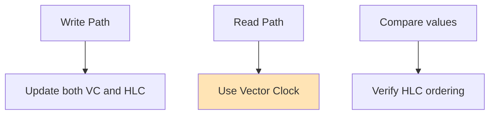
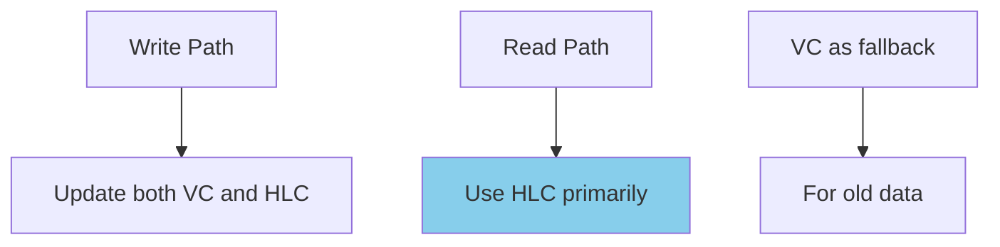
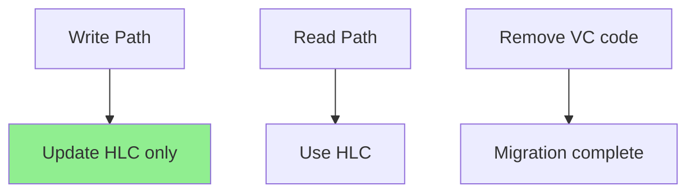
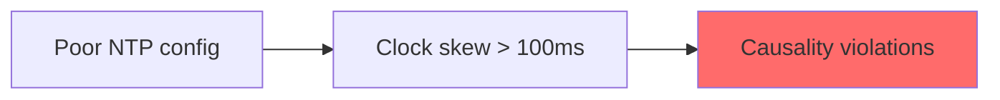

# Migrating from Vector Clocks to HLC

!!! success "Migration Benefits"
    - **90% space reduction**: From O(n) to fixed 64-bit timestamps
    - **Human-readable timestamps**: Approximate wall-clock time
    - **Better scalability**: No growth with cluster size
    - **Simpler operations**: No vector merging complexity

## When to Migrate

### ✅ Good Candidates
- Systems with >100 nodes where vector size is problematic
- Applications needing human-readable timestamps
- Services requiring timestamp-based queries
- Distributed databases with global ordering needs

### ❌ Poor Candidates
- Systems requiring concurrent update detection
- Applications with <10 nodes where vector overhead is minimal
- Services needing full causality information
- Systems without any clock synchronization

## Migration Overview

```mermaid
graph LR
    subgraph "Before: Vector Clocks"
        VC[Vector Clock<br/>[5,3,7,2,9,1,4,8]]
        VCSize[Size: O(n) × 8 bytes]
        VCOps[Complex merge operations]
    end
    
    subgraph "After: HLC"
        HLC[HLC Timestamp<br/>1706280000.42]
        HLCSize[Size: 8 bytes fixed]
        HLCOps[Simple max operations]
    end
    
    VC --> HLC
    VCSize --> HLCSize
    VCOps --> HLCOps
    
    style HLCSize fill:#90EE90
    style HLCOps fill:#90EE90
```

## Pre-Migration Checklist

| ✓ | Task | Why Important |
|---|------|---------------|
| ☐ | Verify clock synchronization (NTP/PTP) | HLC requires bounded clock skew |
| ☐ | Identify concurrent update detection usage | May need alternative approach |
| ☐ | Audit vector clock comparison logic | Will need rewriting for HLC |
| ☐ | Plan for data format changes | Storage schema will change |
| ☐ | Test HLC implementation | Ensure correctness before migration |

## Migration Strategy

### Phase 1: Parallel Running


### Phase 2: Read Migration


### Phase 3: Write Migration


## Code Migration Examples

### Before: Vector Clock Operations
```python
class VectorClockSystem:
    def update(self, node_id: str):
        self.vector[node_id] = self.vector.get(node_id, 0) + 1
    
    def merge(self, other_vector):
        for node, timestamp in other_vector.items():
            self.vector[node] = max(self.vector.get(node, 0), timestamp)
    
    def compare(self, other):
        # Returns: -1 (before), 0 (concurrent), 1 (after)
        self_ahead = any(self.vector.get(n, 0) > other.get(n, 0) 
                        for n in set(self.vector) | set(other))
        other_ahead = any(other.get(n, 0) > self.vector.get(n, 0) 
                         for n in set(self.vector) | set(other))
        
        if self_ahead and not other_ahead:
            return 1
        elif other_ahead and not self_ahead:
            return -1
        elif not self_ahead and not other_ahead:
            return 0  # Equal
        else:
            return 0  # Concurrent
```

### After: HLC Operations
```python
class HLCSystem:
    def update(self):
        now = time.time()
        if now > self.physical:
            self.physical = now
            self.logical = 0
        else:
            self.logical += 1
    
    def merge(self, other_hlc):
        now = time.time()
        max_phys = max(self.physical, other_hlc.physical, now)
        
        if max_phys == now:
            self.logical = 0
        elif max_phys == self.physical == other_hlc.physical:
            self.logical = max(self.logical, other_hlc.logical) + 1
        elif max_phys == self.physical:
            self.logical += 1
        else:
            self.logical = other_hlc.logical + 1
        
        self.physical = max_phys
    
    def compare(self, other):
        # Simple comparison - no concurrent detection
        if self.physical != other.physical:
            return 1 if self.physical > other.physical else -1
        return 1 if self.logical > other.logical else (-1 if self.logical < other.logical else 0)
```

## Handling Lost Functionality

### Concurrent Update Detection

Vector clocks can detect concurrent updates, HLC cannot. Alternatives:

1. **Application-level detection**: Track last writer
2. **Version vectors**: Maintain separate version tracking
3. **CRDT approach**: Use data structures that handle concurrency

### Debugging Causality

Vector clocks show full causality chain, HLC shows only ordering:

1. **Add tracing**: Include source node in metadata
2. **Maintain lineage**: Track operation history separately
3. **Use distributed tracing**: OpenTelemetry for causality

## Common Pitfalls

### 1. Inadequate Clock Sync


**Solution**: Monitor clock skew, use PTP in datacenters

### 2. Counter Overflow


**Solution**: Use microsecond precision physical time

### 3. Timestamp Comparison
```python
## ❌ Wrong: Comparing with wall clock
if hlc_timestamp > time.time():
    # This is incorrect!

## ✅ Correct: Always use HLC comparison
if hlc1.compare(hlc2) > 0:
    # hlc1 is after hlc2
```

## Rollback Plan

If migration fails:

1. **Dual-write period**: Both systems updated
2. **Feature flags**: Toggle between implementations
3. **Data recovery**: Rebuild vector clocks from HLC + metadata

## Post-Migration

### Monitoring
- Clock skew between nodes
- HLC drift from physical time
- Counter overflow frequency
- Causality violation alerts

### Performance Gains
- Message size: 8 bytes vs O(n)×8 bytes
- Comparison: O(1) vs O(n)
- Memory: Constant vs linear growth

## Next Steps

After successful migration:
1. Remove vector clock code
2. Optimize HLC implementation
3. Consider TrueTime-style APIs for stricter guarantees
4. Implement Global Timestamps if needed

## References

- [Logical Physical Clocks paper](https://cse.buffalo.edu/tech-reports/2014-04.pdf/)
- [CockroachDB's HLC implementation](https://github.com/cockroachdb/cockroach/blob/master/pkg/util/hlc/hlc.go/)
- [Vector Clocks vs HLC comparison](https://www.cockroachlabs.com/blog/living-without-atomic-clocks/)