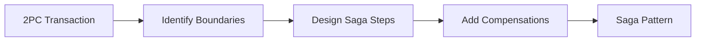

# 🥉 Bronze Patterns - Legacy & Migration Targets

**25 patterns that served us well but now have better alternatives. Learn what to migrate from and how.**

    
Bronze patterns are legacy solutions that were once best practices but have been superseded by better approaches. Understanding them is crucial for maintaining existing systems and planning migrations.

## ⚠️ Why Bronze Patterns Matter

### Don't Ignore Them
- **Legacy Systems**: Millions of systems still use these patterns
- **Migration Knowledge**: Understanding them enables smooth transitions
- **Historical Context**: Learn why they existed and why we moved on
- **Risk Awareness**: Know what problems to expect

### Bronze Pattern Characteristics
- 🔄 **Better Alternatives Exist** - Gold/Silver patterns do it better
- 📉 **70% Success Rate** - More prone to issues
- 🚧 **High Maintenance** - Require more operational effort
- 🎯 **Specific Niches** - May still be valid in narrow contexts

## 🚨 Bronze Patterns to Migrate From

### ❌ Distributed Transaction Patterns

#### [Two-Phase Commit (2PC)](../patterns/two-phase-commit/)
**Distributed ACID transactions**
- ⚠️ **Issues**: Blocking, coordinator failure, poor performance
- ✅ **Migrate to**: [Saga Pattern](../patterns/saga/)
- 📊 **Migration Effort**: High
- 💡 **Still Valid For**: Small-scale, same-datacenter transactions

**Migration Path:**

#### [Distributed Locks](../patterns/distributed-lock/)
**Global mutex across services**
- ⚠️ **Issues**: Single point of failure, deadlocks, performance
- ✅ **Migrate to**: [Optimistic Concurrency](../patterns/optimistic-locking/)
- 📊 **Migration Effort**: Medium
- 💡 **Still Valid For**: Leader election, short-held locks

### 🗄️ Legacy Architecture Patterns

#### [Shared Database](../patterns/shared-database/)
**Multiple services share one database**
- ⚠️ **Issues**: Tight coupling, no isolation, scaling limits
- ✅ **Migrate to**: [Database per Service](../patterns/database-per-service/)
- 📊 **Migration Effort**: Very High
- 💡 **Still Valid For**: Small, simple systems

**Migration Strategy:**
1. Identify service boundaries
2. Add API layer
3. Gradually extract data
4. Implement sync mechanisms
5. Cut over service by service

#### [Thick Client](../patterns/thick-client/)
**Heavy business logic in client**
- ⚠️ **Issues**: Update nightmare, security risks, platform lock-in
- ✅ **Migrate to**: [API-First](../patterns/api-gateway/) + Thin Client
- 📊 **Migration Effort**: High
- 💡 **Still Valid For**: Specialized desktop apps

#### [Stored Procedures](../patterns/stored-procedures/)
**Business logic in database**
- ⚠️ **Issues**: Testing difficulty, version control, vendor lock-in
- ✅ **Migrate to**: Application layer logic
- 📊 **Migration Effort**: Medium
- 💡 **Still Valid For**: Performance-critical operations

### 📡 Outdated Communication Patterns

#### [Polling](../patterns/polling/)
**Repeatedly check for updates**
- ⚠️ **Issues**: Inefficient, latency, resource waste
- ✅ **Migrate to**: [WebSocket](../patterns/websocket/) or [SSE](../patterns/server-sent-events/)
- 📊 **Migration Effort**: Low-Medium
- 💡 **Still Valid For**: Infrequent checks, simple integrations

#### [SOAP/XML-RPC](../patterns/soap/)
**Heavy protocol for service communication**
- ⚠️ **Issues**: Complexity, performance, tooling
- ✅ **Migrate to**: REST or gRPC
- 📊 **Migration Effort**: Medium
- 💡 **Still Valid For**: Enterprise integrations

#### [File-Based Integration](../patterns/file-integration/)
**Share data via files**
- ⚠️ **Issues**: Latency, error handling, monitoring
- ✅ **Migrate to**: [Event Streaming](../patterns/event-streaming/)
- 📊 **Migration Effort**: Medium-High
- 💡 **Still Valid For**: Batch processing, legacy systems

### 🔧 Deprecated Operational Patterns

#### [Manual Scaling](../patterns/manual-scaling/)
**Human-operated capacity changes**
- ⚠️ **Issues**: Slow response, human error, cost
- ✅ **Migrate to**: [Auto-Scaling](../patterns/auto-scaling/)
- 📊 **Migration Effort**: Low
- 💡 **Still Valid For**: Predictable workloads

#### [Singleton Pattern](../patterns/singleton/)
**Single instance globally**
- ⚠️ **Issues**: Testing, concurrency, scalability
- ✅ **Migrate to**: Dependency injection
- 📊 **Migration Effort**: Low-Medium
- 💡 **Still Valid For**: True single resources

## 📋 Bronze Pattern Migration Matrix

| Bronze Pattern | Gold Alternative | Migration Complexity | Business Impact |
|----------------|-----------------|---------------------|-----------------|
| **2PC** | Saga Pattern | High | High |
| **Shared Database** | Database per Service | Very High | Very High |
| **Thick Client** | API + Thin Client | High | Medium |
| **Polling** | WebSocket/SSE | Low | Low |
| **Manual Scaling** | Auto-Scaling | Low | High |
| **Stored Procedures** | App Logic | Medium | Medium |
| **File Integration** | Event Streaming | Medium | High |

## 🚀 Migration Playbooks

### Universal Migration Strategy

#### Phase 1: Assessment (Week 1-2)
1. **Inventory Bronze Patterns**
   - Scan codebase
   - Document usage
   - Assess business impact

2. **Prioritize Migrations**
   - Risk vs Effort matrix
   - Business value
   - Technical debt cost

3. **Select First Target**
   - Quick win candidate
   - Learning opportunity
   - Measurable impact

#### Phase 2: Planning (Week 3-4)
1. **Design Target State**
   - Choose Gold/Silver pattern
   - Architecture diagrams
   - Migration phases

2. **Risk Mitigation**
   - Rollback strategy
   - Data consistency
   - Performance testing

3. **Team Preparation**
   - Training on new pattern
   - Tooling setup
   - Success metrics

#### Phase 3: Execution (Varies)
1. **Parallel Implementation**
   - Build new alongside old
   - Feature flags
   - Gradual rollout

2. **Data Migration**
   - Dual writes
   - Verification
   - Cutover plan

3. **Decommission Legacy**
   - Monitor stability
   - Remove old code
   - Document lessons

### Specific Migration Guides

**[2PC → Saga Migration Guide](/excellence/migrations/2pc-to-saga/)**
- Boundary identification
- Compensation design
- Testing strategies

**[Shared DB → Database per Service](/excellence/migrations/shared-database-to-microservices/)**
- Service extraction
- Data synchronization
- Consistency patterns

**[Polling → WebSocket Migration](/excellence/migrations/polling-to-websocket/)**
- Protocol upgrade
- Fallback handling
- Client updates

## ⚡ Quick Wins

Start with these easy Bronze → Gold migrations:

1. **Manual Scaling → Auto-Scaling**
   - 1 week implementation
   - Immediate cost savings
   - Better reliability

2. **Polling → WebSocket**
   - 2 week implementation
   - 90% resource reduction
   - Better user experience

3. **Singleton → Dependency Injection**
   - 1 week refactoring
   - Improved testability
   - Better maintainability

## 🎯 When Bronze Patterns Are Still Valid

### Limited Scenarios
Some Bronze patterns remain valid in specific contexts:

**2PC**: When you need true ACID across 2-3 resources in same datacenter

**Shared Database**: For simple CRUD apps with <5 developers

**Stored Procedures**: For complex reports or data-intensive operations

**File Integration**: When integrating with legacy systems that can't change

### Decision Framework
Keep Bronze patterns only when:
- ✅ Migration cost exceeds benefit
- ✅ System is being decommissioned
- ✅ Specific constraints require it
- ✅ Temporary solution with sunset date

## 📚 Learning from Bronze Patterns

### Historical Lessons

**Why They Were Popular**
- Simpler times (monoliths)
- Different constraints (on-premise)
- Limited tooling
- Smaller scale

**Why We Moved On**
- Cloud computing
- Microservices
- Better tooling
- Scale requirements

**What We Learned**
- Decouple everything
- Embrace eventual consistency
- Design for failure
- Automate operations

---

    <a href="../silver-pattern-library/" class="md-button">← Silver Patterns</a>
    <a href="../" class="md-button">Back to Discovery</a>
    <a href="../../migrations/" class="md-button md-button--primary">Migration Guides →</a>

