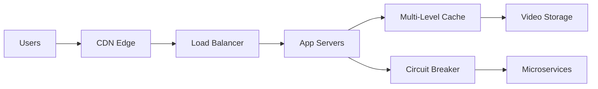
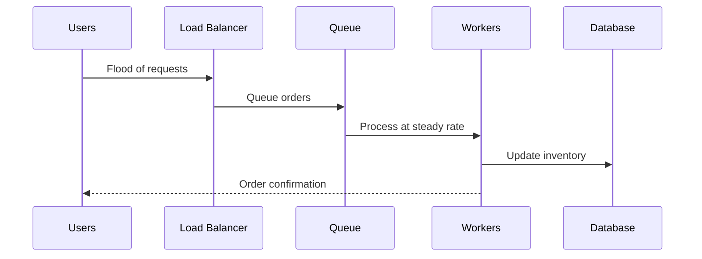
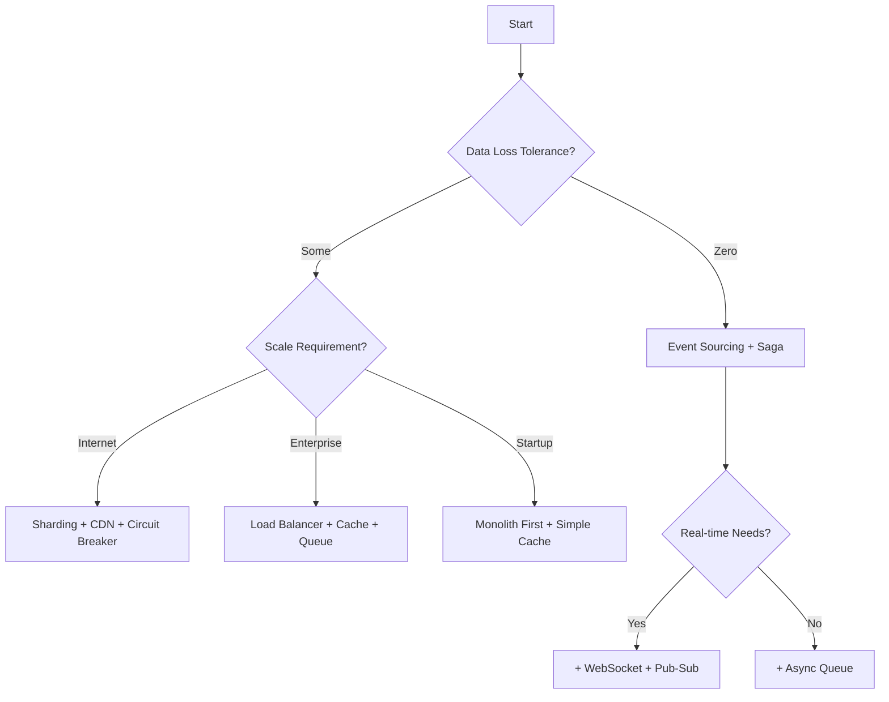

# Pattern Selection Wizard

!!! tip "Find Your Perfect Patterns in 5 Minutes"
    Answer a few questions about your system requirements, and we'll recommend the most suitable patterns based on real-world implementations.

## 🎯 Start Here: What Are You Building?

### Step 1: Choose Your Domain

- :material-play-circle:{ .lg .middle } **Streaming & Media**
    
    ---
    
    Video streaming, live broadcasting, music services
    
    **Examples**: Netflix, YouTube, Spotify
    
    [Select This →](#streaming-media-patterns)

- :material-credit-card:{ .lg .middle } **Payments & Finance**
    
    ---
    
    Payment processing, banking, trading
    
    **Examples**: Stripe, PayPal, Robinhood
    
    [Select This →](#payments-finance-patterns)

- :material-message:{ .lg .middle } **Messaging & Social**
    
    ---
    
    Chat, social networks, collaboration
    
    **Examples**: WhatsApp, Discord, Slack
    
    [Select This →](#messaging-social-patterns)

- :material-cart:{ .lg .middle } **E-commerce**
    
    ---
    
    Online stores, marketplaces, inventory
    
    **Examples**: Amazon, Shopify, eBay
    
    [Select This →](#ecommerce-patterns)

---

## Streaming & Media Patterns

### Your Scale Requirements?

#### 🌍 Internet Scale (100M+ users)
**Recommended Pattern Stack:**

| Pattern | Tier | Why You Need It | Case Study |
|---------|------|-----------------|------------|
| **CDN** | 🥇 Gold | Global content delivery | [Netflix Open Connect](../case-studies/netflix-streaming.md) |
| **Adaptive Bitrate** | 🥇 Gold | Quality based on bandwidth | [YouTube](../case-studies/youtube.md) |
| **Multi-Level Cache** | 🥇 Gold | Reduce origin load | [Netflix EVCache](../case-studies/netflix-streaming.md) |
| **Sharding** | 🥇 Gold | Horizontal scaling | [YouTube Vitess](../case-studies/youtube.md) |
| **Circuit Breaker** | 🥇 Gold | Prevent cascading failures | [Netflix Hystrix](../case-studies/netflix-streaming.md) |

**Architecture Blueprint:**

#### 🏢 Enterprise Scale (1M-100M users)
**Recommended Pattern Stack:**

| Pattern | Tier | Why You Need It | Implementation |
|---------|------|-----------------|----------------|
| **Load Balancing** | 🥇 Gold | Distribute traffic | HAProxy, AWS ALB |
| **Cache-Aside** | 🥇 Gold | Reduce database load | Redis, Memcached |
| **Message Queue** | 🥇 Gold | Async processing | RabbitMQ, SQS |
| **API Gateway** | 🥈 Silver | Single entry point | Kong, Zuul |

#### 🚀 Startup Scale (<1M users)
**Start Simple, Scale Later:**
- **Monolith First** → Microservices when needed
- **Single Database** → Read replicas → Sharding
- **Simple CDN** → Multi-region later
- **Basic Caching** → Sophisticated caching

---

## Payments & Finance Patterns

### What's Your Primary Concern?

#### 💰 Zero Data Loss
**Critical Patterns:**

| Pattern | Tier | Purpose | Implementation |
|---------|------|---------|----------------|
| **Event Sourcing** | 🥇 Gold | Complete audit trail | [Stripe's approach](../case-studies/payment-system.md) |
| **Saga Pattern** | 🥇 Gold | Distributed transactions | [PayPal saga](../case-studies/paypal-payments.md) |
| **Double-Entry Ledger** | 🥇 Gold | Financial accuracy | Immutable entries |
| **Idempotency** | 🥇 Gold | Exactly-once processing | UUID + timestamp keys |

#### ⚡ High Throughput
**Performance Patterns:**

| Pattern | Tier | Purpose | Scale Achieved |
|---------|------|---------|----------------|
| **Sharding** | 🥇 Gold | Horizontal scaling | 65K TPS (Stripe) |
| **CQRS** | 🥈 Silver | Separate read/write | 10x read performance |
| **Event Streaming** | 🥇 Gold | Real-time processing | 1M events/sec |
| **Async Processing** | 🥇 Gold | Decouple operations | Non-blocking flows |

#### 🌍 Global Compliance
**Compliance Patterns:**
- **Multi-Region** with data residency
- **Encryption at Rest** and in transit
- **Audit Logging** with immutability
- **Rate Limiting** for fraud prevention

---

## Messaging & Social Patterns

### Real-Time Requirements?

#### ⚡ Ultra Real-Time (<100ms)
**WebSocket-Based Stack:**

| Pattern | Tier | Use Case | Example |
|---------|------|----------|---------|
| **WebSocket** | 🥇 Gold | Persistent connections | [Discord voice](../case-studies/elite-engineering/discord-voice-infrastructure.md) |
| **Pub-Sub** | 🥇 Gold | Message broadcasting | [WhatsApp](../case-studies/chat-system.md) |
| **Presence System** | 🥈 Silver | Online status | Active user tracking |
| **Edge Computing** | 🥈 Silver | Regional processing | Reduce latency |

#### 🕐 Near Real-Time (100ms-1s)
**Balanced Approach:**
- **Long Polling** for compatibility
- **Message Queue** for reliability
- **Cache-Aside** for recent messages
- **CDN** for media content

#### 📬 Eventual Delivery (>1s)
**Reliability First:**
- **Event Sourcing** for message history
- **Offline Queue** for mobile
- **Retry with Backoff** for delivery
- **Read Receipts** for confirmation

---

## E-commerce Patterns

### Peak Traffic Handling?

#### 🎯 Flash Sales (100x spikes)
**Battle-Tested Stack:**

| Pattern | Tier | Purpose | Success Story |
|---------|------|---------|---------------|
| **Queue-Based Load Leveling** | 🥇 Gold | Absorb spikes | [Shopify Flash Sales](../case-studies/shopify-flash-sales.md) |
| **Circuit Breaker** | 🥇 Gold | Graceful degradation | Prevent total failure |
| **Inventory Reservation** | 🥇 Gold | Prevent overselling | Distributed locking |
| **Auto-Scaling** | 🥇 Gold | Dynamic capacity | 100x scale in minutes |

**Implementation Flow:**

#### 📊 Predictable Growth
**Standard E-commerce Stack:**
- **Microservices** for modularity
- **API Gateway** for routing
- **Cache-Aside** for products
- **Saga Pattern** for checkout
- **Event Streaming** for analytics

---

## 🎨 Pattern Combination Matrix

### Powerful Pattern Combinations

| Primary Pattern | Combines Well With | Use Case | Example |
|-----------------|-------------------|----------|---------|
| **Event Sourcing** | + CQRS | Audit with fast reads | Payment systems |
| **Circuit Breaker** | + Service Mesh | Infrastructure resilience | Uber's 3000 services |
| **Sharding** | + Consistent Hashing | Elastic scaling | Discord servers |
| **Cache-Aside** | + Write-Through | Read-heavy workloads | Social feeds |
| **Saga** | + Event Sourcing | Distributed transactions | E-commerce checkout |

---

## 🚦 Decision Framework

### Quick Decision Tree

---

## 📋 Your Custom Pattern Recipe

Based on your selections, here's your recommended pattern stack:

### 🥇 Core Patterns (Must Have)
1. **Load Balancing** - Distribute traffic
2. **Caching Strategy** - Reduce latency
3. **Circuit Breaker** - Prevent failures
4. **Message Queue** - Decouple components

### 🥈 Scale Patterns (Add When Growing)
1. **Sharding** - Horizontal scaling
2. **Service Mesh** - Microservices management
3. **CQRS** - Read/write optimization
4. **Event Streaming** - Real-time data flow

### 🥉 Avoid These (Legacy)
1. ❌ **Two-Phase Commit** → Use Saga
2. ❌ **Shared Database** → Database per Service
3. ❌ **Synchronous Calls** → Async messaging
4. ❌ **Polling** → Event-driven

---

## 🎯 Next Steps

- :material-book-open:{ .lg .middle } **[Deep Dive into Patterns](../patterns/index.md)**
    
    ---
    
    Explore each pattern in detail with examples

- :material-briefcase:{ .lg .middle } **[See Case Studies](pattern-usage-index.md)**
    
    ---
    
    Learn from real implementations

- :material-rocket:{ .lg .middle } **[Start Your Journey](excellence-journeys/index.md)**
    
    ---
    
    Follow week-by-week implementation guides

- :material-account-group:{ .lg .middle } **[Get Team Buy-in](quick-start/for-teams.md)**
    
    ---
    
    Resources for team adoption

---

!!! success "Pattern Selection Complete!"
    Based on your requirements, we've identified the optimal pattern stack for your distributed system. Remember:
    
    - **Start with Gold patterns** - They're battle-tested
    - **Add Silver patterns** as you scale
    - **Avoid Bronze patterns** for new systems
    - **Test patterns** in isolation before combining
    
    Questions? Check our [FAQ](../introduction/faq.md) or explore [real-world examples](../case-studies/index.md).