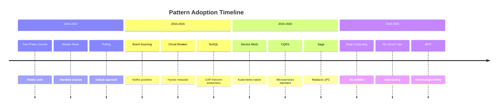

# Pattern Usage Index

!!! tip "How to Use This Index"
    Find case studies that demonstrate specific patterns in production. Each pattern links to real implementations with scale metrics and lessons learned.

## 🥇 Gold Pattern Implementations

### Circuit Breaker Pattern
**Preventing cascade failures at scale**

| Company | Scale | Implementation | Key Insight |
|---------|-------|----------------|-------------|
| **[Netflix](../case-studies/netflix-streaming.md#circuit-breaker-pattern)** | 100B+ requests/day | Hystrix library | Thread pool isolation per service |
| **[Amazon](../case-studies/elite-engineering/amazon-dynamodb-evolution.md)** | 10x Prime Day traffic | Custom breakers | Adaptive thresholds |
| **[Uber](../case-studies/uber-microservices.md)** | 3000+ services | Service mesh | Centralized policy |
| **GitHub** | 100M+ users | Load shedding | Graceful degradation |

### Event Sourcing Pattern
**Immutable event history for audit and replay**

| Company | Scale | Implementation | Key Insight |
|---------|-------|----------------|-------------|
| **[Kafka](../case-studies/kafka.md#event-sourcing-pattern)** | 7T+ messages/day | Log-based architecture | Infinite retention |
| **[Payment System](../case-studies/payment-system.md#event-sourcing-pattern)** | $1T+ annually | Complete audit trail | Regulatory compliance |
| **[Netflix](../case-studies/netflix-streaming.md)** | 260M+ users | Viewing history | Personalization data |
| **[Uber](../case-studies/uber-location.md)** | 20M+ rides/day | Trip event stream | Real-time analytics |

### Load Balancing Pattern
**Distributing traffic for reliability and performance**

| Company | Scale | Implementation | Key Insight |
|---------|-------|----------------|-------------|
| **[Netflix](../case-studies/netflix-streaming.md#load-balancing-pattern)** | 15% internet traffic | Zuul gateway | Request-level routing |
| **[Discord](../case-studies/elite-engineering/discord-voice-infrastructure.md)** | 13.5M concurrent | Consistent hashing | Voice server selection |
| **[Stripe](../case-studies/elite-engineering/stripe-api-excellence.md)** | 99.999% uptime | Global load balancing | Latency-based routing |
| **[Google](../case-studies/google-search-infrastructure.md)** | Billions QPS | Maglev | Connection tracking |

### Caching Strategies Pattern
**Multi-layer caching for sub-millisecond responses**

| Company | Scale | Implementation | Key Insight |
|---------|-------|----------------|-------------|
| **[Redis](../case-studies/redis-architecture.md#caching-strategy)** | 300M+ ops/sec | Cache-aside pattern | Hot key detection |
| **[Netflix](../case-studies/netflix-streaming.md#caching-strategy)** | 200M+ users | EVCache | Regional caching |
| **[Facebook](../case-studies/facebook-memcached.md)** | Billions of requests | Memcached clusters | Cache warming |
| **[Instagram](../case-studies/redis-instagram.md)** | 500M+ daily active | Redis clustering | Feed caching |

### Saga Pattern
**Distributed transactions without 2PC**

| Company | Scale | Implementation | Key Insight |
|---------|-------|----------------|-------------|
| **[Payment System](../case-studies/payment-system.md#saga-pattern)** | 65K TPS | Orchestration saga | Compensation logic |
| **[Hotel Booking](../case-studies/hotel-reservation-system.md)** | 100K+ bookings/day | Choreography saga | Event-driven flow |
| **[Uber Eats](../case-studies/uber-eats-ordering.md)** | Millions orders/day | Hybrid approach | State machines |
| **[PayPal](../case-studies/paypal-architecture.md)** | 400M+ accounts | Orchestrated saga | Idempotency keys |

## 🥈 Silver Pattern Implementations

### Service Mesh Pattern
**Infrastructure layer for microservices communication**

| Company | Scale | Implementation | Key Insight |
|---------|-------|----------------|-------------|
| **[Uber](../case-studies/uber-microservices.md)** | 3000+ services | Envoy-based mesh | Zone-aware routing |
| **[Twitter](../case-studies/twitter-finagle.md)** | Global scale | Linkerd | Request-level tracing |
| **[Lyft](../case-studies/lyft-envoy.md)** | Created Envoy | Service mesh pioneer | Edge proxy |

### CQRS Pattern
**Separate read and write models for scale**

| Company | Scale | Implementation | Key Insight |
|---------|-------|----------------|-------------|
| **[Digital Wallet](../case-studies/digital-wallet-enhanced.md)** | 350M+ users | Event-driven CQRS | Read model projections |
| **[Netflix](../case-studies/netflix-streaming.md)** | Viewing & recommendations | Separate paths | Optimized reads |
| **[Stripe](../case-studies/payment-system.md)** | Payments & reporting | Different datastores | Real-time vs batch |

### API Gateway Pattern
**Single entry point for microservices**

| Company | Scale | Implementation | Key Insight |
|---------|-------|----------------|-------------|
| **[Netflix](../case-studies/netflix-zuul.md)** | 1000+ services | Zuul gateway | Dynamic routing |
| **[Kong](../case-studies/kong-api-gateway.md)** | 40K+ deployments | Plugin architecture | Extensibility |
| **[Amazon](../case-studies/amazon-api-gateway.md)** | AWS scale | Managed service | Serverless integration |

## 🥉 Bronze Pattern Implementations

### Polling Pattern
**Legacy approach replaced by modern alternatives**

| Company | Migration Story | From → To | Lesson |
|---------|----------------|-----------|---------|
| **[Uber](../case-studies/uber-location.md)** | Location updates | Polling → Streaming | 90% infrastructure savings |
| **[Twitter](../case-studies/twitter-timeline.md)** | Timeline refresh | Polling → WebSocket | Real-time updates |
| **[Stock Exchange](../case-studies/real-time-market-data.md)** | Price updates | Polling → Server-sent events | Millisecond latency |

### Two-Phase Commit
**Distributed transactions anti-pattern**

| Company | Migration Story | From → To | Lesson |
|---------|----------------|-----------|---------|
| **[PayPal](../case-studies/paypal-saga-migration.md)** | Payment processing | 2PC → Saga | 10x throughput |
| **[Bank System](../case-studies/banking-modernization.md)** | Account transfers | 2PC → Event sourcing | Better fault tolerance |

## Pattern Combinations

### Circuit Breaker + Service Mesh
**Resilience at infrastructure level**

- **[Uber](../case-studies/uber-microservices.md)**: Envoy with circuit breaking
- **[Netflix](../case-studies/netflix-resilience.md)**: Hystrix + Zuul integration

### Event Sourcing + CQRS
**Complete audit with optimized reads**

- **[Payment System](../case-studies/payment-system.md)**: Financial transactions
- **[Digital Wallet](../case-studies/digital-wallet-enhanced.md)**: Balance tracking

### Load Balancing + Consistent Hashing
**Stateful service distribution**

- **[Discord](../case-studies/elite-engineering/discord-voice-infrastructure.md)**: Voice servers
- **[Redis](../case-studies/redis-architecture.md)**: Sharded clusters

## Search by Scale

### Internet Scale (100M+ users)
- **Netflix**: Circuit Breaker, Load Balancing, Caching
- **Uber**: Event Sourcing, Service Mesh, Saga
- **Facebook**: Caching, Sharding, Consistent Hashing

### Global Scale (Multi-region)
- **Stripe**: Saga, Event Sourcing, API Gateway
- **PayPal**: Saga, Double-Entry Ledger, Sharding
- **Google**: Load Balancing, Caching, MapReduce

### Regional Scale
- **Digital Wallet**: CQRS, Event Sourcing, Cache-Aside
- **Hotel Booking**: Saga, Inventory Management, Caching

## Search by Domain

### Financial Services
- **Payment Systems**: Saga, Event Sourcing, Idempotency
- **Banking**: Double-Entry Ledger, Reconciliation
- **Trading**: Event Streaming, Low Latency Patterns

### E-commerce
- **Shopping Cart**: Saga, Inventory Management
- **Recommendation**: Collaborative Filtering, Caching
- **Search**: Elasticsearch, Faceted Search

### Real-time Systems
- **Location Tracking**: Geospatial Indexing, Event Streaming
- **Chat/Messaging**: WebSocket, Pub-Sub, Presence
- **Gaming**: State Synchronization, Lag Compensation

## Pattern Evolution Timeline

## Related Resources

- [Pattern Discovery Tool](pattern-discovery/index.md) - Interactive pattern finder
- [Pattern Health Dashboard](../reference/pattern-health-dashboard.md) - Adoption metrics
- [Excellence Journeys](excellence-journeys/index.md) - Implementation roadmaps
- [Migration Guides](migrations/index.md) - Step-by-step transitions