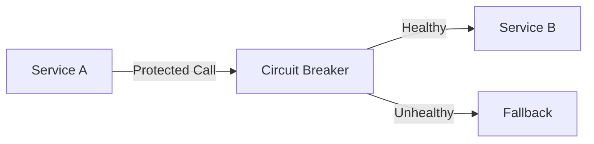
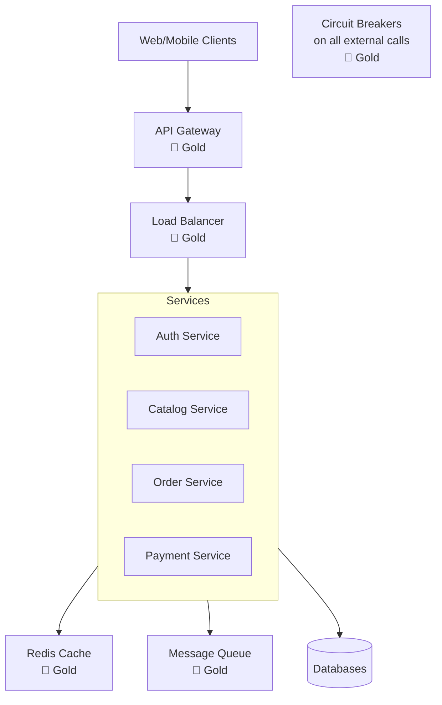

# 🏗️ Quick Start for Architects

**Master the art of designing distributed systems with battle-tested patterns.**

## 🎯 Your 30-Minute Excellence Journey

### Step 1: Understand Excellence Tiers (5 minutes)

<div class="tier-overview">

**🥇 Gold Patterns** - Use these first!
- Battle-tested at FAANG scale
- 95%+ success rate
- Clear implementation guides
- Examples: Circuit Breaker, Load Balancing, Caching

**🥈 Silver Patterns** - Use with consideration
- Specialized use cases
- 85% success rate  
- Trade-offs to evaluate
- Examples: Service Mesh, CQRS, Event Sourcing

**🥉 Bronze Patterns** - Migrate away from these
- Legacy or deprecated
- Better alternatives exist
- Migration guides available
- Examples: 2PC, Thick Client, Shared Database

</div>

### Step 2: Essential Patterns for Every Architect (10 minutes)

Master these 5 Gold patterns that form the foundation of any distributed system:

#### 1. [Circuit Breaker](../../patterns/circuit-breaker/)
**Why:** Prevent cascade failures
**When:** All external service calls
**Impact:** 10x improvement in system resilience



#### 2. [Load Balancing](../../patterns/load-balancing/)
**Why:** Distribute traffic evenly
**When:** Multiple service instances
**Impact:** Linear scalability

#### 3. [Caching Strategies](../../patterns/caching-strategies/)
**Why:** Reduce latency and load
**When:** Repeated data access
**Impact:** 100x performance improvement

#### 4. [API Gateway](../../patterns/api-gateway/)
**Why:** Unified entry point
**When:** Multiple microservices
**Impact:** Simplified client integration

#### 5. [Event-Driven Architecture](../../patterns/event-driven/)
**Why:** Loose coupling at scale
**When:** Asynchronous workflows
**Impact:** Improved scalability and resilience

### Step 3: Architecture Decision Framework (10 minutes)

Use this framework for every pattern selection:

```yaml
Decision: Which messaging pattern to use?

Options:
  1. Direct REST calls
     - Latency: Low (10ms)
     - Complexity: Low
     - Scalability: Limited
     - When: Synchronous, simple requests
     
  2. Message Queue
     - Latency: Medium (100ms)
     - Complexity: Medium
     - Scalability: High
     - When: Work distribution, guaranteed delivery
     
  3. Event Streaming
     - Latency: Low-Medium (50ms)
     - Complexity: High
     - Scalability: Very High
     - When: Event sourcing, real-time analytics

Decision: Event Streaming
Rationale: Need real-time updates + event replay capability
Trade-offs: Higher complexity accepted for scalability
```

### Step 4: Design Your First System (5 minutes)

Let's design a simple e-commerce system using excellence patterns:



**Key Decisions:**
- ✅ API Gateway for unified entry
- ✅ Load balancing for scalability
- ✅ Caching for performance
- ✅ Circuit breakers for resilience
- ✅ Message queue for async operations

## 🚀 Architecture Excellence Checklist

Before any design review, ensure:

### Foundation (Must Have)
- [ ] **Resilience**: Circuit breakers on all external calls
- [ ] **Scalability**: Horizontal scaling capability
- [ ] **Observability**: Metrics, logs, traces
- [ ] **Security**: Authentication, authorization, encryption

### Excellence Patterns
- [ ] At least 3 Gold patterns identified
- [ ] No Bronze patterns without migration plan
- [ ] Trade-offs documented for Silver patterns
- [ ] Real-world examples referenced

### Documentation
- [ ] Architecture Decision Records (ADRs)
- [ ] Failure mode analysis
- [ ] Capacity planning
- [ ] Migration strategy

## 📊 Pattern Selection Matrix

Use this matrix to quickly identify patterns for common scenarios:

| Scenario | Gold Patterns | Silver Patterns | Avoid |
|----------|--------------|-----------------|-------|
| **High Traffic API** | Load Balancer, Cache, Circuit Breaker | Rate Limiting, CDN | Single Server |
| **Real-time Updates** | WebSocket, Pub-Sub | Server-Sent Events | Polling |
| **Data Consistency** | Event Sourcing, Saga | CQRS, Outbox | 2PC |
| **Microservices** | API Gateway, Service Discovery | Service Mesh, BFF | Shared DB |
| **Global Scale** | Multi-region, CDN, Geo-sharding | Edge Computing | Single Region |

## 🎯 Common Architecture Patterns

### Pattern 1: Microservices Excellence
```
API Gateway → Load Balancer → Services → Event Bus
     ↓              ↓              ↓          ↓
Circuit Breaker  Health Checks  Cache    Async Processing
```

### Pattern 2: Event-Driven Excellence  
```
Producers → Event Stream → Stream Processors → Consumers
    ↓           ↓              ↓                   ↓
Validation  Partitioning   Aggregation      Error Handling
```

### Pattern 3: Data Excellence
```
Write Path: API → Validation → Event Store → Projections
Read Path: API → Cache → Read Models → Response
```

## 🏆 Real-World Architecture Examples

Study these architectures from top companies:

1. **[Netflix Microservices](../real-world-excellence/elite-engineering/netflix-resilience/)**
   - 1000+ microservices
   - Chaos engineering
   - Circuit breakers everywhere

2. **[Uber Real-time](../real-world-excellence/elite-engineering/uber-geo/)**
   - Geospatial indexing
   - Event-driven dispatch
   - Cell-based architecture

3. **[Amazon DynamoDB](../../case-studies/amazon-dynamodb/)**
   - Consistent hashing
   - Multi-region replication
   - Predictable performance

## 📚 Next Steps

### Immediate (This Week)
1. Implement one Gold pattern in your current project
2. Document pattern decision in an ADR
3. Share learnings with your team

### Short Term (This Month)
1. Complete [Resilience First Guide](../implementation-guides/resilience-first/)
2. Study 3 [elite engineering case studies](../real-world-excellence/elite-engineering/)
3. Create pattern library for your organization

### Long Term (This Quarter)
1. Lead architecture transformation using [Excellence Journeys](../excellence-journeys/)
2. Mentor others on pattern selection
3. Contribute patterns back to community

## 🛠️ Architect's Toolbox

Essential tools for excellence:

- **[Pattern Discovery Tool](../pattern-discovery/)** - Find patterns by requirement
- **[Comparison Matrices](../comparisons/)** - Compare similar patterns
- **[Migration Guides](../migrations/)** - Upgrade from Bronze to Gold
- **[Implementation Calculator](../pattern-discovery/calculator/)** - Estimate effort

---

<div class="navigation-footer">
    <a href="../" class="md-button">← Back to Quick Start</a>
    <a href="../for-teams/" class="md-button">For Teams →</a>
    <a href="../pattern-discovery/" class="md-button md-button--primary">Discover Patterns →</a>
</div>

