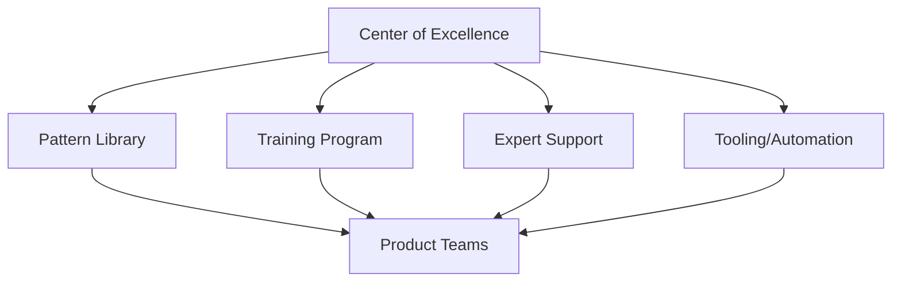

# 🏢 Quick Start for Organizations

**Transform your engineering organization with proven patterns for scale, governance, and excellence.**

## 🎯 Your Organization's 30-Minute Excellence Strategy

### Step 1: Organizational Maturity Assessment (5 minutes)

<div class="maturity-matrix">

| Area | Level 1 (Ad-hoc) | Level 2 (Managed) | Level 3 (Defined) | Level 4 (Excellence) | Your Level |
|------|------------------|-------------------|-------------------|---------------------|------------|
| **Architecture** | Monolith/Few services | Some microservices | Service-oriented | Platform-based | ___ |
| **Patterns** | Inconsistent | Some standards | Documented patterns | Pattern library | ___ |
| **Operations** | Manual/Reactive | Some automation | Proactive monitoring | Self-healing | ___ |
| **Culture** | Silos | Some collaboration | DevOps practices | Excellence mindset | ___ |
| **Scale** | <10 engineers | 10-50 engineers | 50-200 engineers | 200+ engineers | ___ |

**Target**: Level 3+ across all areas

</div>

### Step 2: Organizational Excellence Patterns (10 minutes)

Implement these patterns across your organization:

#### 1. Platform Engineering
**Build a platform that accelerates all teams**

<div class="platform-components">

**Internal Developer Platform (IDP)**
```yaml
golden_paths:
  - Service creation template
  - CI/CD pipelines
  - Monitoring setup
  - Security baseline

self_service:
  - Environment provisioning
  - Database creation
  - Certificate management
  - Feature flags

platform_apis:
  - Deployment API
  - Metrics API
  - Logging API
  - Service registry
```

**Success Metrics:**
- Time to create new service: 4 hours → 30 minutes
- Deployment frequency: 10x increase
- Platform adoption: >90% of teams

</div>

#### 2. Excellence Governance

**Standards Without Bureaucracy**

<div class="governance-framework">

**Architecture Decision Records (ADRs)**
```markdown
# ADR-001: Adopt Circuit Breaker Pattern

Status: Accepted
Date: 2024-01-15

## Context
Services experiencing cascade failures

## Decision
All external calls must use circuit breakers

## Consequences
- Improved resilience
- Additional complexity
- Training needed
```

**Pattern Governance:**
- Gold patterns: Mandatory
- Silver patterns: Recommended with approval
- Bronze patterns: Migration required

</div>

#### 3. Center of Excellence (CoE)

**Scale expertise across teams**



**CoE Responsibilities:**
- Maintain pattern library
- Provide expert consultation
- Run training programs
- Build shared tools
- Track adoption metrics

### Step 3: Organizational Transformation Plan (10 minutes)

#### Phase 1: Foundation (Months 1-3)
**Build the Platform Team**
- [ ] Hire/assign platform engineers
- [ ] Define golden paths
- [ ] Create first templates
- [ ] Launch pilot with 2-3 teams

**Establish CoE**
- [ ] Identify pattern experts
- [ ] Document current patterns
- [ ] Create training materials
- [ ] Set up office hours

**Quick Wins**
- [ ] Standardize health checks
- [ ] Implement basic observability
- [ ] Automate deployments

#### Phase 2: Adoption (Months 4-6)
**Scale the Platform**
- [ ] Onboard 50% of teams
- [ ] Expand golden paths
- [ ] Add self-service features
- [ ] Measure adoption metrics

**Pattern Excellence**
- [ ] Implement Gold patterns org-wide
- [ ] Migrate from Bronze patterns
- [ ] Create pattern decision tree
- [ ] Track pattern usage

**Cultural Shift**
- [ ] Run excellence workshops
- [ ] Celebrate successes
- [ ] Share failure learnings
- [ ] Incentivize adoption

#### Phase 3: Excellence (Months 7-12)
**Advanced Capabilities**
- [ ] Multi-region support
- [ ] Cost optimization
- [ ] Advanced observability
- [ ] Chaos engineering

**Organizational Scale**
- [ ] 100% team adoption
- [ ] Automated governance
- [ ] Excellence metrics
- [ ] Innovation platform

### Step 4: Excellence Metrics Dashboard (5 minutes)

Track organizational transformation:

```yaml
technical_metrics:
  availability:
    current: "99.5%"
    target: "99.99%"
    trend: "↗️"
  
  deployment_frequency:
    current: "Weekly"
    target: "Daily"
    trend: "↗️"
  
  mttr:
    current: "4 hours"
    target: "< 30 min"
    trend: "↘️"
  
  pattern_adoption:
    gold_patterns: "60%"
    silver_patterns: "40%"
    bronze_patterns: "20%" # migrating

organizational_metrics:
  platform_adoption:
    current: "40%"
    target: "100%"
    trend: "↗️"
  
  developer_satisfaction:
    current: "6/10"
    target: "9/10"
    trend: "↗️"
  
  time_to_market:
    current: "3 months"
    target: "2 weeks"
    trend: "↘️"
  
  innovation_velocity:
    experiments_per_quarter: 5
    successful_innovations: 2
```

## 🚀 Organizational Excellence Playbook

### For Engineering Leaders

**Quarter 1: Foundation**
- Form platform team (3-5 engineers)
- Establish Center of Excellence
- Define excellence standards
- Launch pilot program

**Quarter 2: Expansion**
- Scale to 25% of teams
- Implement core patterns
- Track success metrics
- Adjust based on feedback

**Quarter 3: Acceleration**
- Scale to 75% of teams
- Advanced pattern adoption
- Cost optimization
- Performance excellence

**Quarter 4: Excellence**
- 100% adoption
- Self-sustaining platform
- Innovation enablement
- Industry leadership

### For Platform Teams

**Golden Path Components:**
1. **Service Template**
   - Dockerfile
   - CI/CD pipeline
   - Monitoring setup
   - Security baseline

2. **Pattern Library**
   - Implementation guides
   - Code examples
   - Best practices
   - Anti-patterns

3. **Self-Service Portal**
   - Environment creation
   - Resource provisioning
   - Access management
   - Cost tracking

### For Centers of Excellence

**Training Program:**
- **Level 1**: Distributed Systems Basics
- **Level 2**: Pattern Implementation
- **Level 3**: Architecture Design
- **Level 4**: Excellence Leadership

**Support Model:**
- Office hours (2x/week)
- Slack channel (#excellence)
- Pattern champions
- Architecture reviews

## 📊 ROI of Excellence

Calculate your excellence ROI:

| Investment | Cost | Return | ROI |
|------------|------|--------|-----|
| **Platform Team** | 5 engineers | 50% productivity gain | 10x |
| **Training Program** | $100k | Reduced incidents | 5x |
| **Tool Investment** | $200k | Faster delivery | 8x |
| **CoE Operations** | 3 engineers | Knowledge scaling | 15x |
| **Total** | ~$2M/year | $20M value | **10x** |

## 🎯 Common Organizational Challenges

### Challenge 1: Resistance to Change
**Solution:**
- Start with volunteers
- Show quick wins
- Celebrate successes
- Make it easier than status quo

### Challenge 2: Resource Constraints
**Solution:**
- Start small (2-3 people)
- Focus on high-impact patterns
- Automate everything
- Measure ROI constantly

### Challenge 3: Competing Priorities
**Solution:**
- Align with business goals
- Show cost savings
- Reduce operational burden
- Enable innovation

### Challenge 4: Skills Gap
**Solution:**
- Invest in training
- Hire expertise
- Partner with vendors
- Learn from community

## 🏆 Excellence Maturity Model

Track your organization's journey:

### Level 1: Chaos (Months 0-3)
- Ad-hoc practices
- Hero culture
- Frequent outages
- Slow delivery

### Level 2: Emerging (Months 4-6)
- Some standards
- Basic automation
- Improving stability
- Platform thinking

### Level 3: Managed (Months 7-12)
- Consistent patterns
- Self-service platform
- Proactive operations
- Innovation focus

### Level 4: Excellence (12+ Months)
- Industry leader
- Full automation
- Excellence culture
- Continuous innovation

## 💡 Executive Talking Points

Use these to get leadership buy-in:

1. **Business Impact**
   - 10x faster time to market
   - 50% reduction in incidents
   - 40% cost optimization
   - 2x developer productivity

2. **Risk Reduction**
   - Better security posture
   - Improved compliance
   - Reduced technical debt
   - Vendor independence

3. **Competitive Advantage**
   - Attract top talent
   - Enable innovation
   - Scale efficiently
   - Lead the industry

4. **Investment Return**
   - 10x ROI in year 1
   - Compound benefits
   - Reduced operational costs
   - Increased revenue potential

---

<div class="navigation-footer">
    <a href="../" class="md-button">← Back to Quick Start</a>
    <a href="../../excellence-journeys/" class="md-button">Excellence Journeys →</a>
    <a href="../../implementation-guides/platform-engineering-playbook/" class="md-button md-button--primary">Platform Engineering Guide →</a>
</div>

<style>
.maturity-matrix {
    margin: 2rem 0;
    overflow-x: auto;
}

.maturity-matrix table {
    min-width: 800px;
}

.platform-components {
    background: var(--md-code-bg-color);
    padding: 2rem;
    border-radius: 0.5rem;
    margin: 1rem 0;
}

.governance-framework {
    display: grid;
    gap: 2rem;
    margin: 2rem 0;
}

.navigation-footer {
    display: flex;
    gap: 1rem;
    justify-content: center;
    margin-top: 3rem;
    padding-top: 2rem;
    border-top: 1px solid var(--md-default-fg-color--lightest);
}

.mermaid {
    text-align: center;
}
</style>