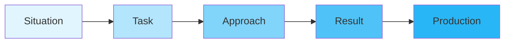
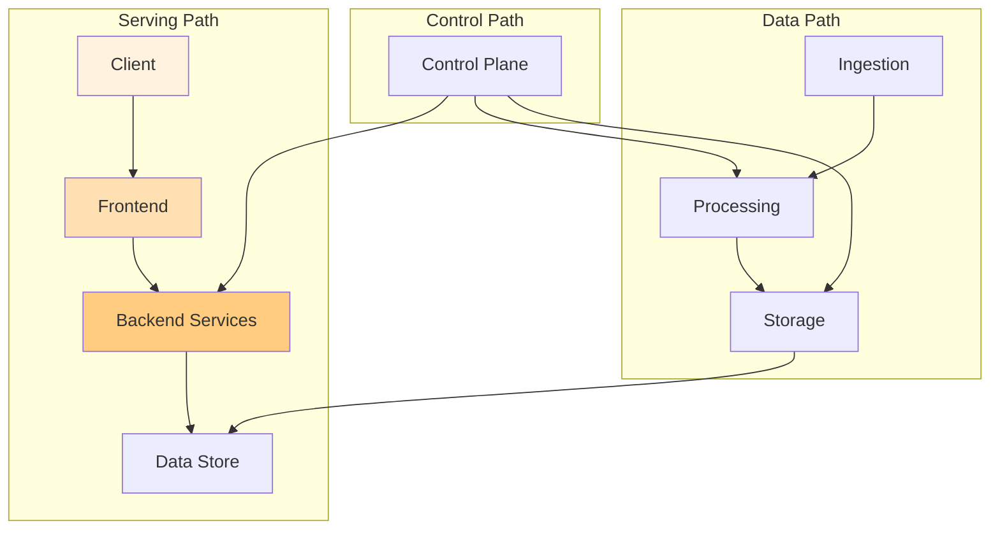

# Advanced Interview Techniques

Master the advanced techniques that distinguish exceptional candidates in Google system design interviews.

## The Google Interview Mindset

### Think Like a Googler
```
Core Principles:
✓ User-first design
✓ Global scale from day one
✓ Simple solutions to complex problems
✓ Data-driven decisions
✓ Fail gracefully, recover quickly
```

### The 10x Engineer Approach
1. **Question assumptions** - "Why 5 9s? Would 4 9s suffice?"
2. **Think constraints** - "What's our hardware budget?"
3. **Consider trade-offs** - "Consistency vs availability here?"
4. **Plan for growth** - "When we 10x, what breaks first?"

## Advanced Communication Strategies

### The STAR-P Method



**Example Application:**
- **Situation**: "Design YouTube"
- **Task**: "Support 2B users watching 1B hours daily"
- **Approach**: "CDN for videos, separate metadata service"
- **Result**: "Sub-second playback start, 99.95% availability"
- **Production**: "Monitor QoE metrics, A/B test encodings"

### The Zoom Levels Technique

```
Level 1: Bird's Eye (30 seconds)
"YouTube = Upload pipeline + Storage + CDN + Streaming"

Level 2: Architecture (5 minutes)
"Upload → Transcode → Store → Distribute → Play"

Level 3: Component Deep Dive (15 minutes)
"Transcoding: Queue → Workers → Formats → Adaptive"

Level 4: Critical Details (10 minutes)
"H.264 baseline for compatibility, VP9 for bandwidth"

Level 5: Production Reality (5 minutes)
"Monitoring, deployment, rollback strategies"
```

## Problem Decomposition Mastery

### The MECE Framework
**Mutually Exclusive, Collectively Exhaustive**

```python
def decompose_youtube():
    return {
        "Data Path": {
            "Upload": ["Resumable", "Chunking", "Validation"],
            "Processing": ["Transcode", "Thumbnail", "Copyright"],
            "Storage": ["Original", "Encoded", "Metadata"],
            "Delivery": ["CDN", "Adaptive", "Caching"]
        },
        "Control Path": {
            "Discovery": ["Search", "Recommendations", "Trending"],
            "Monetization": ["Ads", "Premium", "Creator Fund"],
            "Analytics": ["Views", "Watch Time", "Revenue"]
        },
        "Cross-Cutting": {
            "Scale": ["Sharding", "Replication", "Load Balance"],
            "Reliability": ["Redundancy", "Failover", "Recovery"],
            "Security": ["Auth", "DRM", "Privacy"]
        }
    }
```

### The First Principles Approach

```
YouTube Video Streaming - First Principles:

1. Physics Constraint: Speed of light
   → CDN edge servers globally

2. Bandwidth Constraint: Network capacity  
   → Adaptive bitrate streaming

3. Storage Constraint: Cost per byte
   → Efficient compression (VP9/AV1)

4. Compute Constraint: Transcoding cost
   → Optimize popular content first

5. Human Constraint: Attention span
   → Start playback in <1 second
```

## Handling Ambiguity Like a Pro

### The Clarification Matrix

| Dimension | Questions to Ask | Why It Matters |
|-----------|------------------|----------------|
| **Users** | B2C or B2B? Global? | Determines scale & features |
| **Scale** | QPS? Data size? Growth? | Influences architecture |
| **Features** | MVP or full? Priority? | Affects complexity |
| **Constraints** | Latency? Cost? Team? | Shapes trade-offs |
| **Success** | Metrics? SLA? | Defines optimization |

### Smart Assumptions

```python
class SmartAssumptions:
    def make_assumption(self, unknown):
        assumption = self.reasonable_default(unknown)
        
        # Always state it explicitly
        print(f"I'll assume {unknown} = {assumption}")
        
        # Show flexibility
        print(f"This would change if {self.variation(unknown)}")
        
        # Demonstrate depth
        print(f"In production, we'd measure {self.metric(unknown)}")
        
        return assumption
```

## Advanced System Design Patterns

### The Google Trinity Pattern



### The Scale Ladder Pattern

```
Level 1: Single Server (Proof of Concept)
→ Everything on one machine

Level 2: Functional Split (Startup)
→ Web server | App server | Database

Level 3: Horizontal Scale (Growth)
→ Load balancer | Multiple app servers | Read replicas

Level 4: Microservices (Scale)
→ Service mesh | Domain services | Polyglot persistence

Level 5: Global Distribution (Google Scale)
→ Multi-region | Edge POPs | Geo-replicated data
```

## Deep Dive Techniques

### The Why Chain

```
Statement: "Use consistent hashing for sharding"
Why?: "To minimize data movement during scaling"
Why?: "Because moving data is expensive at scale"
Why?: "Network bandwidth and rebalancing time"
Why?: "Affects availability during migration"
Why?: "Users experience errors or slowness"
→ Real insight: Design for zero-downtime scaling
```

### The Failure Storytelling

```python
def tell_failure_story(component):
    """
    Structure: Context → Failure → Impact → Detection → Recovery
    """
    
    if component == "youtube_cdn":
        return {
            "Context": "Black Friday traffic spike",
            "Failure": "Edge servers in US-East overwhelmed",
            "Impact": "10% users see buffering",
            "Detection": "QoE metrics alert in 30 seconds",
            "Recovery": "Auto-scaled in 2 min, rerouted traffic",
            "Learning": "Pre-warm capacity for known events"
        }
```

## Optimization Deep Dives

### The Performance Pyramid

```
        Peak Performance
       /               \
      /   Algorithms    \
     /  (Smart choices)  \
    /___________________\
   /                     \
  /     Architecture      \
 /   (Efficient design)    \
/_________________________\
/                          \
/      Infrastructure       \
/  (Raw compute/network)     \
/____________________________\
```

### Cost-Performance Trade-offs

```python
class OptimizationStrategy:
    def optimize_youtube(self, constraint):
        if constraint == "latency":
            return {
                "strategy": "Aggressive caching",
                "trade_off": "Higher storage cost",
                "metrics": ["P99 start time", "Rebuffer rate"]
            }
        elif constraint == "cost":
            return {
                "strategy": "Tiered storage + compression",
                "trade_off": "Slightly higher latency",
                "metrics": ["$/GB stored", "Bandwidth cost"]
            }
        elif constraint == "quality":
            return {
                "strategy": "Multiple encodings + ML selection",
                "trade_off": "More compute cost",
                "metrics": ["VMAF score", "User satisfaction"]
            }
```

## Advanced Questioning Techniques

### The Socratic Method

Instead of stating solutions, guide through questions:

```
Interviewer: "How would you handle video uploads?"

You: "Let me think through this:
- What size videos are we supporting? (Influences chunking)
- What happens if upload fails midway? (Need resumable)
- How quickly must videos be available? (Affects processing)
- Should we validate content? (Copyright, inappropriate)

Based on these considerations, I'd design..."
```

### The Edge Case Explorer

```python
def explore_edge_cases(system):
    """
    Show depth by proactively addressing edge cases
    """
    edge_cases = {
        "youtube": [
            "4K/8K videos (huge files)",
            "Live streams (real-time)",
            "Viral videos (traffic spikes)",
            "Copyright strikes (legal)",
            "Region blocks (compliance)",
            "Slow networks (adaptive)",
            "Mobile uploads (reliability)"
        ]
    }
    
    for case in edge_cases[system]:
        print(f"For {case}, we'd need...")
```

## The Production Mindset

### Operational Excellence

```
Design → Build → Deploy → Monitor → Iterate

Key Questions:
1. How do we deploy this safely?
   → Canary deployments, feature flags

2. How do we monitor health?
   → SLIs, error budgets, dashboards

3. How do we debug issues?
   → Distributed tracing, structured logs

4. How do we handle incidents?
   → Runbooks, escalation, postmortems

5. How do we improve?
   → A/B tests, user feedback, metrics
```

### The SRE Perspective

```python
class SREThinking:
    def evaluate_design(self, system):
        return {
            "Reliability": self.calculate_availability(system),
            "Scalability": self.find_bottlenecks(system),
            "Maintainability": self.assess_complexity(system),
            "Observability": self.check_monitoring(system),
            "Security": self.review_attack_surface(system),
            "Cost": self.estimate_tco(system)
        }
```

## Time Management Strategies

### The 45-Minute Blueprint

```
0-5 min: Clarify requirements
├── Users, scale, features
├── Constraints, success metrics
└── Make smart assumptions

5-10 min: High-level design
├── Major components
├── Data flow
└── API design

10-25 min: Deep dive
├── Data models
├── Algorithms
└── Distributed aspects

25-35 min: Scale & optimize
├── Bottlenecks
├── Caching
└── Sharding

35-40 min: Operational
├── Monitoring
├── Deployment
└── Failure handling

40-45 min: Q&A
├── Trade-offs
├── Alternatives
└── Future extensions
```

### Managing Interruptions

```python
def handle_interruption(question):
    # Acknowledge
    response = "Great question! "
    
    # Categorize
    if is_clarification(question):
        response += "Let me clarify that..."
    elif is_challenge(question):
        response += "You raise a good point. Alternatively..."
    elif is_redirect(question):
        response += "I'll address that when I cover..."
    
    # Stay on track
    response += " Continuing with the current component..."
    
    return response
```

## Advanced Behavioral Signals

### What Google Looks For

```
Technical Excellence
├── Deep understanding
├── Creative solutions
└── Production awareness

Problem Solving
├── Structured thinking
├── Trade-off analysis
└── Edge case handling

Communication
├── Clear explanation
├── Active listening
└── Collaborative style

Leadership
├── Own the problem
├── Drive decisions
└── Mentor mindset

Googleyness
├── User empathy
├── Innovation
└── Humility
```

### Demonstrating Senior+ Signals

```python
class SeniorSignals:
    def demonstrate(self):
        return [
            self.cite_real_examples(),      # "At scale, I've seen..."
            self.discuss_alternatives(),     # "We could also consider..."
            self.quantify_everything(),      # "This saves 20% bandwidth"
            self.think_about_people(),       # "The on-call would need..."
            self.consider_business(),        # "Revenue impact would be..."
            self.plan_migration(),          # "To migrate existing data..."
            self.design_for_future()        # "When we need to add..."
        ]
```

## Practice Scenarios

### The Curve Ball Handler

Common curve balls and responses:

```
"What if we 100x the scale tomorrow?"
→ "Here's what breaks first and how we'd address it..."

"Your database just failed globally"
→ "Our failover strategy activates..."

"How would you reduce cost by 50%?"
→ "I'd analyze cost breakdown then..."

"A competitor launched similar feature"
→ "We'd differentiate by focusing on..."
```

### The Deep Dive Drill

Pick one component and go DEEP:

```
Component: Video Transcoding

L1: Queue → Workers → Output
L2: Priority queues, autoscaling, format selection
L3: Work stealing, spot instances, codec optimization
L4: Hardware acceleration, quality ladders, ABR
L5: Cost models, SLA guarantees, failure recovery
```

## Final Pro Tips

### The Interviewer Partnership

```python
def partner_with_interviewer():
    strategies = [
        "Ask for their thoughts",       # "What's your experience with...?"
        "Incorporate their hints",      # "Building on your point..."
        "Show you're coachable",       # "I hadn't considered that..."
        "Make it collaborative",        # "How would you approach...?"
        "Learn from them"              # "Interesting! Why does that work?"
    ]
    return strategies
```

### The Lasting Impression

End strong with:

1. **Summarize key decisions** - "We optimized for X by doing Y"
2. **Acknowledge trade-offs** - "We sacrificed A for B because..."
3. **Show growth mindset** - "I'd love to learn more about..."
4. **Ask thoughtful questions** - "How does Google actually handle...?"
5. **Express enthusiasm** - "This was a fascinating problem!"

## Remember: It's a Conversation

The best interviews feel like engaging technical discussions between colleagues. Be yourself, show your passion for building systems, and demonstrate how you think about hard problems. Google wants to see how you'll contribute to their engineering culture.

Good luck! You've got this! 🚀

[Return to Google Interview Guide](./index.md)