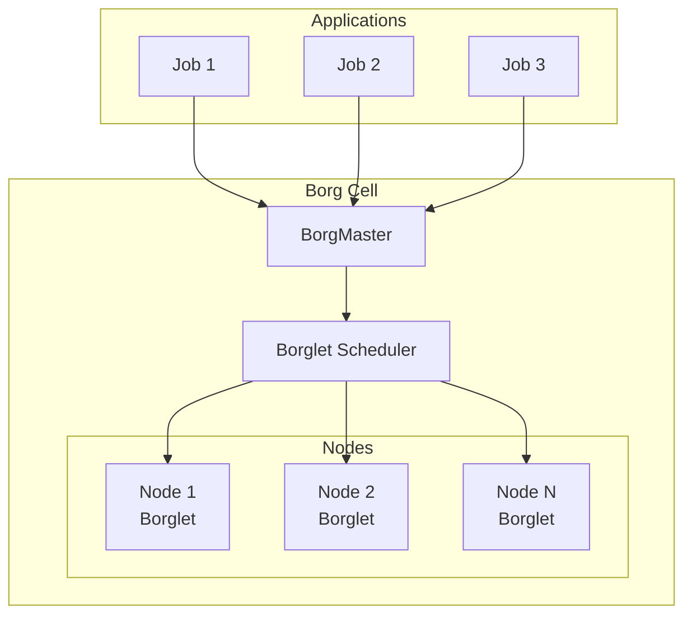
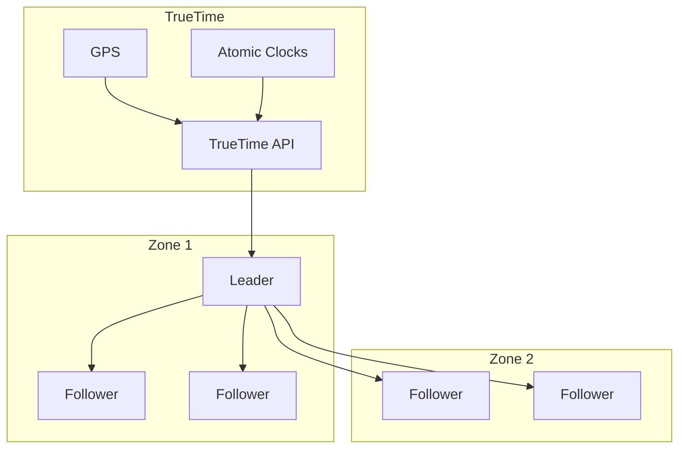
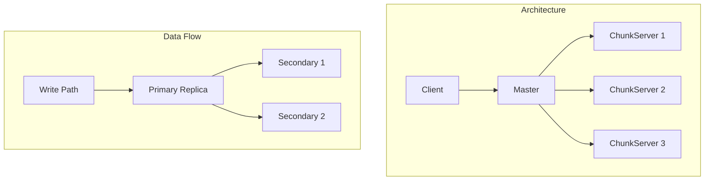
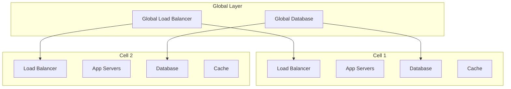
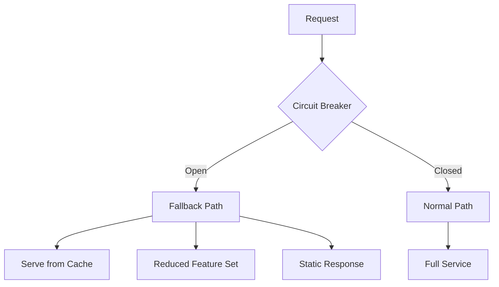

# Google Architecture Patterns Reference

This reference covers architectural patterns frequently seen in Google's systems and commonly discussed in system design interviews.

## Core Google Patterns

### 1. The Borg Pattern (Container Orchestration)



**Key Concepts:**
```python
class BorgPattern:
    """
    Pioneered container orchestration at scale
    """
    principles = {
        "Declarative": "Specify desired state, not steps",
        "Bin_packing": "Efficient resource utilization",
        "Preemption": "Priority-based resource allocation",
        "Admission_control": "Prevent overcommitment"
    }
    
    def apply_to_design(self, system):
        return {
            "Resource_management": "Central scheduler for efficiency",
            "Job_specification": "Declarative config files",
            "Fault_tolerance": "Automatic task restart",
            "Monitoring": "Built-in metrics collection"
        }
```

### 2. The Spanner Pattern (Global Consistency)



**Implementation Strategy:**
```python
def implement_global_consistency():
    """
    Achieve external consistency without TrueTime
    """
    alternatives = {
        "Hybrid_Logical_Clocks": {
            "pros": "No special hardware needed",
            "cons": "Weaker guarantees than TrueTime",
            "use_case": "Most distributed databases"
        },
        "Consensus_Timestamps": {
            "pros": "Strong consistency",
            "cons": "Higher latency",
            "use_case": "Financial systems"
        },
        "Vector_Clocks": {
            "pros": "Captures causality",
            "cons": "No global ordering",
            "use_case": "Collaborative editing"
        }
    }
    return alternatives
```

### 3. The MapReduce Pattern

```
Map Phase → Shuffle → Reduce Phase

Input: Large dataset
↓
Map: Transform each record independently
↓
Shuffle: Group by key
↓
Reduce: Aggregate per key
↓
Output: Processed results
```

**Modern Evolution:**
```python
class ModernMapReduce:
    """
    Evolution of MapReduce at Google
    """
    stages = {
        "Original": "Hadoop MapReduce - Batch only",
        "Dremel": "SQL on nested data - Interactive queries",
        "Millwheel": "Stream processing - Real-time",
        "Dataflow": "Unified batch + stream - Apache Beam",
        "Flume": "High-level data pipelines"
    }
    
    def choose_framework(self, use_case):
        if use_case.latency < timedelta(seconds=1):
            return "Dataflow (streaming mode)"
        elif use_case.interactive_sql:
            return "BigQuery (Dremel)"
        else:
            return "Dataflow (batch mode)"
```

### 4. The GFS/Colossus Pattern (Distributed Storage)



**Design Principles:**
```python
class DistributedStorage:
    principles = {
        "Large_chunks": "64MB+ to amortize overhead",
        "Simple_master": "Metadata only, no data path",
        "Replication": "3x by default, rack-aware",
        "Append_only": "Optimize for sequential writes",
        "Relaxed_consistency": "Per-file semantics"
    }
    
    def design_storage_system(self):
        return {
            "Chunk_size": self.calculate_chunk_size(),
            "Replication_factor": self.determine_replication(),
            "Consistency_model": self.choose_consistency(),
            "Master_design": self.design_metadata_service()
        }
```

### 5. The Bigtable Pattern (Wide Column Store)

```
Row Key → Column Family:Column → Timestamp → Value

Example:
"com.google.www" → "contents:" → t1 → "<html>..."
"com.google.www" → "anchor:cnn.com" → t2 → "CNN Homepage"
```

**When to Use:**
```python
def when_to_use_bigtable_pattern():
    good_fit = [
        "Time-series data with high write volume",
        "Large-scale web indexing",
        "Sparse data with many null values",
        "Need for row-level atomicity"
    ]
    
    poor_fit = [
        "Need full SQL and joins",
        "Small datasets (< 1TB)",
        "Complex transactions",
        "Frequently changing schemas"
    ]
    
    return {"good_fit": good_fit, "poor_fit": poor_fit}
```

## Scalability Patterns

### 6. The Shard-per-User Pattern

```python
class ShardPerUser:
    """
    Used in Gmail, Google Drive, etc.
    """
    def shard_strategy(self, user_id):
        # All user data on same shard
        shard_id = hash(user_id) % num_shards
        return {
            "shard": shard_id,
            "benefits": [
                "No cross-shard queries for user operations",
                "Easy to move users between shards",
                "Natural isolation boundary"
            ],
            "challenges": [
                "Hot users can overload shards",
                "Cross-user features need scatter-gather"
            ]
        }
```

### 7. The Cell Architecture Pattern



**Implementation:**
```python
class CellArchitecture:
    def design_cell(self):
        return {
            "Size": "1000-10000 users per cell",
            "Isolation": "Cells are independent failure domains",
            "Routing": "User → Cell mapping in global layer",
            "Benefits": "Predictable performance, easy scaling",
            "Trade_offs": "Complex cell management, data locality"
        }
```

### 8. The Lambda/Kappa Architecture Pattern

```
Lambda Architecture:
                  ┌─→ Batch Layer → Batch Views ─┐
Raw Data → Kafka ─┤                              ├→ Query
                  └─→ Speed Layer → RT Views ────┘

Kappa Architecture:
Raw Data → Kafka → Stream Processing → Views → Query
```

**Google's Approach:**
```python
def google_streaming_architecture():
    return {
        "Pattern": "Unified batch + streaming (Dataflow)",
        "Benefits": "One codebase, consistent results",
        "Key_innovation": "Watermarks for late data",
        "Use_cases": ["Analytics", "ETL", "Real-time ML"]
    }
```

## Reliability Patterns

### 9. The Canary Deployment Pattern

```python
class CanaryDeployment:
    def rollout_strategy(self, new_version):
        stages = [
            {"stage": "Dev", "traffic": "0%", "duration": "1 day"},
            {"stage": "Canary", "traffic": "1%", "duration": "1 hour"},
            {"stage": "Staged", "traffic": "10%", "duration": "4 hours"},
            {"stage": "Progressive", "traffic": "50%", "duration": "1 day"},
            {"stage": "Full", "traffic": "100%", "duration": "ongoing"}
        ]
        
        for stage in stages:
            if not self.metrics_healthy(new_version, stage):
                self.rollback()
                break
```

### 10. The Circuit Breaker Pattern (Google Style)

```python
class GoogleCircuitBreaker:
    """
    Advanced circuit breaker with adaptive thresholds
    """
    def __init__(self):
        self.state = "CLOSED"
        self.failure_threshold = self.adaptive_threshold()
        self.success_threshold = 5
        self.timeout = self.adaptive_timeout()
    
    def adaptive_threshold(self):
        # Adjust based on time of day, historical data
        return calculate_threshold(
            time_of_day=now(),
            historical_error_rate=get_baseline(),
            current_load=get_qps()
        )
```

### 11. The Graceful Degradation Pattern



**Implementation Levels:**
```python
def degradation_levels():
    return [
        {
            "level": 0,
            "name": "Full Service",
            "features": "All features enabled"
        },
        {
            "level": 1,
            "name": "Non-critical Off",
            "features": "Disable recommendations, keep core"
        },
        {
            "level": 2,
            "name": "Read-only Mode",
            "features": "Disable writes, serve cached reads"
        },
        {
            "level": 3,
            "name": "Emergency Mode",
            "features": "Static page with status"
        }
    ]
```

## Performance Patterns

### 12. The Adaptive Batching Pattern

```python
class AdaptiveBatching:
    """
    Used in Bigtable, Spanner clients
    """
    def __init__(self):
        self.min_batch_size = 1
        self.max_batch_size = 1000
        self.max_latency = timedelta(milliseconds=10)
        
    def should_flush_batch(self, batch, oldest_request_age):
        return (
            len(batch) >= self.max_batch_size or
            oldest_request_age >= self.max_latency or
            self.adaptive_trigger(batch)
        )
    
    def adaptive_trigger(self, batch):
        # Flush early if throughput is low
        current_qps = self.get_current_qps()
        expected_wait = self.max_batch_size / current_qps
        return expected_wait > self.max_latency
```

### 13. The Request Coalescing Pattern

```python
class RequestCoalescing:
    """
    Deduplicate identical concurrent requests
    """
    def __init__(self):
        self.inflight = {}  # key -> Future
        
    async def get(self, key):
        if key in self.inflight:
            # Return existing request's future
            return await self.inflight[key]
        
        # Create new request
        future = asyncio.create_task(self.fetch(key))
        self.inflight[key] = future
        
        try:
            result = await future
            return result
        finally:
            del self.inflight[key]
```

### 14. The Load Shedding Pattern

```python
class LoadShedding:
    def handle_request(self, request):
        load = self.get_current_load()
        
        if load < 0.7:
            return self.process_normally(request)
        elif load < 0.9:
            return self.shed_non_critical(request)
        elif load < 0.95:
            return self.priority_only(request)
        else:
            return self.reject_with_backoff(request)
    
    def get_backoff_time(self):
        # Exponential backoff with jitter
        base = 2 ** self.retry_count
        jitter = random.uniform(0, base * 0.1)
        return base + jitter
```

## Data Patterns

### 15. The Denormalization Pattern

```python
class GoogleDenormalization:
    """
    Strategic denormalization for performance
    """
    strategies = {
        "Materialized_Views": {
            "example": "YouTube view counts",
            "update": "Async aggregation",
            "consistency": "Eventually consistent"
        },
        "Embedded_Documents": {
            "example": "User preferences in session",
            "update": "Write-through cache",
            "consistency": "Strong within document"
        },
        "Computed_Columns": {
            "example": "Search ranking signals",
            "update": "Batch recomputation",
            "consistency": "Periodic refresh"
        }
    }
```

### 16. The Event Sourcing Pattern (Google Style)

```mermaid
graph LR
    E[Event] --> L[Log (Persistent)]
    L --> P1[Processor 1]
    L --> P2[Processor 2]
    L --> P3[Processor 3]
    
    P1 --> V1[View 1]
    P2 --> V2[View 2]
    P3 --> V3[View 3]
```

**Implementation:**
```python
class EventSourcing:
    def design_for_google_scale(self):
        return {
            "Event_Store": "Spanner for global consistency",
            "Event_Bus": "Pub/Sub for distribution",
            "Processing": "Dataflow for transformations",
            "Views": "Bigtable for fast reads",
            "Benefits": "Audit trail, replay capability",
            "Challenges": "Storage cost, complexity"
        }
```

## Operational Patterns

### 17. The SRE Pattern

```python
class SREPattern:
    """
    Site Reliability Engineering principles
    """
    def implement_sre(self, service):
        return {
            "SLI": self.define_service_level_indicators(),
            "SLO": self.set_objectives(),  # e.g., 99.9% availability
            "Error_Budget": self.calculate_error_budget(),
            "Automation": self.automate_toil(),
            "Monitoring": self.implement_observability(),
            "On_Call": self.setup_rotation()
        }
    
    def error_budget_policy(self):
        if self.remaining_error_budget() < 0:
            return "FREEZE_RELEASES"
        elif self.remaining_error_budget() < 0.2:
            return "CAREFUL_RELEASES"
        else:
            return "NORMAL_VELOCITY"
```

### 18. The Prober Pattern

```python
class ProberPattern:
    """
    Synthetic monitoring at Google scale
    """
    def setup_probers(self, service):
        probers = [
            {
                "type": "Blackbox",
                "frequency": "1 minute",
                "checks": ["Endpoint availability", "Response time"]
            },
            {
                "type": "End-to-end",
                "frequency": "5 minutes",
                "checks": ["Full user journey", "Data correctness"]
            },
            {
                "type": "Canary",
                "frequency": "Continuous",
                "checks": ["New feature health", "Performance regression"]
            }
        ]
        return probers
```

## Anti-Patterns to Avoid

### Common Mistakes in Google Interviews

```python
class AntiPatterns:
    mistakes = {
        "Over_engineering": "Don't use Spanner for 1GB of data",
        "Under_engineering": "Don't use single server for Google scale",
        "Wrong_consistency": "Don't use strong consistency for analytics",
        "Ignoring_cost": "Don't ignore TCO at scale",
        "Perfect_solution": "Don't claim zero trade-offs"
    }
    
    def avoid_mistakes(self, design):
        validations = [
            self.check_appropriate_scale(design),
            self.verify_trade_offs_acknowledged(design),
            self.ensure_cost_considered(design),
            self.validate_consistency_choice(design)
        ]
        return all(validations)
```

## Putting It All Together

### Example: Design a Google-Scale Service

```python
def design_google_scale_service(requirements):
    """
    Combine patterns appropriately
    """
    design = {
        "Data_Model": select_data_pattern(requirements),
        "Storage": choose_storage_pattern(requirements),
        "Compute": pick_compute_pattern(requirements),
        "Reliability": apply_reliability_patterns(requirements),
        "Operations": implement_sre_patterns(requirements),
        "Evolution": plan_migration_path(requirements)
    }
    
    # Validate coherent design
    validate_pattern_compatibility(design)
    estimate_cost_at_scale(design)
    verify_performance_targets(design)
    
    return design
```

Remember: These patterns are tools. The art is knowing when and how to apply them based on your specific requirements and constraints.

[Return to Google Interview Guide](./index.md)