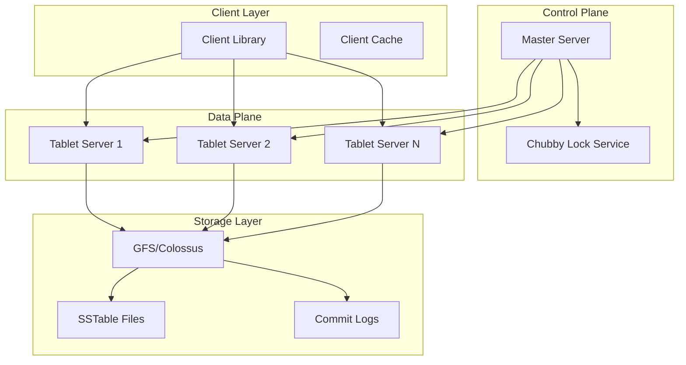

# Design Bigtable


## Problem Statement

"Design a distributed storage system that can handle structured data at massive scale (petabytes), supporting both batch processing and real-time access patterns with low latency."

## Overview

Bigtable is Google's proprietary distributed storage system designed to scale to petabytes of data across thousands of commodity servers. It powers many core Google services including Search, Analytics, Maps, and Gmail.

## Key Characteristics

### Data Model
- **Sparse**: Most cells are empty
- **Distributed**: Data spread across thousands of machines
- **Persistent**: Built on GFS/Colossus for durability
- **Multi-dimensional**: (row, column, timestamp) → value
- **Sorted**: Rows ordered lexicographically

### Scale Metrics
- **Data Size**: Petabytes per table
- **Throughput**: Millions of ops/second
- **Latency**: Single-digit milliseconds
- **Nodes**: Thousands of servers
- **Availability**: 99.9%+ uptime

## System Architecture



## Data Model Deep Dive

### Conceptual Model
```
(row: string, column: string, timestamp: int64) → value: string
```

### Example: Web Crawling Table
```
Row Key: com.google.www (reversed URL)
Column Families:
  - contents: (page content)
  - anchor: (incoming anchor text)
  - metadata: (page metadata)

Timestamps: Multiple versions of each cell

Example data:
com.google.www, contents:, t1 → "<html>..."
com.google.www, anchor:mit.edu, t2 → "Google Home"
com.google.www, metadata:language, t3 → "en"
```

### Column Families
- **Definition**: Group of related columns
- **Configuration**: Created at table setup
- **Access Control**: Per-family ACLs
- **Storage**: Separate locality groups

## Core Components

### 1. Tablet Server
**Responsibilities:**
- Serve read/write requests
- Handle tablet splits
- Perform compactions
- Cache hot data

**Tablet Structure:**
```
Memory:
  - MemTable (sorted buffer)
  - Read cache

Disk (in GFS):
  - SSTable files (immutable)
  - Commit log (WAL)
  - Metadata files
```

### 2. Master Server
**Responsibilities:**
- Tablet assignment to servers
- Load balancing
- Garbage collection
- Schema changes
- Monitor tablet servers

**Fault Tolerance:**
- Single master design
- Fast failover via Chubby
- All state reconstructible

### 3. Chubby Lock Service
**Usage in Bigtable:**
- Master election
- Tablet server discovery
- Schema storage
- ACL storage
- Bootstrap location

### 4. SSTable Format
```
┌─────────────────┐
│   Index Block   │ ← Binary search
├─────────────────┤
│   Data Block 1  │ ← Key-value pairs
├─────────────────┤
│   Data Block 2  │
├─────────────────┤
│      ...        │
├─────────────────┤
│   Data Block N  │
├─────────────────┤
│  Metadata Block │ ← Bloom filter, stats
└─────────────────┘
```

## Read/Write Operations

### Write Path
```python
def write(row_key, column, value):
# 1. Check permissions
    if not has_permission(user, table, column_family):
        raise PermissionError()
    
# 2. Write to commit log
    log_entry = LogEntry(row_key, column, value, timestamp)
    append_to_commit_log(log_entry)
    
# 3. Write to MemTable
    memtable.insert(row_key, column, timestamp, value)
    
# 4. Check if MemTable is full
    if memtable.size() > MEMTABLE_THRESHOLD:
        trigger_minor_compaction()
```

### Read Path
```python
def read(row_key, column):
# 1. Check MemTable
    value = memtable.get(row_key, column)
    if value:
        return value
    
# 2. Check block cache
    value = block_cache.get(row_key, column)
    if value:
        return value
    
# 3. Check SSTables (newest first)
    for sstable in sorted(sstables, key=lambda x: x.timestamp, reverse=True):
        if sstable.might_contain(row_key):  # Bloom filter
            value = sstable.get(row_key, column)
            if value:
                block_cache.put(row_key, column, value)
                return value
    
    return None
```

## Tablet Management

### Tablet Splitting
```
When tablet size > threshold (100-200 MB):

Original Tablet:
[start_row, end_row]
         ↓
Split at median: split_row
         ↓
Tablet 1: [start_row, split_row]
Tablet 2: [split_row, end_row]
```

### Tablet Assignment Protocol
```
1. Master → Chubby: Create tablet lock file
2. Master → TabletServer: LoadTablet RPC
3. TabletServer → Chubby: Acquire tablet lock
4. TabletServer → Master: Tablet loaded
5. Master updates metadata
```

## Compaction Strategies

### Minor Compaction
- **Trigger**: MemTable full
- **Process**: MemTable → new SSTable
- **Goal**: Reduce memory usage

### Merging Compaction
- **Trigger**: Too many SSTables
- **Process**: Merge multiple SSTables
- **Goal**: Reduce read amplification

### Major Compaction
- **Trigger**: Periodic or manual
- **Process**: Rewrite all SSTables
- **Goal**: Reclaim deleted data

## Performance Optimizations

### 1. Locality Groups
```python
# Group columns accessed together
locality_groups = {
    "web_content": ["contents:", "render:"],
    "link_data": ["anchor:", "linkcount:"],
    "metadata": ["language:", "pagerank:"]
}
```

### 2. Bloom Filters
- Per-SSTable filters
- Reduce disk seeks
- ~1% false positive rate

### 3. Compression
- Block-level compression
- Custom compression per locality group
- Typical 10:1 compression ratio

### 4. Caching
- **Block Cache**: SSTable blocks
- **Key Cache**: Row key locations
- **Memtable**: Recent writes

## System Design Considerations

### Consistency Model
- **Row-level**: Atomic row operations
- **No multi-row**: No distributed transactions
- **Timeline**: Consistent ordering per row

### Availability Strategies
- **Replication**: Via GFS
- **Fast Recovery**: Tablet reassignment
- **No Single Point**: Master failover

### Scalability Patterns
- **Horizontal**: Add tablet servers
- **Automatic**: Tablet splitting
- **Linear**: Performance scales with nodes

## Common Interview Questions

### Q1: "How does Bigtable differ from a relational database?"
**Answer:**
- No SQL, no joins
- Schema-less (except column families)
- Designed for scale over features
- Row-level transactions only
- Sparse data model

### Q2: "How does Bigtable handle hot tablets?"
**Answer:**
- Load-based splitting
- Tablet migration
- Multiple replicas
- Caching at multiple levels
- Request coalescing

### Q3: "What happens during master failure?"
**Answer:**
- Chubby detects failure
- New master elected
- Scan Chubby for tablet assignments
- Contact tablet servers
- Minimal downtime (~10 seconds)

## Design Extensions

### For Time-Series Data
```python
# Row key design for time-series
row_key = f"{metric_name}#{timestamp/bucket_size}"

# Prevents hotspots on recent data
row_key = f"{metric_name}#{hash(timestamp) % shards}#{timestamp}"
```

### For Secondary Indexes
```python
# Create reverse index table
main_table: user_id → user_data
index_table: email → user_id

# Maintain consistency manually
def update_user(user_id, email, data):
    old_email = get_user_email(user_id)
    
# Update main table
    write_to_bigtable(main_table, user_id, data)
    
# Update index
    if old_email != email:
        delete_from_bigtable(index_table, old_email)
        write_to_bigtable(index_table, email, user_id)
```

## Best Practices

### 1. Row Key Design
- Avoid monotonic keys (timestamps)
- Consider access patterns
- Balance key distribution

### 2. Schema Design
- Minimize column families
- Group related data
- Plan for growth

### 3. Performance Tuning
- Use appropriate caching
- Enable compression
- Monitor tablet sizes

## References

- [Bigtable: A Distributed Storage System for Structured Data](https://research.google/pubs/pub27898/)
- [Cloud Bigtable Documentation](https://cloud.google.com/bigtable/docs)
- Real-world usage at Google scale

[Return to Google Interview Guide](google-interviews/index.md)