# Common Mistakes in Google System Design Interviews

## Mistake Severity Dashboard

<div class="severity-card critical">
<h3>🔴 Critical Mistakes</h3>
<p class="severity-count">5 mistakes</p>
<p>Interview killers - avoid at all costs</p>
<h3>🟡 Major Mistakes</h3>
<p class="severity-count">8 mistakes</p>
<p>Significantly hurt your chances</p>
<h3>🟢 Minor Mistakes</h3>
<p class="severity-count">10 mistakes</p>
<p>Room for improvement</p>
</div>

## Mistake Impact Matrix

```mermaid
graph TD
    subgraph "Critical Impact"
        C1[Not Thinking at Scale]
        C2[No Failure Handling]
        C3[Ignoring Requirements]
        C4[Poor Communication]
        C5[Time Mismanagement]
    end
    
    subgraph "Major Impact"
        M1[Over-Engineering]
        M2[Weak API Design]
        M3[Missing Monitoring]
        M4[Ignoring Costs]
        M5[No Consistency Plan]
    end
    
    subgraph "Minor Impact"
        Mi1[Suboptimal Choices]
        Mi2[Missing Edge Cases]
        Mi3[Limited Options]
    end
    
    C1 --> Reject[High Rejection Risk]
    C2 --> Reject
    C3 --> Reject
    
    M1 --> Maybe[Borderline Decision]
    M2 --> Maybe
    
    Mi1 --> Pass[Still Might Pass]
    Mi2 --> Pass
    
    style C1 fill:#FF6B6B
    style C2 fill:#FF6B6B
    style C3 fill:#FF6B6B
    style M1 fill:#FFE66D
    style M2 fill:#FFE66D
    style Mi1 fill:#95E1D3
    style Mi2 fill:#95E1D3
```

## Critical Mistakes (Interview Killers)

### 1. Not Thinking at Google Scale

<table class="responsive-table">
<thead>
<tr>
<th>❌ Wrong Approach</th>
<th>✅ Correct Approach</th>
<th>🎯 Why It Matters</th>
</tr>
</thead>
<tbody>
<tr>
<td data-label="❌ Wrong Approach">"We'll use a single PostgreSQL database"</td>
<td data-label="✅ Correct Approach">"We'll shard across thousands of database instances"</td>
<td data-label="🎯 Why It Matters">Google operates at planetary scale</td>
</tr>
<tr>
<td data-label="❌ Wrong Approach">"A few servers should handle it"</td>
<td data-label="✅ Correct Approach">"We'll need 10,000+ servers globally"</td>
<td data-label="🎯 Why It Matters">Billions of users, not thousands</td>
</tr>
<tr>
<td data-label="❌ Wrong Approach">"10GB of storage should be enough"</td>
<td data-label="✅ Correct Approach">"We'll need exabytes of storage"</td>
<td data-label="🎯 Why It Matters">Data grows exponentially</td>
</tr>
</tbody>
</table>

#### Scale Comparison Visual

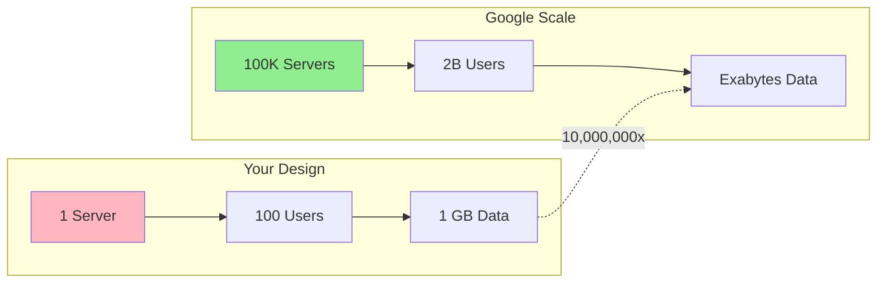

**Mistake**: Designing for thousands of users instead of billions
```
❌ Wrong: "We'll use a single PostgreSQL database"
✅ Right: "We'll shard across thousands of database instances"
```

**How to Avoid**:
- Always clarify scale requirements upfront
- Think in terms of billions of users from the start
- Consider global distribution
- Plan for 100x growth

### 2. Poor Time Management

<svg viewBox="0 0 400 200">
 <!-- Wrong time allocation -->
 <text x="10" y="30" font-weight="bold">❌ Wrong:</text>
 <rect x="10" y="40" width="300" height="30" fill="#FF6B6B" opacity="0.7"/>
 <rect x="310" y="40" width="60" height="30" fill="#FFE66D" opacity="0.7"/>
 <rect x="370" y="40" width="20" height="30" fill="#95E1D3" opacity="0.7"/>
 <text x="160" y="60" text-anchor="middle" fill="white">Requirements (30 min)</text>
 <text x="340" y="60" text-anchor="middle">Design (10m)</text>
 
 <!-- Correct time allocation -->
 <text x="10" y="120" font-weight="bold">✅ Right:</text>
 <rect x="10" y="130" width="40" height="30" fill="#FF6B6B" opacity="0.7"/>
 <rect x="50" y="130" width="40" height="30" fill="#FFE66D" opacity="0.7"/>
 <rect x="90" y="130" width="180" height="30" fill="#4ECDC4" opacity="0.7"/>
 <rect x="270" y="130" width="80" height="30" fill="#95E1D3" opacity="0.7"/>
 <rect x="350" y="130" width="40" height="30" fill="#A8E6CF" opacity="0.7"/>
 
 <text x="30" y="150" text-anchor="middle">Req</text>
 <text x="70" y="150" text-anchor="middle">Est</text>
 <text x="180" y="150" text-anchor="middle" fill="white">High Level Design</text>
 <text x="310" y="150" text-anchor="middle">Deep Dive</text>
 <text x="370" y="150" text-anchor="middle">Q&A</text>
</svg>

#### Time Management Rules

<div class="rule-card">
<h4>5-Minute Rule</h4>
<p>If stuck on requirements > 5 min, make assumptions and move on</p>
<h4>25-Minute Checkpoint</h4>
<p>Must have complete high-level design by 25 min mark</p>
<h4>35-Minute Warning</h4>
<p>Start wrapping up, leave time for questions</p>
</div>

### 3. Ignoring Failure Scenarios

#### Failure Scenario Checklist

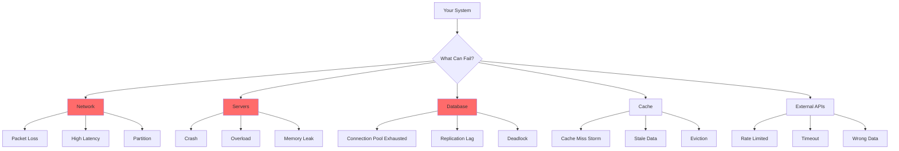

<table class="responsive-table">
<thead>
<tr>
<th>Component</th>
<th>❌ No Failure Handling</th>
<th>✅ With Failure Handling</th>
</tr>
</thead>
<tbody>
<tr>
<td data-label="Component"><strong>API Call</strong></td>
<td data-label="❌ No Failure Handling"><code>result = service.call()</code></td>
<td data-label="✅ With Failure Handling"><code>result = retry_with_backoff(<br/> service.call,<br/> max_retries=3,<br/> timeout=1s<br/>)</code></td>
</tr>
<tr>
<td data-label="Component"><strong>Database</strong></td>
<td data-label="❌ No Failure Handling"><code>db.query(sql)</code></td>
<td data-label="✅ With Failure Handling"><code>with circuit_breaker:<br/> try:<br/> db.query(sql, timeout=100ms)<br/> except:<br/> return cached_result</code></td>
</tr>
<tr>
<td data-label="Component"><strong>Cache</strong></td>
<td data-label="❌ No Failure Handling"><code>cache.get(key)</code></td>
<td data-label="✅ With Failure Handling"><code>try:<br/> return cache.get(key)<br/>except CacheMiss:<br/> return fetch_with_lock(key)</code></td>
</tr>
</tbody>
</table>

**Mistake**: Assuming everything works perfectly
```
❌ Wrong: "The service calls the database and returns the result"
✅ Right: "The service calls the database with timeout, retry logic, and circuit breaker"
```

**How to Avoid**:
- Consider failure at every component
- Discuss fallback strategies
- Plan for graceful degradation
- Include monitoring and alerting

### 4. Not Asking Clarifying Questions 🤔

#### Essential Questions Flowchart

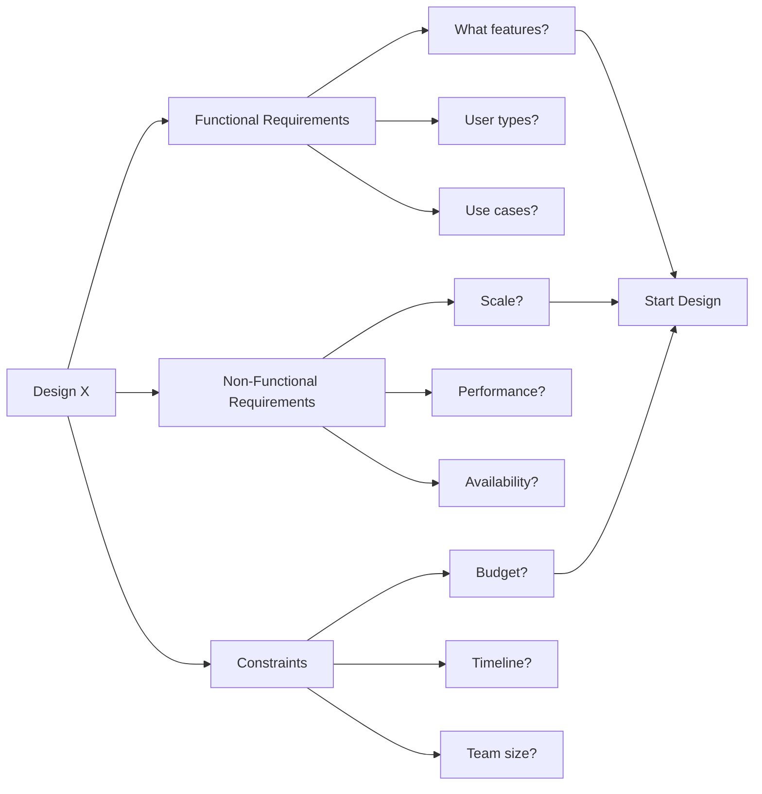

<div class="question-category">
<h4>🎯 Scale Questions</h4>
<ul>
<li>"How many users are we designing for?"</li>
<li>"What's the peak QPS we need to handle?"</li>
<li>"How much data will we store?"</li>
<li>"What's the expected growth rate?"</li>
</ul>
<h4>⚡ Performance Questions</h4>
<ul>
<li>"What's the acceptable latency?"</li>
<li>"Do we need real-time updates?"</li>
<li>"What's more important: latency or throughput?"</li>
<li>"Any specific SLA requirements?"</li>
</ul>
<h4>🔧 Feature Questions</h4>
<ul>
<li>"Should we support [specific feature]?"</li>
<li>"Is this a read-heavy or write-heavy system?"</li>
<li>"Do we need to support mobile clients?"</li>
<li>"Any regulatory requirements?"</li>
</ul>
</div>

### 5. Missing the Big Picture 🖼

#### System Completeness Checklist

<div class="component-check">
<h4>✅ Client Layer</h4>
<label><input type="checkbox"> Web clients</label>
<label><input type="checkbox"> Mobile apps</label>
<label><input type="checkbox"> API clients</label>
<h4>✅ Gateway Layer</h4>
<label><input type="checkbox"> Load balancer</label>
<label><input type="checkbox"> API gateway</label>
<label><input type="checkbox"> Rate limiting</label>
<h4>✅ Service Layer</h4>
<label><input type="checkbox"> Business logic</label>
<label><input type="checkbox"> Service mesh</label>
<label><input type="checkbox"> Circuit breakers</label>
<h4>✅ Data Layer</h4>
<label><input type="checkbox"> Primary database</label>
<label><input type="checkbox"> Cache layer</label>
<label><input type="checkbox"> Search index</label>
<h4>✅ Infrastructure</h4>
<label><input type="checkbox"> Monitoring</label>
<label><input type="checkbox"> Logging</label>
<label><input type="checkbox"> Alerting</label>
<h4>✅ External</h4>
<label><input type="checkbox"> CDN</label>
<label><input type="checkbox"> Third-party APIs</label>
<label><input type="checkbox"> Payment systems</label>
</div>

**Mistake**: Getting lost in implementation details
```
❌ Wrong: Spending 15 minutes on database index optimization
✅ Right: Cover end-to-end flow first, then dive into specifics
```

**How to Avoid**:
- Start with high-level architecture
- Complete the full system before optimizing
- Use the "breadth-first" approach
- Save details for deep dive

## Major Mistakes (Significant Impact)

### 6. Neglecting Data Consistency

#### Consistency Decision Matrix

<table class="responsive-table">
<thead>
<tr>
<th>Use Case</th>
<th>Consistency Model</th>
<th>Why</th>
<th>Implementation</th>
</tr>
</thead>
<tbody>
<tr>
<td data-label="Use Case"><strong>Payment Processing</strong></td>
<td data-label="Consistency Model">🔴 Strong Consistency</td>
<td data-label="Why">Money can't be lost or duplicated</td>
<td data-label="Implementation">Distributed transactions, 2PC</td>
</tr>
<tr>
<td data-label="Use Case"><strong>User Profile Updates</strong></td>
<td data-label="Consistency Model">🟡 Eventual Consistency</td>
<td data-label="Why">Okay if takes few seconds to propagate</td>
<td data-label="Implementation">Async replication, events</td>
</tr>
<tr>
<td data-label="Use Case"><strong>View Counts</strong></td>
<td data-label="Consistency Model">🟢 Weak Consistency</td>
<td data-label="Why">Approximate counts acceptable</td>
<td data-label="Implementation">Best effort, sampling</td>
</tr>
<tr>
<td data-label="Use Case"><strong>Inventory Management</strong></td>
<td data-label="Consistency Model">🔴 Strong Consistency</td>
<td data-label="Why">Can't oversell products</td>
<td data-label="Implementation">Pessimistic locking</td>
</tr>
<tr>
<td data-label="Use Case"><strong>Recommendations</strong></td>
<td data-label="Consistency Model">🟢 Weak Consistency</td>
<td data-label="Why">Stale data acceptable</td>
<td data-label="Implementation">Cached, periodic updates</td>
</tr>
</tbody>
</table>

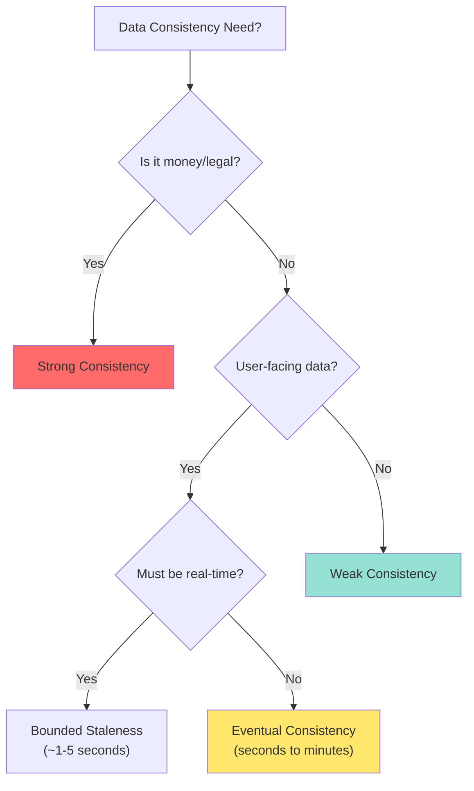

**Mistake**: Hand-waving consistency requirements
```
❌ Wrong: "We'll just use eventual consistency everywhere"
✅ Right: "Payment requires strong consistency, while view counts can be eventually consistent"
```

**How to Avoid**:
- Identify consistency requirements per feature
- Explain trade-offs clearly
- Know when to use different consistency models
- Consider business impact

### 7. Forgetting About Costs

#### Cost Breakdown Calculator

<h4>Monthly Cost Estimation for 1B Users</h4>
<table class="responsive-table">
<thead>
<tr>
<th>Component</th>
<th>Usage</th>
<th>Unit Cost</th>
<th>Monthly Cost</th>
<th>% of Total</th>
</tr>
</thead>
<tbody>
<tr>
<td data-label="Component"><strong>Compute (Servers)</strong></td>
<td data-label="Usage">10,000 instances</td>
<td data-label="Unit Cost">$100/instance</td>
<td data-label="Monthly Cost">$1,000,000</td>
<td data-label="% of Total">20%</td>
</tr>
<tr>
<td data-label="Component"><strong>Storage</strong></td>
<td data-label="Usage">1 PB</td>
<td data-label="Unit Cost">$20/TB</td>
<td data-label="Monthly Cost">$20,000</td>
<td data-label="% of Total">0.4%</td>
</tr>
<tr>
<td data-label="Component"><strong>Bandwidth</strong></td>
<td data-label="Usage">10 PB/month</td>
<td data-label="Unit Cost">$0.08/GB</td>
<td data-label="Monthly Cost">$800,000</td>
<td data-label="% of Total">16%</td>
</tr>
<tr>
<td data-label="Component"><strong>Database</strong></td>
<td data-label="Usage">100 clusters</td>
<td data-label="Unit Cost">$5,000/cluster</td>
<td data-label="Monthly Cost">$500,000</td>
<td data-label="% of Total">10%</td>
</tr>
<tr>
<td data-label="Component"><strong>CDN</strong></td>
<td data-label="Usage">50 PB/month</td>
<td data-label="Unit Cost">$0.04/GB</td>
<td data-label="Monthly Cost">$2,000,000</td>
<td data-label="% of Total">40%</td>
</tr>
<tr>
<td data-label="Component"><strong>Operations</strong></td>
<td data-label="Usage">50 engineers</td>
<td data-label="Unit Cost">$20,000/eng</td>
<td data-label="Monthly Cost">$1,000,000</td>
<td data-label="% of Total">20%</td>
</tr>
<tr class="total-row">
<td data-label="Component"><strong>TOTAL</strong></td>
<td data-label="Usage">-</td>
<td data-label="Unit Cost">-</td>
<td data-label="Monthly Cost"><strong>$5,320,000</strong></td>
<td data-label="% of Total"><strong>100%</strong></td>
</tr>
</tbody>
</table>

#### Cost Optimization Strategies

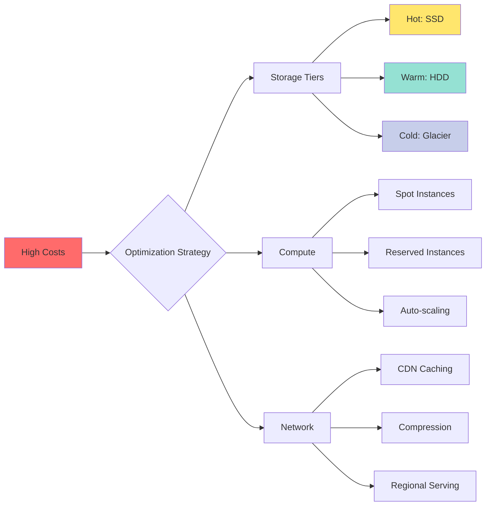

**Mistake**: Proposing expensive solutions without justification
```
❌ Wrong: "Store everything in memory for fast access"
✅ Right: "Use tiered storage: hot data in memory, warm in SSD, cold in HDD"
```

**How to Avoid**:
- Consider cost at Google scale
- Propose cost-effective solutions
- Discuss storage tiers
- Mention optimization strategies

### 8. Over-Engineering Too Early

#### Evolution Path Visualization

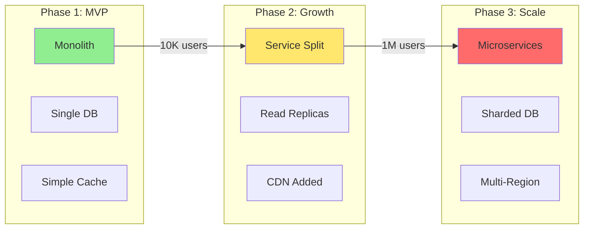

<table class="responsive-table">
<thead>
<tr>
<th>Stage</th>
<th>Users</th>
<th>Architecture</th>
<th>Complexity</th>
<th>Team Size</th>
</tr>
</thead>
<tbody>
<tr>
<td data-label="Stage"><strong>MVP</strong></td>
<td data-label="Users">0-10K</td>
<td data-label="Architecture">• Monolith<br/>• Single DB<br/>• Basic caching</td>
<td data-label="Complexity">⭐</td>
<td data-label="Team Size">2-5 devs</td>
</tr>
<tr>
<td data-label="Stage"><strong>Growth</strong></td>
<td data-label="Users">10K-1M</td>
<td data-label="Architecture">• Few services<br/>• Read replicas<br/>• CDN</td>
<td data-label="Complexity">⭐⭐⭐</td>
<td data-label="Team Size">10-20 devs</td>
</tr>
<tr>
<td data-label="Stage"><strong>Scale</strong></td>
<td data-label="Users">1M-100M</td>
<td data-label="Architecture">• Microservices<br/>• Sharding<br/>• Multi-region</td>
<td data-label="Complexity">⭐⭐⭐⭐⭐</td>
<td data-label="Team Size">50+ devs</td>
</tr>
<tr>
<td data-label="Stage"><strong>Hyper-scale</strong></td>
<td data-label="Users">100M+</td>
<td data-label="Architecture">• Service mesh<br/>• Global distribution<br/>• Custom infrastructure</td>
<td data-label="Complexity">⭐⭐⭐⭐⭐⭐</td>
<td data-label="Team Size">100+ devs</td>
</tr>
</tbody>
</table>

### 9. Weak API Design 🔌

#### API Design Checklist

<div class="api-section">
<h4>RESTful Design</h4>
<pre>
✅ Good:
GET /api/v1/users?limit=20&offset=40
POST /api/v1/users
GET /api/v1/users/{id}
PUT /api/v1/users/{id}
DELETE /api/v1/users/{id}

❌ Bad:
GET /getUsers
POST /createNewUser
GET /user_info
POST /updateUserInfo
GET /deleteUser?id=123
</pre>
!!! info
 <h4>Response Format</h4>
<pre>
✅ Good:
{
 "data": {
 "users": [...],
 "total": 1000,
 "page": 3,
 "pageSize": 20
 },
 "meta": {
 "requestId": "uuid",
 "timestamp": "2024-01-01T00:00:00Z"
 },
 "errors": []
}

❌ Bad:
{
 "users": [...],
 "more": true
}
</pre>
</div>

#### API Design Decision Tree

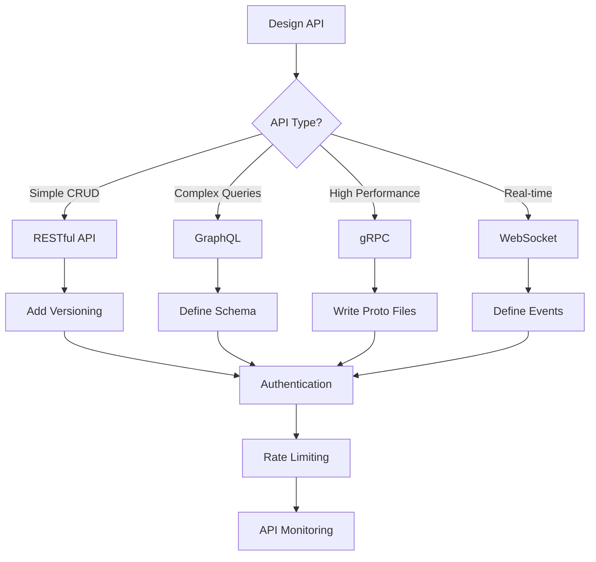

**Mistake**: Vague or incomplete API definitions
```
❌ Wrong: "The API returns search results"
✅ Right: 
 GET /search?q=term&limit=20&offset=0
 Response: {
 results: [...],
 total: 1000,
 next_page_token: "..."
 }
```

**How to Avoid**:
- Define clear endpoints
- Include request/response formats
- Consider pagination
- Plan for versioning

### 10. Insufficient Monitoring Discussion

#### Comprehensive Monitoring Stack

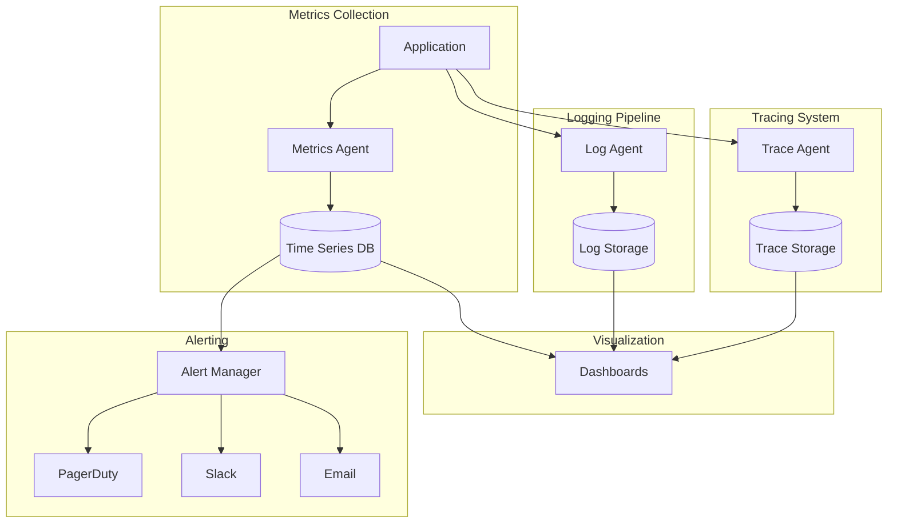

#### Key Metrics by Component

<div class="metric-box">
<h4>🌐 API Gateway</h4>
<ul>
<li>Requests/sec</li>
<li>Latency (p50, p95, p99)</li>
<li>Error rate</li>
<li>Active connections</li>
</ul>
!!! info
 <h4>💾 Database</h4>
<ul>
<li>Query latency</li>
<li>Connection pool usage</li>
<li>Lock wait time</li>
<li>Replication lag</li>
</ul>
!!! info
 <h4>🚀 Application</h4>
<ul>
<li>Response time</li>
<li>Throughput</li>
<li>Error rate</li>
<li>CPU/Memory usage</li>
</ul>
!!! info
 <h4>📦 Cache</h4>
<ul>
<li>Hit rate</li>
<li>Eviction rate</li>
<li>Memory usage</li>
<li>Get/Set latency</li>
</ul>
!!! info
 <h4>🔄 Queue</h4>
<ul>
<li>Queue depth</li>
<li>Processing rate</li>
<li>Message age</li>
<li>DLQ count</li>
</ul>
!!! info
 <h4>💰 Business</h4>
<ul>
<li>User signups</li>
<li>Transaction volume</li>
<li>Revenue metrics</li>
<li>Feature adoption</li>
</ul>
</div>

**Mistake**: Adding monitoring as an afterthought
```
❌ Wrong: "We'll add some monitoring"
✅ Right: "We'll monitor QPS, latency (p50/p95/p99), error rates, and set up alerts for SLA violations"
```

**Key Metrics to Discuss**:
- Latency percentiles
- Throughput metrics
- Error rates
- Business metrics
- SLA monitoring

## Minor Mistakes (Room for Improvement)

### Communication & Behavioral Mistakes

#### Communication Anti-Patterns

<div class="comm-mistake">
<h4>❌ Silent Thinking</h4>
<p><strong>Wrong:</strong> *thinks for 2 minutes silently*</p>
<p><strong>Right:</strong> "I'm considering two approaches: A would give us better performance but B would be simpler to implement..."</p>
<h4>❌ Defensive Behavior</h4>
<p><strong>Wrong:</strong> "No, that won't work because..."</p>
<p><strong>Right:</strong> "That's an interesting point. Let me think about how we could incorporate that..."</p>
<h4>❌ Unclear Diagrams</h4>
<p><strong>Wrong:</strong> Unlabeled boxes and lines</p>
<p><strong>Right:</strong> Clear labels, data flow arrows, component names</p>
<h4>❌ Jargon Overload</h4>
<p><strong>Wrong:</strong> "We'll use CQRS with ES and DDD..."</p>
<p><strong>Right:</strong> "We'll separate reads and writes using CQRS pattern, which means..."</p>
</div>

### Not Thinking Out Loud
- Explain your reasoning
- Share trade-off considerations
- Verbalize your thought process

### Being Defensive
- Accept feedback gracefully
- Iterate on your design
- Show flexibility

### Not Managing Ambiguity
- Make reasonable assumptions
- State them clearly
- Move forward with confidence

## 📚 Knowledge Gap Assessment

### Self-Assessment Checklist

<div class="knowledge-section">
<h4>🎯 Distributed Systems Fundamentals</h4>
<label><input type="checkbox"> CAP Theorem - Can explain trade-offs</label>
<label><input type="checkbox"> Consistency Models - Know at least 3 types</label>
<label><input type="checkbox"> Consensus - Understand Paxos/Raft basics</label>
<label><input type="checkbox"> Partitioning - Can design sharding strategy</label>
<label><input type="checkbox"> Replication - Know sync vs async</label>
<div class="skill-level">
<span>Skill Level:</span>
<span class="level-bar"><span class="level-fill"></span></span>
</div>
!!! info
 <h4>🔧 Google Technologies</h4>
<label><input type="checkbox"> Bigtable - Understand architecture</label>
<label><input type="checkbox"> Spanner - Know TrueTime concept</label>
<label><input type="checkbox"> MapReduce - Can explain workflow</label>
<label><input type="checkbox"> GFS/Colossus - Understand design</label>
<label><input type="checkbox"> Borg - Know container orchestration</label>
<div class="skill-level">
<span>Skill Level:</span>
<span class="level-bar"><span class="level-fill"></span></span>
</div>
!!! info
 <h4>⚡ Performance & Scale</h4>
<label><input type="checkbox"> Caching - Know 4+ strategies</label>
<label><input type="checkbox"> Load Balancing - Understand algorithms</label>
<label><input type="checkbox"> Queueing - Can apply Little's Law</label>
<label><input type="checkbox"> Profiling - Know how to find bottlenecks</label>
<label><input type="checkbox"> Optimization - Can reduce latency</label>
<div class="skill-level">
<span>Skill Level:</span>
<span class="level-bar"><span class="level-fill"></span></span>
</div>
</div>

### Common Gaps to Address

1. **Distributed Systems Fundamentals**
 - CAP theorem
 - Consensus protocols
 - Consistency models

2. **Google Technologies**
 - Bigtable vs Spanner
 - MapReduce basics
 - GFS/Colossus concepts

3. **Scaling Patterns**
 - Sharding strategies
 - Caching layers
 - Load balancing

4. **System Design Patterns**
 - Event sourcing
 - CQRS
 - Saga pattern

## Communication Mistakes

### Poor Diagramming
```
❌ Wrong: Messy, unlabeled boxes
✅ Right: Clear components with data flow arrows
```

### Using Jargon Incorrectly
- Understand terms before using them
- Explain acronyms
- Be precise with technical terms

### Not Engaging the Interviewer
- Ask for feedback
- Check understanding
- Invite questions

## System-Specific Mistake Patterns

### Common Mistakes by System Type

<table class="responsive-table">
<thead>
<tr>
<th>System Type</th>
<th>Common Mistakes</th>
<th>Must Include</th>
<th>Often Forgotten</th>
</tr>
</thead>
<tbody>
<tr>
<td data-label="System Type"><strong>🔍 Search Systems</strong></td>
<td data-label="Common Mistakes">• No ranking algorithm<br/>• Ignoring index updates<br/>• No query understanding</td>
<td data-label="Must Include">• Inverted index<br/>• Ranking algorithm<br/>• Query processing</td>
<td data-label="Often Forgotten">• Spell correction<br/>• Personalization<br/>• A/B testing</td>
</tr>
<tr>
<td data-label="System Type"><strong>💬 Chat Systems</strong></td>
<td data-label="Common Mistakes">• No message ordering<br/>• Missing offline support<br/>• No presence system</td>
<td data-label="Must Include">• WebSocket/SSE<br/>• Message queue<br/>• Delivery receipts</td>
<td data-label="Often Forgotten">• End-to-end encryption<br/>• Media handling<br/>• Push notifications</td>
</tr>
<tr>
<td data-label="System Type"><strong>📹 Video Systems</strong></td>
<td data-label="Common Mistakes">• Underestimating bandwidth<br/>• No CDN design<br/>• Missing transcoding</td>
<td data-label="Must Include">• CDN architecture<br/>• Adaptive bitrate<br/>• Storage tiers</td>
<td data-label="Often Forgotten">• DRM<br/>• Analytics pipeline<br/>• Thumbnail generation</td>
</tr>
<tr>
<td data-label="System Type"><strong>💳 Payment Systems</strong></td>
<td data-label="Common Mistakes">• Weak consistency<br/>• No idempotency<br/>• Missing audit logs</td>
<td data-label="Must Include">• ACID guarantees<br/>• Idempotent APIs<br/>• Audit trail</td>
<td data-label="Often Forgotten">• Fraud detection<br/>• Reconciliation<br/>• Compliance (PCI)</td>
</tr>
<tr>
<td data-label="System Type"><strong>📦 E-commerce</strong></td>
<td data-label="Common Mistakes">• No inventory tracking<br/>• Cart abandonment<br/>• Poor search</td>
<td data-label="Must Include">• Product catalog<br/>• Cart service<br/>• Order management</td>
<td data-label="Often Forgotten">• Recommendation engine<br/>• Review system<br/>• Wishlist</td>
</tr>
</tbody>
</table>

### For Search Systems
- Forgetting about ranking
- Ignoring index updates
- Missing query understanding

### For Storage Systems
- No deduplication strategy
- Ignoring durability requirements
- Missing consistency model

### For Real-time Systems
- Not considering WebSockets
- Ignoring connection management
- Missing message ordering

### For Video Systems
- Forgetting CDN design
- Missing adaptive bitrate
- Ignoring storage costs

## 🏋 Practice Strategies to Avoid Mistakes

### Daily Practice Routine

```mermaid
gantt
    title Daily 2-Hour Practice Schedule
    dateFormat HH:mm
    axisFormat %H:%M
    
    section Morning
    Review Mistakes      :done, 07:00, 15m
    Read System Design   :active, 07:15, 30m
    
    section Evening  
    Design Practice      :18:00, 45m
    Self Review          :18:45, 15m
    Note Improvements    :19:00, 15m
```

### Mock Interview Evaluation Form

<h4>Post-Interview Self Assessment</h4>
<table class="responsive-table">
<thead>
<tr>
<th>Criteria</th>
<th>❌ Failed</th>
<th>⚠️ Needs Work</th>
<th>✅ Good</th>
<th>🌟 Excellent</th>
</tr>
</thead>
<tbody>
<tr>
<td data-label="Criteria"><strong>Requirements Gathering</strong></td>
<td data-label="❌ Failed"><input type="radio" name="req"></td>
<td data-label="⚠️ Needs Work"><input type="radio" name="req"></td>
<td data-label="✅ Good"><input type="radio" name="req"></td>
<td data-label="🌟 Excellent"><input type="radio" name="req"></td>
</tr>
<tr>
<td data-label="Criteria"><strong>Scale Thinking</strong></td>
<td data-label="❌ Failed"><input type="radio" name="scale"></td>
<td data-label="⚠️ Needs Work"><input type="radio" name="scale"></td>
<td data-label="✅ Good"><input type="radio" name="scale"></td>
<td data-label="🌟 Excellent"><input type="radio" name="scale"></td>
</tr>
<tr>
<td data-label="Criteria"><strong>System Completeness</strong></td>
<td data-label="❌ Failed"><input type="radio" name="complete"></td>
<td data-label="⚠️ Needs Work"><input type="radio" name="complete"></td>
<td data-label="✅ Good"><input type="radio" name="complete"></td>
<td data-label="🌟 Excellent"><input type="radio" name="complete"></td>
</tr>
<tr>
<td data-label="Criteria"><strong>Failure Handling</strong></td>
<td data-label="❌ Failed"><input type="radio" name="failure"></td>
<td data-label="⚠️ Needs Work"><input type="radio" name="failure"></td>
<td data-label="✅ Good"><input type="radio" name="failure"></td>
<td data-label="🌟 Excellent"><input type="radio" name="failure"></td>
</tr>
<tr>
<td data-label="Criteria"><strong>Time Management</strong></td>
<td data-label="❌ Failed"><input type="radio" name="time"></td>
<td data-label="⚠️ Needs Work"><input type="radio" name="time"></td>
<td data-label="✅ Good"><input type="radio" name="time"></td>
<td data-label="🌟 Excellent"><input type="radio" name="time"></td>
</tr>
<tr>
<td data-label="Criteria"><strong>Communication</strong></td>
<td data-label="❌ Failed"><input type="radio" name="comm"></td>
<td data-label="⚠️ Needs Work"><input type="radio" name="comm"></td>
<td data-label="✅ Good"><input type="radio" name="comm"></td>
<td data-label="🌟 Excellent"><input type="radio" name="comm"></td>
</tr>
</tbody>
</table>
<div class="improvement-notes">
<h5>Top 3 Things to Improve:</h5>
<textarea rows="4" placeholder="1. &#10;2. &#10;3. "></textarea>
</div>

### Mock Interview Checklist
- [ ] Clarified all requirements
- [ ] Designed for Google scale
- [ ] Addressed failure scenarios
- [ ] Managed time well
- [ ] Covered full system
- [ ] Discussed monitoring
- [ ] Considered costs
- [ ] Drew clear diagrams

### Self-Review Questions
1. Did I think big enough?
2. Is my design simple to start?
3. How does each component fail?
4. What are the bottlenecks?
5. How much would this cost?

## Real-Time Recovery Strategies

### Mistake Recovery Flowchart

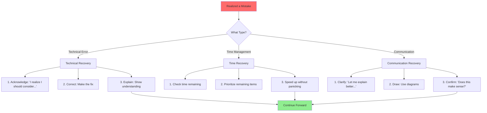

### Recovery Phrases That Work

<div class="phrase-card">
<h4>When You're Stuck</h4>
<p>"I'm considering a few approaches here. Let me think out loud..."</p>
<p>"The challenge I'm facing is X. The options I see are..."</p>
<h4>When You Made an Error</h4>
<p>"Actually, I realize that approach has issue X. Let me revise..."</p>
<p>"Good point. That would indeed cause Y. Here's a better approach..."</p>
<h4>When Running Out of Time</h4>
<p>"Given time constraints, I'll focus on the most critical part..."</p>
<p>"Let me quickly cover X and Y, then we can dive deeper if time permits"</p>
</div>

### When You Realize a Mistake
1. **Acknowledge it**: "I realize I should consider..."
2. **Adjust quickly**: Make the correction
3. **Learn from it**: Don't repeat in the interview
4. **Move forward**: Don't dwell on it

### When Stuck
1. **State the challenge**: "I'm considering how to..."
2. **Think out loud**: Share your options
3. **Make a decision**: Choose and explain
4. **Mark for revisit**: "We can optimize this later"

## Mistake Prevention Checklist

### Pre-Interview Preparation

<div class="checklist-column">
<h4>✅ One Week Before</h4>
<label><input type="checkbox"> Reviewed common mistakes list</label>
<label><input type="checkbox"> Practiced 10+ systems at scale</label>
<label><input type="checkbox"> Timed myself consistently</label>
<label><input type="checkbox"> Got feedback from mock interviews</label>
<h4>✅ One Day Before</h4>
<label><input type="checkbox"> Reviewed Google scale numbers</label>
<label><input type="checkbox"> Practiced failure scenarios</label>
<label><input type="checkbox"> Prepared clarifying questions</label>
<label><input type="checkbox"> Set up quiet environment</label>
<h4>✅ Interview Day</h4>
<label><input type="checkbox"> Have water ready</label>
<label><input type="checkbox"> Timer visible</label>
<label><input type="checkbox"> Drawing tools ready</label>
<label><input type="checkbox"> Positive mindset</label>
</div>

## Remember: The Goal

<p>Google values:</p>
<ul>
<li>🎯 <strong>Clear thinking</strong> over perfect solutions</li>
<li>📈 <strong>Scalable designs</strong> over complex architectures</li>
<li>💬 <strong>Good communication</strong> over silent brilliance</li>
<li>🔄 <strong>Iterative improvement</strong> over getting it right first time</li>
</ul>
<p><strong>Focus on demonstrating these qualities while avoiding common pitfalls!</strong></p>

[Return to Google Interview Guide](google-interviews/index.md)

