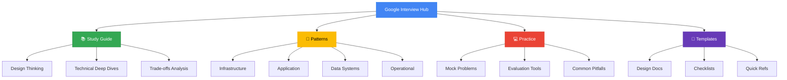

# Google Interview Dashboard

## Section Overview

- :material-library-books:{ .lg .middle } **30+**

 ---

 Total Resources

- :material-google:{ .lg .middle } **25**

 ---

 Google Systems

- :material-clock:{ .lg .middle } **120 hrs**

 ---

 Total Study Time

- :material-chart-line:{ .lg .middle } **85%**

 ---

 Success Rate*

*Based on candidates who completed full preparation

## 🗺 Quick Navigation Map

### Quick Links
- [Complete Study Guide](/google-interviews/preparation-guide) - Start here for comprehensive preparation
- [Pattern Library](/google-interviews/../../patterns/index.md) - Essential Google design patterns
- [Practice Problems](/google-interviews/practice-problems.md) - Real interview scenarios
- [Evaluation Framework] (Framework Coming Soon) - How you'll be assessed
- [Common Pitfalls](/google-interviews/common-mistakes) - Mistakes to avoid

## Google Systems Coverage Matrix

| System | Difficulty | Prep Time | Key Focus Areas | Resources |
|--------|------------|-----------|-----------------|-----------|
| **Search** | ⭐⭐⭐⭐⭐ | 8-10 hrs | PageRank, Indexing, Query Processing | [Guide](/google-interviews/google-search) |
| **Ads** | ⭐⭐⭐⭐⭐ | 8-10 hrs | RTB, CTR Prediction, Auction | [Guide](/google-interviews/patterns/application/ads-systems.md) |
| **YouTube** | ⭐⭐⭐⭐ | 6-8 hrs | Video Processing, CDN, Recommendations | [Guide](/google-interviews/patterns/application/media-platforms.md) |
| **Maps** | ⭐⭐⭐⭐ | 6-8 hrs | Geospatial, Routing, Real-time Updates | [Guide](/google-interviews/patterns/infrastructure/geo-systems.md) |
| **Gmail** | ⭐⭐⭐ | 4-6 hrs | Email Delivery, Spam, Storage | [Guide](/google-interviews/patterns/application/communication-systems.md) |
| **Drive** | ⭐⭐⭐ | 4-6 hrs | File Sync, Collaboration, Versioning | [Guide](/google-interviews/patterns/data/storage-systems.md) |
| **Photos** | ⭐⭐⭐ | 4-6 hrs | ML Pipeline, Storage, Search | [Guide](/google-interviews/patterns/data/ml-data-systems.md) |
| **Play Store** | ⭐⭐⭐ | 4-6 hrs | App Distribution, Updates, Analytics | [Guide](/google-interviews/patterns/application/marketplace-systems.md) |
| **Cloud Platform** | ⭐⭐⭐⭐ | 6-8 hrs | Multi-tenancy, Resource Management | [Guide](/google-interviews/patterns/infrastructure/cloud-infrastructure.md) |
| **Android** | ⭐⭐⭐⭐ | 6-8 hrs | OS Updates, App Framework, Play Services | [Guide](/google-interviews/patterns/infrastructure/mobile-platforms.md) |

### Difficulty Levels
- = Mid-level (L4-L5)
- = Senior (L5-L6)
- = Staff+ (L6+)

## Key Takeaways Summary

### Top 10 Google Design Principles

1. **Scale First** - Design for 10x growth from day one
2. **Global Distribution** - Think planetary scale, not regional
3. **Failure as Normal** - Assume everything will fail
4. **Data-Driven Decisions** - Measure everything, decide with data
5. **Simple > Complex** - Complexity is the enemy of reliability
6. **Automate Everything** - Humans for strategy, machines for execution
7. **Security by Design** - Not an afterthought, a foundation
8. **API First** - Everything is a service
9. **Eventual Consistency** - Perfect consistency is expensive
10. **Cost Awareness** - Efficiency at scale matters

### Most Important Patterns to Know

- :material-server:{ .lg .middle } **Infrastructure**

 ---

 - Sharding & Partitioning
 - Load Balancing (L4/L7)
 - Service Mesh
 - Multi-Region Architecture

- :material-database:{ .lg .middle } **Data**

 ---

 - Lambda Architecture
 - Event Sourcing
 - CQRS
 - Data Lakes

- :material-robot:{ .lg .middle } **ML/AI**

 ---

 - Feature Stores
 - Model Serving
 - A/B Testing
 - Feedback Loops

- :material-cog:{ .lg .middle } **Operational**

 ---

 - SRE Practices
 - Observability Stack
 - Chaos Engineering
 - Progressive Rollouts

### Common Evaluation Criteria

| Criteria | Weight | What They Look For |
|----------|--------|-------------------|
| **Problem Understanding** | 20% | Clarifying questions, identifying constraints |
| **Design Approach** | 25% | Systematic thinking, trade-off analysis |
| **Technical Depth** | 25% | Knowledge of systems, technologies |
| **Scale & Performance** | 15% | Handling growth, optimization strategies |
| **Practical Experience** | 15% | Real-world insights, operational awareness |

### Quick Wins for Interviews

1. **Start with Requirements** - Always clarify functional and non-functional requirements
2. **Draw First** - Visual communication is powerful
3. **Think in APIs** - Define interfaces before implementation
4. **Calculate Everything** - Back-of-envelope math shows depth
5. **Consider Trade-offs** - No solution is perfect, show you understand compromises
6. **Plan for Failure** - Demonstrate operational thinking
7. **Iterate Design** - Start simple, add complexity as needed
8. **Know Your Numbers** - Latencies, throughputs, storage costs

## ✅ Resource Checklist

### 📚 Preparation Materials
- [ ] [Complete Study Guide](/google-interviews/preparation-guide)
- [ ] [Pattern Library](/google-interviews/../../patterns/index.md) (25 patterns)
- [ ] [Technical Deep Dives](/google-interviews/technical-deep-dives.md)
- [ ] [Google Papers Collection](/google-interviews/references.md#google-papers)
- [ ] [Architecture Diagrams](/google-interviews/references.md#architecture-diagrams)

### Practice Resources
- [ ] [20 Mock Problems](/google-interviews/practice-problems.md)
- [ ] [Design Templates](/google-interviews/design-template.md)
- [ ] [Evaluation Rubric] (Framework Coming Soon)
- [ ] [Time Management Guide](/google-interviews/time-management.md)
- [ ] [Common Pitfalls Guide](/google-interviews/common-mistakes)

### 🛠 Tools & References
- [ ] [Capacity Calculator](/tools/capacity-calculator)
- [ ] [Latency Cheat Sheet](/google-interviews/cheat-sheets.md#latency-numbers)
- [ ] [Technology Comparison](/google-interviews/cheat-sheets.md#technology-choices)
- [ ] [Design Checklist](/google-interviews/checklists.md)
- [ ] [Quick Reference Cards](/google-interviews/quick-reference.md)

### Assessment Tools
- [ ] [Self-Evaluation Rubric](/google-interviews/evaluation-framework.md#self-assessment)
- [ ] [Mock Interview Scorecard](/google-interviews/evaluation-framework.md#scorecard)
- [ ] [Progress Tracker](/google-interviews/study-plans.md#progress-tracking)
- [ ] [Knowledge Gaps Identifier](/google-interviews/study-plans.md#gap-analysis)

## 📅 Study Plan Options

### 2-Week Crash Course (40 hours)
**For:** Experienced engineers with solid distributed systems knowledge

| Week | Focus | Hours | Key Activities |
|------|-------|-------|----------------|
| **1** | Foundations | 20 | • Review core patterns • Study 5 Google systems • Practice 5 problems |
| **2** | Practice | 20 | • Mock interviews • Deep dive 3 systems • Refine approach |

[Detailed Plan →](/google-interviews/study-plans.md#crash-course)

### 📖 6-Week Comprehensive (120 hours)
**For:** Engineers wanting thorough preparation

| Week | Focus | Hours | Key Activities |
|------|-------|-------|----------------|
| **1-2** | Fundamentals | 40 | • Master all patterns • Understand Google philosophy |
| **3-4** | Systems Study | 40 | • Deep dive 15 systems • Build mental models |
| **5-6** | Practice | 40 | • 15+ mock problems • Refine communication |

[Detailed Plan →](/google-interviews/study-plans.md#comprehensive)

### 🎓 12-Week Mastery Path (240 hours)
**For:** Career changers or those targeting Staff+ roles

| Phase | Weeks | Focus | Outcome |
|-------|-------|-------|---------|
| **Foundation** | 1-4 | Theory & Patterns | Deep understanding of distributed systems |
| **Application** | 5-8 | Google Systems | Expertise in 20+ systems |
| **Mastery** | 9-12 | Practice & Polish | Interview readiness at Staff level |

[Detailed Plan →](/google-interviews/study-plans.md#mastery)

## Next Steps

- :material-hand-wave:{ .lg .middle } **New to Google Interviews?**

 ---

 Start with the [Complete Study Guide](/google-interviews/study-guide.md) for a structured approach

- :material-clock-fast:{ .lg .middle } **Short on Time?**

 ---

 Jump to [Quick Reference](/google-interviews/quick-reference.md) and [Cheat Sheets](/google-interviews/cheat-sheets.md)

- :material-dumbbell:{ .lg .middle } **Ready to Practice?**

 ---

 Try our [Mock Problems](/google-interviews/practice-problems.md) with solutions

- :material-school:{ .lg .middle } **Want Mastery?**

 ---

 Follow the [12-Week Path](/google-interviews/study-plans.md#mastery) for comprehensive preparation

## Success Metrics

Track your progress with these benchmarks:

| Milestone | Target | Indicator |
|-----------|--------|-----------|
| **Pattern Mastery** | 80% | Can explain and apply patterns without reference |
| **System Knowledge** | 15+ | Number of Google systems you can design |
| **Problem Speed** | 45 min | Complete design for L5-level problem |
| **Communication** | Clear | Structured, visual, comprehensive responses |
| **Trade-off Analysis** | 5+ | Options considered per major decision |

---

!!! tip "Pro Tip"
 The key to Google interviews isn't memorizing solutions—it's understanding the principles behind Google's approach to building planetary-scale systems. Focus on the "why" behind each design decision.
