# Google Interview Dashboard

## Section Overview

<h3>30+</h3>

Total Resources

<h3>25</h3>

Google Systems

<h3>120 hrs</h3>

Total Study Time

<h3>85%</h3>

Success Rate*

*Based on candidates who completed full preparation

## 🗺 Quick Navigation Map

```mermaid
graph TD
    A[Google Interview Hub] --> B[📚 Study Guide]
    A --> C[🧩 Patterns]
    A --> D[💻 Practice]
    A --> E[📝 Templates]
    
    B --> B1[Design Thinking]
    B --> B2[Technical Deep Dives]
    B --> B3[Trade-offs Analysis]
    
    C --> C1[Infrastructure]
    C --> C2[Application]
    C --> C3[Data Systems]
    C --> C4[Operational]
    
    D --> D1[Mock Problems]
    D --> D2[Evaluation Tools]
    D --> D3[Common Pitfalls]
    
    E --> E1[Design Docs]
    E --> E2[Checklists]
    E --> E3[Quick Refs]
    
    style A fill:#4285f4,stroke:#1a73e8,color:#fff
    style B fill:#34a853,stroke:#188038,color:#fff
    style C fill:#fbbc04,stroke:#f9ab00,color:#000
    style D fill:#ea4335,stroke:#d33b27,color:#fff
    style E fill:#673ab7,stroke:#5e35b1,color:#fff
```

### Quick Links
- [Complete Study Guide](/preparation-guide) - Start here for comprehensive preparation
- [Pattern Library](../../patterns/index.md) - Essential Google design patterns
- [Practice Problems](practice-problems.md) - Real interview scenarios
- [Evaluation Framework] (Framework Coming Soon) - How you'll be assessed
- [Common Pitfalls](/common-mistakes) - Mistakes to avoid

## Google Systems Coverage Matrix

| System | Difficulty | Prep Time | Key Focus Areas | Resources |
|--------|------------|-----------|-----------------|-----------|
| **Search** | ⭐⭐⭐⭐⭐ | 8-10 hrs | PageRank, Indexing, Query Processing | [Guide](/google-search) |
| **Ads** | ⭐⭐⭐⭐⭐ | 8-10 hrs | RTB, CTR Prediction, Auction | [Guide](patterns/application/ads-systems.md) |
| **YouTube** | ⭐⭐⭐⭐ | 6-8 hrs | Video Processing, CDN, Recommendations | [Guide](patterns/application/media-platforms.md) |
| **Maps** | ⭐⭐⭐⭐ | 6-8 hrs | Geospatial, Routing, Real-time Updates | [Guide](patterns/infrastructure/geo-systems.md) |
| **Gmail** | ⭐⭐⭐ | 4-6 hrs | Email Delivery, Spam, Storage | [Guide](patterns/application/communication-systems.md) |
| **Drive** | ⭐⭐⭐ | 4-6 hrs | File Sync, Collaboration, Versioning | [Guide](patterns/data/storage-systems.md) |
| **Photos** | ⭐⭐⭐ | 4-6 hrs | ML Pipeline, Storage, Search | [Guide](patterns/data/ml-data-systems.md) |
| **Play Store** | ⭐⭐⭐ | 4-6 hrs | App Distribution, Updates, Analytics | [Guide](patterns/application/marketplace-systems.md) |
| **Cloud Platform** | ⭐⭐⭐⭐ | 6-8 hrs | Multi-tenancy, Resource Management | [Guide](patterns/infrastructure/cloud-infrastructure.md) |
| **Android** | ⭐⭐⭐⭐ | 6-8 hrs | OS Updates, App Framework, Play Services | [Guide](patterns/infrastructure/mobile-platforms.md) |

### Difficulty Levels
- = Mid-level (L4-L5)
- = Senior (L5-L6)
- = Staff+ (L6+)

## Key Takeaways Summary

### Top 10 Google Design Principles

1. **Scale First** - Design for 10x growth from day one
2. **Global Distribution** - Think planetary scale, not regional
3. **Failure as Normal** - Assume everything will fail
4. **Data-Driven Decisions** - Measure everything, decide with data
5. **Simple > Complex** - Complexity is the enemy of reliability
6. **Automate Everything** - Humans for strategy, machines for execution
7. **Security by Design** - Not an afterthought, a foundation
8. **API First** - Everything is a service
9. **Eventual Consistency** - Perfect consistency is expensive
10. **Cost Awareness** - Efficiency at scale matters

### Most Important Patterns to Know

<h4>🏗️ Infrastructure</h4>
<ul>
<li>Sharding & Partitioning</li>
<li>Load Balancing (L4/L7)</li>
<li>Service Mesh</li>
<li>Multi-Region Architecture</li>
</ul>

<h4>📊 Data</h4>
<ul>
<li>Lambda Architecture</li>
<li>Event Sourcing</li>
<li>CQRS</li>
<li>Data Lakes</li>
</ul>

<h4>🤖 ML/AI</h4>
<ul>
<li>Feature Stores</li>
<li>Model Serving</li>
<li>A/B Testing</li>
<li>Feedback Loops</li>
</ul>

<h4>🔧 Operational</h4>
<ul>
<li>SRE Practices</li>
<li>Observability Stack</li>
<li>Chaos Engineering</li>
<li>Progressive Rollouts</li>
</ul>

### Common Evaluation Criteria

| Criteria | Weight | What They Look For |
|----------|--------|-------------------|
| **Problem Understanding** | 20% | Clarifying questions, identifying constraints |
| **Design Approach** | 25% | Systematic thinking, trade-off analysis |
| **Technical Depth** | 25% | Knowledge of systems, technologies |
| **Scale & Performance** | 15% | Handling growth, optimization strategies |
| **Practical Experience** | 15% | Real-world insights, operational awareness |

### Quick Wins for Interviews

1. **Start with Requirements** - Always clarify functional and non-functional requirements
2. **Draw First** - Visual communication is powerful
3. **Think in APIs** - Define interfaces before implementation
4. **Calculate Everything** - Back-of-envelope math shows depth
5. **Consider Trade-offs** - No solution is perfect, show you understand compromises
6. **Plan for Failure** - Demonstrate operational thinking
7. **Iterate Design** - Start simple, add complexity as needed
8. **Know Your Numbers** - Latencies, throughputs, storage costs

## ✅ Resource Checklist

### 📚 Preparation Materials
- [ ] [Complete Study Guide](/preparation-guide)
- [ ] [Pattern Library](../../patterns/index.md) (25 patterns)
- [ ] [Technical Deep Dives](technical-deep-dives.md)
- [ ] [Google Papers Collection](references.md#google-papers)
- [ ] [Architecture Diagrams](references.md#architecture-diagrams)

### Practice Resources
- [ ] [20 Mock Problems](practice-problems.md)
- [ ] [Design Templates](design-template.md)
- [ ] [Evaluation Rubric] (Framework Coming Soon)
- [ ] [Time Management Guide](time-management.md)
- [ ] [Common Pitfalls Guide](/common-mistakes)

### 🛠 Tools & References
- [ ] [Capacity Calculator](/tools/capacity-calculator)
- [ ] [Latency Cheat Sheet](cheat-sheets.md#latency-numbers)
- [ ] [Technology Comparison](cheat-sheets.md#technology-choices)
- [ ] [Design Checklist](checklists.md)
- [ ] [Quick Reference Cards](quick-reference.md)

### Assessment Tools
- [ ] [Self-Evaluation Rubric](evaluation-framework.md#self-assessment)
- [ ] [Mock Interview Scorecard](evaluation-framework.md#scorecard)
- [ ] [Progress Tracker](study-plans.md#progress-tracking)
- [ ] [Knowledge Gaps Identifier](study-plans.md#gap-analysis)

## 📅 Study Plan Options

### 2-Week Crash Course (40 hours)
**For:** Experienced engineers with solid distributed systems knowledge

| Week | Focus | Hours | Key Activities |
|------|-------|-------|----------------|
| **1** | Foundations | 20 | • Review core patterns • Study 5 Google systems • Practice 5 problems |
| **2** | Practice | 20 | • Mock interviews • Deep dive 3 systems • Refine approach |

[Detailed Plan →](study-plans.md#crash-course)

### 📖 6-Week Comprehensive (120 hours)
**For:** Engineers wanting thorough preparation

| Week | Focus | Hours | Key Activities |
|------|-------|-------|----------------|
| **1-2** | Fundamentals | 40 | • Master all patterns • Understand Google philosophy |
| **3-4** | Systems Study | 40 | • Deep dive 15 systems • Build mental models |
| **5-6** | Practice | 40 | • 15+ mock problems • Refine communication |

[Detailed Plan →](study-plans.md#comprehensive)

### 🎓 12-Week Mastery Path (240 hours)
**For:** Career changers or those targeting Staff+ roles

| Phase | Weeks | Focus | Outcome |
|-------|-------|-------|---------|
| **Foundation** | 1-4 | Theory & Patterns | Deep understanding of distributed systems |
| **Application** | 5-8 | Google Systems | Expertise in 20+ systems |
| **Mastery** | 9-12 | Practice & Polish | Interview readiness at Staff level |

[Detailed Plan →](study-plans.md#mastery)

## Next Steps

<h3>👋 New to Google Interviews?</h3>

Start with the <a href="study-guide.md">Complete Study Guide</a> for a structured approach

<h3>⏱️ Short on Time?</h3>

Jump to <a href="quick-reference.md">Quick Reference</a> and <a href="cheat-sheets.md">Cheat Sheets</a>

<h3>💪 Ready to Practice?</h3>

Try our <a href="practice-problems.md">Mock Problems</a> with solutions

<h3>🎓 Want Mastery?</h3>

Follow the <a href="study-plans.md#mastery">12-Week Path</a> for comprehensive preparation

## Success Metrics

Track your progress with these benchmarks:

| Milestone | Target | Indicator |
|-----------|--------|-----------|
| **Pattern Mastery** | 80% | Can explain and apply patterns without reference |
| **System Knowledge** | 15+ | Number of Google systems you can design |
| **Problem Speed** | 45 min | Complete design for L5-level problem |
| **Communication** | Clear | Structured, visual, comprehensive responses |
| **Trade-off Analysis** | 5+ | Options considered per major decision |

---

<h3>💡 Pro Tip</h3>

The key to Google interviews isn't memorizing solutions—it's understanding the principles behind Google's approach to building planetary-scale systems. Focus on the "why" behind each design decision.

