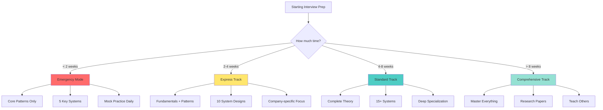
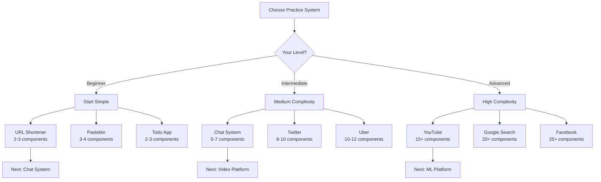
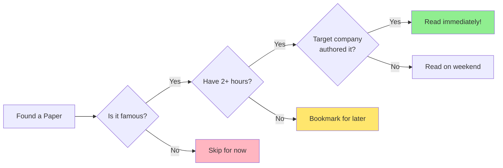
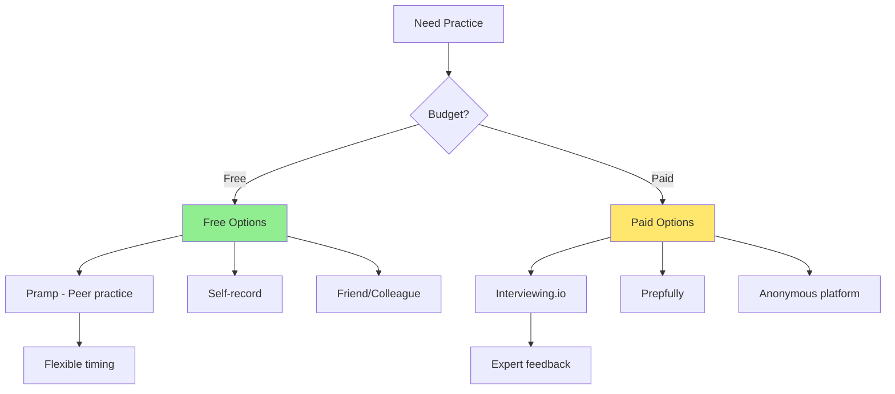

# Interview Focus Selector & Decision Trees

## Master Decision Tree: What Should I Focus On?



## Role-Based Focus Areas

<div class="role-focus-matrix">
<table class="responsive-table">
<thead>
<tr>
<th>Your Role</th>
<th>Must Master (80% time)</th>
<th>Should Know (15% time)</th>
<th>Nice to Have (5% time)</th>
</tr>
</thead>
<tbody>
<tr>
<td data-label="Your Role"><strong>New Grad</strong></td>
<td data-label="Must Master (80% time)">• Data structures<br/>• Basic patterns<br/>• Simple systems<br/>• Communication</td>
<td data-label="Should Know (15% time)">• Scale basics<br/>• Cloud concepts<br/>• Databases</td>
<td data-label="Nice to Have (5% time)">• Papers<br/>• Advanced patterns<br/>• ML systems</td>
</tr>
<tr>
<td data-label="Your Role"><strong>Backend Engineer</strong></td>
<td data-label="Must Master (80% time)">• Distributed systems<br/>• Databases<br/>• Microservices<br/>• Performance</td>
<td data-label="Should Know (15% time)">• Frontend basics<br/>• ML pipeline<br/>• Mobile concerns</td>
<td data-label="Nice to Have (5% time)">• Hardware<br/>• Quantum<br/>• Blockchain</td>
</tr>
<tr>
<td data-label="Your Role"><strong>Full Stack</strong></td>
<td data-label="Must Master (80% time)">• End-to-end systems<br/>• APIs<br/>• Databases<br/>• Frontend scale</td>
<td data-label="Should Know (15% time)">• ML integration<br/>• DevOps<br/>• Security</td>
<td data-label="Nice to Have (5% time)">• Low-level<br/>• Embedded<br/>• Research</td>
</tr>
<tr>
<td data-label="Your Role"><strong>ML Engineer</strong></td>
<td data-label="Must Master (80% time)">• ML systems<br/>• Data pipelines<br/>• Model serving<br/>• Feature stores</td>
<td data-label="Should Know (15% time)">• Traditional systems<br/>• Databases<br/>• APIs</td>
<td data-label="Nice to Have (5% time)">• Frontend<br/>• Mobile<br/>• Games</td>
</tr>
<tr>
<td data-label="Your Role"><strong>Mobile Engineer</strong></td>
<td data-label="Must Master (80% time)">• Mobile architecture<br/>• Offline sync<br/>• Push systems<br/>• Battery optimization</td>
<td data-label="Should Know (15% time)">• Backend design<br/>• APIs<br/>• CDNs</td>
<td data-label="Nice to Have (5% time)">• ML systems<br/>• Big data<br/>• Blockchain</td>
</tr>
</tbody>
</table>
</div>

## 🌳 System Complexity Decision Tree



## Topic Priority Calculator

<div class="priority-calculator">
<h3>What Should You Study First?</h3>
<div class="calc-grid">
<div class="calc-section">
<h4>Your Background</h4>
<label><input type="checkbox" id="has-cs-degree"> CS Degree</label>
<label><input type="checkbox" id="has-dist-exp"> Distributed Systems Experience</label>
<label><input type="checkbox" id="has-cloud-exp"> Cloud Experience</label>
<label><input type="checkbox" id="has-scale-exp"> Large Scale Experience</label>
</div>
<div class="calc-section">
<h4>Target Company Type</h4>
<label><input type="radio" name="company-type" value="faang"> FAANG</label>
<label><input type="radio" name="company-type" value="startup"> Startup</label>
<label><input type="radio" name="company-type" value="enterprise"> Enterprise</label>
<label><input type="radio" name="company-type" value="fintech"> Fintech</label>
</div>
<div class="calc-section">
<h4>Interview Timeline</h4>
<label><input type="radio" name="timeline" value="urgent"> < 2 weeks</label>
<label><input type="radio" name="timeline" value="short"> 2-4 weeks</label>
<label><input type="radio" name="timeline" value="medium"> 1-2 months</label>
<label><input type="radio" name="timeline" value="long"> > 2 months</label>
</div>
</div>
<button onclick="calculatePriorities()">Get My Priority List</button>
<div id="priority-results"></div>
</div>

## Skill Gap Analysis

```mermaid
radar
    title Skills Assessment Radar
    "Distributed Systems": 3
    "System Design": 2
    "Databases": 4
    "Networking": 3
    "Security": 2
    "Performance": 3
    "Cloud Platforms": 4
    "Communication": 3
```

## 🗺 Learning Path Visualizer

<div class="learning-paths">
<h3>Choose Your Learning Path</h3>
<div class="path-grid">
<div class="path-card">
<h4>🚀 Speed Run Path</h4>
<div class="path-timeline">
<div class="milestone">Day 1-3: Core Patterns</div>
<div class="milestone">Day 4-7: 5 Systems</div>
<div class="milestone">Day 8-10: Mock Practice</div>
<div class="milestone">Day 11-14: Polish & Review</div>
</div>
<button onclick="showPath('speed')">See Details</button>
</div>
<div class="path-card">
<h4>⚖️ Balanced Path</h4>
<div class="path-timeline">
<div class="milestone">Week 1: Fundamentals</div>
<div class="milestone">Week 2: Patterns</div>
<div class="milestone">Week 3-4: Practice</div>
<div class="milestone">Week 5-6: Specialization</div>
</div>
<button onclick="showPath('balanced')">See Details</button>
</div>
<div class="path-card">
<h4>🎓 Deep Mastery Path</h4>
<div class="path-timeline">
<div class="milestone">Month 1: Theory</div>
<div class="milestone">Month 2: Practice</div>
<div class="milestone">Month 3: Advanced</div>
<div class="milestone">Month 4: Teaching</div>
</div>
<button onclick="showPath('mastery')">See Details</button>
</div>
</div>
<div id="path-details"></div>
</div>

## Daily Focus Randomizer

<div class="daily-focus">
<h3>What Should I Practice Today?</h3>
<div class="randomizer-options">
<label><input type="checkbox" id="include-easy" checked> Include Easy Topics</label>
<label><input type="checkbox" id="include-medium" checked> Include Medium Topics</label>
<label><input type="checkbox" id="include-hard"> Include Hard Topics</label>
<label><input type="checkbox" id="include-reading"> Include Reading</label>
</div>
<button onclick="getDailyFocus()">Get Today's Focus</button>
<div id="daily-focus-result"></div>
</div>

## Time Investment ROI Matrix

<div class="roi-matrix">
<table class="responsive-table">
<thead>
<tr>
<th>Topic</th>
<th>Time Investment</th>
<th>Interview Frequency</th>
<th>Difficulty</th>
<th>ROI Score</th>
</tr>
</thead>
<tbody>
<tr>
<td data-label="Topic"><strong>Load Balancing</strong></td>
<td data-label="Time Investment">2 hours</td>
<td data-label="Interview Frequency">⭐⭐⭐⭐⭐</td>
<td data-label="Difficulty">⭐⭐</td>
<td data-label="ROI Score">🔥 95%</td>
</tr>
<tr>
<td data-label="Topic"><strong>Consistent Hashing</strong></td>
<td data-label="Time Investment">3 hours</td>
<td data-label="Interview Frequency">⭐⭐⭐⭐⭐</td>
<td data-label="Difficulty">⭐⭐⭐</td>
<td data-label="ROI Score">🔥 90%</td>
</tr>
<tr>
<td data-label="Topic"><strong>Database Sharding</strong></td>
<td data-label="Time Investment">4 hours</td>
<td data-label="Interview Frequency">⭐⭐⭐⭐⭐</td>
<td data-label="Difficulty">⭐⭐⭐</td>
<td data-label="ROI Score">🔥 88%</td>
</tr>
<tr>
<td data-label="Topic"><strong>Caching Strategies</strong></td>
<td data-label="Time Investment">3 hours</td>
<td data-label="Interview Frequency">⭐⭐⭐⭐⭐</td>
<td data-label="Difficulty">⭐⭐</td>
<td data-label="ROI Score">🔥 92%</td>
</tr>
<tr>
<td data-label="Topic"><strong>Message Queues</strong></td>
<td data-label="Time Investment">3 hours</td>
<td data-label="Interview Frequency">⭐⭐⭐⭐</td>
<td data-label="Difficulty">⭐⭐</td>
<td data-label="ROI Score">✅ 85%</td>
</tr>
<tr>
<td data-label="Topic"><strong>Microservices</strong></td>
<td data-label="Time Investment">5 hours</td>
<td data-label="Interview Frequency">⭐⭐⭐⭐</td>
<td data-label="Difficulty">⭐⭐⭐⭐</td>
<td data-label="ROI Score">✅ 75%</td>
</tr>
<tr>
<td data-label="Topic"><strong>Consensus Algorithms</strong></td>
<td data-label="Time Investment">6 hours</td>
<td data-label="Interview Frequency">⭐⭐⭐</td>
<td data-label="Difficulty">⭐⭐⭐⭐⭐</td>
<td data-label="ROI Score">⚡ 60%</td>
</tr>
<tr>
<td data-label="Topic"><strong>Blockchain</strong></td>
<td data-label="Time Investment">8 hours</td>
<td data-label="Interview Frequency">⭐⭐</td>
<td data-label="Difficulty">⭐⭐⭐⭐</td>
<td data-label="ROI Score">❄️ 30%</td>
</tr>
</tbody>
</table>
</div>

## Quick Decision Flowcharts

### Should I Read This Paper?



### Which Mock Interview Platform?



## Mobile-Friendly Quick Reference

<div class="quick-ref-cards">
<div class="qr-card">
<h4>⏱️ If You Have 1 Hour</h4>
<ul>
<li>Design 1 simple system</li>
<li>Review 1 pattern deeply</li>
<li>Do 5 estimation problems</li>
<li>Watch 1 system walkthrough</li>
</ul>
</div>
<div class="qr-card">
<h4>📅 If You Have 1 Day</h4>
<ul>
<li>Morning: Read 1 paper</li>
<li>Afternoon: Design 2 systems</li>
<li>Evening: 1 mock interview</li>
<li>Night: Review & notes</li>
</ul>
</div>
<div class="qr-card">
<h4>📆 If You Have 1 Week</h4>
<ul>
<li>Day 1-2: Fundamentals</li>
<li>Day 3-4: Patterns</li>
<li>Day 5-6: Practice</li>
<li>Day 7: Mock & review</li>
</ul>
</div>
<div class="qr-card">
<h4>📊 If You Have 1 Month</h4>
<ul>
<li>Week 1: Theory</li>
<li>Week 2: Patterns</li>
<li>Week 3: Practice</li>
<li>Week 4: Polish</li>
</ul>
</div>
</div>

<script>
function calculatePriorities() {
    const hasCS = document.getElementById('has-cs-degree').checked;
    const hasDist = document.getElementById('has-dist-exp').checked;
    const hasCloud = document.getElementById('has-cloud-exp').checked;
    const hasScale = document.getElementById('has-scale-exp').checked;
    
    const companyType = document.querySelector('input[name="company-type"]:checked')?.value || 'faang';
    const timeline = document.querySelector('input[name="timeline"]:checked')?.value || 'medium';
    
    let priorities = [];
    
    // Core always needed
    if (!hasDist) priorities.push('🔴 Distributed Systems Fundamentals (Critical!)');
    if (!hasScale) priorities.push('🔴 Scale Thinking & Calculations');
    
    // Company specific
    if (companyType === 'faang') {
        priorities.push('🟡 Company-specific systems (YouTube, etc.)');
        priorities.push('🟡 Research papers');
    } else if (companyType === 'fintech') {
        priorities.push('🟡 Transaction processing');
        priorities.push('🟡 Security & compliance');
    }
    
    // Timeline specific
    if (timeline === 'urgent') {
        priorities = priorities.slice(0, 3);
        priorities.push('🔥 Daily mock interviews');
    }
    
    // Add some always useful
    priorities.push('🟢 Caching strategies');
    priorities.push('🟢 Database design');
    priorities.push('🔵 Communication practice');
    
    let output = '<h4>Your Personalized Priority List</h4><ol>';
    priorities.forEach(p => output += `<li>${p}</li>`);
    output += '</ol>';
    
    output += '<h5>Recommended Daily Schedule:</h5>';
    if (timeline === 'urgent') {
        output += '<p>3 hours/day minimum: 1hr theory, 2hr practice</p>';
    } else {
        output += '<p>1-2 hours/day: Balance theory and practice</p>';
    }
    
    document.getElementById('priority-results').innerHTML = output;
}

function showPath(pathType) {
    const paths = {
        speed: {
            title: 'Speed Run Path Details',
            steps: [
                'Day 1-3: Master these patterns: Load Balancing, Caching, Sharding',
                'Day 4-7: Design these systems: URL Shortener, Chat, KV Store, Feed, Video',
                'Day 8-10: Do 2 mock interviews daily, review and improve',
                'Day 11-14: Polish weak areas, review all designs, mental preparation'
            ]
        },
        balanced: {
            title: 'Balanced Path Details',
            steps: [
                'Week 1: Read "Designing Data-Intensive Applications" ch 1-5',
                'Week 2: Study 10 core patterns in depth',
                'Week 3-4: Design 15 systems, increasing complexity',
                'Week 5-6: Focus on target company systems, mock interviews'
            ]
        },
        mastery: {
            title: 'Deep Mastery Path Details',
            steps: [
                'Month 1: Complete theory - books, papers, courses',
                'Month 2: Design 30+ systems, all complexity levels',
                'Month 3: Research advanced topics, create novel solutions',
                'Month 4: Teach others, write blog posts, perfect skills'
            ]
        }
    };
    
    const path = paths[pathType];
    let output = `<h4>${path.title}</h4><ul>`;
    path.steps.forEach(step => output += `<li>${step}</li>`);
    output += '</ul>';
    
    document.getElementById('path-details').innerHTML = output;
}

function getDailyFocus() {
    const topics = {
        easy: ['URL Shortener', 'Pastebin', 'Todo App', 'Counter Service'],
        medium: ['Chat System', 'Twitter Feed', 'File Storage', 'Payment System'],
        hard: ['YouTube', 'Google Search', 'Uber', 'Facebook'],
        reading: ['MapReduce Paper', 'Dynamo Paper', 'CAP Theorem', 'Raft Consensus']
    };
    
    let pool = [];
    if (document.getElementById('include-easy').checked) pool = pool.concat(topics.easy);
    if (document.getElementById('include-medium').checked) pool = pool.concat(topics.medium);
    if (document.getElementById('include-hard').checked) pool = pool.concat(topics.hard);
    if (document.getElementById('include-reading').checked) pool = pool.concat(topics.reading);
    
    if (pool.length === 0) {
        document.getElementById('daily-focus-result').innerHTML = '<p>Please select at least one category!</p>';
        return;
    }
    
    const selected = pool[Math.floor(Math.random() * pool.length)];
    const time = topics.hard.includes(selected) ? '60-90 min' : 
                  topics.medium.includes(selected) ? '45-60 min' : 
                  topics.reading.includes(selected) ? '30-60 min' : '30-45 min';
    
    let output = `<h4>Today's Focus: ${selected}</h4>`;
    output += `<p>Recommended time: ${time}</p>`;
    output += '<p>Remember to:</p><ul>';
    output += '<li>Set a timer</li>';
    output += '<li>Draw clear diagrams</li>';
    output += '<li>Think out loud</li>';
    output += '<li>Review your solution after</li>';
    output += '</ul>';
    
    document.getElementById('daily-focus-result').innerHTML = output;
}
</script>

