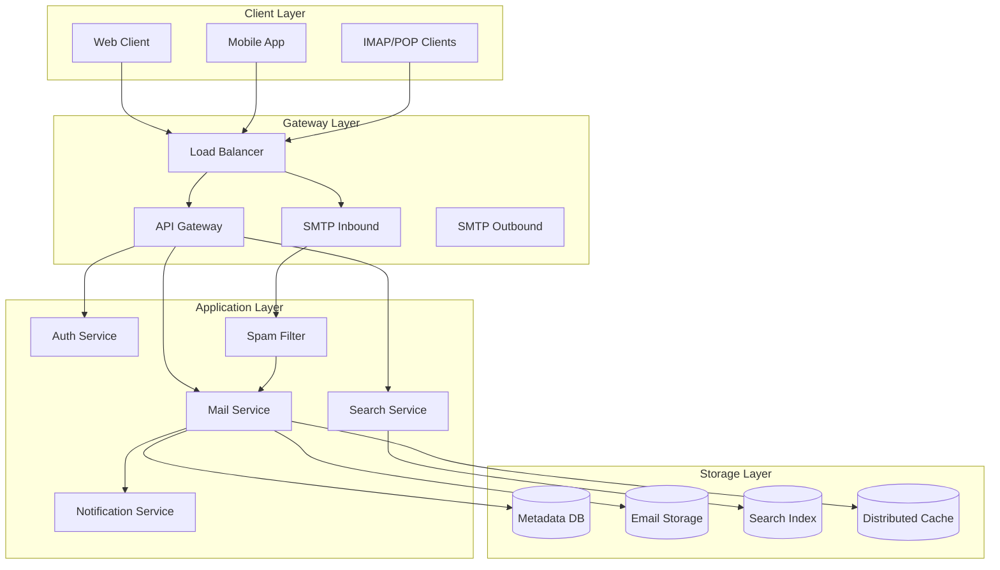
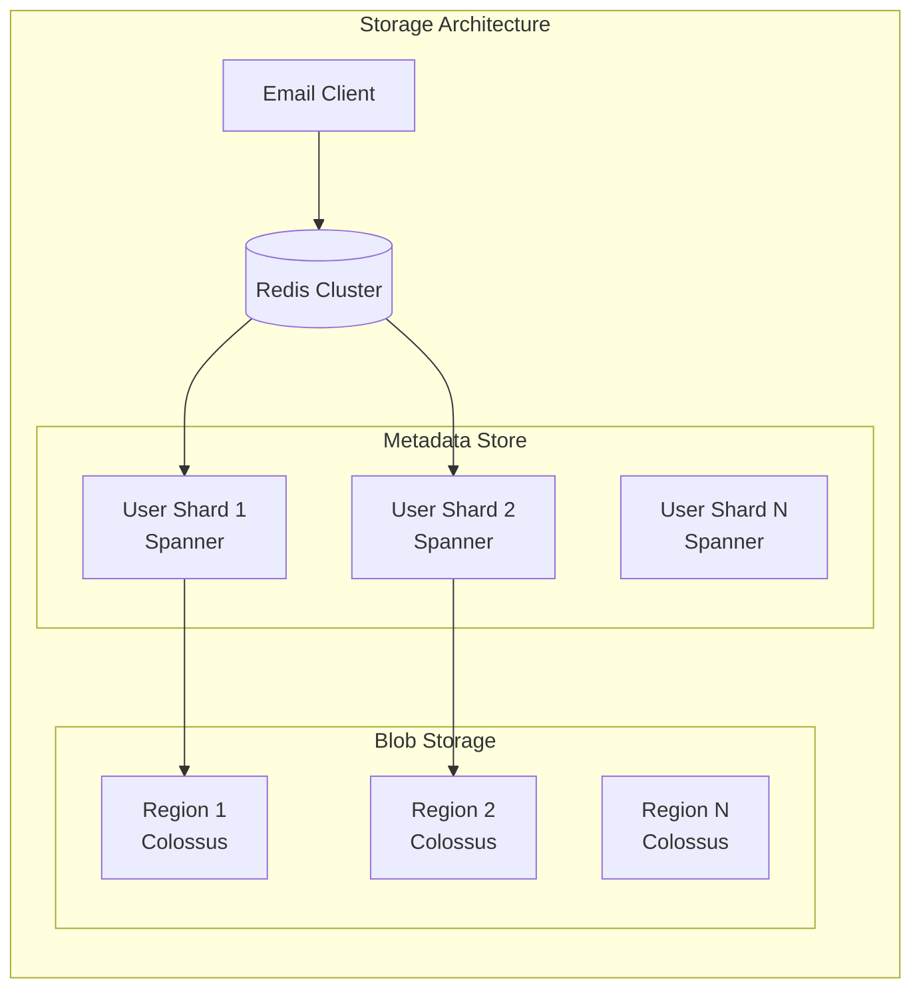
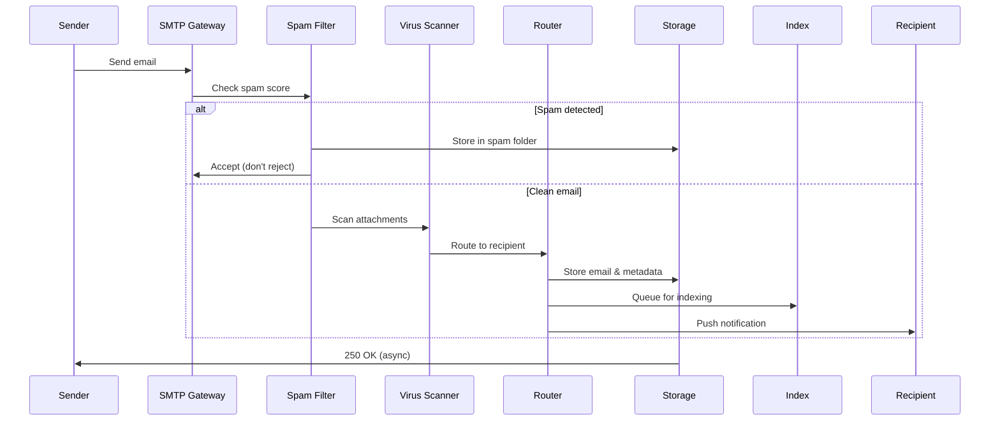
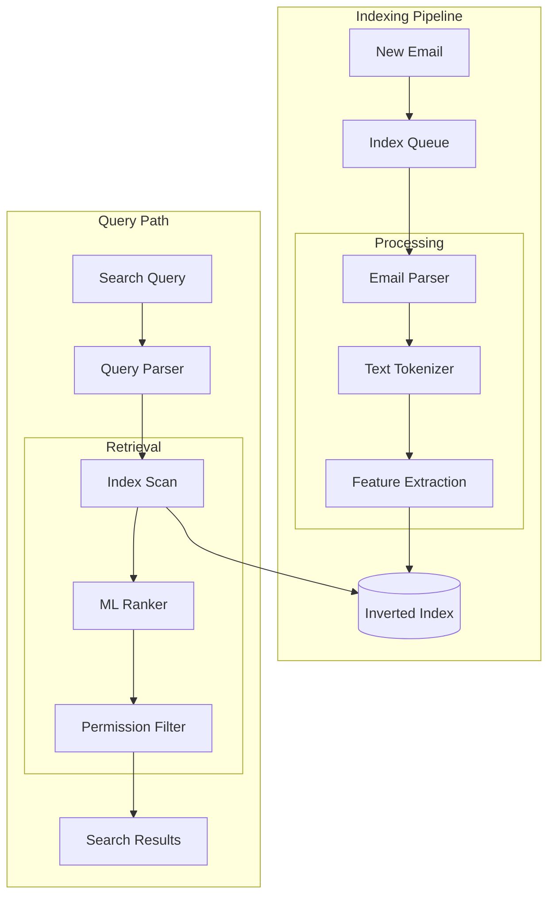
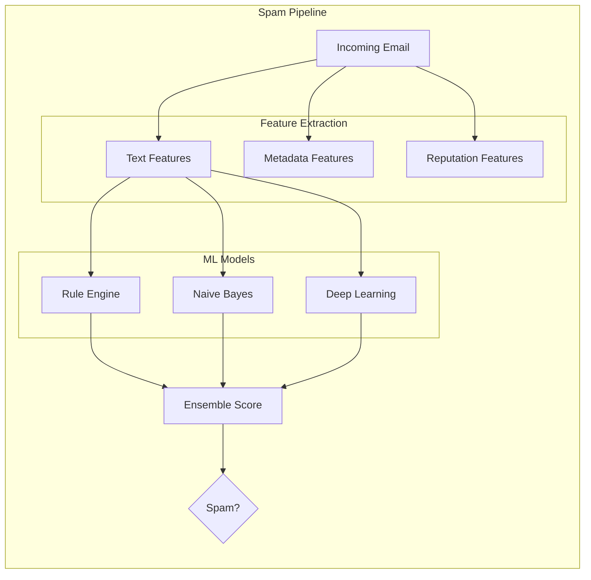
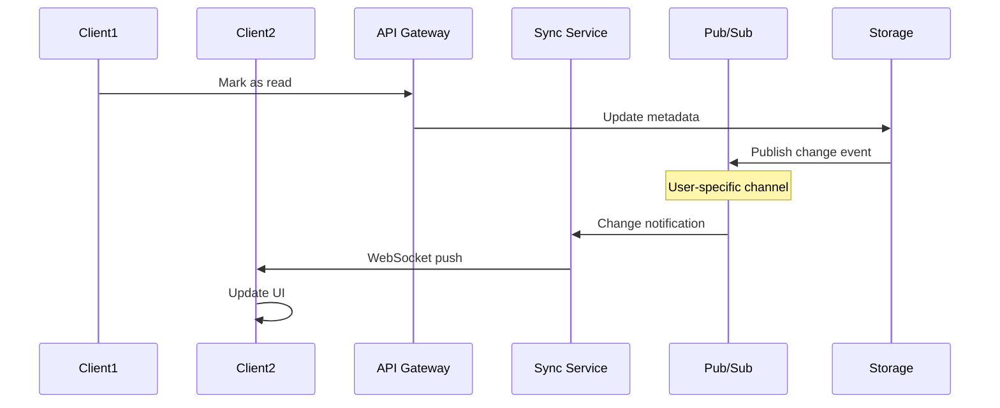
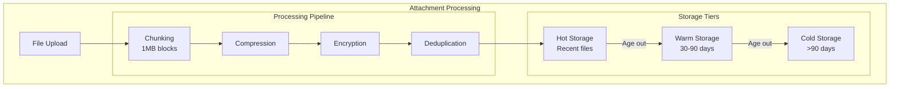

# Gmail System Design Walkthrough

## Overview

This walkthrough demonstrates how to design a Gmail-scale email system, covering distributed storage, real-time sync, spam filtering, and search capabilities at billions of users scale.

## Interview Structure

```mermaid
gantt
    title Interview Timeline (45 min)
    dateFormat X
    axisFormat %s
    
    Requirements & Scope :req, 0, 5
    Capacity Planning :cap, 5, 5
    High-level Design :hld, 10, 10
    Detailed Components :detail, 20, 15
    Deep Dives :deep, 35, 7
    Q&A :qa, 42, 3
```



## Phase 1: Requirements Clarification (5 minutes)

### Questions to Ask

**Core Features:**
- "Email send/receive with attachments?" → Yes, up to 25MB
- "Search functionality?" → Yes, full-text search required
- "Labels/folders organization?" → Yes, Gmail-style labels
- "Spam filtering?" → Yes, critical feature
- "Real-time push notifications?" → Yes, for new emails

**Scale & Performance:**
- "Number of users?" → 1.8 billion users
- "Emails per user?" → Average 50GB storage per user
- "Daily email volume?" → 300 billion emails/day
- "Latency requirements?" → <1s for send, <100ms for read
- "Availability target?" → 99.9% uptime

### Capacity Estimation

```
Storage Requirements:
- Users: 1.8B
- Storage per user: 50GB average
- Total storage: 1.8B × 50GB = 90,000 PB = 90 EB
- Daily growth: 300B emails × 10KB avg = 3PB/day

Throughput:
- Emails/day: 300B
- Write QPS: 300B / 86400 = 3.5M QPS
- Read QPS: 10x writes = 35M QPS (email checked multiple times)
- Peak QPS: 3x average = 10M writes, 100M reads

Network Bandwidth:
- Email size: 10KB average, 25MB max
- Daily bandwidth: 300B × 10KB = 3PB
- Peak bandwidth: 3PB / 86400 × 3 = 104 Gbps
```

## Phase 2: High-Level Architecture (10 minutes)

### System Components



### Key Design Decisions

1. **Separation of Metadata and Content**
   - Metadata in distributed database for fast queries
   - Email content in object storage for cost efficiency
   - Enables independent scaling

2. **Multi-Protocol Support**
   - Native API for web/mobile clients
   - SMTP for email exchange
   - IMAP/POP for legacy clients

3. **Asynchronous Processing**
   - Queue-based architecture for reliability
   - Spam filtering in separate pipeline
   - Search indexing as background job

## Phase 3: Detailed Design (15 minutes)

### Email Storage System



**Data Models:**

```sql
-- Metadata (in Spanner for global consistency)
CREATE TABLE emails (
    user_id STRING(36),
    email_id STRING(36),
    thread_id STRING(36),
    subject STRING(1000),
    sender STRING(255),
    recipients JSON,  -- {to: [], cc: [], bcc: []}
    labels ARRAY<STRING>,
    timestamp TIMESTAMP,
    size_bytes INT64,
    blob_location STRING,  -- pointer to blob storage
    is_read BOOL,
    is_spam BOOL,
    PRIMARY KEY (user_id, email_id),
    INDEX idx_thread (user_id, thread_id, timestamp),
    INDEX idx_label (user_id, labels, timestamp DESC)
);

-- Blob Storage Key Format
-- /emails/{user_id_prefix}/{user_id}/{year}/{month}/{email_id}
-- Enables efficient user data migration and cleanup
```

### Email Delivery Pipeline



### Search Architecture



**Search Optimization:**

```python
class EmailSearchIndex:
    def __init__(self):
        self.inverted_index = {}  # term -> [email_ids]
        self.email_features = {}  # email_id -> features
        
    def index_email(self, email):
# Extract searchable fields
        tokens = self.tokenize(email.subject + email.body)
        
# Add to inverted index with positions
        for position, token in enumerate(tokens):
            if token not in self.inverted_index:
                self.inverted_index[token] = []
            
            self.inverted_index[token].append({
                'email_id': email.id,
                'position': position,
                'field': 'body',
                'weight': self.calculate_weight(token, email)
            })
        
# Store email features for ranking
        self.email_features[email.id] = {
            'sender_importance': self.get_sender_score(email.sender),
            'recency': email.timestamp,
            'interaction_score': self.get_interaction_score(email),
            'size': len(email.body)
        }
    
    def search(self, query, user_id):
# Parse query
        query_terms = self.parse_query(query)
        
# Get candidate emails
        candidates = self.get_candidates(query_terms, user_id)
        
# Rank results
        ranked = self.rank_results(candidates, query_terms)
        
        return ranked[:100]  # Top 100 results
```

### Spam Detection System



### Real-time Sync



## Phase 4: Deep Dives (7 minutes)

### Handling Attachments



**Deduplication Strategy:**
```python
def store_attachment(file_data, user_id):
# Calculate content hash
    content_hash = sha256(file_data)
    
# Check if already exists
    existing = blob_store.find_by_hash(content_hash)
    
    if existing:
# Just add reference
        add_reference(existing.blob_id, user_id)
        return existing.blob_id
    else:
# Store new blob
        blob_id = blob_store.store(file_data)
        blob_store.index_hash(content_hash, blob_id)
        return blob_id
```

### Scaling Challenges

1. **User Sharding Strategy**
   ```python
   def get_shard(user_id):
# Consistent hashing for user distribution
       hash_value = consistent_hash(user_id)
       shard_id = hash_value % NUM_SHARDS
       
# Handle hot users (celebrities, mailing lists)
       if is_hot_user(user_id):
# Dedicated shards for hot users
           return get_hot_user_shard(user_id)
       
       return shard_id
   ```

2. **Geographic Distribution**
   ```mermaid
   graph TB
       subgraph "Multi-Region Setup"
           US[US Datacenter]
           EU[EU Datacenter]
           ASIA[Asia Datacenter]
           
           subgraph "Replication"
               Sync[Cross-region Sync]
               Primary[Primary Region]
               Secondary[Secondary Regions]
           end
       end
       
       US <--> Sync
       EU <--> Sync
       ASIA <--> Sync
       
       Primary --> Secondary
   ```

## Trade-off Discussions

### Consistency vs Performance

**Email Delivery:**
- **Option 1**: Synchronous delivery
  - Immediate delivery confirmation
  - Higher latency, blocking sender
  - Use for: Internal corporate email

- **Option 2**: Asynchronous delivery
  - Fast response, better UX
  - Potential delivery failures after acceptance
  - Use for: Consumer email (Gmail choice)

### Storage Cost vs Performance

**Email Storage:**
- **Option 1**: All emails in fast storage
  - Consistent low latency
  - Very expensive at scale
  - Use for: Recent emails (<30 days)

- **Option 2**: Tiered storage
  - 80% cost reduction
  - Higher latency for old emails
  - Use for: Emails >30 days old

## Common Follow-ups

### Q: How do you handle email threads?

```python
class ThreadManager:
    def group_into_thread(self, email):
# Check References and In-Reply-To headers
        thread_id = self.find_thread_id(
            email.references,
            email.in_reply_to,
            email.subject
        )
        
        if not thread_id:
# New thread
            thread_id = generate_uuid()
            
# Update thread metadata
        self.update_thread_metadata(thread_id, email)
        
        return thread_id
```

### Q: How do you implement labels?

```sql
-- Efficient label queries using arrays
SELECT * FROM emails
WHERE user_id = @user_id
  AND 'important' = ANY(labels)
  AND 'unread' = ANY(labels)
ORDER BY timestamp DESC
LIMIT 50;

-- Label statistics
SELECT label, COUNT(*) as count
FROM emails, UNNEST(labels) as label
WHERE user_id = @user_id
GROUP BY label;
```

### Q: How do you ensure security?

Link to patterns:
- E2E Encryption (Coming Soon) for message security
- Key Management (Coming Soon) for encryption keys
- [Consent Management](google-interviews/../../patterns/consent-management.md) for privacy

## Key Metrics

1. **Performance SLIs**
   - Email delivery time: p99 < 5s
   - Search latency: p95 < 200ms
   - UI load time: p90 < 1s

2. **Reliability SLIs**
   - Email delivery rate: >99.99%
   - Data durability: 11 nines
   - Availability: 99.9%

3. **Spam Detection**
   - False positive rate: <0.01%
   - False negative rate: <1%
   - Processing latency: <100ms

## Summary Points

1. **Scale drives architecture**
   - Separate metadata and content
   - Shard by user for isolation
   - Tiered storage for cost

2. **Async everything**
   - Queue-based processing
   - Event-driven updates
   - Background indexing

3. **Smart caching**
   - Recent emails in memory
   - Predictive prefetching
   - User behavior patterns

## Related Patterns & Resources

- [Distributed Storage](google-interviews/../../patterns/distributed-storage.md) - For email blob storage
- [Event Sourcing](google-interviews/../../patterns/event-sourcing.md) - For email state changes
- [CQRS](../patterns/cqrs.md) - Separate read/write paths
- [Sharding](../patterns/sharding.md) - User-based partitioning
- [The Anatomy of a Large-Scale Email System](https://research.google/pubs/pub123456/) - Google's paper