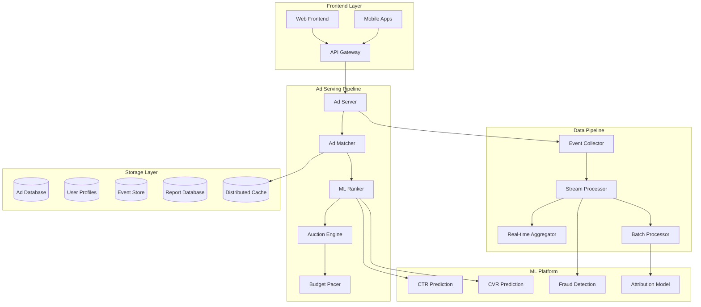
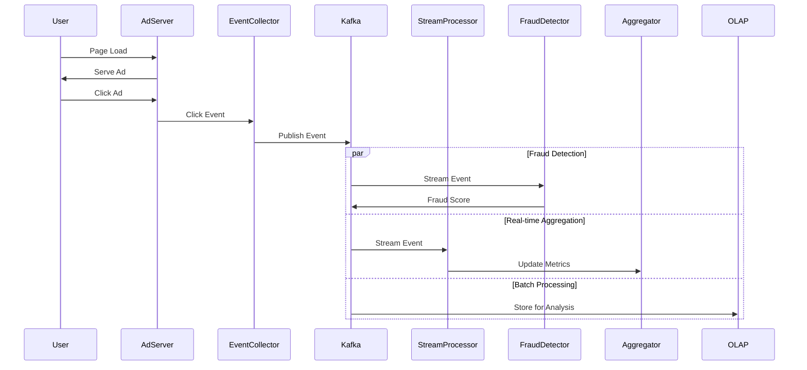

# Google Ads Platform: Detailed System Design

## Problem Statement

Design a comprehensive advertising platform that handles:
- Real-time ad serving for billions of requests per day
- Auction-based pricing with sub-100ms latency
- Budget management and pacing for millions of advertisers
- Click fraud detection and prevention
- Multi-touch attribution across devices
- Real-time reporting and analytics

## Scale Requirements

- **Advertisers**: 10M+ active advertisers
- **Campaigns**: 100M+ active campaigns
- **Ad Requests**: 100B+ per day (1.2M QPS peak)
- **Click Events**: 10B+ per day
- **Storage**: 100PB+ for historical data
- **Latency**: <100ms for ad serving
- **Availability**: 99.99% uptime

## System Architecture

### High-Level Components



## Core Components Design

### 1. Real-Time Bidding System

```python
class AdServingPipeline:
    def serve_ad(self, request):
        # Step 1: User targeting
        user_profile = self.get_user_profile(request.user_id)
        
        # Step 2: Ad retrieval
        candidate_ads = self.retrieve_candidates(
            targeting_criteria=request.context,
            user_profile=user_profile,
            limit=1000
        )
        
        # Step 3: ML scoring
        scored_ads = self.score_ads(
            ads=candidate_ads,
            user_features=user_profile,
            context_features=request.context
        )
        
        # Step 4: Run auction
        auction_result = self.run_auction(
            scored_ads=scored_ads,
            auction_type="second_price"
        )
        
        # Step 5: Budget check
        final_ads = self.apply_budget_pacing(
            auction_winners=auction_result.winners,
            current_time=request.timestamp
        )
        
        return final_ads

class AuctionEngine:
    def run_auction(self, bids, auction_type="second_price"):
        # Sort by effective CPM (bid * CTR * CVR)
        sorted_bids = sorted(
            bids, 
            key=lambda x: x.bid * x.ctr * x.cvr,
            reverse=True
        )
        
        winners = []
        for i, bid in enumerate(sorted_bids[:10]):
            if auction_type == "second_price":
                # Winner pays second highest bid
                winning_price = sorted_bids[i+1].bid if i+1 < len(sorted_bids) else bid.reserve_price
            else:
                winning_price = bid.bid
                
            winners.append(AuctionWinner(
                ad=bid.ad,
                price=winning_price,
                rank=i+1
            ))
            
        return AuctionResult(winners=winners)
```

### 2. Budget Pacing Algorithm

```python
class BudgetPacer:
    def __init__(self):
        self.pacing_models = {}
        self.spend_tracker = SpendTracker()
    
    def should_serve_ad(self, campaign_id, current_time):
        campaign = self.get_campaign(campaign_id)
        
        # Check hard budget limit
        if self.spend_tracker.get_spend(campaign_id) >= campaign.budget:
            return False
        
        # Calculate pacing rate
        time_remaining = campaign.end_time - current_time
        budget_remaining = campaign.budget - self.spend_tracker.get_spend(campaign_id)
        
        # Use probabilistic pacing
        pacing_rate = self.calculate_pacing_rate(
            budget_remaining=budget_remaining,
            time_remaining=time_remaining,
            historical_performance=self.get_historical_data(campaign_id)
        )
        
        return random.random() < pacing_rate
    
    def calculate_pacing_rate(self, budget_remaining, time_remaining, historical_performance):
        # Smooth pacing throughout the day
        expected_spend_rate = budget_remaining / time_remaining
        current_spend_rate = historical_performance.recent_spend_rate
        
        if current_spend_rate > expected_spend_rate * 1.2:
            # Spending too fast, slow down
            return 0.8
        elif current_spend_rate < expected_spend_rate * 0.8:
            # Spending too slow, speed up
            return 1.2
        else:
            return 1.0
```

### 3. Click Fraud Detection

```python
class FraudDetectionPipeline:
    def __init__(self):
        self.ml_model = self.load_fraud_model()
        self.rule_engine = RuleBasedDetector()
        self.pattern_detector = PatternDetector()
    
    def detect_fraud(self, click_event):
        # Real-time features
        features = self.extract_features(click_event)
        
        # ML-based detection
        ml_score = self.ml_model.predict_proba(features)
        
        # Rule-based checks
        rule_violations = self.rule_engine.check(click_event)
        
        # Pattern detection
        pattern_score = self.pattern_detector.analyze(
            user_id=click_event.user_id,
            ip_address=click_event.ip,
            time_window=3600  # 1 hour
        )
        
        # Combine signals
        fraud_score = self.combine_signals(
            ml_score=ml_score,
            rule_violations=rule_violations,
            pattern_score=pattern_score
        )
        
        return FraudDetectionResult(
            is_fraud=fraud_score > 0.8,
            score=fraud_score,
            reasons=self.get_fraud_reasons(features, rule_violations)
        )
    
    def extract_features(self, click_event):
        return {
            # User behavior
            'clicks_last_hour': self.get_user_clicks(click_event.user_id, 3600),
            'unique_ads_clicked': self.get_unique_ads_clicked(click_event.user_id),
            
            # Device/Network
            'ip_reputation': self.get_ip_reputation(click_event.ip),
            'user_agent_entropy': self.calculate_ua_entropy(click_event.user_agent),
            
            # Timing patterns
            'click_interval_variance': self.get_click_interval_stats(click_event.user_id),
            'time_of_day_deviation': self.get_tod_deviation(click_event.timestamp),
            
            # Geographic
            'location_velocity': self.calculate_location_velocity(click_event),
            'vpn_probability': self.detect_vpn(click_event.ip)
        }
```

### 4. Attribution Modeling

```python
class AttributionEngine:
    def __init__(self):
        self.models = {
            'last_click': LastClickAttribution(),
            'first_click': FirstClickAttribution(),
            'linear': LinearAttribution(),
            'time_decay': TimeDecayAttribution(),
            'data_driven': DataDrivenAttribution()
        }
    
    def attribute_conversion(self, conversion_event, attribution_model='data_driven'):
        # Get user's ad interaction history
        touchpoints = self.get_touchpoints(
            user_id=conversion_event.user_id,
            lookback_window=30 * 24 * 3600  # 30 days
        )
        
        # Apply attribution model
        model = self.models[attribution_model]
        attribution_weights = model.calculate_weights(
            touchpoints=touchpoints,
            conversion=conversion_event
        )
        
        # Distribute credit
        attributed_conversions = []
        for touchpoint, weight in zip(touchpoints, attribution_weights):
            attributed_conversions.append(
                AttributedConversion(
                    ad_id=touchpoint.ad_id,
                    campaign_id=touchpoint.campaign_id,
                    credit=conversion_event.value * weight,
                    timestamp=conversion_event.timestamp
                )
            )
        
        return attributed_conversions

class DataDrivenAttribution:
    def calculate_weights(self, touchpoints, conversion):
        # Use Shapley values for fair credit assignment
        n_touchpoints = len(touchpoints)
        weights = np.zeros(n_touchpoints)
        
        # Calculate marginal contribution of each touchpoint
        for i, touchpoint in enumerate(touchpoints):
            # Get conversion probability with this touchpoint
            p_with = self.get_conversion_probability(touchpoints)
            
            # Get conversion probability without this touchpoint
            touchpoints_without = touchpoints[:i] + touchpoints[i+1:]
            p_without = self.get_conversion_probability(touchpoints_without)
            
            # Marginal contribution
            weights[i] = p_with - p_without
        
        # Normalize weights
        return weights / weights.sum()
```

### 5. Real-Time Reporting Dashboard

```python
class RealtimeReportingPipeline:
    def __init__(self):
        self.stream_processor = StreamProcessor()
        self.aggregator = RealtimeAggregator()
        self.cache = DistributedCache()
    
    def process_event(self, event):
        # Stream processing for real-time metrics
        enriched_event = self.enrich_event(event)
        
        # Update real-time aggregations
        self.aggregator.update(
            dimensions={
                'campaign_id': event.campaign_id,
                'ad_group_id': event.ad_group_id,
                'creative_id': event.creative_id,
                'geo': event.geo,
                'device': event.device
            },
            metrics={
                'impressions': 1 if event.type == 'impression' else 0,
                'clicks': 1 if event.type == 'click' else 0,
                'cost': event.cost,
                'conversions': event.conversions
            },
            timestamp=event.timestamp
        )
        
        # Update cache for dashboard
        self.update_dashboard_cache(event)
    
    def get_campaign_metrics(self, campaign_id, time_range):
        # Try cache first
        cached_metrics = self.cache.get(f"metrics:{campaign_id}:{time_range}")
        if cached_metrics:
            return cached_metrics
        
        # Aggregate from multiple sources
        metrics = self.aggregate_metrics(
            realtime=self.aggregator.get_metrics(campaign_id, time_range),
            historical=self.get_historical_metrics(campaign_id, time_range)
        )
        
        # Cache for 1 minute
        self.cache.set(f"metrics:{campaign_id}:{time_range}", metrics, ttl=60)
        
        return metrics
```

## Data Flow Architecture

### Event Collection Pipeline



## Storage Design

### 1. Ad Database (Spanner)
```sql
-- Campaign table
CREATE TABLE campaigns (
    campaign_id STRING(36) NOT NULL,
    advertiser_id STRING(36) NOT NULL,
    name STRING(255),
    budget NUMERIC,
    start_date TIMESTAMP,
    end_date TIMESTAMP,
    status STRING(20),
    targeting_criteria JSON,
    created_at TIMESTAMP,
    updated_at TIMESTAMP,
) PRIMARY KEY (campaign_id);

-- Ad groups table
CREATE TABLE ad_groups (
    ad_group_id STRING(36) NOT NULL,
    campaign_id STRING(36) NOT NULL,
    name STRING(255),
    bid_amount NUMERIC,
    targeting_override JSON,
    status STRING(20),
) PRIMARY KEY (ad_group_id),
  INTERLEAVE IN PARENT campaigns ON DELETE CASCADE;

-- Ads table
CREATE TABLE ads (
    ad_id STRING(36) NOT NULL,
    ad_group_id STRING(36) NOT NULL,
    creative_id STRING(36),
    headline STRING(255),
    description TEXT,
    landing_url STRING(2048),
    status STRING(20),
) PRIMARY KEY (ad_id),
  INTERLEAVE IN PARENT ad_groups ON DELETE CASCADE;
```

### 2. Event Store (Bigtable)
```
Row Key: {reverse_timestamp}#{campaign_id}#{event_id}
Column Families:
- event: type, user_id, ip, user_agent, geo, device
- ad: ad_id, creative_id, position, bid_amount
- metrics: cost, is_click, is_conversion, fraud_score
```

### 3. User Profile Store (Bigtable)
```
Row Key: {user_id}
Column Families:
- demographics: age_range, gender, interests
- behavior: click_history, conversion_history, category_affinity
- device: device_ids, user_agents, ip_addresses
```

## Performance Optimizations

### 1. Caching Strategy

```python
class AdServingCache:
    def __init__(self):
        self.l1_cache = LocalCache(size_mb=1000)  # Process-local
        self.l2_cache = RedisCache(nodes=100)     # Distributed
        
    def get_ad_metadata(self, ad_ids):
        # L1 cache check
        l1_results = self.l1_cache.multi_get(ad_ids)
        missing_ids = [id for id in ad_ids if id not in l1_results]
        
        if not missing_ids:
            return l1_results
        
        # L2 cache check
        l2_results = self.l2_cache.multi_get(missing_ids)
        still_missing = [id for id in missing_ids if id not in l2_results]
        
        # Database fetch for remaining
        if still_missing:
            db_results = self.fetch_from_database(still_missing)
            # Populate caches
            self.l2_cache.multi_set(db_results, ttl=3600)
            l2_results.update(db_results)
        
        # Update L1 cache
        self.l1_cache.multi_set(l2_results, ttl=300)
        
        # Combine all results
        return {**l1_results, **l2_results}
```

### 2. Pre-computation Strategy

```python
class PrecomputationPipeline:
    def precompute_targeting_segments(self):
        """Run daily to precompute user segments"""
        segments = [
            "high_value_shoppers",
            "mobile_gamers",
            "travel_enthusiasts",
            "tech_early_adopters"
        ]
        
        for segment in segments:
            users = self.compute_segment_membership(segment)
            self.store_segment(segment, users)
    
    def precompute_bid_landscapes(self):
        """Hourly job to estimate bid requirements"""
        for targeting_criteria in self.get_popular_targeting():
            bid_landscape = self.calculate_bid_landscape(
                targeting=targeting_criteria,
                lookback_hours=24
            )
            self.cache.set(
                f"bid_landscape:{targeting_criteria.hash()}",
                bid_landscape,
                ttl=3600
            )
```

## ML Pipeline Integration

### CTR/CVR Prediction Pipeline

```python
class MLServingPipeline:
    def __init__(self):
        self.feature_store = FeatureStore()
        self.model_registry = ModelRegistry()
        self.models = {}
        
    def predict_ctr_cvr(self, ad, user, context):
        # Feature assembly
        features = self.assemble_features(
            ad_features=self.feature_store.get_ad_features(ad.ad_id),
            user_features=self.feature_store.get_user_features(user.user_id),
            context_features=self.extract_context_features(context),
            cross_features=self.compute_cross_features(ad, user, context)
        )
        
        # Model inference
        ctr = self.models['ctr'].predict(features)
        cvr = self.models['cvr'].predict(features)
        
        return PredictionResult(ctr=ctr, cvr=cvr)
    
    def compute_cross_features(self, ad, user, context):
        return {
            'user_category_affinity': self.get_category_affinity(
                user.interests, ad.category
            ),
            'time_since_last_interaction': self.get_interaction_recency(
                user.user_id, ad.advertiser_id
            ),
            'geo_relevance': self.calculate_geo_relevance(
                user.location, ad.target_locations
            )
        }
```

## Cost Optimization

### 1. Request Sampling
```python
def should_process_request(request):
    # Sample low-value requests
    if request.estimated_value < 0.001:
        return random.random() < 0.1  # Process 10%
    return True
```

### 2. Computation Budget
```python
class ComputationBudget:
    def allocate_resources(self, request):
        if request.is_premium_placement:
            return ResourceAllocation(
                max_candidates=1000,
                enable_deep_personalization=True,
                ml_model_version='complex'
            )
        else:
            return ResourceAllocation(
                max_candidates=100,
                enable_deep_personalization=False,
                ml_model_version='simple'
            )
```

## Monitoring and Observability

### Key Metrics
```yaml
business_metrics:
  - revenue_per_1000_queries
  - average_cpc
  - click_through_rate
  - conversion_rate
  - advertiser_churn_rate

system_metrics:
  - ad_serving_latency_p99
  - auction_completion_rate
  - ml_inference_latency
  - cache_hit_rate
  - fraud_detection_accuracy

operational_metrics:
  - budget_utilization_rate
  - ad_approval_backlog
  - model_staleness
  - data_pipeline_lag
```

## Disaster Recovery

### Multi-Region Strategy
```python
class MultiRegionAdServer:
    def __init__(self):
        self.regions = ['us-east', 'us-west', 'eu-west', 'asia-pac']
        self.primary_region = 'us-east'
        
    def serve_with_failover(self, request):
        try:
            return self.serve_from_region(self.primary_region, request)
        except RegionUnavailable:
            # Failover to closest available region
            backup_region = self.get_closest_available_region(
                request.user_location
            )
            return self.serve_from_region(backup_region, request)
```

## Security Considerations

1. **Advertiser Isolation**: Strict data isolation between advertisers
2. **Click Verification**: Cryptographic signatures on click URLs
3. **PII Protection**: Differential privacy for user data aggregation
4. **Audit Logging**: Complete audit trail for billing disputes

## Summary

This Google Ads platform design handles the complexity of real-time advertising at massive scale through:

1. **Efficient ad serving pipeline** with <100ms latency
2. **Sophisticated auction mechanism** balancing advertiser value and user experience
3. **Advanced fraud detection** combining ML and rules
4. **Flexible attribution modeling** for accurate conversion tracking
5. **Real-time reporting** with minute-level granularity
6. **Cost-effective architecture** through smart caching and pre-computation

The system scales to handle billions of ad requests daily while maintaining high availability and performance.