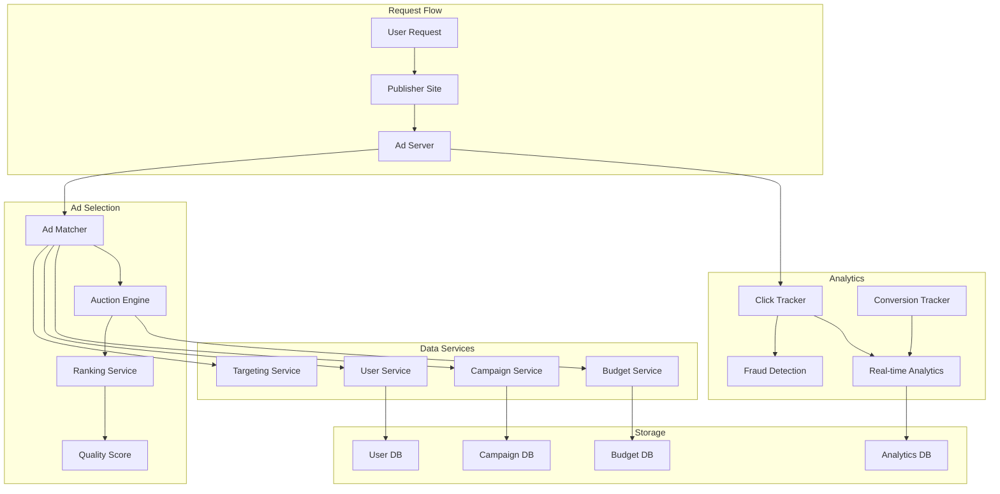

# Design Google Ads (AdWords)


## Problem Statement

"Design an online advertising platform that can conduct real-time auctions for billions of ad requests per day, with precise targeting, budget management, and fraud detection."

## Overview

Google Ads is one of the world's largest advertising platforms, processing billions of ad requests daily with sub-100ms latency while managing complex targeting, bidding, and budget constraints.

## Scale Metrics

```
Daily Operations:
- Ad requests: 100+ billion/day
- Active advertisers: 2+ million
- Active campaigns: 10+ million
- Click-through events: 10+ billion/day

Performance Requirements:
- Ad serving latency: <100ms p99
- Auction processing: <50ms
- Budget updates: Real-time
- Analytics delay: <1 minute
```

## System Architecture



## Core Components Design

### 1. Ad Serving Pipeline

```python
class AdServingPipeline:
    def serve_ad(self, request):
        # 1. Parse request context
        context = self.parse_context(request)
        
        # 2. Find eligible ads
        eligible_ads = self.matcher.find_eligible_ads(
            keywords=context.keywords,
            location=context.location,
            device=context.device,
            user_id=context.user_id
        )
        
        # 3. Filter by targeting
        targeted_ads = self.targeting_service.filter_ads(
            ads=eligible_ads,
            user_profile=context.user_profile,
            page_content=context.page_content
        )
        
        # 4. Check budgets
        active_ads = self.budget_service.filter_active_ads(
            ads=targeted_ads,
            timestamp=context.timestamp
        )
        
        # 5. Run auction
        auction_result = self.auction_engine.run_auction(
            ads=active_ads,
            context=context
        )
        
        # 6. Return winning ads
        return self.format_response(auction_result)
```

### 2. Real-time Auction Engine

```python
class AuctionEngine:
    def run_auction(self, ads, context):
        # 1. Calculate quality scores
        for ad in ads:
            ad.quality_score = self.calculate_quality_score(ad, context)
        
        # 2. Get bids
        bids = []
        for ad in ads:
            bid = self.get_bid(ad, context)
            effective_bid = bid * ad.quality_score
            bids.append({
                'ad': ad,
                'bid': bid,
                'effective_bid': effective_bid
            })
        
        # 3. Sort by effective bid
        bids.sort(key=lambda x: x['effective_bid'], reverse=True)
        
        # 4. Determine winners (GSP auction)
        winners = []
        for i, bid_info in enumerate(bids[:context.num_slots]):
            # Winner pays next highest bid
            price = bids[i+1]['effective_bid'] if i+1 < len(bids) else bid_info['bid'] * 0.01
            winners.append({
                'ad': bid_info['ad'],
                'position': i + 1,
                'price_per_click': price / bid_info['ad'].quality_score
            })
        
        return winners
    
    def calculate_quality_score(self, ad, context):
        # Factors: CTR, relevance, landing page quality
        predicted_ctr = self.ml_model.predict_ctr(ad, context)
        relevance = self.calculate_relevance(ad.keywords, context.keywords)
        landing_quality = self.get_landing_page_score(ad.landing_url)
        
        return predicted_ctr * relevance * landing_quality
```

### 3. Budget Management Service

```python
class BudgetService:
    def __init__(self):
        self.redis_client = Redis()  # For real-time counters
        self.budget_db = BudgetDB()  # For persistent storage
        
    def check_budget(self, campaign_id, cost):
        # Get current spend
        daily_key = f"spend:daily:{campaign_id}:{today()}"
        current_spend = self.redis_client.get(daily_key) or 0
        
        # Get budget limits
        campaign = self.get_campaign(campaign_id)
        daily_budget = campaign.daily_budget
        
        # Check if budget allows
        if current_spend + cost <= daily_budget:
            return True
        
        # Check if we can partially serve
        remaining = daily_budget - current_spend
        return remaining > 0
    
    def record_spend(self, campaign_id, cost):
        # Update Redis counter
        daily_key = f"spend:daily:{campaign_id}:{today()}"
        self.redis_client.incrbyfloat(daily_key, cost)
        
        # Async update to persistent storage
        self.queue_persistent_update(campaign_id, cost)
        
        # Check for budget alerts
        self.check_budget_alerts(campaign_id)
```

### 4. Click Tracking and Fraud Detection

```python
class ClickTracker:
    def track_click(self, click_event):
        # 1. Validate click
        if not self.is_valid_click(click_event):
            return False
        
        # 2. Check for fraud
        fraud_score = self.fraud_detector.analyze(click_event)
        if fraud_score > FRAUD_THRESHOLD:
            self.flag_suspicious_click(click_event)
            return False
        
        # 3. Record click
        self.record_valid_click(click_event)
        
        # 4. Update real-time metrics
        self.update_metrics(click_event)
        
        # 5. Bill advertiser
        self.billing_service.record_charge(
            campaign_id=click_event.campaign_id,
            amount=click_event.cost_per_click
        )
        
        return True

class FraudDetector:
    def analyze(self, click_event):
        features = self.extract_features(click_event)
        
        # Check patterns
        checks = [
            self.check_click_rate(features),      # Abnormal CTR
            self.check_ip_pattern(features),      # Suspicious IPs
            self.check_device_pattern(features),  # Device fingerprinting
            self.check_timing_pattern(features),  # Click timing
            self.check_referrer(features)         # Invalid referrers
        ]
        
        # ML model for comprehensive analysis
        ml_score = self.ml_model.predict_fraud(features)
        
        return max(checks + [ml_score])
```

### 5. Targeting System

```python
class TargetingService:
    def filter_ads(self, ads, user_profile, page_content):
        targeted_ads = []
        
        for ad in ads:
            # Check each targeting criterion
            if self.matches_demographics(ad, user_profile):
                if self.matches_interests(ad, user_profile):
                    if self.matches_keywords(ad, page_content):
                        if self.matches_placement(ad, page_content):
                            targeted_ads.append(ad)
        
        return targeted_ads
    
    def matches_interests(self, ad, user_profile):
        if not ad.interest_targeting:
            return True
        
        user_interests = self.get_user_interests(user_profile)
        required_interests = ad.interest_targeting
        
        # Check for overlap
        return bool(user_interests.intersection(required_interests))
```

## Data Models

### Campaign Structure
```protobuf
message Campaign {
    string campaign_id = 1;
    string advertiser_id = 2;
    string name = 3;
    CampaignStatus status = 4;
    Budget budget = 5;
    repeated AdGroup ad_groups = 6;
    Targeting targeting = 7;
    BiddingStrategy bidding_strategy = 8;
}

message AdGroup {
    string ad_group_id = 1;
    string name = 2;
    repeated Ad ads = 3;
    repeated Keyword keywords = 4;
    float max_cpc = 5;
}

message Ad {
    string ad_id = 1;
    string headline = 2;
    string description = 3;
    string display_url = 4;
    string landing_url = 5;
    AdFormat format = 6;
}
```

### Real-time Metrics
```python
# Redis data structures
# Counter for spend tracking
INCRBYFLOAT campaign:spend:daily:12345 2.50

# HyperLogLog for unique users
PFADD campaign:users:12345 user_id_xyz

# Sorted set for top performing ads
ZADD top_ads 1000 ad_12345  # score = clicks

# Time-series for CTR tracking
TS.ADD campaign:ctr:12345 * 0.023
```

## Performance Optimizations

### 1. Caching Strategy
```python
class AdCache:
    def __init__(self):
        self.local_cache = LRU(10000)  # In-process cache
        self.redis_cache = Redis()       # Distributed cache
        
    def get_eligible_ads(self, keywords):
        # Check local cache first
        cache_key = self.generate_key(keywords)
        ads = self.local_cache.get(cache_key)
        if ads:
            return ads
        
        # Check Redis
        ads = self.redis_cache.get(cache_key)
        if ads:
            self.local_cache.set(cache_key, ads)
            return ads
        
        # Fetch from database
        ads = self.fetch_from_db(keywords)
        
        # Update caches
        self.redis_cache.setex(cache_key, 300, ads)  # 5 min TTL
        self.local_cache.set(cache_key, ads)
        
        return ads
```

### 2. Parallel Processing
```python
async def serve_ads_parallel(request):
    # Run independent operations in parallel
    tasks = [
        fetch_user_profile(request.user_id),
        fetch_page_context(request.url),
        fetch_eligible_campaigns(request.keywords),
        check_fraud_signals(request.ip)
    ]
    
    results = await asyncio.gather(*tasks)
    user_profile, page_context, campaigns, fraud_score = results
    
    if fraud_score > THRESHOLD:
        return empty_response()
    
    # Continue with ad selection
    return run_auction(campaigns, user_profile, page_context)
```

## Scalability Considerations

### Geographic Distribution
- Regional ad servers for low latency
- Campaign data replicated globally
- Budget counters synchronized via CRDT
- Regional auction variations

### Hot Campaign Handling
```python
class HotCampaignHandler:
    def handle_hot_campaign(self, campaign_id):
        # 1. Dedicated infrastructure
        self.allocate_dedicated_servers(campaign_id)
        
        # 2. Pre-warm caches
        self.prewarm_campaign_data(campaign_id)
        
        # 3. Increase budget check frequency
        self.increase_budget_sync_rate(campaign_id)
        
        # 4. Enable traffic shaping
        self.enable_rate_limiting(campaign_id)
```

## Monitoring and Analytics

### Key Metrics
```
Performance Metrics:
- Ad serving latency (p50, p95, p99)
- Auction completion time
- Cache hit rates
- Budget sync delay

Business Metrics:
- Click-through rate (CTR)
- Cost per click (CPC)
- Conversion rate
- Revenue per mille (RPM)

Quality Metrics:
- Invalid click rate
- Ad relevance score
- User satisfaction
- Publisher RPM
```

### Real-time Dashboard
```python
class AdsDashboard:
    def get_real_time_metrics(self):
        return {
            'qps': self.get_current_qps(),
            'active_campaigns': self.count_active_campaigns(),
            'hourly_revenue': self.calculate_hourly_revenue(),
            'ctr': self.get_average_ctr(),
            'fraud_rate': self.get_fraud_rate(),
            'budget_utilization': self.get_budget_utilization()
        }
```

## Interview Tips

1. **Start with the auction mechanism** - It's the core of the system
2. **Emphasize latency** - Sub-100ms is critical
3. **Discuss fraud detection** - Major concern in ad systems
4. **Consider advertiser tools** - Campaign management, analytics
5. **Address scale** - Billions of requests per day

## Common Follow-up Questions

### Q1: "How do you handle budget pacing?"
**Answer:**
- Predictive pacing algorithm
- Real-time spend tracking
- Smooth delivery throughout the day
- Dynamic throttling based on spend rate

### Q2: "How do you detect click fraud?"
**Answer:**
- IP pattern analysis
- Device fingerprinting
- Behavioral analysis
- Machine learning models
- Real-time + batch processing

### Q3: "How do you ensure ad quality?"
**Answer:**
- Automated content review
- Landing page analysis
- Historical performance
- User feedback signals

[Return to Google Interview Guide](./index.md)